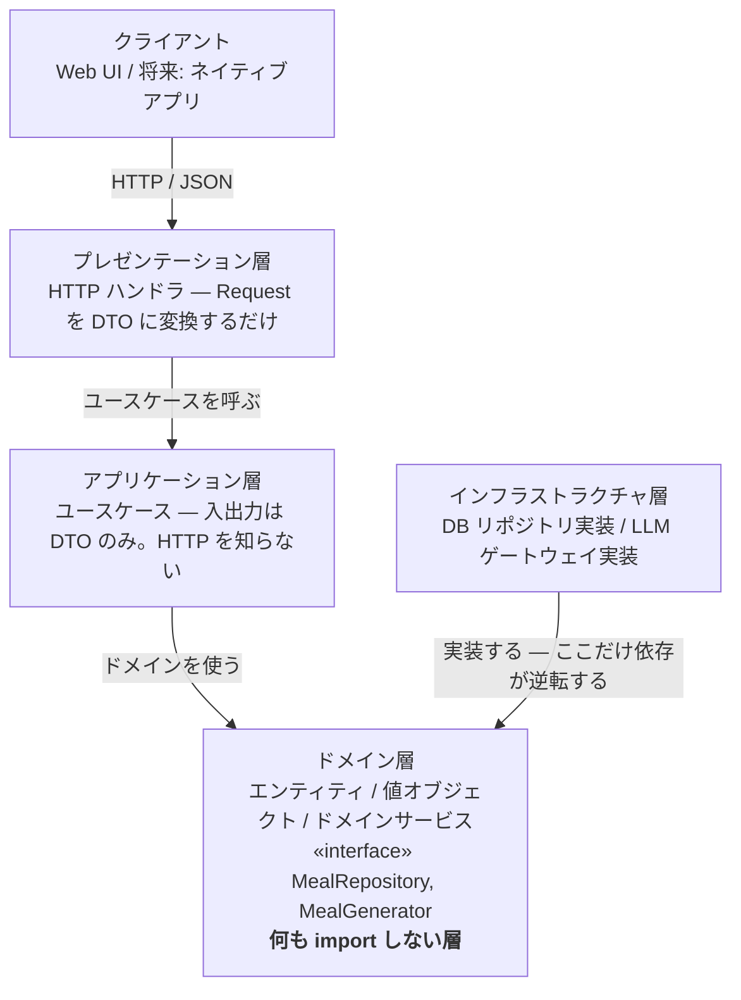

# アーキテクチャ決定録（ADR）

> ドラフト v0.6 / 2026-09-10 / ADR-001 〜 ADR-031
> **この文書がアーキテクチャ決定の正である。** 閲覧用の HTML 版は `html/adr.html`。

決定を変更する場合は、既存の ADR を書き換えず、**新しい ADR を起こして旧 ADR の状態を「置き換え済み」に改める**。

---

## A. 依存ルール

個別の ADR より先に、全体を貫く1つの規則を置く。

> **依存は必ず外から内へ向かう。例外は起動時の組み立て（composition root）だけ。**



### 層どうしの依存

| 依存する側 ↓ / される側 → | ドメイン | アプリケーション | インフラ | プレゼンテーション |
| --- | --- | --- | --- | --- |
| ドメイン層 | — | 禁止 | 禁止 | 禁止 |
| アプリケーション層 | 許可 | — | 禁止 | 禁止 |
| インフラ層 | 許可 | 禁止 | — | 禁止 |
| プレゼンテーション層 | **禁止** | 許可 | 禁止 | — |
| 起動時の組み立て | 許可 | 許可 | 許可 | 許可 |

**プレゼンテーション層 → ドメイン層が「禁止」である点に注意。** 外側が内側に依存すること自体はオニオンの原則に反しないが、ここを許すとドメインオブジェクトが画面まで漏れ出し、UI の都合でドメインが変形する。プレゼンテーション層が触れてよいのはアプリケーション層の DTO だけとする。

**「起動時の組み立て」**は全層を知る唯一の場所（composition root）。`apps/api/src/main.ts` の1ファイルに限定し、他所で `new MealRepositoryImpl()` を書かない。

### 層の呼び名とディレクトリの対応

| 層の呼び名 | ディレクトリ | 置くもの |
| --- | --- | --- |
| プレゼンテーション層 | `contexts/*/api/` と `apps/web/` | HTTP ハンドラと UI。どちらも DTO しか触らない |
| アプリケーション層 | `contexts/*/usecase/` | ユースケース。入出力は DTO |
| ドメイン層 | `contexts/*/domain/` | エンティティ・値オブジェクト・ドメインサービスと、リポジトリ／ポートの interface |
| インフラストラクチャ層 | `contexts/*/infrastructure/` | リポジトリとポートの実装 |

層の呼び名とディレクトリ名は**1対1で対応する**。文書では層の名前で、コードではディレクトリ名で呼ぶ。**この表以外の対応を作らないこと。**

### やってはいけない依存

```
✕ ネイティブ化できなくなる形            ○ 正しい形
  execute(req: Request,                  execute(input: GenerateInput)
          res: Response)                   : GenerateOutput

  Web フレームワークの型が               変換の責務はハンドラが持つ。
  アプリケーション層に侵入する。          ユースケースは HTTP を知らないので、
  HTTP を持たない呼び出し元から使えない。 別クライアントからもそのまま呼べる。
```

ネイティブアプリ対応の可否は、この1点でほぼ決まる。**ユースケースの引数と戻り値にフレームワーク由来の型が1つでも現れた時点で、その層は Web に固定される。**

### コンテキストをまたぐ依存

ディレクトリはコンテキストで垂直に切る（ADR-013）。層のルールは**各コンテキストの内側で**成立し、そのうえでコンテキスト間にもう一段の規則が要る。

| import 元 | import してよい先 |
| --- | --- |
| `contexts/A/domain/` | `shared/domain/` のみ。**他コンテキストは一切不可** |
| `contexts/A/usecase/` | `contexts/A/domain/` と `contexts/B/usecase/`（公開されたユースケースのみ） |
| `contexts/A/infrastructure/` | `contexts/A/domain/` のみ |
| `contexts/A/api/` | `contexts/A/usecase/` のみ |
| `main.ts` | すべて（composition root） |

コンテキストをまたいでよいのは `usecase/` どうしだけ。相手の `domain/` を直接 import した瞬間、2つのコンテキストは1つに融合し、将来の切り出しが不可能になる。

**この規則は lint で強制することを推奨する。** 垂直分割の弱点は、層の違反が「隣のディレクトリ」で起きるため目視で気づきにくいことにある。ESLint の import 制限や dependency-cruiser で、上の表をそのまま設定に落とす。

### ディレクトリ構成

```
リポジトリルート
├─ apps/web/                  React + Vite（PWA）— API のクライアント
│  ├─ src/features/meal/       画面もコンテキスト単位で切る
│  ├─ src/features/pantry/
│  ├─ src/apiClient/
│  ├─ public/manifest.webmanifest
│  └─ vite.config.ts           vite-plugin-pwa
│
├─ apps/api/                  Hono on Cloudflare Workers
│  └─ src/
│     ├─ contexts/meal/       ← コアドメイン
│     │  ├─ domain/
│     │  │  ├─ entity/       Meal.ts  Suggestion.ts
│     │  │  ├─ value/        MealId.ts  MealIngredient.ts  CookingStep.ts
│     │  │  │                CookingRecord.ts  PantrySnapshot.ts
│     │  │  ├─ service/      MealCoverageService.ts  CookableMealFinder.ts
│     │  │  ├─ repository/   MealRepository.ts  SuggestionRepository.ts   «interface»
│     │  │  ├─ port/         MealGenerator.ts                             «interface»
│     │  │  └─ error/        MealRuleViolation.ts        規則違反を断る例外（ADR-025）
│     │  ├─ usecase/         SuggestMeals.ts  RegenerateMeals.ts
│     │  │                   ListMeals.ts  RecordCooking.ts
│     │  ├─ infrastructure/  MealRepositoryImpl.ts  MealGeneratorImpl.ts
│     │  │                   MealResponseParser.ts   ← 腐敗防止層
│     │  └─ api/             routes.ts
│     │
│     ├─ contexts/pantry/     同じ5つのディレクトリを持つ
│     ├─ contexts/catalog/    同じ
│     ├─ contexts/identity/   同じ
│     │
│     ├─ shared/domain/       HouseholdId.ts  Clock.ts
│     └─ main.ts              composition root — 全層を知る唯一の場所
│
└─ packages/contract/         API の型定義。web と api で共有する
```

`repository/` と `port/` は interface だけを置く。**`domain/` は何も import しない。**

`usecase/` は `domain/` の**兄弟**であって、下ではない。依存の向きが `usecase/ → domain/` の一方向だからである。

---

## B. 決定一覧

| # | 決定 | 状態 |
| --- | --- | --- |
| ADR-001 | オニオンアーキテクチャを採用する | 承認 |
| ADR-002 | リポジトリとポートのインターフェースをドメイン層に置く | 承認 |
| ADR-003 | ユースケースを HTTP API として公開し、UI をその一クライアントに限定する | 承認 |
| ADR-004 | モジュラーモノリスとして実装する | 承認 |
| ADR-005 | LLM を腐敗防止層の背後に隔離する | 承認 |
| ADR-006 | 献立を永続化し、再生成を明示操作に限定する | 承認 |
| ADR-007 | 在庫品を集約ルートとし、同一食材を統合しない | 承認 |
| ADR-008 | 集約をまたぐ参照は識別子で行う | 承認 |
| ADR-009 | 材料の充足判定を永続化せず都度算出する | 承認 |
| ADR-010 | 分量を構造化せず自由文字列として扱う | 承認 |
| ADR-011 | MVP ではドメインイベントを導入しない | 承認 |
| ADR-012 | 技術スタックの選定 | 置き換え済み |
| ADR-013 | コンテキストごとに垂直にディレクトリを切る | 承認 |
| ADR-014 | React + Vite の SPA とし、Next.js を採用しない | 承認 |
| ADR-015 | サーバサイドを Hono + Cloudflare Workers とする | 承認 |
| ADR-016 | PWA 化する。オフライン対応はアプリシェルに限る | 承認 |
| ADR-017 | 既存の献立の再利用を優先し、LLM 呼び出しを最後の手段とする | 置き換え済み |
| ADR-018 | ユビキタス言語の中核を「献立 / Meal」とする | 承認 |
| ADR-019 | LLM プロバイダを未定のまま進める | **意図的に未決** |
| ADR-020 | データベースと認証を Supabase とする | **置き換え済み**（ADR-029） |
| ADR-021 | 生成の重複回避はプロンプトで行い、保証はしない | 承認 |
| ADR-022 | 再利用と生成を混ぜず、生成を明示操作に寄せる | 承認 |
| ADR-023 | 材料に種別を持たせ、充足判定の対象を主材料に限る | 承認 |
| ADR-024 | 未完成の機能を feature flag で隠し、ブランチの寿命でマージを律しない | 承認 |
| ADR-025 | ドメイン層の例外型を `domain/error/` に置く | 承認 |
| ADR-026 | 在庫品の識別子をドメイン層のポートで発行する | 承認 |
| ADR-027 | 在庫品の削除を冪等にせず、消せなかったことを断る | 承認 |
| ADR-028 | 世帯を `household_id = auth.uid()` から始め、`household_members` を置かない | 承認 |
| ADR-029 | DB アクセスを Drizzle に寄せ、RLS をトランザクション単位のクレーム設定で効かせる | **提案** |
| ADR-030 | エージェントのコンテナでは Docker を使わず素の PostgreSQL で `pnpm test:db` を回す | 承認 |
| ADR-031 | アクセストークンの検証を共有秘密（HS256）で行い、JWKS は実環境を確かめるまで採らない | **提案** |

---

## C. 決定の記録

### ADR-001　オニオンアーキテクチャを採用する　`承認`

- **状況** — 個人開発の小規模アプリだが、将来のネイティブアプリ対応と、献立生成方式の差し替え（LLM から自前 DB へ）が想定されている。一方で Clean Architecture の全レイヤー分割は、この規模には過剰。
- **決定** — ドメイン / アプリケーション / インフラストラクチャ / プレゼンテーションの4層とし、依存は外から内への一方向に限る。Entities と Use Cases をさらに細分する Clean Architecture 相当の分割は行わない。
- **理由** — 差し替えたいもの（DB・LLM・UI）がすべて外側にあり、守りたいもの（献立と在庫のルール）が中心にある。この形は本アプリの変更予測と一致する。
- **結果** — 層をまたぐたびに型の変換が要り、小さな機能追加でも複数ファイルに触れる。この冗長さは意図的なコストとして受け入れる。層の数をこれ以上増やさないことで上限を設ける。

### ADR-002　リポジトリとポートのインターフェースをドメイン層に置く　`承認`

- **状況** — ドメイン層はデータの永続化と献立の生成を必要とするが、その手段（DB、LLM API）は外側の関心事である。
- **決定** — `MealRepository` `StockItemRepository` `MealGenerator` をドメイン層に**インターフェースとして**定義し、インフラ層がこれを実装する。実装の注入は composition root で行う。
- **理由** — 依存関係逆転の実体。インターフェースを所有するのが呼ぶ側（ドメイン）であることにより、ドメイン層のソースコードに DB や HTTP クライアントの import が1行も現れなくなる。
- **結果** — ドメイン層のテストが実 DB・実 API なしで書ける。反面、インターフェースの設計を誤ると全実装に波及するため、メソッドは**ドメインの語彙で命名する**（`findByHousehold` であって `selectWhere` ではない）。

### ADR-003　ユースケースを HTTP API として公開し、UI をその一クライアントに限定する　`承認`

- **状況** — 将来 Web に加えてネイティブアプリを提供する可能性がある。フルスタックフレームワークを使う場合、UI とサーバ処理を密結合させる仕組み（サーバアクション等）が用意されており、素直に使うとアプリケーション層が Web に固定される。
- **決定** — すべてのユースケースを HTTP API として公開する。Web UI はその API のクライアントであり、特権的な近道を持たない。ユースケースの引数と戻り値には、フレームワーク由来の型（Request / Response / Cookie 等）を**一切含めない**。
- **理由** — ネイティブ化のコストは、この境界を最初に引くかどうかでほぼ決まる。後から剥がすのは、UI からサーバ処理を直接呼ぶコードが増えた分だけ困難になる。
- **結果** — Web だけを作る間は、API 経由の一往復が明確なオーバーヘッドになる。**これは将来のための前払いであり、ネイティブアプリを作らないと決めた時点で見直してよい。**

### ADR-004　モジュラーモノリスとして実装する　`承認`

- **状況** — 境界づけられたコンテキストが4つあるが、利用者は当面ひとりで、運用体制も個人である。
- **決定** — 4コンテキストを単一のデプロイ単位に収め、境界はディレクトリとモジュールの境界として表現する。コンテキスト間の呼び出しは関数呼び出しで行い、ネットワークを介さない。
- **理由** — サービス分割の運用コストに見合う規模ではない。境界を型とディレクトリで守れていれば、必要になった時点で切り出せる。
- **結果** — 境界の侵犯がコンパイルエラーにならないため、規律で守る必要がある。**コンテキストをまたぐ import は、相手コンテキストが公開したユースケース経由に限る**ことをルールとし、内部のエンティティを直接 import しない。

### ADR-005　LLM を腐敗防止層の背後に隔離する　`承認`

- **状況** — 献立の生成を LLM に委ねる。LLM の応答は形式が揺れうるうえ、将来は自前レシピ DB への差し替えも想定される。
- **決定** — ドメイン層のポート `MealGenerator` をインフラ層の `LlmMealGenerator` が実装する。応答の解析と検証は `MealResponseParser` が担い、**検証を通らない応答はドメイン層に渡さない**。プロンプト文字列・JSON・モデル名がドメイン層に現れてはならない。
- **理由** — 外部システムの都合をドメインモデルに侵入させないため。生成方式を差し替えるとき、書き換えるのはこのクラス1つで済む。
- **結果** — 変換層のぶん記述が増える。また、応答が検証を通らなかった場合の扱いを ACL 内で決める必要がある。**現時点では「ユーザーに再試行を促す」とし、自動リトライは行わない。**

### ADR-006　献立を永続化し、再生成を明示操作に限定する　`承認`

- **状況** — LLM は同じ在庫でも毎回異なる献立を返す。利用者は多様性を歓迎しているが、画面を戻るたびに候補が入れ替わるのは不具合に見える。加えて生成のたびに費用が発生する。
- **決定** — 生成した献立をすべて永続化する。画面を開いたときは保存済みの最新の提案を表示し、生成 API を呼ばない。新しい候補は「他の候補を見る」等の明示操作でのみ生成する。在庫が変わらない限り再生成しない（確定事項 C-7）。
- **理由** — 体験の安定と費用の抑制が同じ手段で両立する。さらに、蓄積した献立は「以前見た献立」「つくった献立」という機能そのものになり、将来の自前レシピ DB の初期データにもなる。
- **結果** — 献立が単調増加する。保持期間の方針が必要になる（未決 Q-2）。また「表示は速く、生成は待たせてよい」という性能要件の分離が前提になる。

### ADR-007　在庫品を集約ルートとし、同一食材を統合しない　`承認`

- **状況** — 「冷蔵庫」を集約ルートにして在庫品を配下に置くか、在庫品自体を集約ルートにするかの選択がある。
- **決定** — 在庫品（`StockItem`）を集約ルートとする。同じ食材を別の日に買った場合も統合せず、独立した在庫品として扱う。
- **理由** — 買った日が違えば期限が違う。統合すると期限をどちらに寄せるか決められず、期限管理が壊れる。統合しないほうが現実に即しており、集約も小さくなる。
- **結果** — 一覧に「にんじん」が2行並びうる。**これは仕様であり、まとめる要件は持たない。**

### ADR-008　集約をまたぐ参照は識別子で行う　`承認`

- **状況** — `Suggestion` は3件の `Meal` を参照する。オブジェクト参照を持たせると、読み込み範囲が際限なく広がる。
- **決定** — 集約をまたぐ参照はすべて識別子（`MealId` 等）で保持する。オブジェクト参照を持たない。1トランザクションで更新してよい集約は1つまでとする。
- **理由** — 集約の境界が実際の一貫性の境界と一致し、読み込みと更新の範囲が予測可能になる。
- **結果** — 画面表示のためにリポジトリを複数回呼ぶ場面が出る。**その解決に集約を結合させてはならず、必要ならアプリケーション層に読み取り専用の問い合わせを追加する。**

### ADR-009　材料の充足判定を永続化せず都度算出する　`承認`

- **状況** — 「この献立は在庫で作れるか」は献立と在庫の両方に依存する。在庫は献立の生成後も変化し続ける。
- **決定** — 充足の結果を献立に保存せず、表示のたびに `MealCoverageService` が現在の在庫と突き合わせて算出する。
- **理由** — 保存すると在庫の変化のたびに全献立を更新する必要が生じ、更新漏れが必ず起きる。導出可能な値は導出する。
- **結果** — 一覧表示のたびに計算が走る。**「以前つくった献立」の一覧では充足を算出しない**ことで負荷を抑える。

### ADR-010　分量を構造化せず自由文字列として扱う　`承認`

- **状況** — 「200g」「1本」「少々」を数値と単位に分解するか、文字列のまま扱うかの選択がある。
- **決定** — `Amount` を自由文字列の値オブジェクトとする。数値と単位に分解しない。
- **理由** — 分量を使うのは LLM への入力と画面表示だけで、**数量の演算をする要件が存在しない**。構造化すると入力欄が増え、登録の手間という最大の離脱要因を悪化させる。
- **結果** — 「在庫の 200g に対して献立が 300g 必要」といった不足量の判定ができない。充足判定は食材名の有無のみで行う（確定事項 C-6）。

### ADR-011　MVP ではドメインイベントを導入しない　`承認`

- **状況** — 「献立が調理された」「在庫が登録された」はドメインイベントとして表現できるが、現時点でそれに反応する処理が存在しない。
- **決定** — ドメインイベントの仕組みを導入しない。コンテキスト間の連携はユースケースからの直接呼び出しで行う。
- **理由** — 購読者のいないイベント機構は、処理の流れを追いにくくするだけの複雑さになる。**非同期処理を要する要件が現れてから導入する。**
- **結果** — 通知機能などを追加する際に、この決定の見直しが必要になる。その時点で新しい ADR を起こす。

### ADR-012　技術スタックの選定　`置き換え済み`

- **状況** — Nuxt / Vue と Next.js / React のいずれかを選ぶ論点として起票した。
- **結果** — **ADR-014（フロントエンド）と ADR-015（サーバサイド）に置き換えられた。** いずれの選択肢も採らず、React + Vite と Hono + Cloudflare Workers の組み合わせに決定した。

### ADR-013　コンテキストごとに垂直にディレクトリを切る　`承認`

- **状況** — 当初は層でトップレベルを切っていた（`domain/` `application/` …）。この形では、献立に1つ機能を足すたびに4つの離れたディレクトリを行き来することになり、**コンテキストの境界がディレクトリ上に一切現れない**。
- **決定** — トップレベルを境界づけられたコンテキストで切り、層はその内側に置く。各コンテキストは `domain/` `usecase/` `infrastructure/` `api/` の4つを持ち、`domain/` の中をさらに `entity/` `value/` `service/` `repository/` `port/` に分ける。
- **理由** — 変更が届く単位はコンテキストであって層ではない。境界がディレクトリとして目に見えるため、ADR-004 のモジュラーモノリスの規律が守りやすく、切り出しが必要になったときもディレクトリごと移せる。**ユースケースとエンティティを別ディレクトリに保つことで、層の区別は垂直分割後も失われない。**
- **結果** — 層の違反が「隣のディレクトリ」で起きるため目視で気づきにくくなる。**依存ルールは lint で機械的に強制することを推奨する。**

### ADR-014　React + Vite の SPA とし、Next.js を採用しない　`承認`

- **状況** — React を選ぶとして、Next.js を使うかどうか。本アプリはログイン必須で、扱うのは個人の在庫データである。
- **決定** — React + Vite の SPA とする。Next.js は採用しない。
- **理由** — 3つある。**(1)** ログイン後のプライベートな画面しかなく、SEO も SSR も価値を生まない。**(2)** Next.js の最大の利点であるサーバ統合（サーバアクション等）は、UI からサーバ処理を直接呼べる仕組みであり、**ADR-003 が避けようとしている依存そのもの**である。使わないなら採用する理由が薄く、使えば決定に反する。**(3)** SPA は構造上「API のクライアント」でしかないため、ADR-003 の境界が意識せずとも守られる。
- **結果** — 初回読み込みは SSR より遅い。ログイン後に使うアプリなので許容し、PWA のキャッシュ（ADR-016）で2回目以降を速くする。公開ページや SEO が必要になった時点で見直す。

### ADR-015　サーバサイドを Hono + Cloudflare Workers とする　`承認`

- **状況** — LLM の API キーをクライアントに置けないため、サーバが必須。SPA を選んだ結果、サーバは API 専任になり、**ドメイン層とユースケース層はここに置かれる**。
- **決定** — Hono を Cloudflare Workers 上で動かす。`apps/api/` がドメイン層・ユースケース層・インフラ層を含み、`apps/web/` はその HTTP クライアントに徹する。
- **理由** — 無料枠が広く「ランニングコストをなるべく安く」という要求に合う。Web 標準 API ベースでフレームワークへのロックインが軽い。TypeScript なので、ドメイン層をフロントと同じ言語で書け、`packages/contract/` で API の型を共有できる。
- **結果** — Workers には実行時間と CPU の制限がある。**LLM の呼び出しは数十秒かかりうるため、制限に収まるかを実装初期に確認する必要がある。** 収まらない場合はストリーミング応答か、生成を非同期化して結果をポーリングする形に変える。

### ADR-016　PWA 化する。オフライン対応はアプリシェルに限る　`承認`

- **状況** — 台所で使うため、ホーム画面から即起動できることに価値がある。一方、データのオフライン書き込みを許すと同期と競合解決が必要になり、MVP の規模を大きく超える。
- **決定** — マニフェストとサービスワーカーを備え、ホーム画面に追加できるようにする。キャッシュするのは**アプリの外枠（HTML・CSS・JS）だけ**とし、データのオフライン読み書きは行わない。オフライン時はその旨を表示して操作を止める。
- **理由** — PWA 化の目的は**設置と起動の速さ**であって、オフライン動作ではない。目的をここで区切ることで、同期の複雑さを丸ごと回避できる。
- **結果** — 2つの制約を受け入れる。**(1)** iOS の Safari は `beforeinstallprompt` を実装していないため、ワンタップのインストールバナーを出せない。利用者が自分で「共有 → ホーム画面に追加」をたどる必要があり、**案内 UI がなければ事実上インストールされない**。**(2)** iOS で Web プッシュ通知が届くのはホーム画面に追加された場合のみで、タブで開いているだけでは届かない。期限通知は Could のまま据え置く。

### ADR-017　既存の献立の再利用を優先し、LLM 呼び出しを最後の手段とする　`置き換え済み`

- **状況** — ADR-006 で在庫が変わらない限り再生成しないことは決めたが、**在庫が変われば必ず生成が走る**。一方その頃には、今日の在庫でそのまま作れる献立が手元に貯まっている。
- **決定** — 提案の組み立てを3段で試みる。**(1)** 在庫が前回と同じなら保存済みの提案を返す。**(2)** 違えば、既存の献立から現在の在庫で不足0件のものを選ぶ。**(3)** それで3件に満たない分だけを LLM に生成させる。「他の候補を見る」はこの経路に乗せず、常に新規生成する。
- **理由** — 費用と待ち時間の両方が同時に下がる。しかも**使い続けるほど手持ちが増えて再利用率が上がる**ため、1回あたりのコストは時間とともに下がっていく。ユーザーにとっても「前に見たあれが今日作れる」は有用な情報であり、機能の劣化ではない。
- **結果** — 3つの帰結を引き受ける。**(1)** 再利用の精度が充足判定に依存し、それは食材名の完全一致で行っている（C-6）。**ここが弱いと仕組み全体が働かないため、食材カタログの別名データが実質的な前提条件になる。** **(2)** 再利用は明示表示が必須。黙って混ぜると同じ献立が出たとしか見えない。**(3)** 同じ献立が出続けないよう、直近の提案に出したものを除外する規則が要る（C-11）。
- **置き換え** — **ADR-022 に置き換えられた。** 再利用と生成を1つの提案の中で混ぜる (3) の段を取りやめ、**作れる既存の献立が1件でもあれば LLM を呼ばない**形に改めた。上の (1)〜(3) の帰結は ADR-022 でもそのまま引き継がれる。

### ADR-018　ユビキタス言語の中核を「献立 / Meal」とする　`承認`

- **状況** — 生成物の呼称が定まらないと全レイヤーの識別子が決まらない。当初の「献立案 / `MealIdea`」は文書としては正確だが、UI に置くと固い。
- **決定** — **献立 / `Meal`。**「レシピ」「メニュー」「候補」「料理」「献立案」はすべて予約語として使用を禁じる。
- **理由** — アプリの価値（献立が決まる）と語が一致し、UI が「前に見た献立」「作った献立」と自然に書ける。`Meal` と `Suggestion` は識別子として十分に区別でき、コンテキスト名「献立コンテキスト」とも衝突しない。
- **結果** — 「レシピ / `Recipe`」を空けておける。**ADR-006 の移行先である自前レシピ DB を将来持ったとき、`Recipe`（検証済みの既存レシピ）と `Meal`（この世帯のために生成された献立）を別概念として導入できる。**

### ADR-019　LLM プロバイダを未定のまま進める　`意図的に未決`

- **状況** — Claude・Gemini など複数の候補がある。一方、生成は `MealGenerator` ポートの背後に隔離済みで（ADR-005）、実装は1クラスに閉じている。
- **決定** — **いま決めない。** プロバイダは差し替え可能な詳細として扱い、他の設計と実装を先に進める。
- **理由** — 早く決めても得るものがない。むしろ**プロンプト設計を固めてから、同じプロンプトを複数のプロバイダに投げて比べたほうが、判断材料が揃う**。ポートと腐敗防止層があることの実際的な見返りが、まさにこの「決定を遅らせられる」ことである。
- **比較の軸** — 決定時に見るべき順に、**(1) 構造化出力（JSON）の安定性** — これが最重要。形式が揺れると腐敗防止層の検証失敗が増え、再試行が実質的な追加コストになる。**(2)** 日本語・家庭料理の質。**(3)** 単価。**(4)** レイテンシ（ADR-015 の Workers 実行時間制限に効く）。
- **結果** — 要件定義の費用試算は Claude の単価に基づく暫定値であり、決定時に置き換える。**この未決はプロジェクトを止めない。**

### ADR-020　データベースと認証を Supabase とする　`置き換え済み`

- **状況** — API は Cloudflare Workers 上に置く（ADR-015）。データベースと認証が必要。対抗案は Cloudflare D1 + 自前認証で、こちらはプラットフォームが1つで済む。
- **決定** — Supabase（Postgres + Auth）を使う。Workers からは **supabase-js（HTTP / PostgREST 経由）** で接続する。
- **理由** — **(1) 認証を自前で作らずに済む。** MVP の速度に直結する。**(2) 行レベルセキュリティ（RLS）が安全網になる。** 世帯によるデータ分離をアプリコードだけで守る形は、`householdId` の付け忘れ1箇所で破れる。同じ制約をデータベース側にも置けるのは、対抗案にはない価値である。**(3)** Postgres なので将来の検索・集計で詰まらない。
- **結果** — 4つの帰結を引き受ける。
  1. **RLS を効かせるには、Workers から `service_role` キーではなく利用者の JWT で問い合わせなければならない。** `service_role` は RLS を迂回するため、それを使うと採用理由 (2) が丸ごと消える。**実装上の必須事項。**
  2. Postgres への直接 TCP 接続はエッジ実行と相性が悪く、Hyperdrive のような接続プールを挟む必要がある。**supabase-js の HTTP 経由なら不要**なので当面それで進める。
  3. **無料プランのプロジェクトは、API リクエストが1週間ないと自動的に一時停止される。** データは保持されるが手動で再開するまで止まる。定期的にアクセスする仕組みを置くか、停止と再開を受け入れるかを決める必要がある。
  4. **プラットフォームが2つになる**（Cloudflare と Supabase）。1つにまとめたいなら API を Supabase Edge Functions に寄せる手はあるが、Deno 環境になり Hono を選んだ利点が薄れる。**当面は2つで進め、運用の煩雑さが実際に問題になった時点で見直す。**

### ADR-021　生成の重複回避はプロンプトで行い、保証はしない　`承認`

- **状況** — すでに手元にある献立と同じものが再び生成されると、履歴が同じ料理で埋まる。一方、意味的な重複（「豚肉と白菜の炒め物」と「豚こまと白菜の中華炒め」）をコードで判定するのは難しい。
- **決定** — 生成時のプロンプトに**既存の献立名の一覧を含め、それらとは異なるものを生成するよう指示する**。渡す件数には上限を設ける（初期値: 直近50件）。`MealGenerator` ポートは「在庫スナップショット・必要件数・避けるべき献立名」を受け取る。
- **理由** — 表記の違う同じ料理を見分けられるのは、コードではなく LLM 自身である。判定を自前で持たず、生成側に避けさせるのが最も素直で、実装も増えない。
- **結果** — **(1) これは best-effort であって保証ではない。** 重複が出ても壊れない設計は維持する。**(2) 上限は必ず設ける。** 件数に比例して入力トークンが増えるため、上限を外すと蓄積とともに費用が増え、ADR-017 の削減効果を打ち消しかねない。**(3)** それでも名称が完全一致した場合の扱いを定めた（確定事項 C-4）。

### ADR-022　再利用と生成を混ぜず、生成を明示操作に寄せる　`承認`

- **状況** — ADR-017 は提案の組み立てを3段に分け、作れる既存の献立が1〜2件のときは**その分を再利用し、残りを LLM に生成させて3件に揃える**としていた。しかしこの混合には、費用の面でも体験の面でも割に合わない点がある。**1件でも足りなければ結局 LLM を呼ぶ**ので、再利用が2件あっても削減できるのは出力の一部だけで、待ち時間はまるごと残る。加えて、同じ提案の中で再利用と生成が同居することが、`Suggestion` の不変条件を破りうる経路を作っていた（同じ献立が再利用と生成の両方から入り、C-13 に反する）。
- **決定** — **1つの提案の中で再利用と生成を混ぜない。** 在庫が変わったとき、作れる既存の献立が**1件でもあれば、その1〜3件だけを提案として返し、LLM を呼ばない**。0件のときに限り3件を生成する。利用者が新しい献立を求める明示操作を行った場合は、再利用せず**必ず3件を生成する**。これに伴い `Suggestion.entries` の件数を「ちょうど3件」から「1件以上3件以下」に改める（確定事項 C-15）。
- **理由** — **(1) 費用と待ち時間の削減が「全か無か」になり、実際に効く。** 混合では1件足りないだけで LLM を呼んでいた。**(2) 組み立てが単純になる。** 提案は「再利用だけ」か「生成だけ」のどちらかで、混合に伴う重複の判定が不要になる。**(3) 新しさの要求と、費用の削減が、操作として分かれる。** 3件に満たないときに何を出すかをアプリが推測せず、**足りないと感じた利用者が明示的に求める**形にする。既定の表示では LLM を一度も呼ばない経路が成立する。
- **結果** — 3つの帰結を引き受ける。**(1) 提案が1〜2件しか出ないことがある。** FR-16 の「複数件（3件程度）」は、再利用の経路では満たされないことがある。**新しい献立を求める導線を画面に置くことが前提条件になる**（画面の文言と配置は画面設計で決める）。**(2)** `Suggestion` の件数の不変条件が緩む。「ちょうど3件」に依存した実装を書かない。**(3) 作れる既存の献立が1件だけの日は、提案が1件になる。** 選ぶ余地がないという不満はありうるが、それは (1) の導線で解消する筋のものであり、勝手に生成して埋める理由にはならない。

### ADR-023　材料に種別を持たせ、充足判定の対象を主材料に限る　`承認`

- **状況** — 充足判定は食材名の完全一致で行う（C-6）。ここに調味料が混じると、在庫として登録していない限り**必ず不足材料**になり、不足0件の献立（`CookableMeal`）が事実上生まれない。**ADR-017 と ADR-022 の再利用が丸ごと働かなくなる。** 当初はプロンプト側の固定リストに載る調味料を材料に書かせないことで回避していたが、この方法では**リストに載っていない調味料**（オイスターソース、豆板醤、ナンプラー等）が不足材料として残り、リストが実質的な上限になってしまう。加えて、調味料が材料一覧に現れないため、**何が必要かを材料だけでは把握できない**という副作用があった。
- **決定** — `MealIngredient` に種別 `kind: 'main' | 'seasoning'` を持たせる。**種別は生成時に決まり、以後不変**（C-3 と同じ扱い）。`MealCoverageService` と `CookableMealFinder` は**主材料だけを在庫と突き合わせ、調味料は賄えるものとしても不足するものとしても数えない**（確定事項 C-16）。**種別が判別できない材料は主材料として扱う。**
- **理由** — **(1) 調味料の集合を閉じた列挙で持たなくて済む。** 「これは調味料か」の判別は、献立を考えることに比べれば桁違いに易しく、生成側に任せられる範囲にある。ADR-021 が意味的な重複の判定を生成側に委ねたのと同じ構図である。**(2) 何を判定に使うかという関心が、判定する側に移る。** 「材料に書かせない」は生成側の都合をドメインに持ち込んでいたが、種別を持てば、ドメインが自分で対象を選べる。**(3) 材料一覧に調味料を出せる。** 分量つきで表示でき、何が要るかが材料だけで分かるようになる。
- **結果** — 4つの帰結を引き受ける。**(1) 生成側の申告に依存する。** 誤った種別が来ても壊れないよう、判別できない場合は主材料に倒す — 不足材料が1件増えるだけで済み、逆に倒すと**在庫にない食材が黙って判定から消える**。**(2) 固定リストは残るが役割が変わる。** 「載っているものだけが調味料」（上限）ではなく「**載っているものは必ず調味料に倒す**」（下限）になり、腐敗防止層の保険として働く。**(3) 判定が揺れる余地がある。** 「バター」は菓子なら食材、炒め物なら調味料になりうる。どちらに倒れても影響は不足材料の1件の増減にとどまる。**(4)** 出力トークンが材料の件数ぶん増える。3件で数十トークンの規模であり、無視してよい。

### ADR-024　未完成の機能を feature flag で隠し、ブランチの寿命でマージを律しない　`承認`

- **状況** — 開発はトランクベースで進める。`main` が唯一の幹で、変更は作業ブランチから PR 経由で入る（`docs/workflow.md`）。ここで「画面に出せる状態になるまでマージしない」という運用を採ると、**機能の完成度がマージの条件になり、ブランチが伸びる**。伸びた枝は出発点が古くなり、統合のたびにコンフリクトの解消が主な仕事になる。**AI がループで開発する前提では、これが手間では済まない** — 1周ごとに `main` から出発するため、古い出発点はそのまま誤った前提での実装になる。かといって「枝の寿命は1日まで」のような時間の上限を置くと、上限を守るために機能を不自然に切るか、上限が形骸化するかのどちらかになる。
- **決定** — **未完成の機能もマージを止めず `main` に入れ、画面に出すかどうかだけを feature flag で制御する。** ブランチの寿命に上限は設けない。フラグは次の形に限定する。**(1)** 既定は無効。**(2)** 判定の実体はビルド時の環境変数（`VITE_FEATURE_*`）で、読み出しは `apps/web/src/features.ts` の1か所に閉じる。**(3)** 分岐はプレゼンテーション層にだけ置き、ユースケース層とドメイン層はフラグを知らない。**(4)** フラグは恒久的な設定ではない。**既定で有効になった時点でフラグと分岐を消す。**
- **理由** — **(1) マージの条件が「完成したか」から「壊していないか」に変わる。** 壊していないことは `pnpm verify` で機械的に判定でき、人の判断を待たない。ループが自分で完了を判断できる形になる。**(2) 表示の可否は UI の関心である。** 未完成をブランチで隠すと、隠す仕組みが git の側にあってコードからは見えない。フラグにすれば、何が未完成かがコードとして読める。**(3) 時間の上限を運用で守らせるより、隠す手段を用意するほうが確実である。** 上限は破られるが、既定で無効なフラグは破られない。**(4) ドメイン層とユースケース層は未決事項を待たずに着手できる**（`CLAUDE.md`）。表示だけを止められれば、画面が決まる前に内側を進められる。
- **結果** — 4つの帰結を引き受ける。**(1) `main` に、まだ到達できないコードが一時的に載る。** テストはフラグを介さずユースケース層とドメイン層を直接呼ぶため、到達不能でも検証はされる。**(2) 分岐が増える。** 対策はフラグを消す規律だけであり、フラグを作るときは `docs/backlog.md` に**消すタスクをセットで置く**。放置されたフラグは死んだ分岐になり、次の実装の判断を狂わせる。**(3) 切り替えに再ビルドが要る。** ビルド時の環境変数を採るため、無効化を緊急停止の手段には使えない。運用中の停止が要件になったら、その時点で別の ADR を起こす（要件に無い実行時の設定基盤を先に作らない）。**(4) フラグの状態が環境ごとに異なりうる。** 既定を無効に固定することで、指定を忘れた環境が「未完成が見えている」側に倒れないようにする。

### ADR-025　ドメイン層の例外型を `domain/error/` に置く　`承認`

- **状況** — ADR-013 は `domain/` の中を `entity/` `value/` `service/` `repository/` `port/` の5つに分けると決めた。在庫コンテキストの実装（backlog B-02）で、不変条件に反する入力を断る例外 `PantryRuleViolation` が必要になったが、**これは5つのどれでもない。** 実体でも値でもなく、ドメインサービス（純粋関数）でもなく、interface でもない。`domain/` の直下に置くと、ディレクトリだけが並ぶ階層に `.ts` が1つ混ざる。しかも例外はコンテキストごとに要るため、**同じ浮き方が4か所で起きる。**
- **決定** — `domain/` に6つめとして `error/` を置き、**規則違反を表す例外型をここに集める。** コンテキストごとに1つ（`PantryRuleViolation` / `MealRuleViolation` …）を基本とし、`rule` に規則の識別子を持たせる。**ADR-013 の分割を1つ増やすものであり、置き換えるものではない。**
- **理由** — **(1) 例外は5つのどれとも役割が違う。** 値でも実体でもなく、「断り方」そのものである。**(2) 階層の粒度が揃う。** `domain/` の下がディレクトリだけになり、直下のファイルという例外的な位置づけが消える。**(3) 次のコンテキストで迷わない。** 置き場所が決まっていれば、献立側で同じ判断をやり直さずに済む。ドメイン層が HTTP のステータスコードも画面の文言も持たないという規則（ADR-003）を守る場所が、1か所に集まる。
- **結果** — **ディレクトリ1つにファイル1つという状態がしばらく続く。** 例外の種類が増えるまでは過剰に見えるが、4コンテキストで同じ形になることの一貫性を採る。**例外を細分化する理由にはしない** — 規則の区別は `rule` の識別子で表し、クラスを増やさない。

### ADR-026　在庫品の識別子をドメイン層のポートで発行する　`承認`

- **状況** — 登録のユースケース（backlog B-04）は、保存する在庫品に識別子を1つ与える必要がある。しかし置き場所が決まっていない。**`StockItemId.ts` の doc は「発行はインフラ層（DB の既定値）に任せる」と書いているが、`StockItemRepository.save` は識別子を持った `StockItem` を受け取る**（ADR-002 / B-03）。したがって現在の interface では、識別子は保存より前に決まっていなければならず、DB の既定値では間に合わない。一方 `docs/testing.md` 5章は **`crypto.randomUUID()` を本体が直接読むことを禁じ**、「識別子は引数で渡す。足りなくなったらポートを起こす前に ADR を提案する」と定めている。**この ADR がその提案である。**
- **決定** — `domain/port/StockItemIdGenerator.ts` に**識別子を1つ返すポート**を置き、ユースケースは依存として受け取る。実装（`crypto.randomUUID()` を呼ぶもの）は composition root（`main.ts`）が渡す（ADR-002 / B-09）。テストは決まった値を順に返す記憶上の実装を渡し、**発行を決定的にする。** ポートはコンテキストごとに置き、`shared/domain` には上げない。
- **理由** — **(1) 採番の位置を1か所に決められる。** ユースケースの引数に識別子を足す形でも `crypto` は避けられるが、そのとき採番するのは api 層になる。ルートが増えるたびに採番が散り、composition root の外で実行環境に触れる箇所が増える。**(2) ADR-002 の形と揃う。** 実行環境に触れるものはポートの背後に置き、`main.ts` で注入するという既存の作りをそのまま使える。**(3) 検証が決定的になる。** 記憶上の実装を渡せば、識別子を含めて戻り値と保存内容を確かめられる（`vi.fn()` を使わない — `docs/testing.md` 2章）。
- **結果** — **`StockItemId.ts` の doc の記述（発行はインフラ層に任せる）と食い違っていたため、承認にあわせて直した。****DB の既定値で採番する形に倒すなら、`save` が採番結果を返す必要があり、`StockItemRepository`（B-03）の interface に波及する** — 承認の判断はそこを含む。集約が増えるたびに同じ形のポートが1つずつ増えるが、**`shared/domain` に1つ置いて共有すると、どの集約の識別子かを型で区別できなくなる**ため、重複のほうを採る。

### ADR-027　在庫品の削除を冪等にせず、消せなかったことを断る　`承認`

- **状況** — B-06 は削除を「見つからなくても何もせず成功する」形にした。`StockItemRepository.delete` の doc がそう定めており（B-03）、「消えている」という結果は存在しなかった場合と畳めるという理由による。しかしこの形では、**利用者が消したつもりの操作が実際には1件も消していない場合に、それが伝わらない。** 他の世帯の在庫品を指した場合も同じく成功として返るため、画面は「消えた」と表示することになる。**2026-09-09 にユーザーが「削除できなかったときはエラーを返す」と決定した。**
- **決定** — **削除は `delete` の前に `findById(householdId, id)` で存在を確かめ、`null` なら `delete` を呼ばずに `PantryRuleViolation`（`rule: 'delete.notFound'`）で断る。** 存在しない場合・他の世帯の場合・二度目の削除の3つを**同じ `rule`・同じ文言に畳み**、どれなのかを呼び出し側に判別させない（C-9 / NFR-09）。B-08 は `update.notFound` と同じく **404** に写す。**判定はユースケースに置き、`StockItemRepository` の interface と契約は変えない。**
- **理由** — **(1) 覆ったときに安い。** 判定を消すのは `DeleteStockItem.ts` の数行で済み、リポジトリの interface・doc・契約テスト・記憶上の実装・まだ書いていない Supabase 実装（B-07）は動かない。`delete` の戻り値を「消した件数」に変える案は逆で、supabase-js で件数を得る形（`.select()` を伴う）に固定され、`select` の RLS ポリシー（B-07a）と結びつく。**(2) 非開示は保たれる。** `findById` は他の世帯の在庫品を「無い」として返す契約なので、1つの経路に畳めば、規則の識別子も文言も自然に同一になる。**(3) 更新と同じ形になる。** `update.notFound` と置き場所も形も揃い、B-08 は表の行が1つ増えるだけで済む。
- **結果** — **削除が冪等でなくなる。** 応答を取りこぼしたクライアントが再送すると、**実際には消せていても 404 を受け取る。** B-11（在庫一覧の画面）は、この 404 を「すでに消えている」として扱うか、利用者に見せるかを決める必要がある。**競合は検出しない** — `findById` と `delete` の間に他のセッションが消した場合は成功として返る。取りこぼすのは「1件も消さずに成功した」場合だけで、逆向き（消したのに 404）は起きない。**確認のために1往復増える**（`findById` → `delete`）。

### ADR-028　世帯を `household_id = auth.uid()` から始め、`household_members` を置かない　`承認`

- **状況** — `docs/requirements.md` 8.1 は「世帯を最初から導入する」と定め、C-9 は4つの集約すべてが `householdId` を持つと決めている。だが MVP に**世帯を共有する要件は無い**（招待も、複数人での利用も FR に無い）。素直に正規化すると `households` と `household_members` の2表を置き、サインアップ時に世帯を作って本人を所属させる書き込み経路が要る。**この経路は MVP では何の価値も生まないのに、壊れると新規利用者が何もできなくなる。**
- **決定** — **`stock_items.household_id` に利用者の id をそのまま入れ、RLS の述語を `household_id = (select auth.uid())` にする。** `households` も `household_members` も置かない。条件は2つ — **列名を `user_id` にしない**、**アプリは常に `householdId` を渡す**（既定値 `auth.uid()` を DB に置かない）。
- **理由** — **(1) 移行が安い。** 共有が要件になった日は3段で済み、`stock_items` の行を1件も書き換えない。(a) `households` と `household_members` を足し、(b) 既存の `household_id` の値を**そのまま** `households.id` として入れ、`household_members` に `(household_id, user_id)` を同じ値で1行入れ、(c) 4つのポリシーの述語を `household_id in (select household_id from household_members where user_id = (select auth.uid()))` に差し替える。**変わるのはポリシーだけで、列名も列の値もアプリのコードも動かない。** **(2) 壊れる経路を作らない。** サインアップ時の書き込みが無いので、そこが失敗して新規利用者が詰まる筋が消える。**(3) 型の側は既に世帯を持っている。** C-9 により `householdId` はリポジトリの全メソッドの必須引数であり、DB の表現が1表であることはアプリから見えない。
- **結果** — **`household_id` の値の意味が、共有を入れた日に「利用者の id」から「世帯の id」へ変わる。** 値は同じまま意味だけが変わるため、**列名を `user_id` にしていたらこの移行で名前と実態が食い違い、全参照箇所の改修になる。** 列名の条件はこのために効く。また、DB に `auth.uid()` の既定値を置くと同じ日に必ず消すことになるので、**アプリが常に渡す**規律を初めから守る。**世帯を跨いで在庫を共有する要件が来るまで、`households` は存在しない。**

### ADR-029　DB アクセスを Drizzle に寄せ、RLS をトランザクション単位のクレーム設定で効かせる　`提案`

- **状況** — ADR-020 は Workers から **supabase-js（PostgREST 経由）** で問い合わせると決めた。この形では、問い合わせが SQL ではなく PostgREST の記法に写り、行の型は手書きになる。加えて**テストが実 Supabase を要する**ため、リポジトリ実装と RLS の検証をローカルでも CI でも回せない。ADR-020 の結果2 は「Postgres への直接 TCP 接続はエッジ実行と相性が悪く、Hyperdrive のような接続プールを挟む必要がある」としてこれを避けたが、その代償が上の2点である。**2026-09-10 にユーザーが「手書き SQL をやめて ORM を使う。問い合わせも ORM を通す」と決定した。**
- **決定** — 5つ。
  1. **DB アクセスを Drizzle に統一する。** `drizzle-orm` / `drizzle-kit` / `postgres`（ドライバ）を足す。**supabase-js は使わない** — 読み書きの経路を2本に分けず1本に寄せる。認証（Supabase Auth）と Postgres そのものは Supabase のまま使う。
  2. **スキーマの正を TypeScript の drizzle スキーマに置き、マイグレーションは `drizzle-kit` で生成する。** RLS の有効化・`force row level security`・4つのポリシー・権限は**生成物に手で足し、表と同じ1ファイルに収める**（ADR-028 / B-07a の規約を維持する — 分けると RLS の無い表が実在する窓が開く）。
  3. **RLS は残す。効かせ方は3点セットとする。** (a) **1リクエスト1トランザクション**とし、その中で `set local role`（`authenticated`）と `set local request.jwt.claims` を張る。(b) **表の所有者でないロールで接続する。** (c) 表に **`force row level security`** を付ける。
  4. **DB を使うテストはローカルの PostgreSQL（Docker Compose）に対して行い、`pnpm test:db` に分ける。** `pnpm verify` は **Docker 無しで通るまま**にする。**完了の定義は「`pnpm verify` と `pnpm test:db` の両方が緑」に変わる。** CI は両方を走らせる。
  5. **リポジトリとポートの実装クラスを `<interface 名>Impl` と名づける**（`StockItemRepositoryImpl`）。`Db` / `Supabase` / `Drizzle` の接頭辞を使わない。
- **理由** — **(1) 失敗の向きが変わる。** supabase-js では JWT の付け忘れが「anon として問い合わせる」に倒れる。3点セットでは、クレームを張り忘れた問い合わせは `auth.uid()` が null になって述語が偽になり、**0行になる。** つまり「他世帯が見える」ではなく「自分の行すら見えない」に倒れ、**最初のテストで目に見えて壊れる。** RLS の最大の問題は効いていないことに気づけない点であり、向きを揃えられることの価値はここにある。所有者ロールで繋げば RLS を素通りしてしまうため (b) が要り、所有者で繋がざるをえない場合に備えて (c) を重ねる。**(2) テストがローカルで完結する。** 実 Supabase を要さないので、リポジトリ実装と RLS の回帰を CI で毎回走らせられる。ADR-002 のドメイン層のテストとは別枠のままだが、**別枠が「動かせる枠」になる。** **(3) 問い合わせが SQL に近い形で書け、行の型がスキーマから来る。** 手書きの型と PostgREST の記法を保守しない。**(4) `local` を落とせない。** Supabase の接続プーラはトランザクション単位で接続を貸すため、セッションに残る `set`（`local` なし）は次の借り手に漏れるか消えるかのどちらかになる。**トランザクションに閉じた設定だけが安全である。** **(5) 接頭辞は手段を名前に焼き付ける。** `DbMealRepository` は「Db」が何かを言っておらず、`SupabaseMealRepository` なら**まさに今回改名になっていた。** 差し替えるために interface を置いたのに、実装の名前が手段に縛られては意味が薄い。
- **結果** — 7つの帰結を引き受ける。
  1. **ADR-020 を置き換える。** DB と認証に Supabase を採る理由（認証を自前で作らない・RLS が安全網になる・Postgres である）は**そのまま生きている。** 変わるのは接続方法だけであり、ADR-020 の状態を「置き換え済み」に改める。**`service_role` を使わないという禁止は消えず、「表の所有者ロールで繋がない」を加えた形で残る。**
  2. **JWT の検証がアプリの責務になる。** PostgREST が担っていた署名・有効期限の検証を通らなくなるため、**クレームを張る前に自分で検証しなければならない。** 検証せずに `sub` を張ることは、任意の世帯になりすませることと同じである。**検証を置くまでこの経路を本番に出さない**（NFR-09）。
  3. **Workers から Postgres への接続方法は未確認である。** ADR-020 の結果2 の警告がそのまま効き、Hyperdrive のような接続プールが要る見込みが高い。**確かめるまでこの ADR は `提案` のままとし、承認の判断はその結果を含む。** 収まらない場合は、DB に触る部分だけを別の実行環境に移すか、ADR-015（Hono on Workers）を見直すかの選択になる。**先に確かめるほど安い。**
  4. **プラットフォームの構成に依存が1本増えうる。** Hyperdrive が要れば Cloudflare 側の設定が増え、ADR-020 の結果4（プラットフォームが2つ）に設定の結び目が加わる。費用は無料枠に収まる見込みだが、**有料枠に入るなら `docs/requirements.md` の費用試算に載せ直す。**
  5. **CI に PostgreSQL が要る。** 実行時間が伸び、失敗経路が1つ増える（DB が起き切る前にテストが走る等）。`pnpm verify` を Docker 無しで通るままにするのは、**手元の速い経路を残すため**である。
  6. **開発環境に Docker が要る。** **エージェントのコンテナには Docker デーモンが無い**ため、DB を使うテストの**赤→緑をローカルで回せない。** 該当する周に限り、**赤の確認は CI が行う** — ドラフト PR を push し、`pnpm test:db` が落ちることを CI の結果で確かめてから実装に入る（`docs/workflow.md` の1周の形が、その周だけ変わる）。
  7. **命名は既存の ADR の本文が挙げる実装クラス名にも及ぶ。** ADR-005 の本文は生成の実装を `LlmMealGenerator` と呼んでいるが、決定5 により `MealGeneratorImpl` になる。**ADR の本文は書き換えない**（決定の記録は書かれた時点の判断である）ため、A章の前書きだけが新しい名前を示す。**食い違いはこの1行で引き受ける。**
  8. **生成したマイグレーションに手を入れる箇所が1か所残る**（ポリシー・権限・`force row level security`）。生成物を触らない規律とは引き換えだが、RLS を表と別ファイルに分ける危険のほうが大きい。

---

### ADR-030　エージェントのコンテナでは Docker を使わず素の PostgreSQL で `pnpm test:db` を回す　`承認`

- **状況** — ADR-029 の結果6 は「**エージェントのコンテナには Docker デーモンが無い**ため、DB を使うテストの赤→緑をローカルで回せない」とし、該当する周は赤も緑も CI で確かめる形にした。B-07 の周（2026-09-10）はこの手順で回し、**1周につき CI 往復が2回増えた。** その周の終わりにコンテナを調べたところ、前提が事実と違っていた。**(1) Docker は入っている** — `dockerd` も compose も同梱されており、root で `dockerd` を起動すれば `docker info` が通る。無いのは動いているデーモンだけである。**(2) 動かないのはイメージの取得のほうである** — `docker compose up` は `postgres:17` の取得時に Docker Hub の blob CDN（`production.cloudfront.docker.com`）で `403 Forbidden` になる。これは実行環境の egress ポリシーによる遮断で、プロキシの手引きは**迂回せず報告せよ**としている。さらに **(3) PostgreSQL のサーバ本体がイメージに最初から入っている**（`/usr/lib/postgresql/16/bin/`）。`pnpm test:db` が要求するのは 127.0.0.1:55432 に居る Postgres だけであり、Docker はその手段にすぎない。
- **決定** — 3つ。
  1. **エージェントのコンテナでは、素の PostgreSQL を 55432 に立てて `pnpm test:db` を回す。** 手順は `tools/start-local-postgres.sh` に置き、`pnpm db:up:native` から呼べるようにする。**接続先は `ConnectionStrings.ts` がハードコードしたままでよい** — compose と同じ 55432 に、同じ `supabase/local/init.sql` の役と `auth.uid()` を用意するため、リポジトリ側の設定は1つも変わらない。
  2. **セッション開始のフック（`.claude/hooks/session-start.sh`）から立てる。** サーバはセッションをまたいで生き残らないため、開始のたびに立て直す。**フックはこれが失敗しても続行する** — DB が無くても `pnpm verify` 側は動くので、`pnpm install` ごと倒さない。
  3. **`docker-compose.yml` と `pnpm db:up` は残す。** Docker が使える環境（CI・Docker Hub に届く手元）ではそちらが正であり、**CI は compose の PostgreSQL 17 のまま**とする。
- **理由** — **(1) ループが速くなる。** 赤も緑もローカルで見られるため、`docs/workflow.md` の1周の形が「その周だけ変わる」必要がなくなる。B-07 の周で使った CI 往復が要らない。**(2) 「緑を装わない」を保ちながら速くできる。** ADR-029 の結果6 が CI 往復を選んだのは、ローカルで確かめられないものを確かめたことにしないためである。**素の Postgres は本物であって代用ではない** — RLS も `set local` も同じように効く（現に B-07 の36件がそのまま緑になった）。妥協しているのは版だけである。**(3) egress の遮断は我々が動かせない。** Docker Hub の許可は組織のネットワークポリシーの話で、リポジトリ側の判断では変えられない。**手元にあるもので足りるなら、許可を待つ理由がない。**
- **結果** — 5つの帰結を引き受ける。
  1. **版が2つになる。** ローカルは 16、compose と CI は 17。**正は CI（17）**であり、ローカルは手元の速い経路である。効いてくるのは**移行 SQL の構文や版ごとの挙動差**で、ローカルが緑でも CI が赤なら CI が正しい。**`pg_policies` の突き合わせはここに当たらない** — `stockItemsRls.test.ts` は述語の文字列を期待値に書かず、同じクラスタの `select` と `update` / `delete` を**互いに**比べているため、版が変わっても結論が動かない（`docs/testing.md` 4章が文字列を書くなと言っているのは、まさにそのためである）。版が原因で食い違ったら、そのときローカルを 17 に上げるか、この ADR を見直す。
  2. **ADR-029 の結果6 は書き換えない。** 決定の記録は書かれた時点の判断であり、当時「デーモンが無い」と読んだことも含めて記録である。**この ADR がその実務上の帰結を差し替える。** ADR-029 そのものは置き換えていない（決定1〜5 はすべて生きている）ため、状態も `提案` のまま動かさない。**ADR-029 決定4 の括弧書き「（Docker Compose）」だけは、ローカルに限って当たらなくなる** — ただし決定4 の本旨は「実 Supabase ではなくローカルの PostgreSQL に対して行い、`pnpm test:db` に分ける」であり、輸送手段は付随的である。**CI では compose のままなので、決定4 は生きている。**
  3. **`docs/testing.md` / `docs/workflow.md` / `CLAUDE.md` / `.claude/commands/` の記述を直す。** これらは生きている手順書であり、ADR と違って現在を書く。「Docker が無い環境では回せないので CI で見る」は「まず `pnpm db:up:native` を試し、それも駄目なら CI で見る」になる。
  4. **`tools/start-local-postgres.sh` は `-A trust` のクラスタを作る。** ローカルの接続先は秘密でない（`ConnectionStrings.ts` が同じ理由で接続文字列を平文で持っている）ため接続文字列のパスワードは素通りしてよいが、**この Postgres を外に出さないこと。**
  5. **egress ポリシーが変わればこの ADR は不要になりうる。** Docker Hub が許可されれば `pnpm db:up` がそのまま通り、版も 17 に揃う。**そのときはこの ADR を「置き換え済み」に改める**のが筋で、その判断はユーザーが行う。

---

### ADR-031　アクセストークンの検証を共有秘密（HS256）で行い、JWKS は実環境を確かめるまで採らない　`提案`

- **状況** — ADR-029 の結果2 により、**受け取ったトークンの署名と有効期限の検証がアプリの責務になった**。PostgREST を通らなくなったためである。検証の鍵の受け取り方には2つある。**(a) 共有秘密** — 対称鍵（HS256 等）を環境変数で渡し、その鍵で署名を検算する。**(b) JWKS** — 認証基盤が公開する鍵の一覧を HTTP で取りに行き、非対称鍵（ES256 / RS256 等）で検算する。`apps/api/.dev.vars` の雛形（`CLAUDE.md` の環境変数の節）が持っている鍵は `SUPABASE_JWT_SECRET` の1つで、これは共有秘密である。ただし同じ節には「**鍵の方式は B-07e で確かめる**」と但し書きがあり、確かめる先は実 Supabase プロジェクトである。**このリポジトリの作業環境からは実 Supabase に到達できない**（B-07f が確かめられないのと同じ制約）。
- **決定** — 3つ。
  1. **共有秘密（HS256）の経路だけを実装する。** 鍵は `SUPABASE_JWT_SECRET` から渡す。
  2. **期待する署名アルゴリズムを設定で1つに固定し、トークンのヘッダーが名乗る `alg` を信用しない。** ヘッダーの `alg` に従って検証方式を選ぶと、`alg` をすり替えるだけで検証を外せる。
  3. **JWKS の経路は実装しない。** 実 Supabase プロジェクトの署名方式を確かめた周に、必要なら足す。**そのとき変わるのはポートの背後の実装1ファイルだけ**であり、ドメイン層・ユースケース層・テストの期待は動かない。
- **理由** — **(1) 決められる範囲で決めている。** 手元にある事実は「雛形が持つ鍵は共有秘密1つ」だけであり、そこから導けるのは共有秘密の経路である。実環境を見ずに JWKS を選ぶのは、確かめていないものを実装することになる。**(2) 依存が増えない。** `hono@4.13.7` は既存の依存で、`hono/jwt` が `verify`（共有秘密）と `verifyWithJwks`（JWKS）の**両方**を公開している。どちらを採ってもパッケージは増えず、**この決定は依存の選択ではなく、確かめられる範囲の選択である。** backlog の B-07e が「依存の追加が要るなら止まる」と言っている条件には当たらない。**(3) 差し替えの費用が小さい。** ADR-002 のとおりポート（`HouseholdAuthenticator`）をドメイン層に置くため、方式の違いは腐敗防止層に閉じる（ADR-005 と同じ形）。**先に確かめてから実装する価値より、検証を1周でも早く置く価値のほうが大きい** — 検証を置くまで DB の経路を本番に出せないためである（ADR-029 の結果2 / NFR-09）。
- **結果** — 4つの帰結を引き受ける。
  1. **実 Supabase プロジェクトが非対称鍵で署名していれば、この経路は全滅する。** 起きるのは「素通り」ではなく「全部断る」であり、**気づけない失敗ではない。** ADR-029 の理由(1) と同じ向きに倒れている。
  2. **確かめるまでこの ADR は `提案` のままとする。** 承認の判断は、実 Supabase の署名方式を見た結果を含む。**B-07f と同じ周で確かめるのが安い。**
  3. **共有秘密は署名鍵そのものである。** 公開鍵と違い、漏れれば任意のトークンを**発行**できる。`SUPABASE_JWT_SECRET` はサーバ側だけに置き、クライアントにも `apps/web` のビルド環境にも渡さない（NFR-10 と同じ扱い）。**JWKS に替えればこの危険は消える**ので、替える動機はここにもある。
  4. **検証の失敗を握りつぶさない。** 署名・アルゴリズム・有効期限・`sub` のどれか1つでも通らなければ世帯を作らない。**`exp` を持たないトークンも通さない** — 失効の手段が無い資格を受け入れることになるためである。
