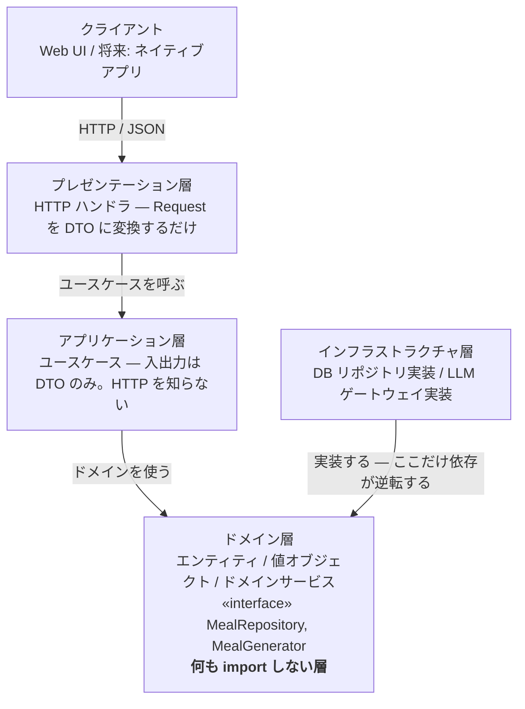

# アーキテクチャ決定録（ADR）

> ドラフト v0.6 / 2026-09-14 / ADR-001 〜 ADR-037
> **この文書がアーキテクチャ決定の正である。** 閲覧用の HTML 版は `html/adr.html`。

決定を変更する場合は、既存の ADR を書き換えず、**新しい ADR を起こして旧 ADR の状態を「置き換え済み」に改める**。
**その同じ周で、旧 ADR を「いま従うべき規則の根拠」として指している箇所を、生きた決定へ向け直す。** 向け先は置き換えた側に一律に寄せず、**その主張を実際に支えている決定**を選ぶ — 状態も材料にし、`提案` の遠い根拠より `承認` の近い根拠を採る。**ADR の本文は、経緯か生きた主張かを問わず書き換えない。** ADR の外で経緯として旧 ADR を指す文も**そのまま残す** — 置き換え済みの ADR を指すこと自体は誤りではない。掃除が1 PR に収まらないなら `docs/backlog.md` に行を足して分ける。次の周に送ると、辿った先が「置き換え済み」の札で行き止まりになる参照が溜まる（B-07 → B-16 → B-29 と2度くり返した）。

---

## A. 依存ルール

個別の ADR より先に、全体を貫く1つの規則を置く。

> **依存は必ず外から内へ向かう。例外は起動時の組み立て（composition root）だけ。**


```mermaid
flowchart TD
  client["クライアント<br/>Web UI / 将来: ネイティブアプリ"]
  pres["プレゼンテーション層<br/>HTTP ハンドラ — Request を DTO に変換するだけ"]
  app["アプリケーション層<br/>ユースケース — 入出力は DTO のみ。HTTP を知らない"]
  dom["ドメイン層<br/>エンティティ / 値オブジェクト / ドメインサービス<br/>«interface» MealRepository, MealGenerator<br/><b>何も import しない層</b>"]
  infra["インフラストラクチャ層<br/>DB リポジトリ実装 / LLM ゲートウェイ実装"]

  client -->|HTTP / JSON| pres
  pres -->|ユースケースを呼ぶ| app
  app -->|ドメインを使う| dom
  infra -->|"実装する — ここだけ依存が逆転する"| dom
```

### 層どうしの依存

| 依存する側 ↓ / される側 → | ドメイン | アプリケーション | インフラ | プレゼンテーション |
| --- | --- | --- | --- | --- |
| ドメイン層 | — | 禁止 | 禁止 | 禁止 |
| アプリケーション層 | 許可 | — | 禁止 | 禁止 |
| インフラ層 | 許可 | 禁止 | — | 禁止 |
| プレゼンテーション層 | **禁止** | 許可 | 禁止 | — |
| 起動時の組み立て | 許可 | 許可 | 許可 | 許可 |

**プレゼンテーション層 → ドメイン層が「禁止」である点に注意。** 外側が内側に依存すること自体はオニオンの原則に反しないが、ここを許すとドメインオブジェクトが画面まで漏れ出し、UI の都合でドメインが変形する。プレゼンテーション層が触れてよいのはアプリケーション層の DTO だけとする。

**「起動時の組み立て」**は全層を知る唯一の場所（composition root）。`apps/api/src/main.ts` の1ファイルに限定し、他所で `new MealRepositoryImpl()` を書かない。

### 層の呼び名とディレクトリの対応

| 層の呼び名 | ディレクトリ | 置くもの |
| --- | --- | --- |
| プレゼンテーション層 | `contexts/*/api/` と `apps/web/` | HTTP ハンドラと UI。どちらも DTO しか触らない |
| アプリケーション層 | `contexts/*/usecase/` | ユースケース。入出力は DTO |
| ドメイン層 | `contexts/*/domain/` | エンティティ・値オブジェクト・ドメインサービスと、リポジトリ／ポートの interface |
| インフラストラクチャ層 | `contexts/*/infrastructure/` | リポジトリとポートの実装 |

層の呼び名とディレクトリ名は**1対1で対応する**。文書では層の名前で、コードではディレクトリ名で呼ぶ。**この表以外の対応を作らないこと。**

### やってはいけない依存

```
✕ ネイティブ化できなくなる形            ○ 正しい形
  execute(req: Request,                  execute(input: GenerateInput)
          res: Response)                   : GenerateOutput

  Web フレームワークの型が               変換の責務はハンドラが持つ。
  アプリケーション層に侵入する。          ユースケースは HTTP を知らないので、
  HTTP を持たない呼び出し元から使えない。 別クライアントからもそのまま呼べる。
```

ネイティブアプリ対応の可否は、この1点でほぼ決まる。**ユースケースの引数と戻り値にフレームワーク由来の型が1つでも現れた時点で、その層は Web に固定される。**

### コンテキストをまたぐ依存

ディレクトリはコンテキストで垂直に切る（ADR-013）。層のルールは**各コンテキストの内側で**成立し、そのうえでコンテキスト間にもう一段の規則が要る。

| import 元 | import してよい先 |
| --- | --- |
| `contexts/A/domain/` | `shared/domain/` のみ。**他コンテキストは一切不可** |
| `contexts/A/usecase/` | `contexts/A/domain/` と `contexts/B/usecase/`（公開されたユースケースのみ） |
| `contexts/A/infrastructure/` | `contexts/A/domain/` のみ |
| `contexts/A/api/` | `contexts/A/usecase/` のみ |
| `main.ts` | すべて（composition root） |

コンテキストをまたいでよいのは `usecase/` どうしだけ。相手の `domain/` を直接 import した瞬間、2つのコンテキストは1つに融合し、将来の切り出しが不可能になる。

**この規則は lint で強制することを推奨する。** 垂直分割の弱点は、層の違反が「隣のディレクトリ」で起きるため目視で気づきにくいことにある。ESLint の import 制限や dependency-cruiser で、上の表をそのまま設定に落とす。

### ディレクトリ構成

```
リポジトリルート
├─ apps/web/                  React + Vite（PWA）— API のクライアント
│  ├─ src/features/meal/       画面もコンテキスト単位で切る
│  ├─ src/features/pantry/
│  ├─ src/apiClient/
│  ├─ public/manifest.webmanifest
│  └─ vite.config.ts           vite-plugin-pwa
│
├─ apps/api/                  Hono on Cloudflare Workers
│  └─ src/
│     ├─ contexts/meal/       ← コアドメイン
│     │  ├─ domain/
│     │  │  ├─ entity/       Meal.ts  Suggestion.ts
│     │  │  ├─ value/        MealId.ts  MealIngredient.ts  CookingStep.ts
│     │  │  │                CookingRecord.ts  PantrySnapshot.ts
│     │  │  ├─ service/      MealCoverageService.ts  CookableMealFinder.ts
│     │  │  ├─ repository/   MealRepository.ts  SuggestionRepository.ts   «interface»
│     │  │  ├─ port/         MealGenerator.ts                             «interface»
│     │  │  └─ error/        MealRuleViolation.ts        規則違反を断る例外（ADR-025）
│     │  ├─ usecase/         SuggestMeals.ts  RegenerateMeals.ts
│     │  │                   ListMeals.ts  RecordCooking.ts
│     │  ├─ infrastructure/  MealRepositoryImpl.ts  MealGeneratorImpl.ts
│     │  │                   MealResponseParser.ts   ← 腐敗防止層
│     │  └─ api/             routes.ts
│     │
│     ├─ contexts/pantry/     同じ5つのディレクトリを持つ
│     ├─ contexts/catalog/    同じ
│     ├─ contexts/identity/   同じ
│     │
│     ├─ shared/domain/       HouseholdId.ts  Clock.ts
│     └─ main.ts              composition root — 全層を知る唯一の場所
│
└─ packages/contract/         API の型定義。web と api で共有する
```

`repository/` と `port/` は interface だけを置く。**`domain/` は何も import しない。**

`usecase/` は `domain/` の**兄弟**であって、下ではない。依存の向きが `usecase/ → domain/` の一方向だからである。

---

## B. 決定一覧

| # | 決定 | 状態 |
| --- | --- | --- |
| ADR-001 | オニオンアーキテクチャを採用する | 承認 |
| ADR-002 | リポジトリとポートのインターフェースをドメイン層に置く | 承認 |
| ADR-003 | ユースケースを HTTP API として公開し、UI をその一クライアントに限定する | 承認 |
| ADR-004 | モジュラーモノリスとして実装する | 承認 |
| ADR-005 | LLM を腐敗防止層の背後に隔離する | 承認 |
| ADR-006 | 献立を永続化し、再生成を明示操作に限定する | 承認 |
| ADR-007 | 在庫品を集約ルートとし、同一食材を統合しない | 承認 |
| ADR-008 | 集約をまたぐ参照は識別子で行う | 承認 |
| ADR-009 | 材料の充足判定を永続化せず都度算出する | 承認 |
| ADR-010 | 分量を構造化せず自由文字列として扱う | 承認 |
| ADR-011 | MVP ではドメインイベントを導入しない | 承認 |
| ADR-012 | 技術スタックの選定 | 置き換え済み |
| ADR-013 | コンテキストごとに垂直にディレクトリを切る | 承認 |
| ADR-014 | React + Vite の SPA とし、Next.js を採用しない | 承認 |
| ADR-015 | サーバサイドを Hono + Cloudflare Workers とする | 承認 |
| ADR-016 | PWA 化する。オフライン対応はアプリシェルに限る | 承認 |
| ADR-017 | 既存の献立の再利用を優先し、LLM 呼び出しを最後の手段とする | 置き換え済み |
| ADR-018 | ユビキタス言語の中核を「献立 / Meal」とする | 承認 |
| ADR-019 | LLM プロバイダを未定のまま進める | **意図的に未決** |
| ADR-020 | データベースと認証を Supabase とする | **置き換え済み**（ADR-029） |
| ADR-021 | 生成の重複回避はプロンプトで行い、保証はしない | 承認 |
| ADR-022 | 再利用と生成を混ぜず、生成を明示操作に寄せる | 承認 |
| ADR-023 | 材料に種別を持たせ、充足判定の対象を主材料に限る | 承認 |
| ADR-024 | *(欠番)* — feature flag。**本番の配信先を持つまで不要と判断し削除**（規則は `CLAUDE.md` へ） | 削除 |
| ADR-025 | ドメイン層の例外型を `domain/error/` に置く | 承認 |
| ADR-026 | 在庫品の識別子をドメイン層のポートで発行する | 承認 |
| ADR-027 | 在庫品の削除を冪等にせず、消せなかったことを断る | 承認 |
| ADR-028 | 世帯を `household_id = auth.uid()` から始め、`household_members` を置かない | 承認 |
| ADR-029 | DB アクセスを Drizzle に寄せ、RLS をトランザクション単位のクレーム設定で効かせる | **提案** |
| ADR-030 | エージェントのコンテナでは Docker を使わず素の PostgreSQL で `pnpm test:db` を回す | 承認 |
| ADR-031 | アクセストークンの検証を共有秘密（HS256）で行い、JWKS は実環境を確かめるまで採らない | **提案** |
| ADR-032 | api 層は世帯と識別子の型をユースケースから導出し、規則違反を `name` で見分ける | 承認 |
| ADR-033 | コンテキストをまたぐ入力を、相手の型ではなく名称などのプリミティブで受け取る | 承認 |
| ADR-034 | 材料の分量を献立コンテキストに起こし、共有カーネルへ移さない | 承認 |
| ADR-035 | 献立から由来 `provenance` を外す | 承認 |
| ADR-036 | 作れる献立の並び順を期限の列の辞書式比較で決め、在庫を献立側の値で受け取る | 承認 |
| ADR-037 | 在庫スナップショットが運ぶ項目を献立側の `StockItem` に足し、C-7 の一致比較を多重集合で行う | 承認 |

---

## C. 決定の記録

### ADR-001　オニオンアーキテクチャを採用する　`承認`

- **状況** — 個人開発の小規模アプリだが、将来のネイティブアプリ対応と、献立生成方式の差し替え（LLM から自前 DB へ）が想定されている。一方で Clean Architecture の全レイヤー分割は、この規模には過剰。
- **決定** — ドメイン / アプリケーション / インフラストラクチャ / プレゼンテーションの4層とし、依存は外から内への一方向に限る。Entities と Use Cases をさらに細分する Clean Architecture 相当の分割は行わない。
- **理由** — 差し替えたいもの（DB・LLM・UI）がすべて外側にあり、守りたいもの（献立と在庫のルール）が中心にある。この形は本アプリの変更予測と一致する。
- **結果** — 層をまたぐたびに型の変換が要り、小さな機能追加でも複数ファイルに触れる。この冗長さは意図的なコストとして受け入れる。層の数をこれ以上増やさないことで上限を設ける。

### ADR-002　リポジトリとポートのインターフェースをドメイン層に置く　`承認`

- **状況** — ドメイン層はデータの永続化と献立の生成を必要とするが、その手段（DB、LLM API）は外側の関心事である。
- **決定** — `MealRepository` `StockItemRepository` `MealGenerator` をドメイン層に**インターフェースとして**定義し、インフラ層がこれを実装する。実装の注入は composition root で行う。
- **理由** — 依存関係逆転の実体。インターフェースを所有するのが呼ぶ側（ドメイン）であることにより、ドメイン層のソースコードに DB や HTTP クライアントの import が1行も現れなくなる。
- **結果** — ドメイン層のテストが実 DB・実 API なしで書ける。反面、インターフェースの設計を誤ると全実装に波及するため、メソッドは**ドメインの語彙で命名する**（`findByHousehold` であって `selectWhere` ではない）。

### ADR-003　ユースケースを HTTP API として公開し、UI をその一クライアントに限定する　`承認`

- **状況** — 将来 Web に加えてネイティブアプリを提供する可能性がある。フルスタックフレームワークを使う場合、UI とサーバ処理を密結合させる仕組み（サーバアクション等）が用意されており、素直に使うとアプリケーション層が Web に固定される。
- **決定** — すべてのユースケースを HTTP API として公開する。Web UI はその API のクライアントであり、特権的な近道を持たない。ユースケースの引数と戻り値には、フレームワーク由来の型（Request / Response / Cookie 等）を**一切含めない**。
- **理由** — ネイティブ化のコストは、この境界を最初に引くかどうかでほぼ決まる。後から剥がすのは、UI からサーバ処理を直接呼ぶコードが増えた分だけ困難になる。
- **結果** — Web だけを作る間は、API 経由の一往復が明確なオーバーヘッドになる。**これは将来のための前払いであり、ネイティブアプリを作らないと決めた時点で見直してよい。**

### ADR-004　モジュラーモノリスとして実装する　`承認`

- **状況** — 境界づけられたコンテキストが4つあるが、利用者は当面ひとりで、運用体制も個人である。
- **決定** — 4コンテキストを単一のデプロイ単位に収め、境界はディレクトリとモジュールの境界として表現する。コンテキスト間の呼び出しは関数呼び出しで行い、ネットワークを介さない。
- **理由** — サービス分割の運用コストに見合う規模ではない。境界を型とディレクトリで守れていれば、必要になった時点で切り出せる。
- **結果** — 境界の侵犯がコンパイルエラーにならないため、規律で守る必要がある。**コンテキストをまたぐ import は、相手コンテキストが公開したユースケース経由に限る**ことをルールとし、内部のエンティティを直接 import しない。

### ADR-005　LLM を腐敗防止層の背後に隔離する　`承認`

- **状況** — 献立の生成を LLM に委ねる。LLM の応答は形式が揺れうるうえ、将来は自前レシピ DB への差し替えも想定される。
- **決定** — ドメイン層のポート `MealGenerator` をインフラ層の `LlmMealGenerator` が実装する。応答の解析と検証は `MealResponseParser` が担い、**検証を通らない応答はドメイン層に渡さない**。プロンプト文字列・JSON・モデル名がドメイン層に現れてはならない。
- **理由** — 外部システムの都合をドメインモデルに侵入させないため。生成方式を差し替えるとき、書き換えるのはこのクラス1つで済む。
- **結果** — 変換層のぶん記述が増える。また、応答が検証を通らなかった場合の扱いを ACL 内で決める必要がある。**現時点では「ユーザーに再試行を促す」とし、自動リトライは行わない。**

### ADR-006　献立を永続化し、再生成を明示操作に限定する　`承認`

- **状況** — LLM は同じ在庫でも毎回異なる献立を返す。利用者は多様性を歓迎しているが、画面を戻るたびに候補が入れ替わるのは不具合に見える。加えて生成のたびに費用が発生する。
- **決定** — 生成した献立をすべて永続化する。画面を開いたときは保存済みの最新の提案を表示し、生成 API を呼ばない。新しい候補は「他の候補を見る」等の明示操作でのみ生成する。在庫が変わらない限り再生成しない（確定事項 C-7）。
- **理由** — 体験の安定と費用の抑制が同じ手段で両立する。さらに、蓄積した献立は「以前見た献立」「つくった献立」という機能そのものになり、将来の自前レシピ DB の初期データにもなる。
- **結果** — 献立が単調増加する。保持期間の方針が必要になる（未決 Q-2）。また「表示は速く、生成は待たせてよい」という性能要件の分離が前提になる。

### ADR-007　在庫品を集約ルートとし、同一食材を統合しない　`承認`

- **状況** — 「冷蔵庫」を集約ルートにして在庫品を配下に置くか、在庫品自体を集約ルートにするかの選択がある。
- **決定** — 在庫品（`StockItem`）を集約ルートとする。同じ食材を別の日に買った場合も統合せず、独立した在庫品として扱う。
- **理由** — 買った日が違えば期限が違う。統合すると期限をどちらに寄せるか決められず、期限管理が壊れる。統合しないほうが現実に即しており、集約も小さくなる。
- **結果** — 一覧に「にんじん」が2行並びうる。**これは仕様であり、まとめる要件は持たない。**

### ADR-008　集約をまたぐ参照は識別子で行う　`承認`

- **状況** — `Suggestion` は3件の `Meal` を参照する。オブジェクト参照を持たせると、読み込み範囲が際限なく広がる。
- **決定** — 集約をまたぐ参照はすべて識別子（`MealId` 等）で保持する。オブジェクト参照を持たない。1トランザクションで更新してよい集約は1つまでとする。
- **理由** — 集約の境界が実際の一貫性の境界と一致し、読み込みと更新の範囲が予測可能になる。
- **結果** — 画面表示のためにリポジトリを複数回呼ぶ場面が出る。**その解決に集約を結合させてはならず、必要ならアプリケーション層に読み取り専用の問い合わせを追加する。**

### ADR-009　材料の充足判定を永続化せず都度算出する　`承認`

- **状況** — 「この献立は在庫で作れるか」は献立と在庫の両方に依存する。在庫は献立の生成後も変化し続ける。
- **決定** — 充足の結果を献立に保存せず、表示のたびに `MealCoverageService` が現在の在庫と突き合わせて算出する。
- **理由** — 保存すると在庫の変化のたびに全献立を更新する必要が生じ、更新漏れが必ず起きる。導出可能な値は導出する。
- **結果** — 一覧表示のたびに計算が走る。**「以前つくった献立」の一覧では充足を算出しない**ことで負荷を抑える。

### ADR-010　分量を構造化せず自由文字列として扱う　`承認`

- **状況** — 「200g」「1本」「少々」を数値と単位に分解するか、文字列のまま扱うかの選択がある。
- **決定** — `Amount` を自由文字列の値オブジェクトとする。数値と単位に分解しない。
- **理由** — 分量を使うのは LLM への入力と画面表示だけで、**数量の演算をする要件が存在しない**。構造化すると入力欄が増え、登録の手間という最大の離脱要因を悪化させる。
- **結果** — 「在庫の 200g に対して献立が 300g 必要」といった不足量の判定ができない。充足判定は食材名の有無のみで行う（確定事項 C-6）。

### ADR-011　MVP ではドメインイベントを導入しない　`承認`

- **状況** — 「献立が調理された」「在庫が登録された」はドメインイベントとして表現できるが、現時点でそれに反応する処理が存在しない。
- **決定** — ドメインイベントの仕組みを導入しない。コンテキスト間の連携はユースケースからの直接呼び出しで行う。
- **理由** — 購読者のいないイベント機構は、処理の流れを追いにくくするだけの複雑さになる。**非同期処理を要する要件が現れてから導入する。**
- **結果** — 通知機能などを追加する際に、この決定の見直しが必要になる。その時点で新しい ADR を起こす。

### ADR-012　技術スタックの選定　`置き換え済み`

- **状況** — Nuxt / Vue と Next.js / React のいずれかを選ぶ論点として起票した。
- **結果** — **ADR-014（フロントエンド）と ADR-015（サーバサイド）に置き換えられた。** いずれの選択肢も採らず、React + Vite と Hono + Cloudflare Workers の組み合わせに決定した。

### ADR-013　コンテキストごとに垂直にディレクトリを切る　`承認`

- **状況** — 当初は層でトップレベルを切っていた（`domain/` `application/` …）。この形では、献立に1つ機能を足すたびに4つの離れたディレクトリを行き来することになり、**コンテキストの境界がディレクトリ上に一切現れない**。
- **決定** — トップレベルを境界づけられたコンテキストで切り、層はその内側に置く。各コンテキストは `domain/` `usecase/` `infrastructure/` `api/` の4つを持ち、`domain/` の中をさらに `entity/` `value/` `service/` `repository/` `port/` に分ける。
- **理由** — 変更が届く単位はコンテキストであって層ではない。境界がディレクトリとして目に見えるため、ADR-004 のモジュラーモノリスの規律が守りやすく、切り出しが必要になったときもディレクトリごと移せる。**ユースケースとエンティティを別ディレクトリに保つことで、層の区別は垂直分割後も失われない。**
- **結果** — 層の違反が「隣のディレクトリ」で起きるため目視で気づきにくくなる。**依存ルールは lint で機械的に強制することを推奨する。**

### ADR-014　React + Vite の SPA とし、Next.js を採用しない　`承認`

- **状況** — React を選ぶとして、Next.js を使うかどうか。本アプリはログイン必須で、扱うのは個人の在庫データである。
- **決定** — React + Vite の SPA とする。Next.js は採用しない。
- **理由** — 3つある。**(1)** ログイン後のプライベートな画面しかなく、SEO も SSR も価値を生まない。**(2)** Next.js の最大の利点であるサーバ統合（サーバアクション等）は、UI からサーバ処理を直接呼べる仕組みであり、**ADR-003 が避けようとしている依存そのもの**である。使わないなら採用する理由が薄く、使えば決定に反する。**(3)** SPA は構造上「API のクライアント」でしかないため、ADR-003 の境界が意識せずとも守られる。
- **結果** — 初回読み込みは SSR より遅い。ログイン後に使うアプリなので許容し、PWA のキャッシュ（ADR-016）で2回目以降を速くする。公開ページや SEO が必要になった時点で見直す。

### ADR-015　サーバサイドを Hono + Cloudflare Workers とする　`承認`

- **状況** — LLM の API キーをクライアントに置けないため、サーバが必須。SPA を選んだ結果、サーバは API 専任になり、**ドメイン層とユースケース層はここに置かれる**。
- **決定** — Hono を Cloudflare Workers 上で動かす。`apps/api/` がドメイン層・ユースケース層・インフラ層を含み、`apps/web/` はその HTTP クライアントに徹する。
- **理由** — 無料枠が広く「ランニングコストをなるべく安く」という要求に合う。Web 標準 API ベースでフレームワークへのロックインが軽い。TypeScript なので、ドメイン層をフロントと同じ言語で書け、`packages/contract/` で API の型を共有できる。
- **結果** — Workers には実行時間と CPU の制限がある。**LLM の呼び出しは数十秒かかりうるため、制限に収まるかを実装初期に確認する必要がある。** 収まらない場合はストリーミング応答か、生成を非同期化して結果をポーリングする形に変える。

### ADR-016　PWA 化する。オフライン対応はアプリシェルに限る　`承認`

- **状況** — 台所で使うため、ホーム画面から即起動できることに価値がある。一方、データのオフライン書き込みを許すと同期と競合解決が必要になり、MVP の規模を大きく超える。
- **決定** — マニフェストとサービスワーカーを備え、ホーム画面に追加できるようにする。キャッシュするのは**アプリの外枠（HTML・CSS・JS）だけ**とし、データのオフライン読み書きは行わない。オフライン時はその旨を表示して操作を止める。
- **理由** — PWA 化の目的は**設置と起動の速さ**であって、オフライン動作ではない。目的をここで区切ることで、同期の複雑さを丸ごと回避できる。
- **結果** — 2つの制約を受け入れる。**(1)** iOS の Safari は `beforeinstallprompt` を実装していないため、ワンタップのインストールバナーを出せない。利用者が自分で「共有 → ホーム画面に追加」をたどる必要があり、**案内 UI がなければ事実上インストールされない**。**(2)** iOS で Web プッシュ通知が届くのはホーム画面に追加された場合のみで、タブで開いているだけでは届かない。期限通知は Could のまま据え置く。

### ADR-017　既存の献立の再利用を優先し、LLM 呼び出しを最後の手段とする　`置き換え済み`

- **状況** — ADR-006 で在庫が変わらない限り再生成しないことは決めたが、**在庫が変われば必ず生成が走る**。一方その頃には、今日の在庫でそのまま作れる献立が手元に貯まっている。
- **決定** — 提案の組み立てを3段で試みる。**(1)** 在庫が前回と同じなら保存済みの提案を返す。**(2)** 違えば、既存の献立から現在の在庫で不足0件のものを選ぶ。**(3)** それで3件に満たない分だけを LLM に生成させる。「他の候補を見る」はこの経路に乗せず、常に新規生成する。
- **理由** — 費用と待ち時間の両方が同時に下がる。しかも**使い続けるほど手持ちが増えて再利用率が上がる**ため、1回あたりのコストは時間とともに下がっていく。ユーザーにとっても「前に見たあれが今日作れる」は有用な情報であり、機能の劣化ではない。
- **結果** — 3つの帰結を引き受ける。**(1)** 再利用の精度が充足判定に依存し、それは食材名の完全一致で行っている（C-6）。**ここが弱いと仕組み全体が働かないため、食材カタログの別名データが実質的な前提条件になる。** **(2)** 再利用は明示表示が必須。黙って混ぜると同じ献立が出たとしか見えない。**(3)** 同じ献立が出続けないよう、直近の提案に出したものを除外する規則が要る（C-11）。
- **置き換え** — **ADR-022 に置き換えられた。** 再利用と生成を1つの提案の中で混ぜる (3) の段を取りやめ、**作れる既存の献立が1件でもあれば LLM を呼ばない**形に改めた。上の (1)〜(3) の帰結は ADR-022 でもそのまま引き継がれる。

### ADR-018　ユビキタス言語の中核を「献立 / Meal」とする　`承認`

- **状況** — 生成物の呼称が定まらないと全レイヤーの識別子が決まらない。当初の「献立案 / `MealIdea`」は文書としては正確だが、UI に置くと固い。
- **決定** — **献立 / `Meal`。**「レシピ」「メニュー」「候補」「料理」「献立案」はすべて予約語として使用を禁じる。
- **理由** — アプリの価値（献立が決まる）と語が一致し、UI が「前に見た献立」「作った献立」と自然に書ける。`Meal` と `Suggestion` は識別子として十分に区別でき、コンテキスト名「献立コンテキスト」とも衝突しない。
- **結果** — 「レシピ / `Recipe`」を空けておける。**ADR-006 の移行先である自前レシピ DB を将来持ったとき、`Recipe`（検証済みの既存レシピ）と `Meal`（この世帯のために生成された献立）を別概念として導入できる。**

### ADR-019　LLM プロバイダを未定のまま進める　`意図的に未決`

- **状況** — Claude・Gemini など複数の候補がある。一方、生成は `MealGenerator` ポートの背後に隔離済みで（ADR-005）、実装は1クラスに閉じている。
- **決定** — **いま決めない。** プロバイダは差し替え可能な詳細として扱い、他の設計と実装を先に進める。
- **理由** — 早く決めても得るものがない。むしろ**プロンプト設計を固めてから、同じプロンプトを複数のプロバイダに投げて比べたほうが、判断材料が揃う**。ポートと腐敗防止層があることの実際的な見返りが、まさにこの「決定を遅らせられる」ことである。
- **比較の軸** — 決定時に見るべき順に、**(1) 構造化出力（JSON）の安定性** — これが最重要。形式が揺れると腐敗防止層の検証失敗が増え、再試行が実質的な追加コストになる。**(2)** 日本語・家庭料理の質。**(3)** 単価。**(4)** レイテンシ（ADR-015 の Workers 実行時間制限に効く）。
- **結果** — 要件定義の費用試算は Claude の単価に基づく暫定値であり、決定時に置き換える。**この未決はプロジェクトを止めない。**

### ADR-020　データベースと認証を Supabase とする　`置き換え済み`

- **状況** — API は Cloudflare Workers 上に置く（ADR-015）。データベースと認証が必要。対抗案は Cloudflare D1 + 自前認証で、こちらはプラットフォームが1つで済む。
- **決定** — Supabase（Postgres + Auth）を使う。Workers からは **supabase-js（HTTP / PostgREST 経由）** で接続する。
- **理由** — **(1) 認証を自前で作らずに済む。** MVP の速度に直結する。**(2) 行レベルセキュリティ（RLS）が安全網になる。** 世帯によるデータ分離をアプリコードだけで守る形は、`householdId` の付け忘れ1箇所で破れる。同じ制約をデータベース側にも置けるのは、対抗案にはない価値である。**(3)** Postgres なので将来の検索・集計で詰まらない。
- **結果** — 4つの帰結を引き受ける。
  1. **RLS を効かせるには、Workers から `service_role` キーではなく利用者の JWT で問い合わせなければならない。** `service_role` は RLS を迂回するため、それを使うと採用理由 (2) が丸ごと消える。**実装上の必須事項。**
  2. Postgres への直接 TCP 接続はエッジ実行と相性が悪く、Hyperdrive のような接続プールを挟む必要がある。**supabase-js の HTTP 経由なら不要**なので当面それで進める。
  3. **無料プランのプロジェクトは、API リクエストが1週間ないと自動的に一時停止される。** データは保持されるが手動で再開するまで止まる。定期的にアクセスする仕組みを置くか、停止と再開を受け入れるかを決める必要がある。
  4. **プラットフォームが2つになる**（Cloudflare と Supabase）。1つにまとめたいなら API を Supabase Edge Functions に寄せる手はあるが、Deno 環境になり Hono を選んだ利点が薄れる。**当面は2つで進め、運用の煩雑さが実際に問題になった時点で見直す。**

### ADR-021　生成の重複回避はプロンプトで行い、保証はしない　`承認`

- **状況** — すでに手元にある献立と同じものが再び生成されると、履歴が同じ料理で埋まる。一方、意味的な重複（「豚肉と白菜の炒め物」と「豚こまと白菜の中華炒め」）をコードで判定するのは難しい。
- **決定** — 生成時のプロンプトに**既存の献立名の一覧を含め、それらとは異なるものを生成するよう指示する**。渡す件数には上限を設ける（初期値: 直近50件）。`MealGenerator` ポートは「在庫スナップショット・必要件数・避けるべき献立名」を受け取る。
- **理由** — 表記の違う同じ料理を見分けられるのは、コードではなく LLM 自身である。判定を自前で持たず、生成側に避けさせるのが最も素直で、実装も増えない。
- **結果** — **(1) これは best-effort であって保証ではない。** 重複が出ても壊れない設計は維持する。**(2) 上限は必ず設ける。** 件数に比例して入力トークンが増えるため、上限を外すと蓄積とともに費用が増え、ADR-017 の削減効果を打ち消しかねない。**(3)** それでも名称が完全一致した場合の扱いを定めた（確定事項 C-4）。

### ADR-022　再利用と生成を混ぜず、生成を明示操作に寄せる　`承認`

- **状況** — ADR-017 は提案の組み立てを3段に分け、作れる既存の献立が1〜2件のときは**その分を再利用し、残りを LLM に生成させて3件に揃える**としていた。しかしこの混合には、費用の面でも体験の面でも割に合わない点がある。**1件でも足りなければ結局 LLM を呼ぶ**ので、再利用が2件あっても削減できるのは出力の一部だけで、待ち時間はまるごと残る。加えて、同じ提案の中で再利用と生成が同居することが、`Suggestion` の不変条件を破りうる経路を作っていた（同じ献立が再利用と生成の両方から入り、C-13 に反する）。
- **決定** — **1つの提案の中で再利用と生成を混ぜない。** 在庫が変わったとき、作れる既存の献立が**1件でもあれば、その1〜3件だけを提案として返し、LLM を呼ばない**。0件のときに限り3件を生成する。利用者が新しい献立を求める明示操作を行った場合は、再利用せず**必ず3件を生成する**。これに伴い `Suggestion.entries` の件数を「ちょうど3件」から「1件以上3件以下」に改める（確定事項 C-15）。
- **理由** — **(1) 費用と待ち時間の削減が「全か無か」になり、実際に効く。** 混合では1件足りないだけで LLM を呼んでいた。**(2) 組み立てが単純になる。** 提案は「再利用だけ」か「生成だけ」のどちらかで、混合に伴う重複の判定が不要になる。**(3) 新しさの要求と、費用の削減が、操作として分かれる。** 3件に満たないときに何を出すかをアプリが推測せず、**足りないと感じた利用者が明示的に求める**形にする。既定の表示では LLM を一度も呼ばない経路が成立する。
- **結果** — 3つの帰結を引き受ける。**(1) 提案が1〜2件しか出ないことがある。** FR-16 の「複数件（3件程度）」は、再利用の経路では満たされないことがある。**新しい献立を求める導線を画面に置くことが前提条件になる**（画面の文言と配置は画面設計で決める）。**(2)** `Suggestion` の件数の不変条件が緩む。「ちょうど3件」に依存した実装を書かない。**(3) 作れる既存の献立が1件だけの日は、提案が1件になる。** 選ぶ余地がないという不満はありうるが、それは (1) の導線で解消する筋のものであり、勝手に生成して埋める理由にはならない。

### ADR-023　材料に種別を持たせ、充足判定の対象を主材料に限る　`承認`

- **状況** — 充足判定は食材名の完全一致で行う（C-6）。ここに調味料が混じると、在庫として登録していない限り**必ず不足材料**になり、不足0件の献立（`CookableMeal`）が事実上生まれない。**ADR-017 と ADR-022 の再利用が丸ごと働かなくなる。** 当初はプロンプト側の固定リストに載る調味料を材料に書かせないことで回避していたが、この方法では**リストに載っていない調味料**（オイスターソース、豆板醤、ナンプラー等）が不足材料として残り、リストが実質的な上限になってしまう。加えて、調味料が材料一覧に現れないため、**何が必要かを材料だけでは把握できない**という副作用があった。
- **決定** — `MealIngredient` に種別 `kind: 'main' | 'seasoning'` を持たせる。**種別は生成時に決まり、以後不変**（C-3 と同じ扱い）。`MealCoverageService` と `CookableMealFinder` は**主材料だけを在庫と突き合わせ、調味料は賄えるものとしても不足するものとしても数えない**（確定事項 C-16）。**種別が判別できない材料は主材料として扱う。**
- **理由** — **(1) 調味料の集合を閉じた列挙で持たなくて済む。** 「これは調味料か」の判別は、献立を考えることに比べれば桁違いに易しく、生成側に任せられる範囲にある。ADR-021 が意味的な重複の判定を生成側に委ねたのと同じ構図である。**(2) 何を判定に使うかという関心が、判定する側に移る。** 「材料に書かせない」は生成側の都合をドメインに持ち込んでいたが、種別を持てば、ドメインが自分で対象を選べる。**(3) 材料一覧に調味料を出せる。** 分量つきで表示でき、何が要るかが材料だけで分かるようになる。
- **結果** — 4つの帰結を引き受ける。**(1) 生成側の申告に依存する。** 誤った種別が来ても壊れないよう、判別できない場合は主材料に倒す — 不足材料が1件増えるだけで済み、逆に倒すと**在庫にない食材が黙って判定から消える**。**(2) 固定リストは残るが役割が変わる。** 「載っているものだけが調味料」（上限）ではなく「**載っているものは必ず調味料に倒す**」（下限）になり、腐敗防止層の保険として働く。**(3) 判定が揺れる余地がある。** 「バター」は菓子なら食材、炒め物なら調味料になりうる。どちらに倒れても影響は不足材料の1件の増減にとどまる。**(4)** 出力トークンが材料の件数ぶん増える。3件で数十トークンの規模であり、無視してよい。


### ADR-025　ドメイン層の例外型を `domain/error/` に置く　`承認`

- **状況** — ADR-013 は `domain/` の中を `entity/` `value/` `service/` `repository/` `port/` の5つに分けると決めた。在庫コンテキストの実装（backlog B-02）で、不変条件に反する入力を断る例外 `PantryRuleViolation` が必要になったが、**これは5つのどれでもない。** 実体でも値でもなく、ドメインサービス（純粋関数）でもなく、interface でもない。`domain/` の直下に置くと、ディレクトリだけが並ぶ階層に `.ts` が1つ混ざる。しかも例外はコンテキストごとに要るため、**同じ浮き方が4か所で起きる。**
- **決定** — `domain/` に6つめとして `error/` を置き、**規則違反を表す例外型をここに集める。** コンテキストごとに1つ（`PantryRuleViolation` / `MealRuleViolation` …）を基本とし、`rule` に規則の識別子を持たせる。**ADR-013 の分割を1つ増やすものであり、置き換えるものではない。**
- **理由** — **(1) 例外は5つのどれとも役割が違う。** 値でも実体でもなく、「断り方」そのものである。**(2) 階層の粒度が揃う。** `domain/` の下がディレクトリだけになり、直下のファイルという例外的な位置づけが消える。**(3) 次のコンテキストで迷わない。** 置き場所が決まっていれば、献立側で同じ判断をやり直さずに済む。ドメイン層が HTTP のステータスコードも画面の文言も持たないという規則（ADR-003）を守る場所が、1か所に集まる。
- **結果** — **ディレクトリ1つにファイル1つという状態がしばらく続く。** 例外の種類が増えるまでは過剰に見えるが、4コンテキストで同じ形になることの一貫性を採る。**例外を細分化する理由にはしない** — 規則の区別は `rule` の識別子で表し、クラスを増やさない。

### ADR-026　在庫品の識別子をドメイン層のポートで発行する　`承認`

- **状況** — 登録のユースケース（backlog B-04）は、保存する在庫品に識別子を1つ与える必要がある。しかし置き場所が決まっていない。**`StockItemId.ts` の doc は「発行はインフラ層（DB の既定値）に任せる」と書いているが、`StockItemRepository.save` は識別子を持った `StockItem` を受け取る**（ADR-002 / B-03）。したがって現在の interface では、識別子は保存より前に決まっていなければならず、DB の既定値では間に合わない。一方 `docs/testing.md` 5章は **`crypto.randomUUID()` を本体が直接読むことを禁じ**、「識別子は引数で渡す。足りなくなったらポートを起こす前に ADR を提案する」と定めている。**この ADR がその提案である。**
- **決定** — `domain/port/StockItemIdGenerator.ts` に**識別子を1つ返すポート**を置き、ユースケースは依存として受け取る。実装（`crypto.randomUUID()` を呼ぶもの）は composition root（`main.ts`）が渡す（ADR-002 / B-09）。テストは決まった値を順に返す記憶上の実装を渡し、**発行を決定的にする。** ポートはコンテキストごとに置き、`shared/domain` には上げない。
- **理由** — **(1) 採番の位置を1か所に決められる。** ユースケースの引数に識別子を足す形でも `crypto` は避けられるが、そのとき採番するのは api 層になる。ルートが増えるたびに採番が散り、composition root の外で実行環境に触れる箇所が増える。**(2) ADR-002 の形と揃う。** 実行環境に触れるものはポートの背後に置き、`main.ts` で注入するという既存の作りをそのまま使える。**(3) 検証が決定的になる。** 記憶上の実装を渡せば、識別子を含めて戻り値と保存内容を確かめられる（`vi.fn()` を使わない — `docs/testing.md` 2章）。
- **結果** — **`StockItemId.ts` の doc の記述（発行はインフラ層に任せる）と食い違っていたため、承認にあわせて直した。****DB の既定値で採番する形に倒すなら、`save` が採番結果を返す必要があり、`StockItemRepository`（B-03）の interface に波及する** — 承認の判断はそこを含む。集約が増えるたびに同じ形のポートが1つずつ増えるが、**`shared/domain` に1つ置いて共有すると、どの集約の識別子かを型で区別できなくなる**ため、重複のほうを採る。

### ADR-027　在庫品の削除を冪等にせず、消せなかったことを断る　`承認`

- **状況** — B-06 は削除を「見つからなくても何もせず成功する」形にした。`StockItemRepository.delete` の doc がそう定めており（B-03）、「消えている」という結果は存在しなかった場合と畳めるという理由による。しかしこの形では、**利用者が消したつもりの操作が実際には1件も消していない場合に、それが伝わらない。** 他の世帯の在庫品を指した場合も同じく成功として返るため、画面は「消えた」と表示することになる。**2026-09-09 にユーザーが「削除できなかったときはエラーを返す」と決定した。**
- **決定** — **削除は `delete` の前に `findById(householdId, id)` で存在を確かめ、`null` なら `delete` を呼ばずに `PantryRuleViolation`（`rule: 'delete.notFound'`）で断る。** 存在しない場合・他の世帯の場合・二度目の削除の3つを**同じ `rule`・同じ文言に畳み**、どれなのかを呼び出し側に判別させない（C-9 / NFR-09）。B-08 は `update.notFound` と同じく **404** に写す。**判定はユースケースに置き、`StockItemRepository` の interface と契約は変えない。**
- **理由** — **(1) 覆ったときに安い。** 判定を消すのは `DeleteStockItem.ts` の数行で済み、リポジトリの interface・doc・契約テスト・記憶上の実装・まだ書いていない Supabase 実装（B-07）は動かない。`delete` の戻り値を「消した件数」に変える案は逆で、supabase-js で件数を得る形（`.select()` を伴う）に固定され、`select` の RLS ポリシー（B-07a）と結びつく。**(2) 非開示は保たれる。** `findById` は他の世帯の在庫品を「無い」として返す契約なので、1つの経路に畳めば、規則の識別子も文言も自然に同一になる。**(3) 更新と同じ形になる。** `update.notFound` と置き場所も形も揃い、B-08 は表の行が1つ増えるだけで済む。
- **結果** — **削除が冪等でなくなる。** 応答を取りこぼしたクライアントが再送すると、**実際には消せていても 404 を受け取る。** B-11（在庫一覧の画面）は、この 404 を「すでに消えている」として扱うか、利用者に見せるかを決める必要がある。**競合は検出しない** — `findById` と `delete` の間に他のセッションが消した場合は成功として返る。取りこぼすのは「1件も消さずに成功した」場合だけで、逆向き（消したのに 404）は起きない。**確認のために1往復増える**（`findById` → `delete`）。

### ADR-028　世帯を `household_id = auth.uid()` から始め、`household_members` を置かない　`承認`

- **状況** — `docs/requirements.md` 8.1 は「世帯を最初から導入する」と定め、C-9 は4つの集約すべてが `householdId` を持つと決めている。だが MVP に**世帯を共有する要件は無い**（招待も、複数人での利用も FR に無い）。素直に正規化すると `households` と `household_members` の2表を置き、サインアップ時に世帯を作って本人を所属させる書き込み経路が要る。**この経路は MVP では何の価値も生まないのに、壊れると新規利用者が何もできなくなる。**
- **決定** — **`stock_items.household_id` に利用者の id をそのまま入れ、RLS の述語を `household_id = (select auth.uid())` にする。** `households` も `household_members` も置かない。条件は2つ — **列名を `user_id` にしない**、**アプリは常に `householdId` を渡す**（既定値 `auth.uid()` を DB に置かない）。
- **理由** — **(1) 移行が安い。** 共有が要件になった日は3段で済み、`stock_items` の行を1件も書き換えない。(a) `households` と `household_members` を足し、(b) 既存の `household_id` の値を**そのまま** `households.id` として入れ、`household_members` に `(household_id, user_id)` を同じ値で1行入れ、(c) 4つのポリシーの述語を `household_id in (select household_id from household_members where user_id = (select auth.uid()))` に差し替える。**変わるのはポリシーだけで、列名も列の値もアプリのコードも動かない。** **(2) 壊れる経路を作らない。** サインアップ時の書き込みが無いので、そこが失敗して新規利用者が詰まる筋が消える。**(3) 型の側は既に世帯を持っている。** C-9 により `householdId` はリポジトリの全メソッドの必須引数であり、DB の表現が1表であることはアプリから見えない。
- **結果** — **`household_id` の値の意味が、共有を入れた日に「利用者の id」から「世帯の id」へ変わる。** 値は同じまま意味だけが変わるため、**列名を `user_id` にしていたらこの移行で名前と実態が食い違い、全参照箇所の改修になる。** 列名の条件はこのために効く。また、DB に `auth.uid()` の既定値を置くと同じ日に必ず消すことになるので、**アプリが常に渡す**規律を初めから守る。**世帯を跨いで在庫を共有する要件が来るまで、`households` は存在しない。**

### ADR-029　DB アクセスを Drizzle に寄せ、RLS をトランザクション単位のクレーム設定で効かせる　`提案`

- **状況** — ADR-020 は Workers から **supabase-js（PostgREST 経由）** で問い合わせると決めた。この形では、問い合わせが SQL ではなく PostgREST の記法に写り、行の型は手書きになる。加えて**テストが実 Supabase を要する**ため、リポジトリ実装と RLS の検証をローカルでも CI でも回せない。ADR-020 の結果2 は「Postgres への直接 TCP 接続はエッジ実行と相性が悪く、Hyperdrive のような接続プールを挟む必要がある」としてこれを避けたが、その代償が上の2点である。**2026-09-10 にユーザーが「手書き SQL をやめて ORM を使う。問い合わせも ORM を通す」と決定した。**
- **決定** — 5つ。
  1. **DB アクセスを Drizzle に統一する。** `drizzle-orm` / `drizzle-kit` / `postgres`（ドライバ）を足す。**supabase-js は使わない** — 読み書きの経路を2本に分けず1本に寄せる。認証（Supabase Auth）と Postgres そのものは Supabase のまま使う。
  2. **スキーマの正を TypeScript の drizzle スキーマに置き、マイグレーションは `drizzle-kit` で生成する。** RLS の有効化・`force row level security`・4つのポリシー・権限は**生成物に手で足し、表と同じ1ファイルに収める**（ADR-028 / B-07a の規約を維持する — 分けると RLS の無い表が実在する窓が開く）。
  3. **RLS は残す。効かせ方は3点セットとする。** (a) **1リクエスト1トランザクション**とし、その中で `set local role`（`authenticated`）と `set local request.jwt.claims` を張る。(b) **表の所有者でないロールで接続する。** (c) 表に **`force row level security`** を付ける。
  4. **DB を使うテストはローカルの PostgreSQL（Docker Compose）に対して行い、`pnpm test:db` に分ける。** `pnpm verify` は **Docker 無しで通るまま**にする。**完了の定義は「`pnpm verify` と `pnpm test:db` の両方が緑」に変わる。** CI は両方を走らせる。
  5. **リポジトリとポートの実装クラスを `<interface 名>Impl` と名づける**（`StockItemRepositoryImpl`）。`Db` / `Supabase` / `Drizzle` の接頭辞を使わない。
- **理由** — **(1) 失敗の向きが変わる。** supabase-js では JWT の付け忘れが「anon として問い合わせる」に倒れる。3点セットでは、クレームを張り忘れた問い合わせは `auth.uid()` が null になって述語が偽になり、**0行になる。** つまり「他世帯が見える」ではなく「自分の行すら見えない」に倒れ、**最初のテストで目に見えて壊れる。** RLS の最大の問題は効いていないことに気づけない点であり、向きを揃えられることの価値はここにある。所有者ロールで繋げば RLS を素通りしてしまうため (b) が要り、所有者で繋がざるをえない場合に備えて (c) を重ねる。**(2) テストがローカルで完結する。** 実 Supabase を要さないので、リポジトリ実装と RLS の回帰を CI で毎回走らせられる。ADR-002 のドメイン層のテストとは別枠のままだが、**別枠が「動かせる枠」になる。** **(3) 問い合わせが SQL に近い形で書け、行の型がスキーマから来る。** 手書きの型と PostgREST の記法を保守しない。**(4) `local` を落とせない。** Supabase の接続プーラはトランザクション単位で接続を貸すため、セッションに残る `set`（`local` なし）は次の借り手に漏れるか消えるかのどちらかになる。**トランザクションに閉じた設定だけが安全である。** **(5) 接頭辞は手段を名前に焼き付ける。** `DbMealRepository` は「Db」が何かを言っておらず、`SupabaseMealRepository` なら**まさに今回改名になっていた。** 差し替えるために interface を置いたのに、実装の名前が手段に縛られては意味が薄い。
- **結果** — 7つの帰結を引き受ける。
  1. **ADR-020 を置き換える。** DB と認証に Supabase を採る理由（認証を自前で作らない・RLS が安全網になる・Postgres である）は**そのまま生きている。** 変わるのは接続方法だけであり、ADR-020 の状態を「置き換え済み」に改める。**`service_role` を使わないという禁止は消えず、「表の所有者ロールで繋がない」を加えた形で残る。**
  2. **JWT の検証がアプリの責務になる。** PostgREST が担っていた署名・有効期限の検証を通らなくなるため、**クレームを張る前に自分で検証しなければならない。** 検証せずに `sub` を張ることは、任意の世帯になりすませることと同じである。**検証を置くまでこの経路を本番に出さない**（NFR-09）。
  3. **Workers から Postgres への接続方法は未確認である。** ADR-020 の結果2 の警告がそのまま効き、Hyperdrive のような接続プールが要る見込みが高い。**確かめるまでこの ADR は `提案` のままとし、承認の判断はその結果を含む。** 収まらない場合は、DB に触る部分だけを別の実行環境に移すか、ADR-015（Hono on Workers）を見直すかの選択になる。**先に確かめるほど安い。**
  4. **プラットフォームの構成に依存が1本増えうる。** Hyperdrive が要れば Cloudflare 側の設定が増え、ADR-020 の結果4（プラットフォームが2つ）に設定の結び目が加わる。費用は無料枠に収まる見込みだが、**有料枠に入るなら `docs/requirements.md` の費用試算に載せ直す。**
  5. **CI に PostgreSQL が要る。** 実行時間が伸び、失敗経路が1つ増える（DB が起き切る前にテストが走る等）。`pnpm verify` を Docker 無しで通るままにするのは、**手元の速い経路を残すため**である。
  6. **開発環境に Docker が要る。** **エージェントのコンテナには Docker デーモンが無い**ため、DB を使うテストの**赤→緑をローカルで回せない。** 該当する周に限り、**赤の確認は CI が行う** — ドラフト PR を push し、`pnpm test:db` が落ちることを CI の結果で確かめてから実装に入る（`docs/workflow.md` の1周の形が、その周だけ変わる）。
  7. **命名は既存の ADR の本文が挙げる実装クラス名にも及ぶ。** ADR-005 の本文は生成の実装を `LlmMealGenerator` と呼んでいるが、決定5 により `MealGeneratorImpl` になる。**ADR の本文は書き換えない**（決定の記録は書かれた時点の判断である）ため、A章の前書きだけが新しい名前を示す。**食い違いはこの1行で引き受ける。**
  8. **生成したマイグレーションに手を入れる箇所が1か所残る**（ポリシー・権限・`force row level security`）。生成物を触らない規律とは引き換えだが、RLS を表と別ファイルに分ける危険のほうが大きい。

---

### ADR-030　エージェントのコンテナでは Docker を使わず素の PostgreSQL で `pnpm test:db` を回す　`承認`

- **状況** — ADR-029 の結果6 は「**エージェントのコンテナには Docker デーモンが無い**ため、DB を使うテストの赤→緑をローカルで回せない」とし、該当する周は赤も緑も CI で確かめる形にした。B-07 の周（2026-09-10）はこの手順で回し、**1周につき CI 往復が2回増えた。** その周の終わりにコンテナを調べたところ、前提が事実と違っていた。**(1) Docker は入っている** — `dockerd` も compose も同梱されており、root で `dockerd` を起動すれば `docker info` が通る。無いのは動いているデーモンだけである。**(2) 動かないのはイメージの取得のほうである** — `docker compose up` は `postgres:17` の取得時に Docker Hub の blob CDN（`production.cloudfront.docker.com`）で `403 Forbidden` になる。これは実行環境の egress ポリシーによる遮断で、プロキシの手引きは**迂回せず報告せよ**としている。さらに **(3) PostgreSQL のサーバ本体がイメージに最初から入っている**（`/usr/lib/postgresql/16/bin/`）。`pnpm test:db` が要求するのは 127.0.0.1:55432 に居る Postgres だけであり、Docker はその手段にすぎない。
- **決定** — 3つ。
  1. **エージェントのコンテナでは、素の PostgreSQL を 55432 に立てて `pnpm test:db` を回す。** 手順は `tools/start-local-postgres.sh` に置き、`pnpm db:up:native` から呼べるようにする。**接続先は `ConnectionStrings.ts` がハードコードしたままでよい** — compose と同じ 55432 に、同じ `supabase/local/init.sql` の役と `auth.uid()` を用意するため、リポジトリ側の設定は1つも変わらない。
  2. **セッション開始のフック（`.claude/hooks/session-start.sh`）から立てる。** サーバはセッションをまたいで生き残らないため、開始のたびに立て直す。**フックはこれが失敗しても続行する** — DB が無くても `pnpm verify` 側は動くので、`pnpm install` ごと倒さない。
  3. **`docker-compose.yml` と `pnpm db:up` は残す。** Docker が使える環境（CI・Docker Hub に届く手元）ではそちらが正であり、**CI は compose の PostgreSQL 17 のまま**とする。
- **理由** — **(1) ループが速くなる。** 赤も緑もローカルで見られるため、`docs/workflow.md` の1周の形が「その周だけ変わる」必要がなくなる。B-07 の周で使った CI 往復が要らない。**(2) 「緑を装わない」を保ちながら速くできる。** ADR-029 の結果6 が CI 往復を選んだのは、ローカルで確かめられないものを確かめたことにしないためである。**素の Postgres は本物であって代用ではない** — RLS も `set local` も同じように効く（現に B-07 の36件がそのまま緑になった）。妥協しているのは版だけである。**(3) egress の遮断は我々が動かせない。** Docker Hub の許可は組織のネットワークポリシーの話で、リポジトリ側の判断では変えられない。**手元にあるもので足りるなら、許可を待つ理由がない。**
- **結果** — 5つの帰結を引き受ける。
  1. **版が2つになる。** ローカルは 16、compose と CI は 17。**正は CI（17）**であり、ローカルは手元の速い経路である。効いてくるのは**移行 SQL の構文や版ごとの挙動差**で、ローカルが緑でも CI が赤なら CI が正しい。**`pg_policies` の突き合わせはここに当たらない** — `stockItemsRls.test.ts` は述語の文字列を期待値に書かず、同じクラスタの `select` と `update` / `delete` を**互いに**比べているため、版が変わっても結論が動かない（`docs/testing.md` 4章が文字列を書くなと言っているのは、まさにそのためである）。版が原因で食い違ったら、そのときローカルを 17 に上げるか、この ADR を見直す。
  2. **ADR-029 の結果6 は書き換えない。** 決定の記録は書かれた時点の判断であり、当時「デーモンが無い」と読んだことも含めて記録である。**この ADR がその実務上の帰結を差し替える。** ADR-029 そのものは置き換えていない（決定1〜5 はすべて生きている）ため、状態も `提案` のまま動かさない。**ADR-029 決定4 の括弧書き「（Docker Compose）」だけは、ローカルに限って当たらなくなる** — ただし決定4 の本旨は「実 Supabase ではなくローカルの PostgreSQL に対して行い、`pnpm test:db` に分ける」であり、輸送手段は付随的である。**CI では compose のままなので、決定4 は生きている。**
  3. **`docs/testing.md` / `docs/workflow.md` / `CLAUDE.md` / `.claude/commands/` の記述を直す。** これらは生きている手順書であり、ADR と違って現在を書く。「Docker が無い環境では回せないので CI で見る」は「まず `pnpm db:up:native` を試し、それも駄目なら CI で見る」になる。
  4. **`tools/start-local-postgres.sh` は `-A trust` のクラスタを作る。** ローカルの接続先は秘密でない（`ConnectionStrings.ts` が同じ理由で接続文字列を平文で持っている）ため接続文字列のパスワードは素通りしてよいが、**この Postgres を外に出さないこと。**
  5. **egress ポリシーが変わればこの ADR は不要になりうる。** Docker Hub が許可されれば `pnpm db:up` がそのまま通り、版も 17 に揃う。**そのときはこの ADR を「置き換え済み」に改める**のが筋で、その判断はユーザーが行う。

---

### ADR-031　アクセストークンの検証を共有秘密（HS256）で行い、JWKS は実環境を確かめるまで採らない　`提案`

- **状況** — ADR-029 の結果2 により、**受け取ったトークンの署名と有効期限の検証がアプリの責務になった**。PostgREST を通らなくなったためである。検証の鍵の受け取り方には2つある。**(a) 共有秘密** — 対称鍵（HS256 等）を環境変数で渡し、その鍵で署名を検算する。**(b) JWKS** — 認証基盤が公開する鍵の一覧を HTTP で取りに行き、非対称鍵（ES256 / RS256 等）で検算する。`apps/api/.dev.vars` の雛形（`CLAUDE.md` の環境変数の節）が持っている鍵は `SUPABASE_JWT_SECRET` の1つで、これは共有秘密である。ただし同じ節には「**鍵の方式は B-07e で確かめる**」と但し書きがあり、確かめる先は実 Supabase プロジェクトである。**このリポジトリの作業環境からは実 Supabase に到達できない**（B-07f が確かめられないのと同じ制約）。
- **決定** — 3つ。
  1. **共有秘密（HS256）の経路だけを実装する。** 鍵は `SUPABASE_JWT_SECRET` から渡す。
  2. **期待する署名アルゴリズムを設定で1つに固定し、トークンのヘッダーが名乗る `alg` を信用しない。** ヘッダーの `alg` に従って検証方式を選ぶと、`alg` をすり替えるだけで検証を外せる。
  3. **JWKS の経路は実装しない。** 実 Supabase プロジェクトの署名方式を確かめた周に、必要なら足す。**そのとき変わるのはポートの背後の実装1ファイルだけ**であり、ドメイン層・ユースケース層・テストの期待は動かない。
- **理由** — **(1) 決められる範囲で決めている。** 手元にある事実は「雛形が持つ鍵は共有秘密1つ」だけであり、そこから導けるのは共有秘密の経路である。実環境を見ずに JWKS を選ぶのは、確かめていないものを実装することになる。**(2) 依存が増えない。** `hono@4.13.7` は既存の依存で、`hono/jwt` が `verify`（共有秘密）と `verifyWithJwks`（JWKS）の**両方**を公開している。どちらを採ってもパッケージは増えず、**この決定は依存の選択ではなく、確かめられる範囲の選択である。** backlog の B-07e が「依存の追加が要るなら止まる」と言っている条件には当たらない。**(3) 差し替えの費用が小さい。** ADR-002 のとおりポート（`HouseholdAuthenticator`）をドメイン層に置くため、方式の違いは腐敗防止層に閉じる（ADR-005 と同じ形）。**先に確かめてから実装する価値より、検証を1周でも早く置く価値のほうが大きい** — 検証を置くまで DB の経路を本番に出せないためである（ADR-029 の結果2 / NFR-09）。
- **結果** — 4つの帰結を引き受ける。
  1. **実 Supabase プロジェクトが非対称鍵で署名していれば、この経路は全滅する。** 起きるのは「素通り」ではなく「全部断る」であり、**気づけない失敗ではない。** ADR-029 の理由(1) と同じ向きに倒れている。
  2. **確かめるまでこの ADR は `提案` のままとする。** 承認の判断は、実 Supabase の署名方式を見た結果を含む。**B-07f と同じ周で確かめるのが安い。**
  3. **共有秘密は署名鍵そのものである。** 公開鍵と違い、漏れれば任意のトークンを**発行**できる。`SUPABASE_JWT_SECRET` はサーバ側だけに置き、クライアントにも `apps/web` のビルド環境にも渡さない（NFR-10 と同じ扱い）。**JWKS に替えればこの危険は消える**ので、替える動機はここにもある。
  4. **検証の失敗を握りつぶさない。** 署名・アルゴリズム・有効期限・`sub` のどれか1つでも通らなければ世帯を作らない。**`exp` を持たないトークンも通さない** — 失効の手段が無い資格を受け入れることになるためである。

---

### ADR-032　api 層は世帯と識別子の型をユースケースから導出し、規則違反を `name` で見分ける　`承認`

- **状況** — B-08 で最初の api 層（`contexts/pantry/api/`）を置くにあたり、依存ルールと型の要求が正面からぶつかった。**依存ルールは `api/` → `domain/` を禁じている**（ADR-003 / A章の表 / `.dependency-cruiser.cjs` の `api-はdomainとinfraをimportしない`）。一方で **ユースケースのシグネチャは branded 型を要求する** — `ListStockItems` は `HouseholdId`、`DeleteStockItem` は `StockItemId` を取り、どちらも `domain/value/`（と `shared/domain/`）にある。**例外の見分けも同じ形でぶつかる** — どの状態コードに写すかは `PantryRuleViolation.rule` / `IdentityRuleViolation.rule` から引くが、`instanceof` で判別するには `domain/error/` のクラスを import することになる。さらに `identity` のユースケースを呼ぶ必要があるが、**コンテキストをまたいでよいのは `usecase/` どうしだけ**であり、`pantry/api/` から `identity/usecase/` を呼ぶ道は無い。
- **決定** — 3つ。
  1. **世帯と在庫品の識別子の型を、ユースケースのシグネチャから導出する。** `type 世帯 = Parameters<ListStockItems>[0]` の形で引き、`domain/` も `shared/domain/` も import しない。**`householdIdOf` / `stockItemIdOf` を呼ばない** — 経路から受け取った文字列は、導出した型への型アサーションで渡す。api 層は**中身を見ない値**として扱い、書式も検査しない。
  2. **規則違反の判別を `name` の文字列で行う。** `thrown.name === 'PantryRuleViolation'` を見る。例外クラスを import せず、`instanceof` も使わない。
  3. **失敗の応答本体には `rule` だけを載せる**（`ErrorResponseDto`）。状態コードへの写像は api 層が表として持ち、**ドメインは HTTP を知らない**（ADR-003 / ADR-025）。例外の `message` は開発者向けであり、応答に出さない。
- **理由** — **(1) 依存の向きを曲げずに済む唯一の手立てである。** 型を導出する形なら、api が知るのは「ユースケースが受け取る型」だけで、その型が何と名づけられ、どこに定義されているかを知らない。ユースケースの引数が変われば api の型も自動で追随する。**branded 型の作り手（`householdIdOf` / `stockItemIdOf`）は実体が型アサーション1行であり**、呼べても検査は1つも増えない — import を1つ増やして得るものが無い。**(2) `name` による判別に先行がある。** `identity/infrastructure/HouseholdAuthenticatorImpl.ts` が `hono/jwt` の例外を `name.startsWith('Jwt')` で見分けている。層をまたぐ例外の判別を文字列で行うのは、このリポジトリで初めての形ではない。**(3) `name` は `instanceof` より壊れにくい。** `instanceof` はクラスの同一性に依る — 同じクラスが2つの実体で読み込まれると静かに外れる。`name` はコンストラクタが固定文字列で設定しており（`this.name = 'PantryRuleViolation'`）、**ADR-025 が「失敗の区別は例外クラスを増やさず `rule` で表す」と決めている以上、クラスの同一性には元から意味が薄い。** **(4) `identity` を関数として受け取れば境界が立つ。** `identifyHousehold` を `(accessToken: string) => Promise<世帯>` という形で引数に取れば、`pantry/api/` は `identity` の存在自体を知らない。結線するのは `main.ts`（B-09）であり、コンテキストをまたぐ import は1つも生まれない。
- **結果** — 4つの帰結を引き受ける。
  1. **型アサーションが api 層に現れる。** 経路の `:id` は `string` で届き、導出した型へ `as` で渡す。**これは検査の省略ではない** — 通り道の `stockItemIdOf` も中身は同じアサーションであり、**書式を決めるのは識別子を発行する側**（ADR-026）である。api で形を決めれば、発行側とずれた日に登録が止まる。
  2. **`name` を書き換えると判別が静かに外れる。** 例外クラスの `name` は**外向きの契約になった。** 改名するときは api 層の写像を一緒に直す。`rule` の綴りも同じ性質を持つ（表に無い `rule` は既定の状態コードに落ちる）。
  3. **`Parameters<...>` の導出は、ユースケースの引数の順序に依る。** `HouseholdId` が第1引数であることは C-9 が決めているため、この依存は規則に裏打ちされている。**順序を変えるなら C-9 を変えることになる。**
  4. **献立側の api がこの形を写す。** 型の導出・`name` による判別・`{ rule }` だけの応答は、`contexts/meal/api/` でも同じになる。**最初の1件で決めたのはそのためである** — 2つ目で別の形を採ると、どちらが規約なのか読めなくなる。

---

### ADR-033　コンテキストをまたぐ入力を、相手の型ではなく名称などのプリミティブで受け取る　`承認`

- **状況** — B-13 で最初のドメインサービス（`contexts/meal/domain/service/MealCoverageService.ts`）を置くにあたり、依存ルールと文書の記述が正面からぶつかった。`docs/domain-model.md` 第4章は `MealCoverageService` を「**献立と現在の在庫品リストを受け取り**」と書き、`docs/testing.md` 第2章は「`MealCoverageService` のテストで本物の `Meal` と本物の `StockItem` を使うのが正しい」と例示する。しかし **在庫品 `StockItem` は `contexts/pantry/domain/` にあり、コンテキストをまたぐ import は `usecase/` どうしだけに許されている**（A章の表 / `.dependency-cruiser.cjs`）。`meal/domain/` から在庫品の型を import する道は無い。同じことが 分量 `Amount` にも起きる — 用語表は 材料 を「食材と**分量**」と定めるが、`Amount` の実体も `contexts/pantry/domain/value/` にある。**これは B-13 限りの事故ではなく、献立と在庫という2つのコンテキストが触れるたびに起きる。** B-14（`CookableMealFinder`）も同じ選択を迫られる。
- **決定** — 3つ。
  1. **ドメインサービスがほかのコンテキストの情報を要るときは、相手の型ではなく、突き合わせに要る最小の値をプリミティブで受け取る。** `mealCoverageOf(ingredients: readonly MealIngredient[], stockItemNames: readonly string[])` の形を採り、在庫品を**名称の文字列の列**として渡す。
  2. **プリミティブへ落とすのは呼ぶ側（`usecase/`）の責務とする。** コンテキストをまたいでよい唯一の層であり、そこでだけ相手の型に触れる。
  3. **「最小の値」は確定事項が決める。** 充足判定が名称の完全一致だけを見る（C-6）こと、分量を比較しない（ADR-010）ことが、在庫品から名称1つだけを取り出してよい根拠である。**規則が見ないものを引数に入れない。**
- **理由** — **(1) 依存の向きを曲げずに済む。** ADR-032 が api 層で採ったのと同じ形である — 相手の層の型を知らずに、要る情報の形だけを知る。そこでは型をユースケースから導出したが、ドメイン層には導出できる相手が居ないため、プリミティブに落とすのが対応する手立てになる。**(2) 引数が規則と1対1になる。** `StockItem` を受け取れば、この関数が `householdId` も `expiryDate` も `amount` も見ないことがシグネチャから読めない。名称の列にすると、**C-6 が名称しか見ないという割り切りが型に現れる。** **(3) テストが軽くなる。** 在庫品を組み立てるのに識別子の発行も期限も要らず、`docs/testing.md` の「本題以外を書かない」がそのまま通る。**(4) 献立集約ができても形が変わらない。** `Meal` を置いた日に `mealCoverageOf(meal.ingredients, …)` と呼ぶだけで足り、この決定を撤回せずに済む。
- **結果** — 4つの帰結を引き受ける。
  1. **`docs/domain-model.md` 第4章と `docs/testing.md` 第2章の記述が実態と食い違っていた。** どちらも依存ルールより前に書かれたもので、**この ADR がその2か所を直す根拠になる。** `docs/testing.md` の第2章の主張（ダブルにしない・本物を使う）は変わらず、**例だけが同一コンテキストで閉じる組に差し替わる。**
  2. **世帯が同じであることの保証が型から消える。** `StockItem` は `householdId` を持つが、名称の列は持たない。**C-9 はリポジトリの要件なので違反ではない**が、同じ世帯の在庫だけを渡すのは呼ぶ側の責務になった。**結線する周（`SuggestMeals`）でそこを明示的に押さえる。**
  3. **材料 `MealIngredient` は当面 分量 を持たない。** 持たせるには `Amount` を `shared/domain` へ移す判断（B-17 と同種の移動）が要る。**充足は分量を見ない（ADR-010）ため B-13 では要らなかった**が、FR-17 の表示には要る。献立集約を作る周で決める。
  4. **プリミティブに落とす境界が増えるほど、取り違えが型で止まらなくなる。** 名称の列と手順の列はどちらも `readonly string[]` である。**引数が2つ以上のプリミティブの列になるなら、そこで branded 型を献立側に起こす**（在庫品の型を借りるのではなく）。

### ADR-034　材料の分量を献立コンテキストに起こし、共有カーネルへ移さない　`承認`

- **状況** — 用語表は 分量 `Amount` のコンテキストを「在庫・献立」と定め、FR-17 と `docs/screen-design.md` は材料に分量を並べて出す。しかし `Amount` の実体は `contexts/pantry/domain/value/` にあり、`meal/domain/` から import できない（A章の表）。**ADR-033 の結果3 が「持たせるには `Amount` を `shared/domain` へ移す判断（B-17 と同種の移動）が要る…献立集約を作る周で決める」と宿題にしていた。** 手立てを「移す / 献立側に起こす」の2択に開いたのは backlog の B-14a の行であり、この ADR はその2択に答える。B-14a がその周である。
- **決定** — `contexts/meal/domain/value/Amount.ts` を献立側に起こす。名前は用語表どおり `Amount` のままとし、正規化の規則（前後の空白を落とす／空は「分量なし」として `null`）は ADR-010 に従って両側で同じにする。**pantry 側の `Amount` は動かさない。`shared/domain` には足さない。**
- **理由** — **(1) 共有カーネルは `HouseholdId` のみ**と `docs/domain-model.md` 第2章と `apps/api/src/shared/domain/README.md` が既に決めており、移す案はその決定の置き換えになる。起こす案は既存の決定をどれも変えない。**(2) `HouseholdId` が共有なのは、複数のコンテキストが同じものを指すからである。** 分量は何も指さず、コンテキストをまたいで比べもしない（ADR-010 と C-6 が「充足は分量を見ない」と決めている）。**共有する理由がない。** **(3) 先行がある** — `IngredientId` はカタログの識別子を在庫側に起こしており、ADR-033 の結果4 も「branded 型を献立側に起こす（在庫品の型を借りるのではなく）」と書いている。**(4) 移す案は B-17 と同種の横断的な移動**で、`StockItem` / リポジトリ / ユースケースとそのテストに及び、集約の新規実装と同じ PR に収まらない。起こす案なら FR-17 の分量を同じ周で届かせられる。
- **結果** — 4つ。
  1. **同じ名前の branded 型が2つ存在する。** ブランドの文字列も `'Amount'` で揃えるため**構造的には同一**であり、片方をもう片方として渡しても型では止まらない。**分けなかったのは、分けても守るものが無いからである** — コンテキストをまたぐ import は依存ルールが止め、またぐ受け渡しはプリミティブで行う（ADR-033）ので2つが同じ場所に現れず、仮に取り違えても分量はコンテキストをまたいで比べないため判定が変わらない（ADR-010 / C-6）。**これは ADR-033 の結果4 が「branded 型で取り違えを止める」と書いた効き目が、`Amount` については無いということである。**
     ブランドを型名からずらすと、リポジトリ全体で揃っている「ブランドの文字列は型名と同じ」という流儀のほうが崩れる。
  2. **同名の型が2つ在る状態は、まだ実在しない。** 先行と呼べるのは `IngredientId` がカタログの識別子を在庫側に起こしていることまでで、`contexts/catalog/` は空である。**2つ目の `IngredientId` が生えるのはカタログを実装する周であり、`Amount` はそれより先にこの形になる。**
  3. **正規化の規則が2か所に分かれる。** 片方だけ変えると表示がずれる。**規則の出所は ADR-010 であって写した側ではない** — 変えるときは ADR を先に直す。
  4. **ADR-033 の結果3 が残した宿題はこれで閉じる。ADR-033 は書き換えない**（決定そのものは動いておらず、宿題に答えただけである）。

### ADR-035　献立から由来 `provenance` を外す　`承認`

- **状況** — `docs/domain-model.md` 4章は献立 `Meal` の構成に `provenance: 'llm'` を挙げており、B-14a はそれをそのまま実装した。**しかし取り得る値は `'llm'` の1つだけで、すべての献立が同じ値を持つ。** 読んで分岐できる場面が原理的に存在しない。加えて、この項目を要求する FR / NFR / 確定事項 C-n は1つも無い。文書に現れるのは4章の表と `docs/prompt-design.md` 2.2 の「常に `'llm'` なので、ポートの戻り値には含めず、`Meal` を組み立てる側で付与する」の2か所だけであり、**後者はそれ自体が「この項目は情報を運んでいない」ことを述べている。**
- **決定** — `Meal` から `provenance` を外す。`docs/domain-model.md` 4章の表と `docs/prompt-design.md` 2.2 の記述も同じ周で落とす。**`SuggestionEntry.origin` は残す** — 別物である（下の理由3）。
- **理由** — **(1) 値が1つしかない項目は何も区別しない。** 型としては情報量ゼロで、`createMeal` の呼び出しすべてに定数を書かせる手間と、永続化したときに定数だけの列を持つ費用だけが残る。**(2) 2つ目の値が来る見込みがない。** 唯一の弁護は「将来の自前レシピ DB（ADR-006 の移行先）が2つ目の由来になる」だが、**ADR-018 の結果が「`Recipe`（検証済みの既存レシピ）と `Meal`（この世帯のために生成された献立）を別概念として導入できる」と書いている。** 2つ目の由来が来るなら別の集約であって、`Meal.provenance` の2つ目の値にはならない。**献立は定義上この世帯のために生成されたものである。** **(3) 「どこから来たか」を画面に出す要件は、すでに別の項目が担っている。** FR-35 と `docs/screen-design.md` D-3 が印を付ける対象は `SuggestionEntry.origin`（`'reused'` / `'generated'`）であり、C-4c は「`origin` は『この提案でどの経路から来たか』を表す値」と明記している。**`Meal` 側の由来は使われない。** **(4) C-1 は由来に依っていない。** backlog の B-14a の行は「`generatedAt` と `provenance` を落とさない — C-12 の第3の鍵と C-1 がこれに依る」と書いていたが、C-1 の本文は「生成した献立は必ず永続化する…保存に失敗した献立は、ユーザーに提示しない」であり、由来を記録せよとは書いていない。**C-12 に依っているのは `generatedAt` だけである。**
- **結果** — 4つ。
  1. **`docs/domain-model.md` 4章の表と `docs/prompt-design.md` 2.2 を直す根拠がこの ADR になる。** どちらも B-14a より前に書かれたもので、実装して初めて「値が1つしかない」ことが目に見えた。
  2. **将来2つ目の由来が要ると分かったら、そのときに足す。** 値が2つ以上あって初めて項目が意味を持つので、**足す周には「どの値があるか」が分かっている。** いま置いておく保険は、永続化の移行でバックフィルが要らないことだけで、理由2 によりその将来は来ない見込みである。
  3. **`CLAUDE.md` の「ドメイン層に LLM・プロンプト・JSON・モデル名・SQL という語を出さない」と4章の表が字面でぶつかっていた点が、副産物として消える。** ただしこれは決定の理由ではない — **理由は値が1つしかないことであって、語がぶつかることではない。** 語の側の整理（`apps/api/src/contexts/pantry/domain/value/Amount.ts` のコメントにも「LLM」の語がある）は別の話として残る。
  4. **`MealGenerator` ポート（B-15）の戻り値は変わらない。** `docs/prompt-design.md` 2.2 の `GeneratedMeal` はもともと `provenance` を含んでいない。

---

### ADR-036　作れる献立の並び順を期限の列の辞書式比較で決め、在庫を献立側の値で受け取る　`承認`

- **状況** — B-14b で 作れる献立 `CookableMeal` と `CookableMealFinder` を置くにあたり、**C-12 が定める並び順を実装できる形に書き下せない**ことが分かった。C-12 は「再利用の優先順位は**「期限の近い在庫をより多く使うもの」**。同点の場合は調理記録があるものを優先する。さらに同点なら生成日時の新しい順。**順序は決定的でなければならない** — 同じ入力で並びが変わってはいけない」と決めるが、**「近い」の線も「より多く」の数え方もどの文書にも無い。** `docs/requirements.md` の FR-34 の判断基準は「詳細な判定順序はドメインモデル文書に定める」と送っており、送った先が上の1行である。近さの線を持つ記述は2つあるが、どちらも別の目的で引かれている — FR-12 の「3日以内」は**在庫一覧の帯**（`docs/screen-design.md` 5章）、`docs/prompt-design.md` 9.2 の「残日数1日以内」は**生成品質の測り方**である。**`docs/domain-model.md` 8章の未決の論点にも載っておらず、決めていないことに気づかれていない空白だった。** 同じ実装で、決まっていないことがあと3つ出た。**(a) 在庫の渡し方** — 期限を見るには `MealCoverageService` が受け取る名称の列では足りないが、在庫品の型は `contexts/pantry/domain/` にあって `meal/domain/` から import できない。**ADR-033 の結果4 は「引数が2つ以上のプリミティブの列になるなら、そこで branded 型を献立側に起こす」と書いているが、名前も中身も決めていない。** **(b) 上位3件を切る場所** — 4章の表は `CookableMealFinder` を「選び出す」と書き、6章の図と本文は切り取りを提案側に描くが、**どちらも主語が無い。** **(c) `CookableMeal` が抱えるもの** — 用語表（3章）は「不足材料0件のもの」としか書いていない。
- **決定** — 5つ。
  1. **C-12 の「期限の近い在庫をより多く使う」を、献立が使う在庫の期限を昇順に並べた列の辞書式比較で量る。** 列は先頭から突き合わせ、**最初に違ったところで期限の早いほうが上**。片方がもう片方の**先頭一致で尽きたら、長いほうが上**。**基準日を引数に取らない。** 列を作る規則は3つ — **(i)** 対象は献立の**主材料**の名称に一致する在庫品だけ（C-16）。**(ii)** 同じ名称の在庫品は**最も早い期限の1件に畳む**。**(iii)** 期限を持たない在庫品は列に入らない。
  2. **全順序を閉じる4段目に `MealId` の昇順（コード単位の比較）を置く。** C-12 の3段では同点が残りうる。
  3. **在庫は、献立側に起こした 在庫品 `StockItem`（**名称と期限だけ**を持つ値）の列で受け取る。** 期限 `ExpiryDate` も同じく献立側に起こす。**pantry 側は動かさない。`shared/domain` には足さない。**
  4. **`CookableMealFinder` は上位3件に切らない。** C-12 の順に並べた**全件**を返す。**C-11 の除外も、上位3件の切り取りも、呼ぶ側（`SuggestMeals`）が「並べる → 除外する → 切る」の順で行う。**
  5. **`CookableMeal` は献立1つだけを抱える。** 充足 `MealCoverage` は持たない。
- **理由** — 6つ。
  - **(1) 辞書式比較は「より多く」を、線を1つも選ばずに量る形である。** ある日付 `d` について「その献立が使う在庫のうち、**期限が `d` 以前のものの件数**」を数えると、**昇順の列の辞書式比較は「件数が最初に食い違う最も早い `d` で、多いほうを上とする順序」と一致する**（先頭一致で片方が尽きる場合も、十分に先の `d` で件数が少ないことに対応する）。つまりこの決定は **「より多く」を「早さ」に置き換えたのではなく、「近い」の線を固定せずに、差がつく最も早い線で「より多く」を量ることにした**ものである。**C-12 の文面はそのまま成り立つ。**
  - **(2) 線を引く根拠が、借りるにも新しく引くにも無い。** 「残日数 N 日以内の件数」で量るには N が要る。借りられる線は**画面の帯**（FR-12）か**生成品質の指標**（`prompt-design.md` 9.2）しかなく、どちらも並び順のために引かれた線ではない — **画面の帯を変えた日に再利用の並びが黙って変わるのは、変更の波及として筋が悪い。** かといってここで新しく引けば、その数字を支える観測が無い（利用のデータはまだ1件も無い）。**理由1 の形なら、線を引かないまま C-12 を満たせる。**
  - **(3) 閾値は、線の外で情報を失う。** 件数で量ると、**在庫に切迫したものが1つも無い日は全件が同点になり**、C-12 の第1段が働かずに調理記録の有無だけで並ぶ。辞書式比較なら、期限を持つ在庫を使う献立がある限り差がつく。
  - **(4) 基準日を取らない形が、先行のそろえ方と合う。** `ExpiryDate.ts` は「表現を ISO の日付文字列に固定しているのは、**文字列として並べ替えると期限の近い順になる**ためである」と書き、`DateTime.ts` も同じことを C-12 の「生成日時の新しい順」のために書いている。`ListStockItems`（B-05 規則5）は**基準時刻を取らず残日数も返さない**と決め、日数は画面が持つ形になっている。**閾値を置く案も、今日を明示の引数に取れば「同じ入力で並びが変わらない」は満たす** — C-12 の「決定的」はそう定義されている。**分かれ目は決定性ではなく、ドメイン層に基準日を持ち込むかどうかである。**
  - **(5) 献立側に起こす形には ADR-034 の先行がそのまま当たる。** 共有カーネルは `HouseholdId` のみと2章が決めており、`shared/domain` へ移す案はその決定の**置き換え**になる。起こす案は既存の決定をどれも変えない。ADR-033 の結果4 が名指しで避けよと書いた「`readonly string[]` が2本並ぶ形」も、この形なら生じない。
  - **(6) 3件は提案の側の規則であり、「作れる」の規則ではない。** 出所は C-15 と 4章の `Suggestion` の不変条件「`entries` は1件以上3件以下」と FR-16 である。**そして C-11（直近3回の提案に含めた献立は再利用対象から除外する）は `Suggestion` の履歴に依るため、呼ぶ側にしか判定できない。** finder が先に3件へ切ると、**除外した分を取り戻せずに3件を割る。** 順序は「並べる → 除外する → 切る」でなければならず、**切り取りは除外と同じ側に置くほかない。** 一方 `CookableMeal` が充足を抱えても何も区別しない — `missing` は定義上つねに空で、`covered` は献立の主材料そのものである。**値が1つしか取りえない項目は何も区別しない**という ADR-035 の論法がそのまま当たる。**包みそのものは残す** — その論法が向くのは項目であって、**判定を通ったことを表す型**ではない。`Meal` は「手持ちの献立」としか言えず、`CookableMeal` は「不足0件を通った」と型で言う。用語表が 作れる献立 を独立した語として持つのも同じ理由である。
- **結果** — 10 の帰結を引き受ける。
  1. **「近い」の線が「差がつく最も早い期限」になる。** 期限 `09-14` の在庫を1件だけ使う献立は、`09-15` の在庫を3件使う献立より**上に来る** — `09-14` という線で 1 対 0 だからである。**件数で勝てるのは、より早い線がすべて並んだときだけである。**

     | 順位 | 使う在庫の期限（昇順） | なぜその順位か |
     | --- | --- | --- |
     | 1 | `09-14`, `09-30` | `09-14` の線で1件。2位と並ぶが、より先の線で1件多い |
     | 2 | `09-14` | `09-14` の線で1件 |
     | 3 | `09-15`, `09-15`, `09-16` | `09-14` の線で0件。件数は最多だが、より早い線で負けている |
     | 4 | （期限つきの在庫を使わない） | どの線でも0件 |

  2. **C-12 の第2段（調理記録の有無）が働く場面は狭い。** 第1段が同点になるのは、2つの献立が使う在庫の**期限の列が完全に一致する**ときだけである。閾値で量れば同点は頻繁に起きるが、この量り方では稀になる。**第2段が無意味になるわけではない**（主材料の重なる献立どうしでは列が一致する）が、**効く頻度は素直な読みより低い。** これは理由3 の裏返しであり、**第1段により多くの判断をさせる**という選択の代償である。
  3. **期限を持たない在庫品は並び順に一切効かない。** 4章の在庫品の不変条件「`expiryDate` が未設定の在庫品は、期限による警告・優先の対象外」と揃う。主材料をすべて期限未設定の在庫で賄う献立は列が空になり、**第1段では最下位に並ぶ**（上の表の4位）。
  4. **同名で期限の違う在庫品を1件に畳むので、買い置きの多さは順位を動かさない。** 充足が名称の有無しか見ない（C-6 / 分量を見ない ADR-010）ことと揃えた。畳まないと「同じ食材を何個も持っている献立が上に来る」という**別の量り**になる。
  5. **同名の branded 型が2つ増える**（`StockItem` と `ExpiryDate`）。ブランドの文字列も型名と同じにするため、**pantry 側の `StockItem` は献立側の `StockItem` として渡せてしまう**（余分な項目は構造的部分型では止まらない）。**それでも分けないのは、2つが同じ場所に現れないからである** — コンテキストをまたぐ import は `usecase/` どうしだけであり、`meal/usecase` が受け取る在庫は `pantry/usecase` が `stockItemDtoOf` で写した `StockItemDto`（型は `packages/contract/src/pantry.ts`）であって集約ではない。**ADR-034 の結果1 とは事情が1つ違う** — `Amount` は両側が同じものを指す同型の値だったが、献立側の `StockItem` は集約の**射影**である。したがって「取り違えても判定が変わらない」は効かず、効いているのは「2つが同じ関数の中に並ばない」のほうだけである。
  6. **在庫品と期限の語が2つのコンテキストにまたがる。** 用語表の欄を「在庫・献立」に広げ、**集約ルートは在庫コンテキストにあり、献立コンテキストは規則が見る2つだけを持つ**と書き足す。**指しているものは同じ1件の在庫品であって、語が増えたのではない。**
  7. **呼ぶ側が「除外 → 上位3件」の順を守る責任を負う。** 4章と6章に主語を書き足して責任の置き場所を文書に残し、実際に押さえるのは `SuggestMeals` を置く周である。**C-11 と FR-37 の除外は finder の外に残る。**
  8. **C-12 に4段目が増える。** 3段では同点が残る — **1回の生成で作られた3件は `generatedAt` が同じになりうる**ため、これは机上の話ではない。**C-12 自身が「順序は決定的でなければならない」と要求しているので、これは確定事項の変更ではなく、決め切れていなかったところの穴埋めである。** 識別子で閉じるのは B-05 規則8 の先行（リポジトリが約束していない順序を結果に漏らさない）と同じ形である。**`localeCompare` は実行環境の ICU に依存するので使わない。**
  9. **在庫スナップショット `PantrySnapshot`（C-7）はこの値では組めない。** 一致比較は `(name, amount, expiryDate)` の集合で行うと C-7 が決めており、**分量が足りない。** スナップショットを起こす周で別に決める — この ADR は「規則が見ないものを引数に入れない」（ADR-033 決定3）に従って2つに絞っており、**足りないのは意図した結果である。**
  10. **ADR-033 の結果4 が残した宿題（起こす branded 型の名前と中身）はこれで閉じる。ADR-033 は書き換えない** — 決定そのものは動いておらず、宿題に答えただけである（ADR-034 の結果4 と同じ扱い）。

### ADR-037　在庫スナップショットが運ぶ項目を献立側の `StockItem` に足し、C-7 の一致比較を多重集合で行う　`承認`

- **状況** — C-7 は「一致判定は在庫品の `(name, amount, expiryDate)` の集合比較とする。`id` は比較に含めない」と定めており、在庫スナップショット `PantrySnapshot` は**名称・分量・期限の3つ**を保持しなければならない。ところが献立側の 在庫品 `StockItem` は**名称と期限だけ**を持つ。ADR-036 の決定3 が「規則が見ないものを引数に入れない」（ADR-033 決定3）に従って2つに絞ったためで、**同 結果9 が「この値では組めない…スナップショットを起こす周で別に決める」と明言し、足りないのは意図した結果だと書いている。** その周が backlog の B-26 である。**急ぐ理由は B-26 だけではない** — `docs/prompt-design.md` 2.1 は `MealGenerator` ポートの入力を `PantrySnapshot` と定めており、**B-15 は同じ1点に突き当たって着手できない。** なお分量を新しく起こす必要は無い。`contexts/meal/domain/value/Amount.ts` は ADR-034 で、`ExpiryDate` は ADR-036 の決定3 で、すでに献立側にある。**決めるのは運び手の形だけである。**
- **決定** — 3つ。
  1. **献立側の `StockItem` を `(name, amount, expiryDate)` の3項目にし、`PantrySnapshot` はその列を包む。** 分量の型は献立側の `Amount`（`null` は「分量なし」。ADR-010 / ADR-034）。**ADR-036 の決定3 の値に項目を1つ増やすものであり、置き換えるものではない** — 決定1・2・4・5 はそのまま効き、**ADR-036 の状態は `承認` のままとする**（ADR-025 が ADR-013 に対して採ったのと同じ扱い）。
  2. **C-7 の「集合比較」を多重集合（件数を数える）として読む。** 同じ `(name, amount, expiryDate)` の行が2件あることと1件あることを区別する。順序には依存しない。
  3. **一致の述語はドメインの値が出し、「生成を呼ばない」の判断はユースケース層が行う。** 比較する相手はどちらも `PantrySnapshot` であり、**現在の在庫も先にスナップショットへ写してから比べる。**
- **比較した案** — 5つを同じ土俵に載せた。分かれ目は「**同じ在庫を2つの型で持つかどうか**」1点である。

  | | 案 | B-15 のポート入力 | `CookableMealFinder` が受け取る在庫 | 同じ在庫を2つの型で持つか | この案の長所 | 既存の決定への影響 |
  | --- | --- | --- | --- | --- | --- | --- |
  | **A** | **`StockItem` に分量を足す**（採用） | `PantrySnapshot`。射影で3項目とも取れる | `StockItem`（3項目。**分量は読まない**） | **いいえ。写しは1つ** | 型と用語が1対1のまま。正規化が1か所 | ADR-036 決定3 の値が1項目広がる |
  | B | スナップショット専用の値を別に起こす | `PantrySnapshot` | `StockItem`（2項目のまま） | **はい。** `SuggestMeals` が同じ在庫から2種類を組む | **`cookableMealsOf` が「分量を見ない」と型で言い続けられる**（ADR-033 決定3 が型のまま保たれる。A の結果1 が失うもの） | 動かない |
  | C | 構造化せずプリミティブの組で持つ | 同上 | `StockItem`（2項目のまま） | はい | 新しい型を1つも起こさない | 正規化（`amountOf` / `expiryDateOf` / C-6 の trim）を迂回する写しが増える |
  | D | `Amount` を `shared/domain` へ移す | 何も変わらない | 変わらない | 変わらない | 分量の定義が1か所になる | **共有カーネルは `HouseholdId` のみ**（2章 / ADR-034 理由1）の置き換えになる |
  | E | 比較用の鍵だけを持ち、項目を復元しない | **成り立たない** | 変わらない | はい | 保持する量が最小 | `docs/prompt-design.md` 2.1・2.3 が成り立たない |

- **理由** — **D と E は先に落ちる。** D は解こうとしている問題（運び手の形）に答えていない。`Amount` は ADR-034 によって**すでに両側に在る**ので、移す案は「2つ消して1つ作る」横断的な変更になり、ADR-034 の理由4（B-17 と同種の移動で1つの変更に収まらない）が当時より強く当たる。**退けた理由は今も当たる。** E は期限の残日数への変換も期限切れの除外も名称と分量の取り出しもできなくし、ポートの契約を壊す。C は、`amountOf` / `expiryDateOf` と C-6 の trim を迂回した**正規化の写しを4つ目に増やす**（下の理由3 と同じ論法が当たる）。ADR-033 の結果4 が名指しで避けよと書いた「プリミティブの列が2本並ぶ」形そのものではないので、**そこまでは言わない。****残る A と B のうち A を採る理由は4つ。**
  - **(1) 用語と型の1対1が保たれる。** 用語表は 在庫品 = `StockItem` と固定しており、同義語の混在はこのリポジトリが最も避けるものである。**案B の2つ目の型は、名前が何であれ「在庫品」を指す2つ目の型である。**
  - **(2) 3項目は、献立コンテキストの規則が見るものの総和そのものである。** C-6 と C-12 が名称と期限を見、C-7 が加えて分量を見る。**外部へ送る射影が読むものも同じ3つである**（`docs/prompt-design.md` 2.3 — 送るのは名称・分量・期限の残日数だけ）。識別子・世帯・カタログ参照は**どの規則も射影も見ないので入らない。** ADR-033 の決定3 が止めたかった「相手の集約をまるごと引き込む」は、この形でも起きない。
  - **(3) 正規化が1か所に残る。** 名称の前後空白を落とす規則（C-6）は `createStockItem` と `createMealIngredient` で揃えてある。案B は3つ目の写しを作り、**片方だけ変えると一致が静かにずれる**（ADR-034 の結果3 が同じ危うさを書いている。あちらはコンテキストが違うので避けられなかったが、**ここは同じコンテキストの中なので避けられる**）。
  - **(4) 同じ1件の在庫品を指す型が、同じ関数の中に2つ並ぶ。** 案B の `SuggestMeals` は、1つの在庫の列から2種類を組んで両方を持ち回る。**取り違えは型が止める**ので危険ではなく、これは読みやすさの話である — 用語表で1語に固定したものが、実装では2つの名前で現れる。**ADR-034 の結果1 と ADR-036 の結果5 の「2つが同じ場所に現れないから分けない」をここに移植しない** — あちらはブランドまで同じで型が取り違えを止められない2つについての弁護であり、案B の2つには当たらない。
  - **決定2 の理由** — 在庫品は同じ食材でも統合しない（ADR-007）ため、同じ `(name, amount, expiryDate)` の行が2件あることは実際に起きる。字面どおりの集合（重複を畳む）にすると、**同じ卵をもう1パック足した日に「在庫は変わっていない」と判定し、古い献立を返してしまう。** C-7 が `id` を比較から外したのは**採番の違いを無視する**ためであって、件数を無視するためではない。
  - **決定3 の理由** — ADR-036 の決定4 が「並べるのは finder、除外と切り取りは呼ぶ側」と分けたのと同じ形である。値が言えるのは「2つのスナップショットが一致するか」までで、**それを理由に何をするかは提案の組み立ての規則**（C-7 / ADR-022）に属する。
- **結果** — 7つの帰結を引き受ける。**代償を隠さない。**
  1. **`cookableMealsOf` のシグネチャから「分量を見ない」が読めなくなる。** ADR-033 の理由2（型で取り違えを止める）の効き目が1項目ぶん減り、**型で言えていたことを doc コメントで言う形への後退である。** 補うのは `CookableMealFinder` の doc の1行であって、型ではない。
  2. **`createStockItem` に `amount` が必須引数として増える。** 既存の呼び出しは直る。ただし `CookableMealFinder` のテストは在庫品の組み立てをヘルパー1つに隠してあるため、**実測すると直るのはその1行と `StockItem` 自身のテストだけである。**
  3. **ADR-036 の決定3 の「名称と期限だけ」が広がる。** 動くのは括弧書きの項目数だけで、決定3 の操作的な中身（finder が献立側の `StockItem` を受け取る／`ExpiryDate` も献立側に起こす／pantry 側は動かさない／`shared/domain` には足さない）はどれも動かない。決定1・2・4・5 も動かない。**したがって置き換えではなく、ADR-036 は書き換えず `承認` のまま残す**（ADR-025 が ADR-013 の5分割を6つにしたのと同型）。**B-26 の前の周（B-15）の設計書はこれを「決定3 の書き換えになる」と読んだが、採らない** — 操作的な中身が1つも動かないものを置き換えと呼ぶと、ADR-025 も ADR-013 の置き換えになってしまう。なお `StockItem.ts` の doc コメントは「組めない」の1文だけでなく、「名称と期限だけを持つ」「再利用の規則が見る2つだけを持つ射影」「分量も識別子も世帯も持たない」も事実でなくなる。**1文を落とすのではなく、doc コメント全体を書き直す。**
  4. **C-7 の字面を狭める。** 「集合」は意味の定まった語であり、これを多重集合と読むのは**穴埋めではなく上書きである。** ADR-036 の結果8（C-12 の4段目）とは違う — あちらは **C-12 自身が「順序は決定的でなければならない」と要求していた**ので条文の内部に穴があったが、**C-7 には対応する自己要求が無い。** よって**これは確定事項の解釈を狭める提案であり、承認を要する。** 支えるのは決定2 の理由（ADR-007 で同じ食材を統合しない）と **NFR-C1**（「在庫に変化がない限り再生成しない」— 裏を返せば**在庫が変化したら再生成する**）であって、C-7 の条文そのものではない。`docs/domain-model.md` の C-7 に追記する。
  5. **B-15 の前提がこれで揃う。** `MealGenerator` ポートの入力 `PantrySnapshot` が実在する型になる。**B-15 は B-26 の後に回る** — backlog の順序を入れ替える。
  6. **決定2 は C-7 の近道が効く頻度を下げる。** 多重集合にすると、**同じ卵をもう1パック足しただけで一致しなくなる**（字面どおりの集合なら一致していた）。**費用への響きは小さい** — 在庫が変わった後も、作れる既存の献立が1件でもあれば生成を呼ばない（NFR-C1b / ADR-022）ためである。**近道を広く効かせることと、在庫の変化を見落とさないことが衝突したときは、後者を採る。**
  7. **分量は充足にも並び順にも効かない。** 同じ在庫で分量だけが違っても `cookableMealsOf` の結果は変わらない（C-6 / ADR-010 / ADR-036 決定1）。**運ぶだけの項目が1つ増えたのであって、判定が増えたのではない。**
