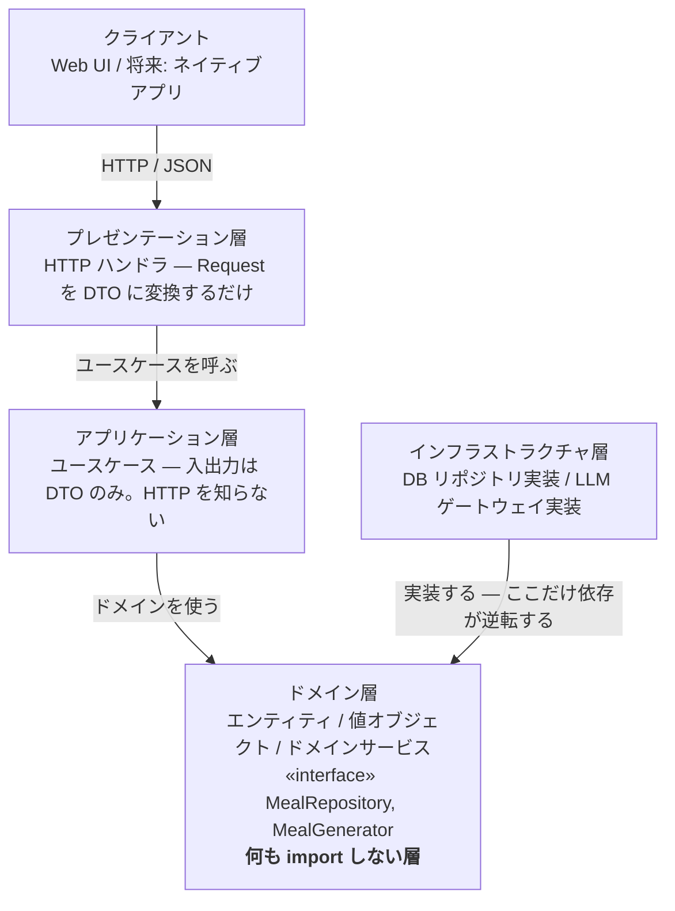

# アーキテクチャ決定録（ADR）

> ドラフト v0.33 / 2026-09-28 / ADR-001 〜 ADR-068
> **この文書がアーキテクチャ決定の正である。**

決定を変更する場合は、既存の ADR を書き換えず、**新しい ADR を起こして旧 ADR の状態を「置き換え済み」に改める**。
**その同じ周で、旧 ADR を「いま従うべき規則の根拠」として指している箇所を、生きた決定へ向け直す。** 向け先は置き換えた側に一律に寄せず、**その主張を実際に支えている決定**を選ぶ — 状態も材料にし、`提案` の遠い根拠より `承認` の近い根拠を採る。**ADR の本文は、経緯か生きた主張かを問わず書き換えない。** ADR の外で経緯として旧 ADR を指す文も**そのまま残す** — 置き換え済みの ADR を指すこと自体は誤りではない。掃除が1 PR に収まらないなら `docs/backlog.md` に行を足して分ける。次の周に送ると、辿った先が「置き換え済み」の札で行き止まりになる参照が溜まる（B-07 → B-16 → B-29 と2度くり返した）。

---

## A. 依存ルール

個別の ADR より先に、全体を貫く1つの規則を置く。

> **依存は必ず外から内へ向かう。例外は起動時の組み立て（composition root）だけ。**


```mermaid
flowchart TD
  client["クライアント<br/>Web UI / 将来: ネイティブアプリ"]
  pres["プレゼンテーション層<br/>HTTP ハンドラ — Request を DTO に変換するだけ"]
  app["アプリケーション層<br/>ユースケース — 入出力は DTO のみ。HTTP を知らない"]
  dom["ドメイン層<br/>エンティティ / 値オブジェクト / ドメインサービス<br/>«interface» MealRepository, MealGenerator<br/><b>何も import しない層</b>"]
  infra["インフラストラクチャ層<br/>DB リポジトリ実装 / LLM ゲートウェイ実装"]

  client -->|HTTP / JSON| pres
  pres -->|ユースケースを呼ぶ| app
  app -->|ドメインを使う| dom
  infra -->|"実装する — ここだけ依存が逆転する"| dom
```

### 層どうしの依存

| 依存する側 ↓ / される側 → | ドメイン | アプリケーション | インフラ | プレゼンテーション |
| --- | --- | --- | --- | --- |
| ドメイン層 | — | 禁止 | 禁止 | 禁止 |
| アプリケーション層 | 許可 | — | 禁止 | 禁止 |
| インフラ層 | 許可 | 禁止 | — | 禁止 |
| プレゼンテーション層 | **禁止** | 許可 | 禁止 | — |
| 起動時の組み立て | 許可 | 許可 | 許可 | 許可 |

**プレゼンテーション層 → ドメイン層が「禁止」である点に注意。** 外側が内側に依存すること自体はオニオンの原則に反しないが、ここを許すとドメインオブジェクトが画面まで漏れ出し、UI の都合でドメインが変形する。プレゼンテーション層が触れてよいのはアプリケーション層の DTO だけとする。

**「起動時の組み立て」**は全層を知る唯一の場所（composition root）。`apps/api/src/main.ts` の1ファイルに限定し、他所で `new MealRepositoryImpl()` を書かない。

### 層の呼び名とディレクトリの対応

| 層の呼び名 | ディレクトリ | 置くもの |
| --- | --- | --- |
| プレゼンテーション層 | `contexts/*/api/` と `apps/web/` | HTTP ハンドラと UI。どちらも DTO しか触らない |
| アプリケーション層 | `contexts/*/usecase/` | ユースケース。入出力は DTO |
| ドメイン層 | `contexts/*/domain/` | エンティティ・値オブジェクト・ドメインサービスと、リポジトリ／ポートの interface |
| インフラストラクチャ層 | `contexts/*/infrastructure/` | リポジトリとポートの実装 |

層の呼び名とディレクトリ名は**1対1で対応する**。文書では層の名前で、コードではディレクトリ名で呼ぶ。**この表以外の対応を作らないこと。**

### やってはいけない依存

```
✕ ネイティブ化できなくなる形            ○ 正しい形
  execute(req: Request,                  execute(input: GenerateInput)
          res: Response)                   : GenerateOutput

  Web フレームワークの型が               変換の責務はハンドラが持つ。
  アプリケーション層に侵入する。          ユースケースは HTTP を知らないので、
  HTTP を持たない呼び出し元から使えない。 別クライアントからもそのまま呼べる。
```

ネイティブアプリ対応の可否は、この1点でほぼ決まる。**ユースケースの引数と戻り値にフレームワーク由来の型が1つでも現れた時点で、その層は Web に固定される。**

### コンテキストをまたぐ依存

ディレクトリはコンテキストで垂直に切る（ADR-013）。層のルールは**各コンテキストの内側で**成立し、そのうえでコンテキスト間にもう一段の規則が要る。

| import 元 | import してよい先 |
| --- | --- |
| `contexts/A/domain/` | `shared/domain/` のみ。**他コンテキストは一切不可** |
| `contexts/A/usecase/` | `contexts/A/domain/` と `contexts/B/usecase/`（公開されたユースケースのみ） |
| `contexts/A/infrastructure/` | `contexts/A/domain/` と `shared/infrastructure/`（ADR-059） |
| `contexts/A/api/` | `contexts/A/usecase/` のみ |
| `shared/domain/` | 何も import しない。**`contexts/` は一切不可** |
| `shared/infrastructure/` | `shared/domain/` のみ。**`contexts/` は一切不可**（ADR-059） |
| `main.ts` | すべて（composition root） |

コンテキストをまたいでよいのは `usecase/` どうしだけ。相手の `domain/` を直接 import した瞬間、2つのコンテキストは1つに融合し、将来の切り出しが不可能になる。

**この規則は lint で強制することを推奨する。** 垂直分割の弱点は、層の違反が「隣のディレクトリ」で起きるため目視で気づきにくいことにある。ESLint の import 制限や dependency-cruiser で、上の表をそのまま設定に落とす。

### ディレクトリ構成

```
リポジトリルート
├─ apps/web/                  React + Vite（PWA）— API のクライアント
│  ├─ src/features/meal/       画面もコンテキスト単位で切る
│  ├─ src/features/pantry/
│  ├─ src/apiClient/
│  ├─ public/manifest.webmanifest
│  └─ vite.config.ts           vite-plugin-pwa
│
├─ apps/api/                  Hono on Cloudflare Workers
│  └─ src/
│     ├─ contexts/meal/       ← コアドメイン
│     │  ├─ domain/
│     │  │  ├─ entity/       Meal.ts  Suggestion.ts
│     │  │  ├─ value/        MealId.ts  MealIngredient.ts  CookingStep.ts
│     │  │  │                CookingRecord.ts  PantrySnapshot.ts
│     │  │  ├─ service/      MealCoverageService.ts  CookableMealFinder.ts
│     │  │  ├─ repository/   MealRepository.ts  SuggestionRepository.ts   «interface»
│     │  │  ├─ port/         MealGenerator.ts                             «interface»
│     │  │  └─ error/        MealRuleViolation.ts        規則違反を断る例外（ADR-025）
│     │  ├─ usecase/         SuggestMeals.ts  RegenerateMeals.ts
│     │  │                   ListMeals.ts  RecordCooking.ts
│     │  ├─ infrastructure/  MealRepositoryImpl.ts  MealGeneratorImpl.ts
│     │  │                   MealResponseParser.ts   ← 腐敗防止層
│     │  └─ api/             routes.ts
│     │
│     ├─ contexts/pantry/     同じ5つのディレクトリを持つ
│     ├─ contexts/catalog/    同じ
│     ├─ contexts/identity/   同じ
│     │
│     ├─ shared/domain/       HouseholdId.ts  Clock.ts
│     ├─ shared/infrastructure/db/  HouseholdTransaction.ts   各 infrastructure/ と main.ts だけが引く（ADR-059）
│     └─ main.ts              composition root — 全層を知る唯一の場所
│
└─ packages/contract/         API の型定義。web と api で共有する
```

`repository/` と `port/` は interface だけを置く。**`domain/` は何も import しない。**

`usecase/` は `domain/` の**兄弟**であって、下ではない。依存の向きが `usecase/ → domain/` の一方向だからである。

---

## B. 決定一覧

| # | 決定 | 状態 |
| --- | --- | --- |
| ADR-001 | オニオンアーキテクチャを採用する | 承認 |
| ADR-002 | リポジトリとポートのインターフェースをドメイン層に置く | 承認 |
| ADR-003 | ユースケースを HTTP API として公開し、UI をその一クライアントに限定する | 承認 |
| ADR-004 | モジュラーモノリスとして実装する | 承認 |
| ADR-005 | LLM を腐敗防止層の背後に隔離する | 承認 |
| ADR-006 | 献立を永続化し、再生成を明示操作に限定する | 承認 |
| ADR-007 | 在庫品を集約ルートとし、同一食材を統合しない | 承認 |
| ADR-008 | 集約をまたぐ参照は識別子で行う | 承認 |
| ADR-009 | 材料の充足判定を永続化せず都度算出する | 承認 |
| ADR-010 | 分量を構造化せず自由文字列として扱う | 承認 |
| ADR-011 | MVP ではドメインイベントを導入しない | 承認 |
| ADR-012 | 技術スタックの選定 | 置き換え済み |
| ADR-013 | コンテキストごとに垂直にディレクトリを切る | 承認 |
| ADR-014 | React + Vite の SPA とし、Next.js を採用しない | 承認 |
| ADR-015 | サーバサイドを Hono + Cloudflare Workers とする | 承認 |
| ADR-016 | PWA 化する。オフライン対応はアプリシェルに限る | 承認 |
| ADR-017 | 既存の献立の再利用を優先し、LLM 呼び出しを最後の手段とする | 置き換え済み |
| ADR-018 | ユビキタス言語の中核を「献立 / Meal」とする | 承認 |
| ADR-019 | LLM プロバイダを未定のまま進める | **意図的に未決** |
| ADR-020 | データベースと認証を Supabase とする | **置き換え済み**（ADR-029） |
| ADR-021 | 生成の重複回避はプロンプトで行い、保証はしない | 承認 |
| ADR-022 | 再利用と生成を混ぜず、生成を明示操作に寄せる | 承認 |
| ADR-023 | 材料に種別を持たせ、充足判定の対象を主材料に限る | 承認 |
| ADR-024 | *(欠番)* — feature flag。**本番の配信先を持つまで不要と判断し削除**（規則は `CLAUDE.md` へ） | 削除 |
| ADR-025 | ドメイン層の例外型を `domain/error/` に置く | 承認 |
| ADR-026 | 在庫品の識別子をドメイン層のポートで発行する | 承認 |
| ADR-027 | 在庫品の削除を冪等にせず、消せなかったことを断る | 承認 |
| ADR-028 | 世帯を `household_id = auth.uid()` から始め、`household_members` を置かない | 承認 |
| ADR-029 | DB アクセスを Drizzle に寄せ、RLS をトランザクション単位のクレーム設定で効かせる | 承認 |
| ADR-030 | エージェントのコンテナでは Docker を使わず素の PostgreSQL で `pnpm test:db` を回す | 承認 |
| ADR-031 | アクセストークンの検証を共有秘密（HS256）で行い、JWKS は実環境を確かめるまで採らない | **置き換え済み**（ADR-043） |
| ADR-032 | api 層は世帯と識別子の型をユースケースから導出し、規則違反を `name` で見分ける | 承認 |
| ADR-033 | コンテキストをまたぐ入力を、相手の型ではなく名称などのプリミティブで受け取る | 承認 |
| ADR-034 | 材料の分量を献立コンテキストに起こし、共有カーネルへ移さない | 承認 |
| ADR-035 | 献立から由来 `provenance` を外す | 承認 |
| ADR-036 | 作れる献立の並び順を期限の列の辞書式比較で決め、在庫を献立側の値で受け取る | 承認 |
| ADR-037 | 在庫スナップショットが運ぶ項目を献立側の `StockItem` に足し、C-7 の一致比較を多重集合で行う | 承認 |
| ADR-038 | 直近の提案を引く口が順序を約束し、同時刻を `SuggestionId` の降順で閉じる | 承認 |
| ADR-039 | コード上の識別子を英語に統一し、コメントとテストの文は日本語のまま残す | 承認 |
| ADR-040 | 期限切れの在庫を落とす規則を在庫スナップショットの側に置き、当日は落とさない | 承認 |
| ADR-041 | ユースケースの「生成を呼ばなかった」結末を、例外ではなく判別できる戻り値で表す | 承認 |
| ADR-042 | Workers から Postgres へは Hyperdrive 経由で繋ぎ、origin を Supabase の直接接続とする | 承認 |
| ADR-043 | アクセストークンの検証を JWKS（ES256）で行う | 承認 |
| ADR-044 | Hyperdrive の問い合わせキャッシュを切る | 承認 |
| ADR-045 | サーバ側の不備を素の `Error` で断り、api 層は写さずに畳む | 承認 |
| ADR-046 | web のログインを `@supabase/supabase-js` に委ね、セッションを継ぎ目の背後に置く | 承認 |
| ADR-047 | 開発の場を public の `tkdev106/fridge-to-meal` に戻し、非公開の複製を退役させる | 承認 |
| ADR-048 | web から `apps/api` への到達を別 origin ＋ CORS の明示の許可一覧とし、経路の接頭辞を置かない | 承認 |
| ADR-049 | 1日の生成回数を生成由来の提案の件数で数え、「1日」を基準日時から遡る24時間の窓とする | 承認 |
| ADR-050 | 削除の 404 を画面が「すでに消えている」と読み、一覧の取り直しで検める | 承認 |
| ADR-051 | FR-36 の明示操作を2つ目の入口として置き、C-7 の短絡を通さない | 承認 |
| ADR-052 | 画面のコンポーネントを jsdom 上で描いて検証する | 承認 |
| ADR-053 | 設計文書の閲覧用 HTML をやめ、Markdown だけを置く | 承認 |
| ADR-054 | 画面の見た目をインラインの `style` に置き、CSS ファイルを持たない | **置き換え済み**（ADR-055） |
| ADR-055 | 画面の見た目を CSS Modules に置き、トークンとリセットだけ1枚のグローバル CSS に置く | 承認 |
| ADR-056 | 移行 SQL の RLS の守りを表ごとに判定し、子表は自分で `household_id` を持つ | 承認 |
| ADR-057 | C-3 はリポジトリが読み比べて断ることで守る | 承認 |
| ADR-058 | 提案の保存は読み比べず素の insert で書き、提案の1件から献立へ外部キーを張らない | 承認 |
| ADR-059 | コンテキストをまたぐインフラを `shared/infrastructure/` に置き、各コンテキストの `infrastructure/` と `main.ts` だけに引かせる | 承認 |
| ADR-060 | プロバイダが決まるまで、`MealGenerator` の背後に仮の生成器 `PlaceholderMealGenerator` を置いて本番の結線に挿す | 承認 |
| ADR-061 | 提案の1件が指す献立を引けない回は提案を返さずに断り、賄える材料に在庫品の最も早い期限を載せる | 承認 |
| ADR-062 | 献立の2経路を `POST` とし、提案の3つの結末を 200 で返し、献立の規則違反の既定を 500 とする | 承認 |
| ADR-063 | 食材名を集める口を献立の usecase に置き、在庫品の名称と主材料の名称だけから集める | 承認 |
| ADR-064 | 起動時に開く画面を献立タブにする | 提案 |
| ADR-065 | 保存済みの提案を `GET /suggestions/latest` で読み取り専用に返し、献立タブはそこから取る | 承認 |
| ADR-066 | 選んでいるタブの状態を門に持ち上げ、画面からタブを移せるようにする | 提案 |
| ADR-067 | 献立1件を `GET /meals/:id` で充足つきに返し、提案の1件と中身の型を共有する | 提案 |

---

## C. 決定の記録

### ADR-001　オニオンアーキテクチャを採用する　`承認`

- **状況** — 個人開発の小規模アプリだが、将来のネイティブアプリ対応と、献立生成方式の差し替え（LLM から自前 DB へ）が想定されている。一方で Clean Architecture の全レイヤー分割は、この規模には過剰。
- **決定** — ドメイン / アプリケーション / インフラストラクチャ / プレゼンテーションの4層とし、依存は外から内への一方向に限る。Entities と Use Cases をさらに細分する Clean Architecture 相当の分割は行わない。
- **理由** — 差し替えたいもの（DB・LLM・UI）がすべて外側にあり、守りたいもの（献立と在庫のルール）が中心にある。この形は本アプリの変更予測と一致する。
- **結果** — 層をまたぐたびに型の変換が要り、小さな機能追加でも複数ファイルに触れる。この冗長さは意図的なコストとして受け入れる。層の数をこれ以上増やさないことで上限を設ける。

### ADR-002　リポジトリとポートのインターフェースをドメイン層に置く　`承認`

- **状況** — ドメイン層はデータの永続化と献立の生成を必要とするが、その手段（DB、LLM API）は外側の関心事である。
- **決定** — `MealRepository` `StockItemRepository` `MealGenerator` をドメイン層に**インターフェースとして**定義し、インフラ層がこれを実装する。実装の注入は composition root で行う。
- **理由** — 依存関係逆転の実体。インターフェースを所有するのが呼ぶ側（ドメイン）であることにより、ドメイン層のソースコードに DB や HTTP クライアントの import が1行も現れなくなる。
- **結果** — ドメイン層のテストが実 DB・実 API なしで書ける。反面、インターフェースの設計を誤ると全実装に波及するため、メソッドは**ドメインの語彙で命名する**（`findByHousehold` であって `selectWhere` ではない）。

### ADR-003　ユースケースを HTTP API として公開し、UI をその一クライアントに限定する　`承認`

- **状況** — 将来 Web に加えてネイティブアプリを提供する可能性がある。フルスタックフレームワークを使う場合、UI とサーバ処理を密結合させる仕組み（サーバアクション等）が用意されており、素直に使うとアプリケーション層が Web に固定される。
- **決定** — すべてのユースケースを HTTP API として公開する。Web UI はその API のクライアントであり、特権的な近道を持たない。ユースケースの引数と戻り値には、フレームワーク由来の型（Request / Response / Cookie 等）を**一切含めない**。
- **理由** — ネイティブ化のコストは、この境界を最初に引くかどうかでほぼ決まる。後から剥がすのは、UI からサーバ処理を直接呼ぶコードが増えた分だけ困難になる。
- **結果** — Web だけを作る間は、API 経由の一往復が明確なオーバーヘッドになる。**これは将来のための前払いであり、ネイティブアプリを作らないと決めた時点で見直してよい。**

### ADR-004　モジュラーモノリスとして実装する　`承認`

- **状況** — 境界づけられたコンテキストが4つあるが、利用者は当面ひとりで、運用体制も個人である。
- **決定** — 4コンテキストを単一のデプロイ単位に収め、境界はディレクトリとモジュールの境界として表現する。コンテキスト間の呼び出しは関数呼び出しで行い、ネットワークを介さない。
- **理由** — サービス分割の運用コストに見合う規模ではない。境界を型とディレクトリで守れていれば、必要になった時点で切り出せる。
- **結果** — 境界の侵犯がコンパイルエラーにならないため、規律で守る必要がある。**コンテキストをまたぐ import は、相手コンテキストが公開したユースケース経由に限る**ことをルールとし、内部のエンティティを直接 import しない。

### ADR-005　LLM を腐敗防止層の背後に隔離する　`承認`

- **状況** — 献立の生成を LLM に委ねる。LLM の応答は形式が揺れうるうえ、将来は自前レシピ DB への差し替えも想定される。
- **決定** — ドメイン層のポート `MealGenerator` をインフラ層の `LlmMealGenerator` が実装する。応答の解析と検証は `MealResponseParser` が担い、**検証を通らない応答はドメイン層に渡さない**。プロンプト文字列・JSON・モデル名がドメイン層に現れてはならない。
- **理由** — 外部システムの都合をドメインモデルに侵入させないため。生成方式を差し替えるとき、書き換えるのはこのクラス1つで済む。
- **結果** — 変換層のぶん記述が増える。また、応答が検証を通らなかった場合の扱いを ACL 内で決める必要がある。**現時点では「ユーザーに再試行を促す」とし、自動リトライは行わない。**

### ADR-006　献立を永続化し、再生成を明示操作に限定する　`承認`

- **状況** — LLM は同じ在庫でも毎回異なる献立を返す。利用者は多様性を歓迎しているが、画面を戻るたびに候補が入れ替わるのは不具合に見える。加えて生成のたびに費用が発生する。
- **決定** — 生成した献立をすべて永続化する。画面を開いたときは保存済みの最新の提案を表示し、生成 API を呼ばない。新しい候補は「他の候補を見る」等の明示操作でのみ生成する。在庫が変わらない限り再生成しない（確定事項 C-7）。
- **理由** — 体験の安定と費用の抑制が同じ手段で両立する。さらに、蓄積した献立は「以前見た献立」「つくった献立」という機能そのものになり、将来の自前レシピ DB の初期データにもなる。
- **結果** — 献立が単調増加する。保持期間の方針が必要になる（未決 Q-2）。また「表示は速く、生成は待たせてよい」という性能要件の分離が前提になる。

### ADR-007　在庫品を集約ルートとし、同一食材を統合しない　`承認`

- **状況** — 「冷蔵庫」を集約ルートにして在庫品を配下に置くか、在庫品自体を集約ルートにするかの選択がある。
- **決定** — 在庫品（`StockItem`）を集約ルートとする。同じ食材を別の日に買った場合も統合せず、独立した在庫品として扱う。
- **理由** — 買った日が違えば期限が違う。統合すると期限をどちらに寄せるか決められず、期限管理が壊れる。統合しないほうが現実に即しており、集約も小さくなる。
- **結果** — 一覧に「にんじん」が2行並びうる。**これは仕様であり、まとめる要件は持たない。**

### ADR-008　集約をまたぐ参照は識別子で行う　`承認`

- **状況** — `Suggestion` は3件の `Meal` を参照する。オブジェクト参照を持たせると、読み込み範囲が際限なく広がる。
- **決定** — 集約をまたぐ参照はすべて識別子（`MealId` 等）で保持する。オブジェクト参照を持たない。1トランザクションで更新してよい集約は1つまでとする。
- **理由** — 集約の境界が実際の一貫性の境界と一致し、読み込みと更新の範囲が予測可能になる。
- **結果** — 画面表示のためにリポジトリを複数回呼ぶ場面が出る。**その解決に集約を結合させてはならず、必要ならアプリケーション層に読み取り専用の問い合わせを追加する。**

### ADR-009　材料の充足判定を永続化せず都度算出する　`承認`

- **状況** — 「この献立は在庫で作れるか」は献立と在庫の両方に依存する。在庫は献立の生成後も変化し続ける。
- **決定** — 充足の結果を献立に保存せず、表示のたびに `MealCoverageService` が現在の在庫と突き合わせて算出する。
- **理由** — 保存すると在庫の変化のたびに全献立を更新する必要が生じ、更新漏れが必ず起きる。導出可能な値は導出する。
- **結果** — 一覧表示のたびに計算が走る。**「以前つくった献立」の一覧では充足を算出しない**ことで負荷を抑える。

### ADR-010　分量を構造化せず自由文字列として扱う　`承認`

- **状況** — 「200g」「1本」「少々」を数値と単位に分解するか、文字列のまま扱うかの選択がある。
- **決定** — `Amount` を自由文字列の値オブジェクトとする。数値と単位に分解しない。
- **理由** — 分量を使うのは LLM への入力と画面表示だけで、**数量の演算をする要件が存在しない**。構造化すると入力欄が増え、登録の手間という最大の離脱要因を悪化させる。
- **結果** — 「在庫の 200g に対して献立が 300g 必要」といった不足量の判定ができない。充足判定は食材名の有無のみで行う（確定事項 C-6）。

### ADR-011　MVP ではドメインイベントを導入しない　`承認`

- **状況** — 「献立が調理された」「在庫が登録された」はドメインイベントとして表現できるが、現時点でそれに反応する処理が存在しない。
- **決定** — ドメインイベントの仕組みを導入しない。コンテキスト間の連携はユースケースからの直接呼び出しで行う。
- **理由** — 購読者のいないイベント機構は、処理の流れを追いにくくするだけの複雑さになる。**非同期処理を要する要件が現れてから導入する。**
- **結果** — 通知機能などを追加する際に、この決定の見直しが必要になる。その時点で新しい ADR を起こす。

### ADR-012　技術スタックの選定　`置き換え済み`

- **状況** — Nuxt / Vue と Next.js / React のいずれかを選ぶ論点として起票した。
- **結果** — **ADR-014（フロントエンド）と ADR-015（サーバサイド）に置き換えられた。** いずれの選択肢も採らず、React + Vite と Hono + Cloudflare Workers の組み合わせに決定した。

### ADR-013　コンテキストごとに垂直にディレクトリを切る　`承認`

- **状況** — 当初は層でトップレベルを切っていた（`domain/` `application/` …）。この形では、献立に1つ機能を足すたびに4つの離れたディレクトリを行き来することになり、**コンテキストの境界がディレクトリ上に一切現れない**。
- **決定** — トップレベルを境界づけられたコンテキストで切り、層はその内側に置く。各コンテキストは `domain/` `usecase/` `infrastructure/` `api/` の4つを持ち、`domain/` の中をさらに `entity/` `value/` `service/` `repository/` `port/` に分ける。
- **理由** — 変更が届く単位はコンテキストであって層ではない。境界がディレクトリとして目に見えるため、ADR-004 のモジュラーモノリスの規律が守りやすく、切り出しが必要になったときもディレクトリごと移せる。**ユースケースとエンティティを別ディレクトリに保つことで、層の区別は垂直分割後も失われない。**
- **結果** — 層の違反が「隣のディレクトリ」で起きるため目視で気づきにくくなる。**依存ルールは lint で機械的に強制することを推奨する。**

### ADR-014　React + Vite の SPA とし、Next.js を採用しない　`承認`

- **状況** — React を選ぶとして、Next.js を使うかどうか。本アプリはログイン必須で、扱うのは個人の在庫データである。
- **決定** — React + Vite の SPA とする。Next.js は採用しない。
- **理由** — 3つある。**(1)** ログイン後のプライベートな画面しかなく、SEO も SSR も価値を生まない。**(2)** Next.js の最大の利点であるサーバ統合（サーバアクション等）は、UI からサーバ処理を直接呼べる仕組みであり、**ADR-003 が避けようとしている依存そのもの**である。使わないなら採用する理由が薄く、使えば決定に反する。**(3)** SPA は構造上「API のクライアント」でしかないため、ADR-003 の境界が意識せずとも守られる。
- **結果** — 初回読み込みは SSR より遅い。ログイン後に使うアプリなので許容し、PWA のキャッシュ（ADR-016）で2回目以降を速くする。公開ページや SEO が必要になった時点で見直す。

### ADR-015　サーバサイドを Hono + Cloudflare Workers とする　`承認`

- **状況** — LLM の API キーをクライアントに置けないため、サーバが必須。SPA を選んだ結果、サーバは API 専任になり、**ドメイン層とユースケース層はここに置かれる**。
- **決定** — Hono を Cloudflare Workers 上で動かす。`apps/api/` がドメイン層・ユースケース層・インフラ層を含み、`apps/web/` はその HTTP クライアントに徹する。
- **理由** — 無料枠が広く「ランニングコストをなるべく安く」という要求に合う。Web 標準 API ベースでフレームワークへのロックインが軽い。TypeScript なので、ドメイン層をフロントと同じ言語で書け、`packages/contract/` で API の型を共有できる。
- **結果** — Workers には実行時間と CPU の制限がある。**LLM の呼び出しは数十秒かかりうるため、制限に収まるかを実装初期に確認する必要がある。** 収まらない場合はストリーミング応答か、生成を非同期化して結果をポーリングする形に変える。

### ADR-016　PWA 化する。オフライン対応はアプリシェルに限る　`承認`

- **状況** — 台所で使うため、ホーム画面から即起動できることに価値がある。一方、データのオフライン書き込みを許すと同期と競合解決が必要になり、MVP の規模を大きく超える。
- **決定** — マニフェストとサービスワーカーを備え、ホーム画面に追加できるようにする。キャッシュするのは**アプリの外枠（HTML・CSS・JS）だけ**とし、データのオフライン読み書きは行わない。オフライン時はその旨を表示して操作を止める。
- **理由** — PWA 化の目的は**設置と起動の速さ**であって、オフライン動作ではない。目的をここで区切ることで、同期の複雑さを丸ごと回避できる。
- **結果** — 2つの制約を受け入れる。**(1)** iOS の Safari は `beforeinstallprompt` を実装していないため、ワンタップのインストールバナーを出せない。利用者が自分で「共有 → ホーム画面に追加」をたどる必要があり、**案内 UI がなければ事実上インストールされない**。**(2)** iOS で Web プッシュ通知が届くのはホーム画面に追加された場合のみで、タブで開いているだけでは届かない。期限通知は Could のまま据え置く。

### ADR-017　既存の献立の再利用を優先し、LLM 呼び出しを最後の手段とする　`置き換え済み`

- **状況** — ADR-006 で在庫が変わらない限り再生成しないことは決めたが、**在庫が変われば必ず生成が走る**。一方その頃には、今日の在庫でそのまま作れる献立が手元に貯まっている。
- **決定** — 提案の組み立てを3段で試みる。**(1)** 在庫が前回と同じなら保存済みの提案を返す。**(2)** 違えば、既存の献立から現在の在庫で不足0件のものを選ぶ。**(3)** それで3件に満たない分だけを LLM に生成させる。「他の候補を見る」はこの経路に乗せず、常に新規生成する。
- **理由** — 費用と待ち時間の両方が同時に下がる。しかも**使い続けるほど手持ちが増えて再利用率が上がる**ため、1回あたりのコストは時間とともに下がっていく。ユーザーにとっても「前に見たあれが今日作れる」は有用な情報であり、機能の劣化ではない。
- **結果** — 3つの帰結を引き受ける。**(1)** 再利用の精度が充足判定に依存し、それは食材名の完全一致で行っている（C-6）。**ここが弱いと仕組み全体が働かないため、食材カタログの別名データが実質的な前提条件になる。** **(2)** 再利用は明示表示が必須。黙って混ぜると同じ献立が出たとしか見えない。**(3)** 同じ献立が出続けないよう、直近の提案に出したものを除外する規則が要る（C-11）。
- **置き換え** — **ADR-022 に置き換えられた。** 再利用と生成を1つの提案の中で混ぜる (3) の段を取りやめ、**作れる既存の献立が1件でもあれば LLM を呼ばない**形に改めた。上の (1)〜(3) の帰結は ADR-022 でもそのまま引き継がれる。

### ADR-018　ユビキタス言語の中核を「献立 / Meal」とする　`承認`

- **状況** — 生成物の呼称が定まらないと全レイヤーの識別子が決まらない。当初の「献立案 / `MealIdea`」は文書としては正確だが、UI に置くと固い。
- **決定** — **献立 / `Meal`。**「レシピ」「メニュー」「候補」「料理」「献立案」はすべて予約語として使用を禁じる。
- **理由** — アプリの価値（献立が決まる）と語が一致し、UI が「前に見た献立」「作った献立」と自然に書ける。`Meal` と `Suggestion` は識別子として十分に区別でき、コンテキスト名「献立コンテキスト」とも衝突しない。
- **結果** — 「レシピ / `Recipe`」を空けておける。**ADR-006 の移行先である自前レシピ DB を将来持ったとき、`Recipe`（検証済みの既存レシピ）と `Meal`（この世帯のために生成された献立）を別概念として導入できる。**

### ADR-019　LLM プロバイダを未定のまま進める　`意図的に未決`

- **状況** — Claude・Gemini など複数の候補がある。一方、生成は `MealGenerator` ポートの背後に隔離済みで（ADR-005）、実装は1クラスに閉じている。
- **決定** — **いま決めない。** プロバイダは差し替え可能な詳細として扱い、他の設計と実装を先に進める。
- **理由** — 早く決めても得るものがない。むしろ**プロンプト設計を固めてから、同じプロンプトを複数のプロバイダに投げて比べたほうが、判断材料が揃う**。ポートと腐敗防止層があることの実際的な見返りが、まさにこの「決定を遅らせられる」ことである。
- **比較の軸** — 決定時に見るべき順に、**(1) 構造化出力（JSON）の安定性** — これが最重要。形式が揺れると腐敗防止層の検証失敗が増え、再試行が実質的な追加コストになる。**(2)** 日本語・家庭料理の質。**(3)** 単価。**(4)** レイテンシ（ADR-015 の Workers 実行時間制限に効く）。
- **結果** — 要件定義の費用試算は Claude の単価に基づく暫定値であり、決定時に置き換える。**この未決はプロジェクトを止めない。**

### ADR-020　データベースと認証を Supabase とする　`置き換え済み`

- **状況** — API は Cloudflare Workers 上に置く（ADR-015）。データベースと認証が必要。対抗案は Cloudflare D1 + 自前認証で、こちらはプラットフォームが1つで済む。
- **決定** — Supabase（Postgres + Auth）を使う。Workers からは **supabase-js（HTTP / PostgREST 経由）** で接続する。
- **理由** — **(1) 認証を自前で作らずに済む。** MVP の速度に直結する。**(2) 行レベルセキュリティ（RLS）が安全網になる。** 世帯によるデータ分離をアプリコードだけで守る形は、`householdId` の付け忘れ1箇所で破れる。同じ制約をデータベース側にも置けるのは、対抗案にはない価値である。**(3)** Postgres なので将来の検索・集計で詰まらない。
- **結果** — 4つの帰結を引き受ける。
  1. **RLS を効かせるには、Workers から `service_role` キーではなく利用者の JWT で問い合わせなければならない。** `service_role` は RLS を迂回するため、それを使うと採用理由 (2) が丸ごと消える。**実装上の必須事項。**
  2. Postgres への直接 TCP 接続はエッジ実行と相性が悪く、Hyperdrive のような接続プールを挟む必要がある。**supabase-js の HTTP 経由なら不要**なので当面それで進める。
  3. **無料プランのプロジェクトは、API リクエストが1週間ないと自動的に一時停止される。** データは保持されるが手動で再開するまで止まる。定期的にアクセスする仕組みを置くか、停止と再開を受け入れるかを決める必要がある。
  4. **プラットフォームが2つになる**（Cloudflare と Supabase）。1つにまとめたいなら API を Supabase Edge Functions に寄せる手はあるが、Deno 環境になり Hono を選んだ利点が薄れる。**当面は2つで進め、運用の煩雑さが実際に問題になった時点で見直す。**

### ADR-021　生成の重複回避はプロンプトで行い、保証はしない　`承認`

- **状況** — すでに手元にある献立と同じものが再び生成されると、履歴が同じ料理で埋まる。一方、意味的な重複（「豚肉と白菜の炒め物」と「豚こまと白菜の中華炒め」）をコードで判定するのは難しい。
- **決定** — 生成時のプロンプトに**既存の献立名の一覧を含め、それらとは異なるものを生成するよう指示する**。渡す件数には上限を設ける（初期値: 直近50件）。`MealGenerator` ポートは「在庫スナップショット・必要件数・避けるべき献立名」を受け取る。
- **理由** — 表記の違う同じ料理を見分けられるのは、コードではなく LLM 自身である。判定を自前で持たず、生成側に避けさせるのが最も素直で、実装も増えない。
- **結果** — **(1) これは best-effort であって保証ではない。** 重複が出ても壊れない設計は維持する。**(2) 上限は必ず設ける。** 件数に比例して入力トークンが増えるため、上限を外すと蓄積とともに費用が増え、ADR-017 の削減効果を打ち消しかねない。**(3)** それでも名称が完全一致した場合の扱いを定めた（確定事項 C-4）。

### ADR-022　再利用と生成を混ぜず、生成を明示操作に寄せる　`承認`

- **状況** — ADR-017 は提案の組み立てを3段に分け、作れる既存の献立が1〜2件のときは**その分を再利用し、残りを LLM に生成させて3件に揃える**としていた。しかしこの混合には、費用の面でも体験の面でも割に合わない点がある。**1件でも足りなければ結局 LLM を呼ぶ**ので、再利用が2件あっても削減できるのは出力の一部だけで、待ち時間はまるごと残る。加えて、同じ提案の中で再利用と生成が同居することが、`Suggestion` の不変条件を破りうる経路を作っていた（同じ献立が再利用と生成の両方から入り、C-13 に反する）。
- **決定** — **1つの提案の中で再利用と生成を混ぜない。** 在庫が変わったとき、作れる既存の献立が**1件でもあれば、その1〜3件だけを提案として返し、LLM を呼ばない**。0件のときに限り3件を生成する。利用者が新しい献立を求める明示操作を行った場合は、再利用せず**必ず3件を生成する**。これに伴い `Suggestion.entries` の件数を「ちょうど3件」から「1件以上3件以下」に改める（確定事項 C-15）。
- **理由** — **(1) 費用と待ち時間の削減が「全か無か」になり、実際に効く。** 混合では1件足りないだけで LLM を呼んでいた。**(2) 組み立てが単純になる。** 提案は「再利用だけ」か「生成だけ」のどちらかで、混合に伴う重複の判定が不要になる。**(3) 新しさの要求と、費用の削減が、操作として分かれる。** 3件に満たないときに何を出すかをアプリが推測せず、**足りないと感じた利用者が明示的に求める**形にする。既定の表示では LLM を一度も呼ばない経路が成立する。
- **結果** — 3つの帰結を引き受ける。**(1) 提案が1〜2件しか出ないことがある。** FR-16 の「複数件（3件程度）」は、再利用の経路では満たされないことがある。**新しい献立を求める導線を画面に置くことが前提条件になる**（画面の文言と配置は画面設計で決める）。**(2)** `Suggestion` の件数の不変条件が緩む。「ちょうど3件」に依存した実装を書かない。**(3) 作れる既存の献立が1件だけの日は、提案が1件になる。** 選ぶ余地がないという不満はありうるが、それは (1) の導線で解消する筋のものであり、勝手に生成して埋める理由にはならない。

### ADR-023　材料に種別を持たせ、充足判定の対象を主材料に限る　`承認`

- **状況** — 充足判定は食材名の完全一致で行う（C-6）。ここに調味料が混じると、在庫として登録していない限り**必ず不足材料**になり、不足0件の献立（`CookableMeal`）が事実上生まれない。**ADR-017 と ADR-022 の再利用が丸ごと働かなくなる。** 当初はプロンプト側の固定リストに載る調味料を材料に書かせないことで回避していたが、この方法では**リストに載っていない調味料**（オイスターソース、豆板醤、ナンプラー等）が不足材料として残り、リストが実質的な上限になってしまう。加えて、調味料が材料一覧に現れないため、**何が必要かを材料だけでは把握できない**という副作用があった。
- **決定** — `MealIngredient` に種別 `kind: 'main' | 'seasoning'` を持たせる。**種別は生成時に決まり、以後不変**（C-3 と同じ扱い）。`MealCoverageService` と `CookableMealFinder` は**主材料だけを在庫と突き合わせ、調味料は賄えるものとしても不足するものとしても数えない**（確定事項 C-16）。**種別が判別できない材料は主材料として扱う。**
- **理由** — **(1) 調味料の集合を閉じた列挙で持たなくて済む。** 「これは調味料か」の判別は、献立を考えることに比べれば桁違いに易しく、生成側に任せられる範囲にある。ADR-021 が意味的な重複の判定を生成側に委ねたのと同じ構図である。**(2) 何を判定に使うかという関心が、判定する側に移る。** 「材料に書かせない」は生成側の都合をドメインに持ち込んでいたが、種別を持てば、ドメインが自分で対象を選べる。**(3) 材料一覧に調味料を出せる。** 分量つきで表示でき、何が要るかが材料だけで分かるようになる。
- **結果** — 4つの帰結を引き受ける。**(1) 生成側の申告に依存する。** 誤った種別が来ても壊れないよう、判別できない場合は主材料に倒す — 不足材料が1件増えるだけで済み、逆に倒すと**在庫にない食材が黙って判定から消える**。**(2) 固定リストは残るが役割が変わる。** 「載っているものだけが調味料」（上限）ではなく「**載っているものは必ず調味料に倒す**」（下限）になり、腐敗防止層の保険として働く。**(3) 判定が揺れる余地がある。** 「バター」は菓子なら食材、炒め物なら調味料になりうる。どちらに倒れても影響は不足材料の1件の増減にとどまる。**(4)** 出力トークンが材料の件数ぶん増える。3件で数十トークンの規模であり、無視してよい。


### ADR-025　ドメイン層の例外型を `domain/error/` に置く　`承認`

- **状況** — ADR-013 は `domain/` の中を `entity/` `value/` `service/` `repository/` `port/` の5つに分けると決めた。在庫コンテキストの実装（backlog B-02）で、不変条件に反する入力を断る例外 `PantryRuleViolation` が必要になったが、**これは5つのどれでもない。** 実体でも値でもなく、ドメインサービス（純粋関数）でもなく、interface でもない。`domain/` の直下に置くと、ディレクトリだけが並ぶ階層に `.ts` が1つ混ざる。しかも例外はコンテキストごとに要るため、**同じ浮き方が4か所で起きる。**
- **決定** — `domain/` に6つめとして `error/` を置き、**規則違反を表す例外型をここに集める。** コンテキストごとに1つ（`PantryRuleViolation` / `MealRuleViolation` …）を基本とし、`rule` に規則の識別子を持たせる。**ADR-013 の分割を1つ増やすものであり、置き換えるものではない。**
- **理由** — **(1) 例外は5つのどれとも役割が違う。** 値でも実体でもなく、「断り方」そのものである。**(2) 階層の粒度が揃う。** `domain/` の下がディレクトリだけになり、直下のファイルという例外的な位置づけが消える。**(3) 次のコンテキストで迷わない。** 置き場所が決まっていれば、献立側で同じ判断をやり直さずに済む。ドメイン層が HTTP のステータスコードも画面の文言も持たないという規則（ADR-003）を守る場所が、1か所に集まる。
- **結果** — **ディレクトリ1つにファイル1つという状態がしばらく続く。** 例外の種類が増えるまでは過剰に見えるが、4コンテキストで同じ形になることの一貫性を採る。**例外を細分化する理由にはしない** — 規則の区別は `rule` の識別子で表し、クラスを増やさない。

### ADR-026　在庫品の識別子をドメイン層のポートで発行する　`承認`

- **状況** — 登録のユースケース（backlog B-04）は、保存する在庫品に識別子を1つ与える必要がある。しかし置き場所が決まっていない。**`StockItemId.ts` の doc は「発行はインフラ層（DB の既定値）に任せる」と書いているが、`StockItemRepository.save` は識別子を持った `StockItem` を受け取る**（ADR-002 / B-03）。したがって現在の interface では、識別子は保存より前に決まっていなければならず、DB の既定値では間に合わない。一方 `docs/testing.md` 5章は **`crypto.randomUUID()` を本体が直接読むことを禁じ**、「識別子は引数で渡す。足りなくなったらポートを起こす前に ADR を提案する」と定めている。**この ADR がその提案である。**
- **決定** — `domain/port/StockItemIdGenerator.ts` に**識別子を1つ返すポート**を置き、ユースケースは依存として受け取る。実装（`crypto.randomUUID()` を呼ぶもの）は composition root（`main.ts`）が渡す（ADR-002 / B-09）。テストは決まった値を順に返す記憶上の実装を渡し、**発行を決定的にする。** ポートはコンテキストごとに置き、`shared/domain` には上げない。
- **理由** — **(1) 採番の位置を1か所に決められる。** ユースケースの引数に識別子を足す形でも `crypto` は避けられるが、そのとき採番するのは api 層になる。ルートが増えるたびに採番が散り、composition root の外で実行環境に触れる箇所が増える。**(2) ADR-002 の形と揃う。** 実行環境に触れるものはポートの背後に置き、`main.ts` で注入するという既存の作りをそのまま使える。**(3) 検証が決定的になる。** 記憶上の実装を渡せば、識別子を含めて戻り値と保存内容を確かめられる（`vi.fn()` を使わない — `docs/testing.md` 2章）。
- **結果** — **`StockItemId.ts` の doc の記述（発行はインフラ層に任せる）と食い違っていたため、承認にあわせて直した。****DB の既定値で採番する形に倒すなら、`save` が採番結果を返す必要があり、`StockItemRepository`（B-03）の interface に波及する** — 承認の判断はそこを含む。集約が増えるたびに同じ形のポートが1つずつ増えるが、**`shared/domain` に1つ置いて共有すると、どの集約の識別子かを型で区別できなくなる**ため、重複のほうを採る。

### ADR-027　在庫品の削除を冪等にせず、消せなかったことを断る　`承認`

- **状況** — B-06 は削除を「見つからなくても何もせず成功する」形にした。`StockItemRepository.delete` の doc がそう定めており（B-03）、「消えている」という結果は存在しなかった場合と畳めるという理由による。しかしこの形では、**利用者が消したつもりの操作が実際には1件も消していない場合に、それが伝わらない。** 他の世帯の在庫品を指した場合も同じく成功として返るため、画面は「消えた」と表示することになる。**2026-09-09 にユーザーが「削除できなかったときはエラーを返す」と決定した。**
- **決定** — **削除は `delete` の前に `findById(householdId, id)` で存在を確かめ、`null` なら `delete` を呼ばずに `PantryRuleViolation`（`rule: 'delete.notFound'`）で断る。** 存在しない場合・他の世帯の場合・二度目の削除の3つを**同じ `rule`・同じ文言に畳み**、どれなのかを呼び出し側に判別させない（C-9 / NFR-09）。B-08 は `update.notFound` と同じく **404** に写す。**判定はユースケースに置き、`StockItemRepository` の interface と契約は変えない。**
- **理由** — **(1) 覆ったときに安い。** 判定を消すのは `DeleteStockItem.ts` の数行で済み、リポジトリの interface・doc・契約テスト・記憶上の実装・まだ書いていない Supabase 実装（B-07）は動かない。`delete` の戻り値を「消した件数」に変える案は逆で、supabase-js で件数を得る形（`.select()` を伴う）に固定され、`select` の RLS ポリシー（B-07a）と結びつく。**(2) 非開示は保たれる。** `findById` は他の世帯の在庫品を「無い」として返す契約なので、1つの経路に畳めば、規則の識別子も文言も自然に同一になる。**(3) 更新と同じ形になる。** `update.notFound` と置き場所も形も揃い、B-08 は表の行が1つ増えるだけで済む。
- **結果** — **削除が冪等でなくなる。** 応答を取りこぼしたクライアントが再送すると、**実際には消せていても 404 を受け取る。** B-11（在庫一覧の画面）は、この 404 を「すでに消えている」として扱うか、利用者に見せるかを決める必要がある。**競合は検出しない** — `findById` と `delete` の間に他のセッションが消した場合は成功として返る。取りこぼすのは「1件も消さずに成功した」場合だけで、逆向き（消したのに 404）は起きない。**確認のために1往復増える**（`findById` → `delete`）。

### ADR-028　世帯を `household_id = auth.uid()` から始め、`household_members` を置かない　`承認`

- **状況** — `docs/requirements.md` 8.1 は「世帯を最初から導入する」と定め、C-9 は4つの集約すべてが `householdId` を持つと決めている。だが MVP に**世帯を共有する要件は無い**（招待も、複数人での利用も FR に無い）。素直に正規化すると `households` と `household_members` の2表を置き、サインアップ時に世帯を作って本人を所属させる書き込み経路が要る。**この経路は MVP では何の価値も生まないのに、壊れると新規利用者が何もできなくなる。**
- **決定** — **`stock_items.household_id` に利用者の id をそのまま入れ、RLS の述語を `household_id = (select auth.uid())` にする。** `households` も `household_members` も置かない。条件は2つ — **列名を `user_id` にしない**、**アプリは常に `householdId` を渡す**（既定値 `auth.uid()` を DB に置かない）。
- **理由** — **(1) 移行が安い。** 共有が要件になった日は3段で済み、`stock_items` の行を1件も書き換えない。(a) `households` と `household_members` を足し、(b) 既存の `household_id` の値を**そのまま** `households.id` として入れ、`household_members` に `(household_id, user_id)` を同じ値で1行入れ、(c) 4つのポリシーの述語を `household_id in (select household_id from household_members where user_id = (select auth.uid()))` に差し替える。**変わるのはポリシーだけで、列名も列の値もアプリのコードも動かない。** **(2) 壊れる経路を作らない。** サインアップ時の書き込みが無いので、そこが失敗して新規利用者が詰まる筋が消える。**(3) 型の側は既に世帯を持っている。** C-9 により `householdId` はリポジトリの全メソッドの必須引数であり、DB の表現が1表であることはアプリから見えない。
- **結果** — **`household_id` の値の意味が、共有を入れた日に「利用者の id」から「世帯の id」へ変わる。** 値は同じまま意味だけが変わるため、**列名を `user_id` にしていたらこの移行で名前と実態が食い違い、全参照箇所の改修になる。** 列名の条件はこのために効く。また、DB に `auth.uid()` の既定値を置くと同じ日に必ず消すことになるので、**アプリが常に渡す**規律を初めから守る。**世帯を跨いで在庫を共有する要件が来るまで、`households` は存在しない。**

### ADR-029　DB アクセスを Drizzle に寄せ、RLS をトランザクション単位のクレーム設定で効かせる　`承認`

- **状況** — ADR-020 は Workers から **supabase-js（PostgREST 経由）** で問い合わせると決めた。この形では、問い合わせが SQL ではなく PostgREST の記法に写り、行の型は手書きになる。加えて**テストが実 Supabase を要する**ため、リポジトリ実装と RLS の検証をローカルでも CI でも回せない。ADR-020 の結果2 は「Postgres への直接 TCP 接続はエッジ実行と相性が悪く、Hyperdrive のような接続プールを挟む必要がある」としてこれを避けたが、その代償が上の2点である。**2026-09-10 にユーザーが「手書き SQL をやめて ORM を使う。問い合わせも ORM を通す」と決定した。**
- **決定** — 5つ。
  1. **DB アクセスを Drizzle に統一する。** `drizzle-orm` / `drizzle-kit` / `postgres`（ドライバ）を足す。**supabase-js は使わない** — 読み書きの経路を2本に分けず1本に寄せる。認証（Supabase Auth）と Postgres そのものは Supabase のまま使う。
  2. **スキーマの正を TypeScript の drizzle スキーマに置き、マイグレーションは `drizzle-kit` で生成する。** RLS の有効化・`force row level security`・4つのポリシー・権限は**生成物に手で足し、表と同じ1ファイルに収める**（ADR-028 / B-07a の規約を維持する — 分けると RLS の無い表が実在する窓が開く）。
  3. **RLS は残す。効かせ方は3点セットとする。** (a) **1リクエスト1トランザクション**とし、その中で `set local role`（`authenticated`）と `set local request.jwt.claims` を張る。(b) **表の所有者でないロールで接続する。** (c) 表に **`force row level security`** を付ける。
  4. **DB を使うテストはローカルの PostgreSQL（Docker Compose）に対して行い、`pnpm test:db` に分ける。** `pnpm verify` は **Docker 無しで通るまま**にする。**完了の定義は「`pnpm verify` と `pnpm test:db` の両方が緑」に変わる。** CI は両方を走らせる。
  5. **リポジトリとポートの実装クラスを `<interface 名>Impl` と名づける**（`StockItemRepositoryImpl`）。`Db` / `Supabase` / `Drizzle` の接頭辞を使わない。
- **理由** — **(1) 失敗の向きが変わる。** supabase-js では JWT の付け忘れが「anon として問い合わせる」に倒れる。3点セットでは、クレームを張り忘れた問い合わせは `auth.uid()` が null になって述語が偽になり、**0行になる。** つまり「他世帯が見える」ではなく「自分の行すら見えない」に倒れ、**最初のテストで目に見えて壊れる。** RLS の最大の問題は効いていないことに気づけない点であり、向きを揃えられることの価値はここにある。所有者ロールで繋げば RLS を素通りしてしまうため (b) が要り、所有者で繋がざるをえない場合に備えて (c) を重ねる。**(2) テストがローカルで完結する。** 実 Supabase を要さないので、リポジトリ実装と RLS の回帰を CI で毎回走らせられる。ADR-002 のドメイン層のテストとは別枠のままだが、**別枠が「動かせる枠」になる。** **(3) 問い合わせが SQL に近い形で書け、行の型がスキーマから来る。** 手書きの型と PostgREST の記法を保守しない。**(4) `local` を落とせない。** Supabase の接続プーラはトランザクション単位で接続を貸すため、セッションに残る `set`（`local` なし）は次の借り手に漏れるか消えるかのどちらかになる。**トランザクションに閉じた設定だけが安全である。** **(5) 接頭辞は手段を名前に焼き付ける。** `DbMealRepository` は「Db」が何かを言っておらず、`SupabaseMealRepository` なら**まさに今回改名になっていた。** 差し替えるために interface を置いたのに、実装の名前が手段に縛られては意味が薄い。
- **結果** — 7つの帰結を引き受ける。
  1. **ADR-020 を置き換える。** DB と認証に Supabase を採る理由（認証を自前で作らない・RLS が安全網になる・Postgres である）は**そのまま生きている。** 変わるのは接続方法だけであり、ADR-020 の状態を「置き換え済み」に改める。**`service_role` を使わないという禁止は消えず、「表の所有者ロールで繋がない」を加えた形で残る。**
  2. **JWT の検証がアプリの責務になる。** PostgREST が担っていた署名・有効期限の検証を通らなくなるため、**クレームを張る前に自分で検証しなければならない。** 検証せずに `sub` を張ることは、任意の世帯になりすませることと同じである。**検証を置くまでこの経路を本番に出さない**（NFR-09）。
  3. **Workers から Postgres への接続方法は未確認である。** ADR-020 の結果2 の警告がそのまま効き、Hyperdrive のような接続プールが要る見込みが高い。**確かめるまでこの ADR は `提案` のままとし、承認の判断はその結果を含む。** 収まらない場合は、DB に触る部分だけを別の実行環境に移すか、ADR-015（Hono on Workers）を見直すかの選択になる。**先に確かめるほど安い。**
  4. **プラットフォームの構成に依存が1本増えうる。** Hyperdrive が要れば Cloudflare 側の設定が増え、ADR-020 の結果4（プラットフォームが2つ）に設定の結び目が加わる。費用は無料枠に収まる見込みだが、**有料枠に入るなら `docs/requirements.md` の費用試算に載せ直す。**
  5. **CI に PostgreSQL が要る。** 実行時間が伸び、失敗経路が1つ増える（DB が起き切る前にテストが走る等）。`pnpm verify` を Docker 無しで通るままにするのは、**手元の速い経路を残すため**である。
  6. **開発環境に Docker が要る。** **エージェントのコンテナには Docker デーモンが無い**ため、DB を使うテストの**赤→緑をローカルで回せない。** 該当する周に限り、**赤の確認は CI が行う** — ドラフト PR を push し、`pnpm test:db` が落ちることを CI の結果で確かめてから実装に入る（`docs/workflow.md` の1周の形が、その周だけ変わる）。
  7. **命名は既存の ADR の本文が挙げる実装クラス名にも及ぶ。** ADR-005 の本文は生成の実装を `LlmMealGenerator` と呼んでいるが、決定5 により `MealGeneratorImpl` になる。**ADR の本文は書き換えない**（決定の記録は書かれた時点の判断である）ため、A章の前書きだけが新しい名前を示す。**食い違いはこの1行で引き受ける。**
  8. **生成したマイグレーションに手を入れる箇所が1か所残る**（ポリシー・権限・`force row level security`）。生成物を触らない規律とは引き換えだが、RLS を表と別ファイルに分ける危険のほうが大きい。

---

### ADR-030　エージェントのコンテナでは Docker を使わず素の PostgreSQL で `pnpm test:db` を回す　`承認`

- **状況** — ADR-029 の結果6 は「**エージェントのコンテナには Docker デーモンが無い**ため、DB を使うテストの赤→緑をローカルで回せない」とし、該当する周は赤も緑も CI で確かめる形にした。B-07 の周（2026-09-10）はこの手順で回し、**1周につき CI 往復が2回増えた。** その周の終わりにコンテナを調べたところ、前提が事実と違っていた。**(1) Docker は入っている** — `dockerd` も compose も同梱されており、root で `dockerd` を起動すれば `docker info` が通る。無いのは動いているデーモンだけである。**(2) 動かないのはイメージの取得のほうである** — `docker compose up` は `postgres:17` の取得時に Docker Hub の blob CDN（`production.cloudfront.docker.com`）で `403 Forbidden` になる。これは実行環境の egress ポリシーによる遮断で、プロキシの手引きは**迂回せず報告せよ**としている。さらに **(3) PostgreSQL のサーバ本体がイメージに最初から入っている**（`/usr/lib/postgresql/16/bin/`）。`pnpm test:db` が要求するのは 127.0.0.1:55432 に居る Postgres だけであり、Docker はその手段にすぎない。
- **決定** — 3つ。
  1. **エージェントのコンテナでは、素の PostgreSQL を 55432 に立てて `pnpm test:db` を回す。** 手順は `tools/start-local-postgres.sh` に置き、`pnpm db:up:native` から呼べるようにする。**接続先は `ConnectionStrings.ts` がハードコードしたままでよい** — compose と同じ 55432 に、同じ `supabase/local/init.sql` の役と `auth.uid()` を用意するため、リポジトリ側の設定は1つも変わらない。
  2. **セッション開始のフック（`.claude/hooks/session-start.sh`）から立てる。** サーバはセッションをまたいで生き残らないため、開始のたびに立て直す。**フックはこれが失敗しても続行する** — DB が無くても `pnpm verify` 側は動くので、`pnpm install` ごと倒さない。
  3. **`docker-compose.yml` と `pnpm db:up` は残す。** Docker が使える環境（CI・Docker Hub に届く手元）ではそちらが正であり、**CI は compose の PostgreSQL 17 のまま**とする。
- **理由** — **(1) ループが速くなる。** 赤も緑もローカルで見られるため、`docs/workflow.md` の1周の形が「その周だけ変わる」必要がなくなる。B-07 の周で使った CI 往復が要らない。**(2) 「緑を装わない」を保ちながら速くできる。** ADR-029 の結果6 が CI 往復を選んだのは、ローカルで確かめられないものを確かめたことにしないためである。**素の Postgres は本物であって代用ではない** — RLS も `set local` も同じように効く（現に B-07 の36件がそのまま緑になった）。妥協しているのは版だけである。**(3) egress の遮断は我々が動かせない。** Docker Hub の許可は組織のネットワークポリシーの話で、リポジトリ側の判断では変えられない。**手元にあるもので足りるなら、許可を待つ理由がない。**
- **結果** — 6つの帰結を引き受ける。
  1. **版が2つになる。** ローカルは 16、compose と CI は 17。**正は CI（17）**であり、ローカルは手元の速い経路である。効いてくるのは**移行 SQL の構文や版ごとの挙動差**で、ローカルが緑でも CI が赤なら CI が正しい。**`pg_policies` の突き合わせはここに当たらない** — `stockItemsRls.test.ts` は述語の文字列を期待値に書かず、同じクラスタの `select` と `update` / `delete` を**互いに**比べているため、版が変わっても結論が動かない（`docs/testing.md` 4章が文字列を書くなと言っているのは、まさにそのためである）。版が原因で食い違ったら、そのときローカルを 17 に上げるか、この ADR を見直す。
  2. **ADR-029 の結果6 は書き換えない。** 決定の記録は書かれた時点の判断であり、当時「デーモンが無い」と読んだことも含めて記録である。**この ADR がその実務上の帰結を差し替える。** ADR-029 そのものは置き換えていない（決定1〜5 はすべて生きている）ため、状態も `提案` のまま動かさない。**ADR-029 決定4 の括弧書き「（Docker Compose）」だけは、ローカルに限って当たらなくなる** — ただし決定4 の本旨は「実 Supabase ではなくローカルの PostgreSQL に対して行い、`pnpm test:db` に分ける」であり、輸送手段は付随的である。**CI では compose のままなので、決定4 は生きている。**
  3. **`docs/testing.md` / `docs/workflow.md` / `CLAUDE.md` / `.claude/commands/` の記述を直す。** これらは生きている手順書であり、ADR と違って現在を書く。「Docker が無い環境では回せないので CI で見る」は「まず `pnpm db:up:native` を試し、それも駄目なら CI で見る」になる。
  4. **`tools/start-local-postgres.sh` は `-A trust` のクラスタを作る。** ローカルの接続先は秘密でない（`ConnectionStrings.ts` が同じ理由で接続文字列を平文で持っている）ため接続文字列のパスワードは素通りしてよいが、**この Postgres を外に出さないこと。**
  5. **egress ポリシーが変わればこの ADR は不要になりうる。** Docker Hub が許可されれば `pnpm db:up` がそのまま通り、版も 17 に揃う。**そのときはこの ADR を「置き換え済み」に改める**のが筋で、その判断はユーザーが行う。

---

### ADR-031　アクセストークンの検証を共有秘密（HS256）で行い、JWKS は実環境を確かめるまで採らない　`置き換え済み`

- **状況** — ADR-029 の結果2 により、**受け取ったトークンの署名と有効期限の検証がアプリの責務になった**。PostgREST を通らなくなったためである。検証の鍵の受け取り方には2つある。**(a) 共有秘密** — 対称鍵（HS256 等）を環境変数で渡し、その鍵で署名を検算する。**(b) JWKS** — 認証基盤が公開する鍵の一覧を HTTP で取りに行き、非対称鍵（ES256 / RS256 等）で検算する。`apps/api/.dev.vars` の雛形（`CLAUDE.md` の環境変数の節）が持っている鍵は `SUPABASE_JWT_SECRET` の1つで、これは共有秘密である。ただし同じ節には「**鍵の方式は B-07e で確かめる**」と但し書きがあり、確かめる先は実 Supabase プロジェクトである。**このリポジトリの作業環境からは実 Supabase に到達できない**（B-07f が確かめられないのと同じ制約）。
- **決定** — 3つ。
  1. **共有秘密（HS256）の経路だけを実装する。** 鍵は `SUPABASE_JWT_SECRET` から渡す。
  2. **期待する署名アルゴリズムを設定で1つに固定し、トークンのヘッダーが名乗る `alg` を信用しない。** ヘッダーの `alg` に従って検証方式を選ぶと、`alg` をすり替えるだけで検証を外せる。
  3. **JWKS の経路は実装しない。** 実 Supabase プロジェクトの署名方式を確かめた周に、必要なら足す。**そのとき変わるのはポートの背後の実装1ファイルだけ**であり、ドメイン層・ユースケース層・テストの期待は動かない。
- **理由** — **(1) 決められる範囲で決めている。** 手元にある事実は「雛形が持つ鍵は共有秘密1つ」だけであり、そこから導けるのは共有秘密の経路である。実環境を見ずに JWKS を選ぶのは、確かめていないものを実装することになる。**(2) 依存が増えない。** `hono@4.13.7` は既存の依存で、`hono/jwt` が `verify`（共有秘密）と `verifyWithJwks`（JWKS）の**両方**を公開している。どちらを採ってもパッケージは増えず、**この決定は依存の選択ではなく、確かめられる範囲の選択である。** backlog の B-07e が「依存の追加が要るなら止まる」と言っている条件には当たらない。**(3) 差し替えの費用が小さい。** ADR-002 のとおりポート（`HouseholdAuthenticator`）をドメイン層に置くため、方式の違いは腐敗防止層に閉じる（ADR-005 と同じ形）。**先に確かめてから実装する価値より、検証を1周でも早く置く価値のほうが大きい** — 検証を置くまで DB の経路を本番に出せないためである（ADR-029 の結果2 / NFR-09）。
- **結果** — 4つの帰結を引き受ける。
  1. **実 Supabase プロジェクトが非対称鍵で署名していれば、この経路は全滅する。** 起きるのは「素通り」ではなく「全部断る」であり、**気づけない失敗ではない。** ADR-029 の理由(1) と同じ向きに倒れている。
  2. **確かめるまでこの ADR は `提案` のままとする。** 承認の判断は、実 Supabase の署名方式を見た結果を含む。**B-07f と同じ周で確かめるのが安い。**
  3. **共有秘密は署名鍵そのものである。** 公開鍵と違い、漏れれば任意のトークンを**発行**できる。`SUPABASE_JWT_SECRET` はサーバ側だけに置き、クライアントにも `apps/web` のビルド環境にも渡さない（NFR-10 と同じ扱い）。**JWKS に替えればこの危険は消える**ので、替える動機はここにもある。
  4. **検証の失敗を握りつぶさない。** 署名・アルゴリズム・有効期限・`sub` のどれか1つでも通らなければ世帯を作らない。**`exp` を持たないトークンも通さない** — 失効の手段が無い資格を受け入れることになるためである。

---

### ADR-032　api 層は世帯と識別子の型をユースケースから導出し、規則違反を `name` で見分ける　`承認`

- **状況** — B-08 で最初の api 層（`contexts/pantry/api/`）を置くにあたり、依存ルールと型の要求が正面からぶつかった。**依存ルールは `api/` → `domain/` を禁じている**（ADR-003 / A章の表 / `.dependency-cruiser.cjs` の `api-はdomainとinfraをimportしない`）。一方で **ユースケースのシグネチャは branded 型を要求する** — `ListStockItems` は `HouseholdId`、`DeleteStockItem` は `StockItemId` を取り、どちらも `domain/value/`（と `shared/domain/`）にある。**例外の見分けも同じ形でぶつかる** — どの状態コードに写すかは `PantryRuleViolation.rule` / `IdentityRuleViolation.rule` から引くが、`instanceof` で判別するには `domain/error/` のクラスを import することになる。さらに `identity` のユースケースを呼ぶ必要があるが、**コンテキストをまたいでよいのは `usecase/` どうしだけ**であり、`pantry/api/` から `identity/usecase/` を呼ぶ道は無い。
- **決定** — 3つ。
  1. **世帯と在庫品の識別子の型を、ユースケースのシグネチャから導出する。** `type 世帯 = Parameters<ListStockItems>[0]` の形で引き、`domain/` も `shared/domain/` も import しない。**`householdIdOf` / `stockItemIdOf` を呼ばない** — 経路から受け取った文字列は、導出した型への型アサーションで渡す。api 層は**中身を見ない値**として扱い、書式も検査しない。
  2. **規則違反の判別を `name` の文字列で行う。** `thrown.name === 'PantryRuleViolation'` を見る。例外クラスを import せず、`instanceof` も使わない。
  3. **失敗の応答本体には `rule` だけを載せる**（`ErrorResponseDto`）。状態コードへの写像は api 層が表として持ち、**ドメインは HTTP を知らない**（ADR-003 / ADR-025）。例外の `message` は開発者向けであり、応答に出さない。
- **理由** — **(1) 依存の向きを曲げずに済む唯一の手立てである。** 型を導出する形なら、api が知るのは「ユースケースが受け取る型」だけで、その型が何と名づけられ、どこに定義されているかを知らない。ユースケースの引数が変われば api の型も自動で追随する。**branded 型の作り手（`householdIdOf` / `stockItemIdOf`）は実体が型アサーション1行であり**、呼べても検査は1つも増えない — import を1つ増やして得るものが無い。**(2) `name` による判別に先行がある。** `identity/infrastructure/HouseholdAuthenticatorImpl.ts` が `hono/jwt` の例外を `name.startsWith('Jwt')` で見分けている。層をまたぐ例外の判別を文字列で行うのは、このリポジトリで初めての形ではない。**(3) `name` は `instanceof` より壊れにくい。** `instanceof` はクラスの同一性に依る — 同じクラスが2つの実体で読み込まれると静かに外れる。`name` はコンストラクタが固定文字列で設定しており（`this.name = 'PantryRuleViolation'`）、**ADR-025 が「失敗の区別は例外クラスを増やさず `rule` で表す」と決めている以上、クラスの同一性には元から意味が薄い。** **(4) `identity` を関数として受け取れば境界が立つ。** `identifyHousehold` を `(accessToken: string) => Promise<世帯>` という形で引数に取れば、`pantry/api/` は `identity` の存在自体を知らない。結線するのは `main.ts`（B-09）であり、コンテキストをまたぐ import は1つも生まれない。
- **結果** — 4つの帰結を引き受ける。
  1. **型アサーションが api 層に現れる。** 経路の `:id` は `string` で届き、導出した型へ `as` で渡す。**これは検査の省略ではない** — 通り道の `stockItemIdOf` も中身は同じアサーションであり、**書式を決めるのは識別子を発行する側**（ADR-026）である。api で形を決めれば、発行側とずれた日に登録が止まる。
  2. **`name` を書き換えると判別が静かに外れる。** 例外クラスの `name` は**外向きの契約になった。** 改名するときは api 層の写像を一緒に直す。`rule` の綴りも同じ性質を持つ（表に無い `rule` は既定の状態コードに落ちる）。
  3. **`Parameters<...>` の導出は、ユースケースの引数の順序に依る。** `HouseholdId` が第1引数であることは C-9 が決めているため、この依存は規則に裏打ちされている。**順序を変えるなら C-9 を変えることになる。**
  4. **献立側の api がこの形を写す。** 型の導出・`name` による判別・`{ rule }` だけの応答は、`contexts/meal/api/` でも同じになる。**最初の1件で決めたのはそのためである** — 2つ目で別の形を採ると、どちらが規約なのか読めなくなる。

---

### ADR-033　コンテキストをまたぐ入力を、相手の型ではなく名称などのプリミティブで受け取る　`承認`

- **状況** — B-13 で最初のドメインサービス（`contexts/meal/domain/service/MealCoverageService.ts`）を置くにあたり、依存ルールと文書の記述が正面からぶつかった。`docs/domain-model.md` 第4章は `MealCoverageService` を「**献立と現在の在庫品リストを受け取り**」と書き、`docs/testing.md` 第2章は「`MealCoverageService` のテストで本物の `Meal` と本物の `StockItem` を使うのが正しい」と例示する。しかし **在庫品 `StockItem` は `contexts/pantry/domain/` にあり、コンテキストをまたぐ import は `usecase/` どうしだけに許されている**（A章の表 / `.dependency-cruiser.cjs`）。`meal/domain/` から在庫品の型を import する道は無い。同じことが 分量 `Amount` にも起きる — 用語表は 材料 を「食材と**分量**」と定めるが、`Amount` の実体も `contexts/pantry/domain/value/` にある。**これは B-13 限りの事故ではなく、献立と在庫という2つのコンテキストが触れるたびに起きる。** B-14（`CookableMealFinder`）も同じ選択を迫られる。
- **決定** — 3つ。
  1. **ドメインサービスがほかのコンテキストの情報を要るときは、相手の型ではなく、突き合わせに要る最小の値をプリミティブで受け取る。** `mealCoverageOf(ingredients: readonly MealIngredient[], stockItemNames: readonly string[])` の形を採り、在庫品を**名称の文字列の列**として渡す。
  2. **プリミティブへ落とすのは呼ぶ側（`usecase/`）の責務とする。** コンテキストをまたいでよい唯一の層であり、そこでだけ相手の型に触れる。
  3. **「最小の値」は確定事項が決める。** 充足判定が名称の完全一致だけを見る（C-6）こと、分量を比較しない（ADR-010）ことが、在庫品から名称1つだけを取り出してよい根拠である。**規則が見ないものを引数に入れない。**
- **理由** — **(1) 依存の向きを曲げずに済む。** ADR-032 が api 層で採ったのと同じ形である — 相手の層の型を知らずに、要る情報の形だけを知る。そこでは型をユースケースから導出したが、ドメイン層には導出できる相手が居ないため、プリミティブに落とすのが対応する手立てになる。**(2) 引数が規則と1対1になる。** `StockItem` を受け取れば、この関数が `householdId` も `expiryDate` も `amount` も見ないことがシグネチャから読めない。名称の列にすると、**C-6 が名称しか見ないという割り切りが型に現れる。** **(3) テストが軽くなる。** 在庫品を組み立てるのに識別子の発行も期限も要らず、`docs/testing.md` の「本題以外を書かない」がそのまま通る。**(4) 献立集約ができても形が変わらない。** `Meal` を置いた日に `mealCoverageOf(meal.ingredients, …)` と呼ぶだけで足り、この決定を撤回せずに済む。
- **結果** — 4つの帰結を引き受ける。
  1. **`docs/domain-model.md` 第4章と `docs/testing.md` 第2章の記述が実態と食い違っていた。** どちらも依存ルールより前に書かれたもので、**この ADR がその2か所を直す根拠になる。** `docs/testing.md` の第2章の主張（ダブルにしない・本物を使う）は変わらず、**例だけが同一コンテキストで閉じる組に差し替わる。**
  2. **世帯が同じであることの保証が型から消える。** `StockItem` は `householdId` を持つが、名称の列は持たない。**C-9 はリポジトリの要件なので違反ではない**が、同じ世帯の在庫だけを渡すのは呼ぶ側の責務になった。**結線する周（`SuggestMeals`）でそこを明示的に押さえる。**
  3. **材料 `MealIngredient` は当面 分量 を持たない。** 持たせるには `Amount` を `shared/domain` へ移す判断（B-17 と同種の移動）が要る。**充足は分量を見ない（ADR-010）ため B-13 では要らなかった**が、FR-17 の表示には要る。献立集約を作る周で決める。
  4. **プリミティブに落とす境界が増えるほど、取り違えが型で止まらなくなる。** 名称の列と手順の列はどちらも `readonly string[]` である。**引数が2つ以上のプリミティブの列になるなら、そこで branded 型を献立側に起こす**（在庫品の型を借りるのではなく）。

### ADR-034　材料の分量を献立コンテキストに起こし、共有カーネルへ移さない　`承認`

- **状況** — 用語表は 分量 `Amount` のコンテキストを「在庫・献立」と定め、FR-17 と `docs/screen-design.md` は材料に分量を並べて出す。しかし `Amount` の実体は `contexts/pantry/domain/value/` にあり、`meal/domain/` から import できない（A章の表）。**ADR-033 の結果3 が「持たせるには `Amount` を `shared/domain` へ移す判断（B-17 と同種の移動）が要る…献立集約を作る周で決める」と宿題にしていた。** 手立てを「移す / 献立側に起こす」の2択に開いたのは backlog の B-14a の行であり、この ADR はその2択に答える。B-14a がその周である。
- **決定** — `contexts/meal/domain/value/Amount.ts` を献立側に起こす。名前は用語表どおり `Amount` のままとし、正規化の規則（前後の空白を落とす／空は「分量なし」として `null`）は ADR-010 に従って両側で同じにする。**pantry 側の `Amount` は動かさない。`shared/domain` には足さない。**
- **理由** — **(1) 共有カーネルは `HouseholdId` のみ**と `docs/domain-model.md` 第2章と `apps/api/src/shared/domain/README.md` が既に決めており、移す案はその決定の置き換えになる。起こす案は既存の決定をどれも変えない。**(2) `HouseholdId` が共有なのは、複数のコンテキストが同じものを指すからである。** 分量は何も指さず、コンテキストをまたいで比べもしない（ADR-010 と C-6 が「充足は分量を見ない」と決めている）。**共有する理由がない。** **(3) 先行がある** — `IngredientId` はカタログの識別子を在庫側に起こしており、ADR-033 の結果4 も「branded 型を献立側に起こす（在庫品の型を借りるのではなく）」と書いている。**(4) 移す案は B-17 と同種の横断的な移動**で、`StockItem` / リポジトリ / ユースケースとそのテストに及び、集約の新規実装と同じ PR に収まらない。起こす案なら FR-17 の分量を同じ周で届かせられる。
- **結果** — 4つ。
  1. **同じ名前の branded 型が2つ存在する。** ブランドの文字列も `'Amount'` で揃えるため**構造的には同一**であり、片方をもう片方として渡しても型では止まらない。**分けなかったのは、分けても守るものが無いからである** — コンテキストをまたぐ import は依存ルールが止め、またぐ受け渡しはプリミティブで行う（ADR-033）ので2つが同じ場所に現れず、仮に取り違えても分量はコンテキストをまたいで比べないため判定が変わらない（ADR-010 / C-6）。**これは ADR-033 の結果4 が「branded 型で取り違えを止める」と書いた効き目が、`Amount` については無いということである。**
     ブランドを型名からずらすと、リポジトリ全体で揃っている「ブランドの文字列は型名と同じ」という流儀のほうが崩れる。
  2. **同名の型が2つ在る状態は、まだ実在しない。** 先行と呼べるのは `IngredientId` がカタログの識別子を在庫側に起こしていることまでで、`contexts/catalog/` は空である。**2つ目の `IngredientId` が生えるのはカタログを実装する周であり、`Amount` はそれより先にこの形になる。**
  3. **正規化の規則が2か所に分かれる。** 片方だけ変えると表示がずれる。**規則の出所は ADR-010 であって写した側ではない** — 変えるときは ADR を先に直す。
  4. **ADR-033 の結果3 が残した宿題はこれで閉じる。ADR-033 は書き換えない**（決定そのものは動いておらず、宿題に答えただけである）。

### ADR-035　献立から由来 `provenance` を外す　`承認`

- **状況** — `docs/domain-model.md` 4章は献立 `Meal` の構成に `provenance: 'llm'` を挙げており、B-14a はそれをそのまま実装した。**しかし取り得る値は `'llm'` の1つだけで、すべての献立が同じ値を持つ。** 読んで分岐できる場面が原理的に存在しない。加えて、この項目を要求する FR / NFR / 確定事項 C-n は1つも無い。文書に現れるのは4章の表と `docs/prompt-design.md` 2.2 の「常に `'llm'` なので、ポートの戻り値には含めず、`Meal` を組み立てる側で付与する」の2か所だけであり、**後者はそれ自体が「この項目は情報を運んでいない」ことを述べている。**
- **決定** — `Meal` から `provenance` を外す。`docs/domain-model.md` 4章の表と `docs/prompt-design.md` 2.2 の記述も同じ周で落とす。**`SuggestionEntry.origin` は残す** — 別物である（下の理由3）。
- **理由** — **(1) 値が1つしかない項目は何も区別しない。** 型としては情報量ゼロで、`createMeal` の呼び出しすべてに定数を書かせる手間と、永続化したときに定数だけの列を持つ費用だけが残る。**(2) 2つ目の値が来る見込みがない。** 唯一の弁護は「将来の自前レシピ DB（ADR-006 の移行先）が2つ目の由来になる」だが、**ADR-018 の結果が「`Recipe`（検証済みの既存レシピ）と `Meal`（この世帯のために生成された献立）を別概念として導入できる」と書いている。** 2つ目の由来が来るなら別の集約であって、`Meal.provenance` の2つ目の値にはならない。**献立は定義上この世帯のために生成されたものである。** **(3) 「どこから来たか」を画面に出す要件は、すでに別の項目が担っている。** FR-35 と `docs/screen-design.md` D-3 が印を付ける対象は `SuggestionEntry.origin`（`'reused'` / `'generated'`）であり、C-4c は「`origin` は『この提案でどの経路から来たか』を表す値」と明記している。**`Meal` 側の由来は使われない。** **(4) C-1 は由来に依っていない。** backlog の B-14a の行は「`generatedAt` と `provenance` を落とさない — C-12 の第3の鍵と C-1 がこれに依る」と書いていたが、C-1 の本文は「生成した献立は必ず永続化する…保存に失敗した献立は、ユーザーに提示しない」であり、由来を記録せよとは書いていない。**C-12 に依っているのは `generatedAt` だけである。**
- **結果** — 4つ。
  1. **`docs/domain-model.md` 4章の表と `docs/prompt-design.md` 2.2 を直す根拠がこの ADR になる。** どちらも B-14a より前に書かれたもので、実装して初めて「値が1つしかない」ことが目に見えた。
  2. **将来2つ目の由来が要ると分かったら、そのときに足す。** 値が2つ以上あって初めて項目が意味を持つので、**足す周には「どの値があるか」が分かっている。** いま置いておく保険は、永続化の移行でバックフィルが要らないことだけで、理由2 によりその将来は来ない見込みである。
  3. **`CLAUDE.md` の「ドメイン層に LLM・プロンプト・JSON・モデル名・SQL という語を出さない」と4章の表が字面でぶつかっていた点が、副産物として消える。** ただしこれは決定の理由ではない — **理由は値が1つしかないことであって、語がぶつかることではない。** 語の側の整理（`apps/api/src/contexts/pantry/domain/value/Amount.ts` のコメントにも「LLM」の語がある）は別の話として残る。
  4. **`MealGenerator` ポート（B-15）の戻り値は変わらない。** `docs/prompt-design.md` 2.2 の `GeneratedMeal` はもともと `provenance` を含んでいない。

---

### ADR-036　作れる献立の並び順を期限の列の辞書式比較で決め、在庫を献立側の値で受け取る　`承認`

- **状況** — B-14b で 作れる献立 `CookableMeal` と `CookableMealFinder` を置くにあたり、**C-12 が定める並び順を実装できる形に書き下せない**ことが分かった。C-12 は「再利用の優先順位は**「期限の近い在庫をより多く使うもの」**。同点の場合は調理記録があるものを優先する。さらに同点なら生成日時の新しい順。**順序は決定的でなければならない** — 同じ入力で並びが変わってはいけない」と決めるが、**「近い」の線も「より多く」の数え方もどの文書にも無い。** `docs/requirements.md` の FR-34 の判断基準は「詳細な判定順序はドメインモデル文書に定める」と送っており、送った先が上の1行である。近さの線を持つ記述は2つあるが、どちらも別の目的で引かれている — FR-12 の「3日以内」は**在庫一覧の帯**（`docs/screen-design.md` 5章）、`docs/prompt-design.md` 9.2 の「残日数1日以内」は**生成品質の測り方**である。**`docs/domain-model.md` 8章の未決の論点にも載っておらず、決めていないことに気づかれていない空白だった。** 同じ実装で、決まっていないことがあと3つ出た。**(a) 在庫の渡し方** — 期限を見るには `MealCoverageService` が受け取る名称の列では足りないが、在庫品の型は `contexts/pantry/domain/` にあって `meal/domain/` から import できない。**ADR-033 の結果4 は「引数が2つ以上のプリミティブの列になるなら、そこで branded 型を献立側に起こす」と書いているが、名前も中身も決めていない。** **(b) 上位3件を切る場所** — 4章の表は `CookableMealFinder` を「選び出す」と書き、6章の図と本文は切り取りを提案側に描くが、**どちらも主語が無い。** **(c) `CookableMeal` が抱えるもの** — 用語表（3章）は「不足材料0件のもの」としか書いていない。
- **決定** — 5つ。
  1. **C-12 の「期限の近い在庫をより多く使う」を、献立が使う在庫の期限を昇順に並べた列の辞書式比較で量る。** 列は先頭から突き合わせ、**最初に違ったところで期限の早いほうが上**。片方がもう片方の**先頭一致で尽きたら、長いほうが上**。**基準日を引数に取らない。** 列を作る規則は3つ — **(i)** 対象は献立の**主材料**の名称に一致する在庫品だけ（C-16）。**(ii)** 同じ名称の在庫品は**最も早い期限の1件に畳む**。**(iii)** 期限を持たない在庫品は列に入らない。
  2. **全順序を閉じる4段目に `MealId` の昇順（コード単位の比較）を置く。** C-12 の3段では同点が残りうる。
  3. **在庫は、献立側に起こした 在庫品 `StockItem`（**名称と期限だけ**を持つ値）の列で受け取る。** 期限 `ExpiryDate` も同じく献立側に起こす。**pantry 側は動かさない。`shared/domain` には足さない。**
  4. **`CookableMealFinder` は上位3件に切らない。** C-12 の順に並べた**全件**を返す。**C-11 の除外も、上位3件の切り取りも、呼ぶ側（`SuggestMeals`）が「並べる → 除外する → 切る」の順で行う。**
  5. **`CookableMeal` は献立1つだけを抱える。** 充足 `MealCoverage` は持たない。
- **理由** — 6つ。
  - **(1) 辞書式比較は「より多く」を、線を1つも選ばずに量る形である。** ある日付 `d` について「その献立が使う在庫のうち、**期限が `d` 以前のものの件数**」を数えると、**昇順の列の辞書式比較は「件数が最初に食い違う最も早い `d` で、多いほうを上とする順序」と一致する**（先頭一致で片方が尽きる場合も、十分に先の `d` で件数が少ないことに対応する）。つまりこの決定は **「より多く」を「早さ」に置き換えたのではなく、「近い」の線を固定せずに、差がつく最も早い線で「より多く」を量ることにした**ものである。**C-12 の文面はそのまま成り立つ。**
  - **(2) 線を引く根拠が、借りるにも新しく引くにも無い。** 「残日数 N 日以内の件数」で量るには N が要る。借りられる線は**画面の帯**（FR-12）か**生成品質の指標**（`prompt-design.md` 9.2）しかなく、どちらも並び順のために引かれた線ではない — **画面の帯を変えた日に再利用の並びが黙って変わるのは、変更の波及として筋が悪い。** かといってここで新しく引けば、その数字を支える観測が無い（利用のデータはまだ1件も無い）。**理由1 の形なら、線を引かないまま C-12 を満たせる。**
  - **(3) 閾値は、線の外で情報を失う。** 件数で量ると、**在庫に切迫したものが1つも無い日は全件が同点になり**、C-12 の第1段が働かずに調理記録の有無だけで並ぶ。辞書式比較なら、期限を持つ在庫を使う献立がある限り差がつく。
  - **(4) 基準日を取らない形が、先行のそろえ方と合う。** `ExpiryDate.ts` は「表現を ISO の日付文字列に固定しているのは、**文字列として並べ替えると期限の近い順になる**ためである」と書き、`DateTime.ts` も同じことを C-12 の「生成日時の新しい順」のために書いている。`ListStockItems`（B-05 規則5）は**基準時刻を取らず残日数も返さない**と決め、日数は画面が持つ形になっている。**閾値を置く案も、今日を明示の引数に取れば「同じ入力で並びが変わらない」は満たす** — C-12 の「決定的」はそう定義されている。**分かれ目は決定性ではなく、ドメイン層に基準日を持ち込むかどうかである。**
  - **(5) 献立側に起こす形には ADR-034 の先行がそのまま当たる。** 共有カーネルは `HouseholdId` のみと2章が決めており、`shared/domain` へ移す案はその決定の**置き換え**になる。起こす案は既存の決定をどれも変えない。ADR-033 の結果4 が名指しで避けよと書いた「`readonly string[]` が2本並ぶ形」も、この形なら生じない。
  - **(6) 3件は提案の側の規則であり、「作れる」の規則ではない。** 出所は C-15 と 4章の `Suggestion` の不変条件「`entries` は1件以上3件以下」と FR-16 である。**そして C-11（直近3回の提案に含めた献立は再利用対象から除外する）は `Suggestion` の履歴に依るため、呼ぶ側にしか判定できない。** finder が先に3件へ切ると、**除外した分を取り戻せずに3件を割る。** 順序は「並べる → 除外する → 切る」でなければならず、**切り取りは除外と同じ側に置くほかない。** 一方 `CookableMeal` が充足を抱えても何も区別しない — `missing` は定義上つねに空で、`covered` は献立の主材料そのものである。**値が1つしか取りえない項目は何も区別しない**という ADR-035 の論法がそのまま当たる。**包みそのものは残す** — その論法が向くのは項目であって、**判定を通ったことを表す型**ではない。`Meal` は「手持ちの献立」としか言えず、`CookableMeal` は「不足0件を通った」と型で言う。用語表が 作れる献立 を独立した語として持つのも同じ理由である。
- **結果** — 10 の帰結を引き受ける。
  1. **「近い」の線が「差がつく最も早い期限」になる。** 期限 `09-14` の在庫を1件だけ使う献立は、`09-15` の在庫を3件使う献立より**上に来る** — `09-14` という線で 1 対 0 だからである。**件数で勝てるのは、より早い線がすべて並んだときだけである。**

     | 順位 | 使う在庫の期限（昇順） | なぜその順位か |
     | --- | --- | --- |
     | 1 | `09-14`, `09-30` | `09-14` の線で1件。2位と並ぶが、より先の線で1件多い |
     | 2 | `09-14` | `09-14` の線で1件 |
     | 3 | `09-15`, `09-15`, `09-16` | `09-14` の線で0件。件数は最多だが、より早い線で負けている |
     | 4 | （期限つきの在庫を使わない） | どの線でも0件 |

  2. **C-12 の第2段（調理記録の有無）が働く場面は狭い。** 第1段が同点になるのは、2つの献立が使う在庫の**期限の列が完全に一致する**ときだけである。閾値で量れば同点は頻繁に起きるが、この量り方では稀になる。**第2段が無意味になるわけではない**（主材料の重なる献立どうしでは列が一致する）が、**効く頻度は素直な読みより低い。** これは理由3 の裏返しであり、**第1段により多くの判断をさせる**という選択の代償である。
  3. **期限を持たない在庫品は並び順に一切効かない。** 4章の在庫品の不変条件「`expiryDate` が未設定の在庫品は、期限による警告・優先の対象外」と揃う。主材料をすべて期限未設定の在庫で賄う献立は列が空になり、**第1段では最下位に並ぶ**（上の表の4位）。
  4. **同名で期限の違う在庫品を1件に畳むので、買い置きの多さは順位を動かさない。** 充足が名称の有無しか見ない（C-6 / 分量を見ない ADR-010）ことと揃えた。畳まないと「同じ食材を何個も持っている献立が上に来る」という**別の量り**になる。
  5. **同名の branded 型が2つ増える**（`StockItem` と `ExpiryDate`）。ブランドの文字列も型名と同じにするため、**pantry 側の `StockItem` は献立側の `StockItem` として渡せてしまう**（余分な項目は構造的部分型では止まらない）。**それでも分けないのは、2つが同じ場所に現れないからである** — コンテキストをまたぐ import は `usecase/` どうしだけであり、`meal/usecase` が受け取る在庫は `pantry/usecase` が `stockItemDtoOf` で写した `StockItemDto`（型は `packages/contract/src/pantry.ts`）であって集約ではない。**ADR-034 の結果1 とは事情が1つ違う** — `Amount` は両側が同じものを指す同型の値だったが、献立側の `StockItem` は集約の**射影**である。したがって「取り違えても判定が変わらない」は効かず、効いているのは「2つが同じ関数の中に並ばない」のほうだけである。
  6. **在庫品と期限の語が2つのコンテキストにまたがる。** 用語表の欄を「在庫・献立」に広げ、**集約ルートは在庫コンテキストにあり、献立コンテキストは規則が見る2つだけを持つ**と書き足す。**指しているものは同じ1件の在庫品であって、語が増えたのではない。**
  7. **呼ぶ側が「除外 → 上位3件」の順を守る責任を負う。** 4章と6章に主語を書き足して責任の置き場所を文書に残し、実際に押さえるのは `SuggestMeals` を置く周である。**C-11 と FR-37 の除外は finder の外に残る。**
  8. **C-12 に4段目が増える。** 3段では同点が残る — **1回の生成で作られた3件は `generatedAt` が同じになりうる**ため、これは机上の話ではない。**C-12 自身が「順序は決定的でなければならない」と要求しているので、これは確定事項の変更ではなく、決め切れていなかったところの穴埋めである。** 識別子で閉じるのは B-05 規則8 の先行（リポジトリが約束していない順序を結果に漏らさない）と同じ形である。**`localeCompare` は実行環境の ICU に依存するので使わない。**
  9. **在庫スナップショット `PantrySnapshot`（C-7）はこの値では組めない。** 一致比較は `(name, amount, expiryDate)` の集合で行うと C-7 が決めており、**分量が足りない。** スナップショットを起こす周で別に決める — この ADR は「規則が見ないものを引数に入れない」（ADR-033 決定3）に従って2つに絞っており、**足りないのは意図した結果である。**
  10. **ADR-033 の結果4 が残した宿題（起こす branded 型の名前と中身）はこれで閉じる。ADR-033 は書き換えない** — 決定そのものは動いておらず、宿題に答えただけである（ADR-034 の結果4 と同じ扱い）。

### ADR-037　在庫スナップショットが運ぶ項目を献立側の `StockItem` に足し、C-7 の一致比較を多重集合で行う　`承認`

- **状況** — C-7 は「一致判定は在庫品の `(name, amount, expiryDate)` の集合比較とする。`id` は比較に含めない」と定めており、在庫スナップショット `PantrySnapshot` は**名称・分量・期限の3つ**を保持しなければならない。ところが献立側の 在庫品 `StockItem` は**名称と期限だけ**を持つ。ADR-036 の決定3 が「規則が見ないものを引数に入れない」（ADR-033 決定3）に従って2つに絞ったためで、**同 結果9 が「この値では組めない…スナップショットを起こす周で別に決める」と明言し、足りないのは意図した結果だと書いている。** その周が backlog の B-26 である。**急ぐ理由は B-26 だけではない** — `docs/prompt-design.md` 2.1 は `MealGenerator` ポートの入力を `PantrySnapshot` と定めており、**B-15 は同じ1点に突き当たって着手できない。** なお分量を新しく起こす必要は無い。`contexts/meal/domain/value/Amount.ts` は ADR-034 で、`ExpiryDate` は ADR-036 の決定3 で、すでに献立側にある。**決めるのは運び手の形だけである。**
- **決定** — 3つ。
  1. **献立側の `StockItem` を `(name, amount, expiryDate)` の3項目にし、`PantrySnapshot` はその列を包む。** 分量の型は献立側の `Amount`（`null` は「分量なし」。ADR-010 / ADR-034）。**ADR-036 の決定3 の値に項目を1つ増やすものであり、置き換えるものではない** — 決定1・2・4・5 はそのまま効き、**ADR-036 の状態は `承認` のままとする**（ADR-025 が ADR-013 に対して採ったのと同じ扱い）。
  2. **C-7 の「集合比較」を多重集合（件数を数える）として読む。** 同じ `(name, amount, expiryDate)` の行が2件あることと1件あることを区別する。順序には依存しない。
  3. **一致の述語はドメインの値が出し、「生成を呼ばない」の判断はユースケース層が行う。** 比較する相手はどちらも `PantrySnapshot` であり、**現在の在庫も先にスナップショットへ写してから比べる。**
- **比較した案** — 5つを同じ土俵に載せた。分かれ目は「**同じ在庫を2つの型で持つかどうか**」1点である。

  | | 案 | B-15 のポート入力 | `CookableMealFinder` が受け取る在庫 | 同じ在庫を2つの型で持つか | この案の長所 | 既存の決定への影響 |
  | --- | --- | --- | --- | --- | --- | --- |
  | **A** | **`StockItem` に分量を足す**（採用） | `PantrySnapshot`。射影で3項目とも取れる | `StockItem`（3項目。**分量は読まない**） | **いいえ。写しは1つ** | 型と用語が1対1のまま。正規化が1か所 | ADR-036 決定3 の値が1項目広がる |
  | B | スナップショット専用の値を別に起こす | `PantrySnapshot` | `StockItem`（2項目のまま） | **はい。** `SuggestMeals` が同じ在庫から2種類を組む | **`cookableMealsOf` が「分量を見ない」と型で言い続けられる**（ADR-033 決定3 が型のまま保たれる。A の結果1 が失うもの） | 動かない |
  | C | 構造化せずプリミティブの組で持つ | 同上 | `StockItem`（2項目のまま） | はい | 新しい型を1つも起こさない | 正規化（`amountOf` / `expiryDateOf` / C-6 の trim）を迂回する写しが増える |
  | D | `Amount` を `shared/domain` へ移す | 何も変わらない | 変わらない | 変わらない | 分量の定義が1か所になる | **共有カーネルは `HouseholdId` のみ**（2章 / ADR-034 理由1）の置き換えになる |
  | E | 比較用の鍵だけを持ち、項目を復元しない | **成り立たない** | 変わらない | はい | 保持する量が最小 | `docs/prompt-design.md` 2.1・2.3 が成り立たない |

- **理由** — **D と E は先に落ちる。** D は解こうとしている問題（運び手の形）に答えていない。`Amount` は ADR-034 によって**すでに両側に在る**ので、移す案は「2つ消して1つ作る」横断的な変更になり、ADR-034 の理由4（B-17 と同種の移動で1つの変更に収まらない）が当時より強く当たる。**退けた理由は今も当たる。** E は期限の残日数への変換も期限切れの除外も名称と分量の取り出しもできなくし、ポートの契約を壊す。C は、`amountOf` / `expiryDateOf` と C-6 の trim を迂回した**正規化の写しを4つ目に増やす**（下の理由3 と同じ論法が当たる）。ADR-033 の結果4 が名指しで避けよと書いた「プリミティブの列が2本並ぶ」形そのものではないので、**そこまでは言わない。****残る A と B のうち A を採る理由は4つ。**
  - **(1) 用語と型の1対1が保たれる。** 用語表は 在庫品 = `StockItem` と固定しており、同義語の混在はこのリポジトリが最も避けるものである。**案B の2つ目の型は、名前が何であれ「在庫品」を指す2つ目の型である。**
  - **(2) 3項目は、献立コンテキストの規則が見るものの総和そのものである。** C-6 と C-12 が名称と期限を見、C-7 が加えて分量を見る。**外部へ送る射影が読むものも同じ3つである**（`docs/prompt-design.md` 2.3 — 送るのは名称・分量・期限の残日数だけ）。識別子・世帯・カタログ参照は**どの規則も射影も見ないので入らない。** ADR-033 の決定3 が止めたかった「相手の集約をまるごと引き込む」は、この形でも起きない。
  - **(3) 正規化が1か所に残る。** 名称の前後空白を落とす規則（C-6）は `createStockItem` と `createMealIngredient` で揃えてある。案B は3つ目の写しを作り、**片方だけ変えると一致が静かにずれる**（ADR-034 の結果3 が同じ危うさを書いている。あちらはコンテキストが違うので避けられなかったが、**ここは同じコンテキストの中なので避けられる**）。
  - **(4) 同じ1件の在庫品を指す型が、同じ関数の中に2つ並ぶ。** 案B の `SuggestMeals` は、1つの在庫の列から2種類を組んで両方を持ち回る。**取り違えは型が止める**ので危険ではなく、これは読みやすさの話である — 用語表で1語に固定したものが、実装では2つの名前で現れる。**ADR-034 の結果1 と ADR-036 の結果5 の「2つが同じ場所に現れないから分けない」をここに移植しない** — あちらはブランドまで同じで型が取り違えを止められない2つについての弁護であり、案B の2つには当たらない。
  - **決定2 の理由** — 在庫品は同じ食材でも統合しない（ADR-007）ため、同じ `(name, amount, expiryDate)` の行が2件あることは実際に起きる。字面どおりの集合（重複を畳む）にすると、**同じ卵をもう1パック足した日に「在庫は変わっていない」と判定し、古い献立を返してしまう。** C-7 が `id` を比較から外したのは**採番の違いを無視する**ためであって、件数を無視するためではない。
  - **決定3 の理由** — ADR-036 の決定4 が「並べるのは finder、除外と切り取りは呼ぶ側」と分けたのと同じ形である。値が言えるのは「2つのスナップショットが一致するか」までで、**それを理由に何をするかは提案の組み立ての規則**（C-7 / ADR-022）に属する。
- **結果** — 7つの帰結を引き受ける。**代償を隠さない。**
  1. **`cookableMealsOf` のシグネチャから「分量を見ない」が読めなくなる。** ADR-033 の理由2（型で取り違えを止める）の効き目が1項目ぶん減り、**型で言えていたことを doc コメントで言う形への後退である。** 補うのは `CookableMealFinder` の doc の1行であって、型ではない。
  2. **`createStockItem` に `amount` が必須引数として増える。** 既存の呼び出しは直る。ただし `CookableMealFinder` のテストは在庫品の組み立てをヘルパー1つに隠してあるため、**実測すると直るのはその1行と `StockItem` 自身のテストだけである。**
  3. **ADR-036 の決定3 の「名称と期限だけ」が広がる。** 動くのは括弧書きの項目数だけで、決定3 の操作的な中身（finder が献立側の `StockItem` を受け取る／`ExpiryDate` も献立側に起こす／pantry 側は動かさない／`shared/domain` には足さない）はどれも動かない。決定1・2・4・5 も動かない。**したがって置き換えではなく、ADR-036 は書き換えず `承認` のまま残す**（ADR-025 が ADR-013 の5分割を6つにしたのと同型）。**B-26 の前の周（B-15）の設計書はこれを「決定3 の書き換えになる」と読んだが、採らない** — 操作的な中身が1つも動かないものを置き換えと呼ぶと、ADR-025 も ADR-013 の置き換えになってしまう。なお `StockItem.ts` の doc コメントは「組めない」の1文だけでなく、「名称と期限だけを持つ」「再利用の規則が見る2つだけを持つ射影」「分量も識別子も世帯も持たない」も事実でなくなる。**1文を落とすのではなく、doc コメント全体を書き直す。**
  4. **C-7 の字面を狭める。** 「集合」は意味の定まった語であり、これを多重集合と読むのは**穴埋めではなく上書きである。** ADR-036 の結果8（C-12 の4段目）とは違う — あちらは **C-12 自身が「順序は決定的でなければならない」と要求していた**ので条文の内部に穴があったが、**C-7 には対応する自己要求が無い。** よって**これは確定事項の解釈を狭める提案であり、承認を要する。** 支えるのは決定2 の理由（ADR-007 で同じ食材を統合しない）と **NFR-C1**（「在庫に変化がない限り再生成しない」— 裏を返せば**在庫が変化したら再生成する**）であって、C-7 の条文そのものではない。`docs/domain-model.md` の C-7 に追記する。
  5. **B-15 の前提がこれで揃う。** `MealGenerator` ポートの入力 `PantrySnapshot` が実在する型になる。**B-15 は B-26 の後に回る** — backlog の順序を入れ替える。
  6. **決定2 は C-7 の近道が効く頻度を下げる。** 多重集合にすると、**同じ卵をもう1パック足しただけで一致しなくなる**（字面どおりの集合なら一致していた）。**費用への響きは小さい** — 在庫が変わった後も、作れる既存の献立が1件でもあれば生成を呼ばない（NFR-C1b / ADR-022）ためである。**近道を広く効かせることと、在庫の変化を見落とさないことが衝突したときは、後者を採る。**
  7. **分量は充足にも並び順にも効かない。** 同じ在庫で分量だけが違っても `cookableMealsOf` の結果は変わらない（C-6 / ADR-010 / ADR-036 決定1）。**運ぶだけの項目が1つ増えたのであって、判定が増えたのではない。**

### ADR-038　直近の提案を引く口が順序を約束し、同時刻を `SuggestionId` の降順で閉じる　`承認`

- **状況** — B-27 で `SuggestMeals` に C-11 の除外（「直近3回の提案に含めた献立は再利用対象から除外する」）を入れるにあたり、**「直近3回」をどう取り出すかがどの文書にも無い**ことが分かった。先行の `StockItemRepository.findByHousehold` は「**並び順を約束しない。** 期限の近い順に見せるのは画面の要求（FR-04）であり、並べ替えはユースケース層で行う。ここで順序を決めると、実装ごとに並びが変わる余地が残る」と doc コメントに明文で書いており、**そのまま倣うと提案も全件返すことになる。** もう1つ、生成日時だけで並べても**同点が残る** — `DateTime` はミリ秒まで持つが、同じ値の提案が2件ある状態を型としては排除できず（取り込み・試験・将来の一括生成）、**同点が残ると除外の対象がぶれ、同じ入力から違う提案が返る。**
- **決定** — 3つ。
  1. **`SuggestionRepository.findRecentByHousehold(householdId, limit)` は順序を約束する。** 生成日時の新しい順に最大 `limit` 件を返す。
  2. **同じ生成日時は `SuggestionId` の降順で閉じる。** ここで全順序が閉じる。
  3. **「直近3回」の 3 はユースケースが持ち**、リポジトリには `limit` として渡す。リポジトリは回数を知らない。
- **理由** — 4つ。
  - **(1) 「直近3回」は見せ方ではなく選抜である。** 先行の判断が守っていたのは「画面の要求をリポジトリに焼き付けない」ことで、**FR-04 の期限の近い順は、全件を返したうえでユースケースが並べても同じ結果になる** — だから約束しなくてよかった。**ここは違う。限って取るには順序が要り、順序を約束しない `limit` は意味を持たない。** 線は「表示の並びか、選抜の順序か」であって、「リポジトリが順序を持ってよいか」ではない。
  - **(2) 全件を返す形は、提案が溜まるほど無駄が増える。** 献立の保持期間は未決であり「蓄積が多いほど再利用が効くため安易に消さない」方針（`docs/requirements.md` 11章）なので、**提案は増える一方だと見込むのが妥当である。** 除外に要るのは3回ぶんだけで、それ以上を運ぶ理由が無い。
  - **(3) 識別子で同点を閉じるのは先行と同じ形である。** B-05 規則8（`StockItemId` の昇順で全順序を閉じる）と ADR-036 決定2（`MealId` の昇順）に倣う。**識別子で閉じるのは、リポジトリが約束していない順序が結果に漏れないようにするため**であり、ここでも同じ理由が当たる。降順にするのは「新しい順」の向きに揃えるためで、昇順との差が出るのは同点のときだけである。
  - **(4) 選抜がぶれれば、並びの決定性は意味を失う。** C-11 自身は決定性を要求していないが、C-12 は「順序は決定的でなければならない」と要求している。**除外は C-12 の並びの前段にあり、そこがぶれると順序どころか中身が変わる。** C-12 の要求を成り立たせるために、その入力を決定的にする。
- **結果** — 4つの帰結を引き受ける。
  1. **リポジトリの口が2種類に分かれる。** 「表示の並びは約束しない／選抜の順序は約束する」が線であり、**新しい口を足すときはこの線で判断する。** `StockItemRepository` は動かさない — あちらは表示の並びであり、判断は変わっていない。
  2. **interface では強制できない約束が1つ増える。** `save` の `save.householdMismatch` と同じで、**実装ごとにテストで確かめるほかない。** 記憶上の実装（`test/support/meal/InMemorySuggestionRepository.ts`）は持っており、**DB 実装の周で同じ約束を検めるテストが要る。**
  3. **回数を変えるときに触るのは1か所である。** 3 はユースケースの定数 `除外に遡る提案の回数` にあり、C-11 が動けばそこだけが動く。**`並べる上限`（C-15 の3）とは別の定数にしてある** — 値は同じだが由来が違い、片方だけ動くことがありうる。
  4. **C-11 の条文は動かさない。** 「直近3回」の意味を決めただけで、確定事項の解釈を狭めても広げてもいない（ADR-037 の結果4 が扱ったような上書きではない）。

---

### ADR-039　コード上の識別子を英語に統一し、コメントとテストの文は日本語のまま残す　`承認`

- **状況** — このリポジトリの識別子は2つの言語で書かれている。**export される名前は英語**（用語表どおりの `Meal` / `Suggestion` / `StockItem`）、**ファイルの中だけで使うローカルな変数・関数・型は日本語**（`採ったもの`、`検証済みクレーム`、`断り方にした例外`）である。実測すると、`apps/` に日本語の識別子の宣言が **921件 / 70ファイル**ある（`apps/api/src` 98件 / 11ファイル、`apps/api/test` 791件 / 47ファイル、`apps/web` 38件 / 8ファイル）。**`packages/contract` と `tools/` には1件も無い。** また **`export` された日本語名は30件あり、すべて `apps/api/test/support/` の差し替え実装**である（`記憶上の献立リポジトリ` など）。**この流儀には根拠が無い。** `CLAUDE.md` は「**実物から読み取れる規則**」としか書いておらず、**誰かが決めたものではなく、書かれたコードから後付けで観察されたもの**である。同じ強さで守られている他の命名規則 — 禁止語（ADR-018）、実装クラスの `Impl`（ADR-029 決定5）— がいずれも ADR を持つ中で、識別子の言語だけが根拠を持たないまま `CLAUDE.md` に「合わせること」と書かれている。**2026-09-14 にユーザーが「識別子を英語に置き換える」と決定した。この ADR の状態を `提案` ではなく `承認` とすることも、同じ日にユーザーが明示的に指示している**（`CLAUDE.md` は「エージェントが起こした ADR の状態は `提案`」と定めており、その1回の例外である）。
- **決定** — 5つ。
  1. **コード上の識別子はすべて英語にする。** export される名前だけでなく、**ファイル内のローカルな変数・関数・型も英語にする。** 言語で公開範囲を示す運用をやめる。**範囲はアプリのコード（`apps/`）と、`pnpm verify` が実行するリポジトリのコード**とする — 後者には `.claude/hooks/guard.mjs` が含まれ（`test:hooks` が回している実行コードである）、日本語のローカル名が6件残る。**backlog B-30d がこれを引き取る。**
  2. **コメントと doc は日本語のまま残す。** 2,059行ある。ADR 番号と確定事項を引いて**設計の意図を記録している**のはこちらであり、訳すと根拠への参照が読みにくくなる。
  3. **テストの `describe` / `it` の文も日本語のまま残す。** 631件ある。`docs/testing.md` 6章が「`describe` は対象、`it` は**振る舞いを日本語の文**で書く」と**書き方として定めている**規則であり、これは変えない。**文字列であって識別子ではない。**
  4. **用語表にある概念は、用語表の英語をそのまま使う**（`献立` → `meal`、`在庫スナップショット` → `pantrySnapshot`）。訳語を自分で作らない。**禁止語は英語でも禁止である**（ADR-018）。 **書き方は先行に揃える** — 変数・関数・型の別名は camelCase / PascalCase、**モジュール直下のリテラル定数は `SCREAMING_SNAKE`**（先行は `Suggestion.ts` の `MAX_ENTRIES`、`ExpiryDate.ts` の `ISO_DATE`）。**api 層がユースケースから導出した型の別名には、domain の型名を借りない**（`HouseholdIdParam`。ADR-032 の決定1 は「api はその型が何と名づけられ、どこに定義されているかを知らない」形を意図している）。
  5. **段階的に移し、1ファイルの中で流儀を混ぜない。** ディレクトリ単位で割る（backlog B-30a / B-30b / B-30c）。**件数で割らない** — 途中の状態で言語の混ざったファイルができる。
- **理由** — **(1) 混在の側に根拠が無い。** 上のとおり、日本語のローカル名は決定の結果ではなく観察された事実である。**根拠の無い規則を「合わせること」として守り続けるほうが、変えるより説明が難しい。** **(2) `apps/` だけが例外になっている。** `packages/contract` と `tools/` は日本語の識別子を1件も持たない。つまりこれは「全体を揃える」のではなく、**外れている側を戻す**変更である。 **(3) 1行の中で言語が切り替わる。** 型は英語、変数は日本語という行が大半を占め（`const 採ったもの: readonly CookableMeal[]`）、読むたびに切り替えが要る。**(4) 周辺の規約がすべて英語を前提にしている。** TypeScript の標準ライブラリ、ESLint の規則名、ライブラリの API と並べて書くため、識別子だけが日本語だと境界が増える。
- **結果** — 5つの帰結を引き受ける。
  1. **用語表の違反が見えにくくなる。これが最大の代償である。** 日本語のローカル名は用語表の語をそのまま書けたため、**用語表にない語を書いた瞬間に目立った**。英語にすると `items` / `list` / `result` のような、用語表に無いが自然な語が紛れ込みやすい。**決定4（用語表の英語をそのまま使う）はこの穴を塞ぐためにある**が、`pnpm lint:code` の禁止語検査は `Recipe` などの明示された語しか見ておらず、**「用語表に無い語を使った」ことは機械的に検査できない。** レビューで見るほかない。
  2. **1ファイルの中に2つの言語が残る。** コードは英語、コメントとテストの文は日本語になる。決定2・3 は意図してそう選んだものであり、**混在が消えるわけではない** — 消えるのは「識別子の中での混在」だけである。
  3. **差分が大きく、レビューが効きにくい。** 921件の改名は機械的で、**1件ずつ読んでも間違いが見つかりにくい。** 安全網は型検査と596件のテストであり、**振る舞いが変わればそこが落ちる。** 逆に言えば、**テストが通ることが唯一の担保**である。
  4. **`CLAUDE.md` の「実装の現在地」末尾の記述を書き換える。** この ADR がその根拠になる。
  5. **`docs/testing.md` の6章の規則は変えないが、コード例は追随する。** 「`it` は振る舞いを日本語の文で書く」は決定3 のとおり生きている。**ただし同書のコード例には日本語の識別子がある**（2章の `記憶上の献立生成器`、6章の `在庫品`）。`記憶上の献立生成器` は **B-30b が改名する `export` 名そのもの**であり、直さなければ文書が存在しない名前を指す。**追随は B-30b の周で行う。**
  6. **既存の ADR の本文が古い名前を指したまま残る。** ADR-038 の結果3 は `除外に遡る提案の回数` と `並べる上限` を挙げているが、この決定によりそれぞれ `exclusionLookbackCount` と `maxSuggestionEntries` になる。**ADR の本文は書き換えない**（決定の記録は書かれた時点の判断である）ため、**食い違いはこの1行で引き受ける。** ADR-029 の結果7 が `LlmMealGenerator` について同じ扱いをした先例である。**ADR の外**（コードのコメント・`docs/backlog.md`・テスト）の参照は、同じ周で新しい名前に向け直す — あちらは経緯の記録ではなく、**いまのコードを指すための参照**だからである。

---

### ADR-040　期限切れの在庫を落とす規則を在庫スナップショットの側に置き、当日は落とさない　`承認`

- **状況** — `docs/prompt-design.md` 8章 は「在庫が少なすぎるときは生成を呼ばない」と定めており、そこで数えるのは**同書 D-5 の射影後の件数**（期限切れを落とした残り）である。ところが**期限切れを落とす規則は射影＝腐敗防止層の側にあり**、`PantrySnapshot` の doc も「期限の近い順に並べるのも期限切れを落とすのも、外へ送る射影の仕事である」と書いていた（B-26 規則9）。下限を見るのはユースケース `SuggestMeals` であり、**数えること自体はユースケースにもできる** — 献立側の `StockItem` は期限を持ち（ADR-037 決定1）、基準日時も引数で受け取っている。**問題は規則の置き場所である。** ユースケースが同じ規則を写せば、**片方だけ変わった日に下限と射影がずれる**（B-31a）。さらに **ADR-019 が未決で、射影を担う腐敗防止層の実装はまだ無い** — 射影の側に置いたままでは、B-31b が実装の無いものに依存する。もう1つ、**D-5 の字義（「期限を過ぎた」）だけでは当日を落とすかが決まらない。** 同書 D-2 は残日数0 に「期限は今日」の文言を持ち、9.1 P-2・P-4 と 9.2 の「期限の遵守」は残日数1日以内の在庫を使い切らせる方向を要求している。**当日を落とすと、その日に使い切るべき在庫が真っ先に消える。**
- **決定** — 3つ。
  1. **期限切れの在庫を落とす規則を在庫スナップショット `PantrySnapshot` の側に置く。** `unexpiredStockItemsOf(pantrySnapshot, asOf)` が期限切れを落とした在庫品の列を返し、**射影（腐敗防止層）と、生成を呼ぶ下限（ユースケース）の両方がこれを呼ぶ。** 規則の写しは1つだけになる。
  2. **落とすのは、期限が基準日時の暦日より前の在庫品だけとする。当日は落とさない。** 期限が未設定の在庫品も落とさない（FR-13 / D-2 は未設定の期限を書かない）。**基準日時は引数で受け取る** — 本体は現在時刻を読まない（`docs/testing.md` 5章）。
  3. **返すのは在庫品の列であって在庫スナップショットではない。** 濾した結果を `PantrySnapshot` で返せてしまうと `pantrySnapshotEquals` に渡せ、**C-7 の一致比較が期限切れを落とした相手と突き合わされる**（ADR-037 決定2・決定3）。
- **比較した案** — 5つを同じ土俵に載せた。分かれ目は「同じ規則を射影と下限の2か所が要るときに、**両方から呼べる場所に1つ置けるか**」1点である。

  | | 案 | 射影（infrastructure）から呼べるか | 下限（usecase）から呼べるか | 規則の写しの数 | 退ける理由 |
  | --- | --- | --- | --- | --- | --- |
  | **A** | **在庫スナップショットの値に置く**（採用） | 呼べる（infra → domain 許可） | 呼べる（usecase → domain 許可） | **1** | — |
  | B | ドメインサービスとして起こす | 呼べる | 呼べる | 1 | **正しいが冗長。** 先行のドメインサービスは2つ以上のものを突き合わせる判断（`MealCoverageService` / `CookableMealFinder`）で、ここは在庫スナップショット1つと基準日時に閉じる。値と規則を別ファイルに離すだけになる |
  | C | ユースケースが持つ | **呼べない**（infra → usecase 禁止） | 呼べる | **2** | 依存の向きが写しを**強制する。** B-31a が名指しした「片方だけ変わった日に下限と射影がずれる」がそのまま起きる |
  | D | 射影に残し、件数だけ別に渡す | 置き場所 | **呼べない**（usecase → infra 禁止） | 1 | 数えるために出口を通ることになり、**呼ぶかどうかの判断が出口の中へ入る**（`MealGenerator` の doc）。ADR-019 が未決である以上、**実装の無いものに B-31b が依存する** |
  | E | `StockItem` に「1件が期限切れか」の述語を置く | 呼べる | 呼べる | 1（述語） | 述語は共有できるが、**濾す形は呼び手ごとに書かれる。** prompt-design 8章 が数えるのは「載る在庫の件数」であり、規則の単位は1件ではなく列である |

- **理由** — **C と D は依存ルール（A章）で落ちる。** C は `infrastructure → usecase` が禁止なので射影から呼べず、**規則の写しが2つになることを依存の向きが強制する。** D は `usecase → infrastructure` が禁止なので下限から呼べず、数えるために出口を通ることになる — **`MealGenerator` の doc が「生成を呼ぶかどうかの判断は呼ぶ側にある」と約束しているのに、その判断が出口の中へ入る**（backlog の「B-31a〜c に共通する順序」が同じことを別の角度から書いている）。E は述語だけを共有し、**濾す形を呼び手ごとに書かせる** — 数えたいのは「載る在庫の件数」であって1件の可否ではない。**残る A と B のうち A を採る理由は3つ。**
  - **(1) 判断が在庫スナップショット1つと基準日時に閉じている。** 先行のドメインサービスは2つ以上のものを突き合わせる判断（`MealCoverageService` は材料と在庫、`CookableMealFinder` は献立と在庫）であり、ここはそうではない。**値と、その値だけで決まる規則を別ファイルに離す理由が無い。**
  - **(2) 落とすのは期限の規則であって、生成の手段ではない。** 「期限を過ぎた在庫は載せない」は在庫の中身についての判断であり、送り先を1つも知らずに言える。**ADR-005 が腐敗防止層へ隔離したのは外部との変換であって、外部へ送るものの中身の規則ではない。**
  - **(3) 同じファイルの中で C-7 の一致比較と並ぶ。** どちらも在庫スナップショットの中身についての規則であり、**「一致比較には期限切れも含める／外へ送るときは落とす」という対比が1か所で読める**（B-26 規則9 が doc で言っていたことが、いまは2つの関数として並ぶ）。
  - **決定2 の理由** — D-5 の字義は「期限を過ぎた」であり、**当日はまだ過ぎていない。** D-2 が残日数0 に「期限は今日」の文言を持ち、9.1 P-2・P-4 と 9.2 が残日数1日以内の在庫を使い切らせる方向を要求している以上、**当日を落とすのは要求と逆向きである**（FR-18）。期限未設定を落とさないのは、期限が任意入力だからである（FR-13 / ADR-036 結果3）。
- **結果** — 6つの帰結を引き受ける。
  1. **時間帯（「1日」の境界）は決めていない。B-31c の範囲である。** `asOf` は `DateTime` であり `dateTimeOf` が UTC の正準形に正規化しているため、**取り出せる暦日は UTC のものだけである。それ以外を採ること自体が B-31c の決定の先取りになる**ので、ここでは選ばない。**暦日の取り出しは関数の中の1か所に閉じてあり、B-31c が決めた日に動くのはそこだけである。**
  2. **画面側とサーバ側で「今日」の立場が違う。** `apps/web/src/features/pantry/RemainingDays.ts` の `todayOf` は「利用者の『今日』は手元の暦日である」として `toISOString()` を避けており、サーバ側は UTC の正準形を採る。**同じ在庫が画面では「当日」、サーバでは「超過」になる時間帯が生じうる。このずれは新しく作ったものではなく、既にある2つの立場をそのまま引き継いだものである。** 揃えるかどうかは B-31c (b) が決める。
  3. **ADR-005 は狭めない。** 移すのは「**載せるかどうか**（期限の規則）」だけであり、**残日数の文言（D-2）・期限の近い順の並べ替え（prompt-design 5.1）・プロンプトの組み立ては腐敗防止層のままである。** 線は「**載せるかどうか**」と「**どう書くか**」である。
  4. **`PantrySnapshot.ts` の doc を書き換える。** 「期限切れを落とすのも、外へ送る射影の仕事である」は事実でなくなる（B-26 規則9 の後半）。**「期限の近い順に並べる」は射影の仕事のまま残る。**
  5. **既存の ADR の置き換えは無い。** ADR-005 も ADR-036 も ADR-037 も、決定の中身は1つも動かない。`置き換え済み` に改める ADR は無い。
  6. **B-25 を決着させるものではない。** 名前 `unexpiredStockItemsOf` は**期限の語だけで組んである**ので、B-25（ドメイン層に置けない語はどれか）が「語そのものを禁じる／手段の持ち込みだけを禁じる」のどちらに決まっても動かない。決まったら doc の文言だけを合わせる。

### ADR-041　ユースケースの「生成を呼ばなかった」結末を、例外ではなく判別できる戻り値で表す　`承認`

- **状況** — `SuggestMeals` の結末はいま「**提案を返すか投げるかの2択**」である（B-28 規則16。再利用で組めなければ生成へ回るようになり、「組めなかった」を表す `null` が消えた）。ところが `prompt-design.md` 8章 が定める「生成を呼ばない条件」のうち、**在庫の下限**（`screen-design.md` 3.1 S-4）と **NFR-C2 の1日の上限**（同 S-7）は、**生成を呼ばないまま提案が1件も組み上がらずに正常終了する。** 2択のどちらでもない。既にある手立ては2つとも当たらない。**例外は ADR-025 が「不変条件に反する入力を断るもの」と定めている** — 在庫が少ないことも上限に達したことも入力の誤りではなく、`rule` に載せる規則の識別子も無い。**`null` は S-4 と S-7 を区別できない** — 画面は両者を別の状態として持ち、見せるものも導線も違う（S-4 は在庫タブへ送る D-7、S-7 は上限に達した旨。S-6 の失敗表示とも別）。**同じ形が2回要ることは分かっている** — B-31b が S-4、B-31c が S-7 を置く。
- **決定** — 3つ。
  1. **「生成を呼ばなかったため提案が組み上がらなかった」結末を、判別できる戻り値（discriminated union）で表す。判別子は `outcome` とする。** 投げず、`null` も使わない。
  2. **union のほうが `<ユースケース>Output` を名乗り、提案の payload は union の中の1つの変種が持つ。** `SuggestMealsOutput` が union、提案1回ぶんは `SuggestionOutput` である。**`<ユースケース>Output` がそのユースケースの戻り値**である先行（`ListStockItemsOutput`）を崩さない。
  3. **失敗（S-6）と規則違反は例外のままとする。** ADR-025（例外は `domain/error/` に置き `rule` で区別する）も ADR-032（api 層は規則違反を例外の `name` で見分ける）も、決定の中身は1つも動かない。
- **比較した案** — 分かれ目は「**S-4 と S-7 を互いに区別でき、変種が増えたときに呼び出し側の漏れが機械的に見つかるか**」である。

  | | 案 | S-4 と S-7 を区別できるか | 変種の追加が型検査に現れるか | 失敗（S-6）と混ざらないか | 退ける理由 |
  | --- | --- | --- | --- | --- | --- |
  | **A** | **`outcome` で判別する union**（採用） | できる | **現れる** | 混ざらない | — |
  | B | 例外を投げる（`MealRuleViolation` に `rule` を足す） | できる | 現れない | **混ざる** | **ADR-025 が例外を「不変条件に反する入力を断るもの」と定めている。** 在庫が少ないのは入力の誤りではない。api 層は ADR-032 決定2 の `name` で見分けるため、**失敗と同じ棚に置かれ**、状態コードの写像が S-6 と並ぶ |
  | C | `null` を返す | **できない** | 現れない | 混ざらない | B-28 が消したものに戻ることになり、**S-7 を足す日に区別できない。** 呼び出し側は「なぜ組めなかったか」を問い合わせ直すほかない |
  | D | 提案を空の `entries` で返す | できない | 現れない | 混ざらない | `Suggestion` の不変条件が `entries` を1件以上3件以下と定めている（C-15）。**出力のためだけに集約の不変条件を緩めることになる** |

- **理由** — **(1) S-4 と S-7 は失敗ではない。** どちらも「呼ばないと決めた」結果であり、費用を抑えるという要求（NFR-C1 / NFR-C2）が意図して作る経路である。**例外にすると、意図した経路が異常系の作法で運ばれる** — api 層は ADR-032 決定2 の `name` で判別するため、`MealGenerator` が投げた失敗（S-6 / NFR-07）と同じ棚に並び、状態コードの写像で両者を分けることになる。**(2) 変種の追加が型検査に現れる。** B-31c が S-7 を足すとき、`outcome` を見ていない呼び出し側は `tsc` が落とす。`null` も例外も、増えたことを呼び出し側に機械的に伝えない。**(3) 判別子に `kind` を使わない。** `MealIngredient.kind`（主材料／調味料。C-16）が同じ語を別の意味で既に持っており、**1つのコンテキストで同じ語を2つの意味に使わない**（用語表の流儀）。**(4) ドメイン層は何も知らない。** 結末はユースケース層の出力の形であり、`domain/` に型は増えない。HTTP の状態コードも画面の文言もここでは決めない（ADR-003）。
- **結果** — 4つの帰結を引き受ける。
  1. **api 層の写像が2種類になる**（B-27 10章の周）。例外の `name` から引く経路（ADR-032 決定2）に加えて、**`outcome` から引く経路が要る。** どちらも成功の応答ではないが、**S-4 は利用者の操作で解消できる**ため、状態コードの選び方は api の周で決める。**ここでは決めない。**
  2. **B-31c は union に1行と、それを返す分岐だけを足す。** 上限の数え方（NFR-C2）がどう決まっても、結末の表し方は動かない。
  3. **提案を返す回の中身は1つも変わらない。** `SuggestionOutput` は既存の出力型の**改名**であって新しい型ではない。識別子・1件の列・生成日時・並びはそのままである。
  4. **この形を他のユースケースへ広げることは決めていない。** `RegisterStockItem` / `ListStockItems` などは「正常なのに結果が無い」経路を持たないため、いま union にする理由が無い。**同じ形が3つ目に要ったときに、規則として立てるかを改めて考える。**

---

### ADR-042　Workers から Postgres へは Hyperdrive 経由で繋ぎ、origin を Supabase の直接接続とする　`承認`

- **状況** — ADR-029 の結果3 は「**Workers から Postgres への接続方法は未確認である**」とし、「Hyperdrive のような接続プールが要る見込みが高い」と書いて、**確かめるまで ADR-029 を `提案` に留めた**（承認の判断はその結果を含む）。**2026-09-19 に実 Cloudflare アカウントと実 Supabase プロジェクトで測った**（B-07f）。使い捨ての Worker をデプロイし、`postgres`（postgres.js）で1トランザクションを開いて `set local role authenticated` とクレームを張り、`stock_items` を1件読む形で、4つの経路を上から試した。

  | 段 | 経路 | 結果 |
  | --- | --- | --- |
  | 1 | Hyperdrive 無し・直接接続 `db.<ref>.supabase.co:5432` | **到達する。** 18ms で Postgres のエラー応答（当時はパスワード誤り）が返った。**TLS を要求すると通らない** — 下記 |
  | 2 | Hyperdrive 無し・Supavisor（pooler）`:6543` | **測った。到達する** — 520〜730ms で Postgres のエラー応答が返った。段1 が到達したため採る理由は消えた |
  | 3 | **Hyperdrive → 直接接続**（採用） | **通る。** 初回 106ms、以降 23〜68ms。RLS 付きの select が1件返った |
  | 4 | Hyperdrive → Supavisor session mode `:5432` | 段3 が通ったため測っていない |

  観測から分かったことが4つある。**(1) 到達性は問題ではなかった。** `db.<ref>.supabase.co` は既定で IPv6 にしか解決しないが、Workers は IPv6 で出られる。**IPv4 add-on（有料）は要らない。** **(2) 壁は TLS だった。** ドライバに `ssl: 'require'` を与えると接続のやり直しが繰り返され、**1リクエストあたりの外向き接続数の上限**（無料枠で50本）に当たって `Too many subrequests` で落ちる。**同じ設定は手元の Node では通った**ので、これは実行環境の差である。Cloudflare 自身の案内も、直接接続のこの制限を避けるために Hyperdrive を使うことを推奨としている。**(3) TLS は捨てられない。** **NFR-08「通信は全て暗号化する」は例外を認めていない。** 平文で繋げば、`set local request.jwt.claims` に張る世帯 ID と問い合わせ結果が経路上に出る。**(4) Hyperdrive を挟むと通る。** Worker → Hyperdrive は Cloudflare の内部で繋がり、Hyperdrive → Supabase の TLS は Cloudflare 側が張るため、**Worker の中で TLS を上げる必要がなくなる。**
- **決定** — 4つ。
  1. **Workers から Postgres へは Hyperdrive 経由で繋ぐ。origin は Supabase の直接接続**（`db.<ref>.supabase.co:5432`）とする。**Supavisor（pooler）を origin にしない** — Hyperdrive 自身がプールするため二重になり、`prepare` の扱いも二重に気を配ることになる。
  2. **接続情報の置き場は Hyperdrive の設定とする。** `DATABASE_URL` を Worker の secret として持たない。`main.ts` は binding から接続文字列を読む（`env.HYPERDRIVE.connectionString`）。binding 名は `HYPERDRIVE` とする。
  3. **ドライバには `prepare: false` と `fetch_types: false` を与える。** 前者は接続を貸し回す経路で名前付きの文を参照できなくなるため、後者は起動のたびに型の一覧を取りに行く往復を削るためである。
  4. **IPv4 add-on を買わない。** 費用試算（`docs/requirements.md` 6.3）は動かない。
- **理由** — **(1) NFR-08 を満たせる唯一の実測できた形である。** 他の3段は、TLS を要求した時点で同じ壁に当たるか、測る理由が消えるかのどちらかだった。**(2) RLS の効かせ方は1つも動かない。** Hyperdrive を挟んでも `set local` はトランザクションの中で生き、実測で世帯の行が返り、ADR-029 の3点セット（決定3）はそのまま成立した。**失敗の向き**（クレームを張り忘れた問い合わせは0行になる。ADR-029 理由(1)）**も変わらない。** **(3) 費用が動かない。** Hyperdrive は Cloudflare Workers の無料枠に含まれ、1日10万クエリまで無料である。ADR-029 の結果4 が「有料枠に入るなら費用試算に載せ直す」と条件付きで残した宿題は、**載せ直さずに閉じられる。** **(4) 手段を1つに寄せる。** pooler と Hyperdrive の両方を経路に持つと、`prepare` の要否・接続数の上限・キャッシュの有無が2か所で効き、どちらが原因かを切り分けられなくなる。
- **結果** — 6つの帰結を引き受ける。
  1. **ADR-029 の結果3 の問いはこれで閉じる。** ただし**要る理由が違った** — 「エッジ実行と直接 TCP の相性」ではなく **TLS** である。**ADR-029 の本文は書き換えない**（決定の記録は書かれた時点の判断である）。**ADR-029 を置き換えてもいない** — 決定1〜5 はすべて生きており、実測がそれを裏づけた。**状態を `提案` から動かすかはユーザーの判断である。**
  2. **プラットフォームの構成に依存が1本増えた。** ADR-029 の結果4 が予告したとおりである。Hyperdrive の設定は Cloudflare 側にあり、リポジトリに入るのは binding の id だけになる。**接続情報（ロールとパスワード）は Cloudflare にしか無い** — したがって**新しい環境を立てる手順に「Hyperdrive の設定を作る」が1段増える。** id は秘密ではないが、設定の中身は秘密である。
  3. **`wrangler.toml` に binding を入れるのは結線の周（B-09）である。** 先に入れると `wrangler dev` がローカル用の接続文字列（`WRANGLER_HYPERDRIVE_LOCAL_CONNECTION_STRING_HYPERDRIVE`）を要求し、**`pnpm dev` が止まる。** 決定2 の形に合わせて `.dev.vars` の `DATABASE_URL` の役割も変わるため、両方をまとめて B-09 で置く。
  4. **`pnpm test:db` は影響を受けない。** ローカルの PostgreSQL へ直接繋ぐ経路であり、Hyperdrive を通らない（ADR-029 決定4 / ADR-030）。**完了の定義も変わらない。**
  5. **Hyperdrive の問い合わせキャッシュの扱いを決めていない。** 作成時の既定では有効になっている。**世帯ごとに `set local` を張る形と噛み合うかを確かめていない** — トランザクションの中の問い合わせはキャッシュされない見込みだが、**確かめるまで前提にしない。** 噛み合わなければ世帯をまたいで結果が見えることになり、Supabase を選んだ理由（世帯分離の安全網）を壊す。**B-09 で結線する周に、確かめてキャッシュを切るかどうかを決める。**
  6. **測った数字は1つの世帯・1件の行での値である。** 初回 106ms・以降 23〜68ms は、同じリージョン（Tokyo）で、同時実行なしの計測である。**同時実行時の接続数の振る舞いは測っていない** — `origin_connection_limit` の既定は20 で、足りるかどうかは利用が始まってから見る。

---

### ADR-043　アクセストークンの検証を JWKS（ES256）で行う　`承認`

- **状況** — ADR-031 は「手元にある事実は**雛形が持つ鍵は共有秘密1つ**だけ」という理由から共有秘密（HS256）の経路だけを実装し、**実 Supabase の署名方式を確かめるまで `提案` のままとした**（結果2。「B-07f と同じ周で確かめるのが安い」）。**2026-09-19 に実プロジェクトで確かめた**（B-07f）。テストユーザーを1人作ってサインインし、アクセストークン1本を復号した。
  - ヘッダーは `{"alg":"ES256","kid":"<UUID>","typ":"JWT"}` — **非対称鍵（ECC）である。**
  - ダッシュボードの JWT Signing Keys の Current key も ECC であった。
  - ペイロードは `iss` が `https://<ref>.supabase.co/auth/v1`、`aud` が `authenticated`、`sub` が UUID、`exp` と `iat` を持ち、差は 3600 秒であった。
  - **JWKS の取得先は `<SUPABASE_URL>/auth/v1/.well-known/jwks.json`** である。**公開鍵の一覧であり、秘密ではない** — 検証はできても署名を発行できない。

  **ADR-031 の結果1 が予告した事態に当たった。** 「実 Supabase プロジェクトが非対称鍵で署名していれば、この経路は全滅する。**起きるのは『素通り』ではなく『全部断る』**であり、気づけない失敗ではない」— 予告どおりの倒れ方である。実装（`HouseholdAuthenticatorImpl`）は `alg: 'HS256'` を設定で固定しているため、ES256 のトークンは**検証の入口で断られる。**
- **決定** — 4つ。
  1. **JWKS の経路を実装し、共有秘密の経路をやめる。** `hono/jwt` が `verify`（共有秘密）と `verifyWithJwks`（JWKS）の**両方**を公開しているため、**依存パッケージは増えない**（ADR-031 理由(2) と同じ事実）。
  2. **期待する署名アルゴリズムは設定で1つに固定し、トークンのヘッダーが名乗る `alg` を信用しない。** ADR-031 の決定2 を**そのまま引き継ぐ。** 鍵は `kid` で JWKS から引き、**引いた JWK の `alg` が設定した値と一致すること**を確かめる。ヘッダーの `alg` に従って方式を選ぶと、`alg` をすり替えるだけで検証を外せる。
  3. **`issuer` と `audience` は必ず照合する。** ADR-031 は実測値を持たなかったため「与えられていれば照合し、無ければ照合しない」としたが、**実値が得られたので任意をやめる。** 渡す値を決めるのは結線（B-09）である。
  4. **`SUPABASE_JWT_SECRET` を使わない。** 環境変数の一覧から外す。
- **理由** — **(1) 実環境がそうである。** ADR-031 が「確かめていないものを実装することになる」と書いて避けた判断を、確かめた事実で置き換えている。**(2) 共有秘密の危険が消える。** ADR-031 の結果3 が「**共有秘密は署名鍵そのものである。**公開鍵と違い、漏れれば任意のトークンを**発行**できる。JWKS に替えればこの危険は消えるので、替える動機はここにもある」と書いていた。その動機が実現する。**(3) 共有秘密には期限がある。** Supabase の legacy な共有秘密のサポートは2026年末までとされており、**HS256 を採っても先がない。** 仮に Current key が共有秘密であったとしても、同じ結論に向かうことになる。**(4) 差し替えの費用は小さい。** ADR-031 の決定3 は「**そのとき変わるのはポートの背後の実装1ファイルだけ**であり、ドメイン層・ユースケース層・テストの期待は動かない」と書いた。**この見立てのうち「テストの期待」だけは粗かった** — `HouseholdAuthenticator` ポートの口（アクセストークン1つを受け取り `HouseholdId` を返す）と `IdentifyHousehold` のテストは動かないが、**`HouseholdAuthenticatorImpl` のテストは鍵の作り方から書き換わる**（いまは HS256 の共有秘密でトークンを組んでいる）。動かないのは**層**であって、腐敗防止層のテストではない。
- **結果** — 6つの帰結を引き受ける。
  1. **ADR-031 を置き換える。** 状態を「置き換え済み」に改める。**決定2（`alg` を信用しない）と結果4（検証の失敗を握りつぶさない）は、この ADR の決定2 と結果4 として引き継いだ** — 置き換えたのは鍵の受け取り方だけである。
  2. **鍵の取得が HTTP 越しになる。** 共有秘密は環境変数から即座に読めたが、JWKS は取りに行く。**1リクエストごとに取りに行かせない** — 取得結果をどう持つか（Workers のキャッシュか、実行単位での保持か）は実装の周に決める。**取得に失敗したときに検証を素通りさせない** — 鍵が引けないなら世帯を作らない。断る側に倒す。
  3. **鍵の入れ替えに追従できるようになる。** `kid` で引く形なので、認証基盤が鍵を回しても JWKS を取り直せば通る。共有秘密では環境変数の差し替えが要った。
  4. **検証の失敗を握りつぶさない**（ADR-031 結果4 を引き継ぐ）。署名・アルゴリズム・有効期限・`sub` のどれか1つでも通らなければ世帯を作らない。**`exp` を持たないトークンも通さない** — 実測のトークンは `exp` を持つので、**この規則が実用を妨げないことは確かめた。**
  5. **`sub` が UUID であることを確かめた。** `stock_items.household_id` は `uuid` 型で、ポリシーの述語は `household_id = (select auth.uid())` である（ADR-028）。`auth.uid()` は `request.jwt.claims` の `sub` を `uuid` にキャストして返す。**実測の `sub` は UUID であり、このキャストが通る。**
  6. **実装はこの周では行わない。** `HouseholdAuthenticatorImpl` とそのテストの書き換えは、テストを先に落とす1周（`/tdd`）として `docs/backlog.md` に置く。**B-07f が約束しているのは確かめることまで**であり、同じ PR に入れると1 PR = 1タスクを崩す。**それまでの間、`HouseholdAuthenticatorImpl` は実環境のトークンを1つも通さない** — ただし結線（B-09）がまだ無いため、通らないことで壊れる経路は存在しない。

---

### ADR-044　Hyperdrive の問い合わせキャッシュを切る　`承認`

- **状況** — ADR-042 の結果5 は「**Hyperdrive の問い合わせキャッシュの扱いを決めていない。** 作成時の既定では有効になっている。**世帯ごとに `set local` を張る形と噛み合うかを確かめていない** — トランザクションの中の問い合わせはキャッシュされない見込みだが、**確かめるまで前提にしない**」とし、判断を結線の周に預けた。**2026-09-19 に実環境で測った**（B-07h）。世帯 A と世帯 B にそれぞれ在庫品を1件置き、**問い合わせ文はまったく同じまま**クレームだけを入れ替えて、A を5回 → B を5回、B を5回 → A を5回の順で叩いた。**20回すべて、それぞれの世帯の行だけが返った。** 混ざった回は1つもない。

  **この測定は条件が揃っていた。** キャッシュの既定は `max_age` 60秒 / `stale_while_revalidate` 15秒であり、20回は数秒のうちに叩いたので**窓のど真ん中**である。問い合わせ文は完全に同一で、同じ場所から叩いたので同じエッジに当たっている。**キャッシュが効いているなら当たるはずの条件で、当たらなかった。**

  **ただし、なぜ当たらなかったのかは名指しできない。** Hyperdrive がキャッシュしないと明示しているのは**書き込み・`STABLE` / `VOLATILE` 関数を含む問い合わせ・50MB を超える応答**であり、**私たちの `select … from stock_items` はどれにも当たらない**（`auth.uid()` はポリシーの述語の中にあり、送る文には現れない。Hyperdrive が見るのは送った文のテキストである）。**トランザクションの中が除外されるという記述は確認できていない** — このリポジトリの作業環境から Cloudflare の文書に到達できないためである（B-07f が実 Supabase に到達できないのと同じ制約）。
- **決定** — 3つ。
  1. **Hyperdrive の設定で問い合わせキャッシュを切る**（`caching.disabled` を真にする）。既定のままにしない。
  2. **新しい環境を立てる手順に「キャッシュを切る」を含める。** ADR-042 の結果2 が「新しい環境を立てる手順に『Hyperdrive の設定を作る』が1段増える」と書いた、その1段の中身にこれを加える。
  3. **確認の手段を決めておく。** `wrangler hyperdrive get <id>` が `caching.disabled` を返すので、設定が意図どおりかは問い合わせで確かめられる。**リポジトリの側からは検査できない**ことを受け入れる。
- **理由** — **(1) 鮮度が要る。これが主たる理由である。** **キャッシュが世帯ごとに正しく効いたとしても**、TTL（既定60秒）は「**登録したのに一覧に出ない**」を作る。Hyperdrive のキャッシュは TTL で切れるだけで、**書き込みでは無効化されない。** つまり FR-01 で登録した在庫品が、60秒のあいだ FR-04 の一覧に出ないことが起こりうる。**このアプリは「冷蔵庫に入れたものを見る」ためのものであり、これは機能の不具合である。** そして**漏れと違って、起きるかどうかを推測する必要がない** — キャッシュが当たれば必ず起きる。**(2) 得るものが1つもない。** 読み取りは**すべて世帯で絞られており**（C-9 / ADR-028）、**世帯をまたいで再利用できる結果が存在しない。** 当たるのは同じ世帯の同じ問い合わせだけで、それは (1) の危険と引き換えである。**(3) 外れたときの壊れ方が最悪の向きである** — これは**おまけの理由**であって、主たる理由ではない。噛み合わなければ他世帯の在庫が**例外も警告もなく**返る。ADR-029 の理由(1) は「クレームを張り忘れた問い合わせは**0行**になる」という**気づける方向**に失敗を揃えたことを Supabase と RLS を採る根拠にしており、キャッシュはその向きを**唯一ひっくり返しうる部品**である。ただし実測は混ざらないほうに出ているので、これを主な論拠にはしない。**(4) 費用が設定1つで、忘れたときの戻り先が実測した状態である。** 切ることで失う機能も増える保守もない。新しい環境で入れ忘れたら戻るのは**今日測った状態**であり、そこで壊れていないことは確かめてある。
- **結果** — 4つの帰結を引き受ける。
  1. **ADR-042 の結果5 が預けた判断はこれで閉じる。** ADR-042 の本文は書き換えない（決定の記録は書かれた時点の判断である）。**ADR-042 を置き換えてもいない** — 決定1〜4 はすべて生きており、これはその結果5 に答えを入れる決定である。
  2. **守っているものが2つあり、支えが違う。** **鮮度については、この設定が唯一の守りである** — トランザクションの意味論は鮮度を守らない。**世帯の分離については2枚ある** — 1枚目はトランザクションの意味論（`set local` がトランザクションに閉じる）で、これが本来の根拠であり、2枚目がこの設定である。**設定だけに頼らない** — 設定はリポジトリの外にあり、新しい環境で入れ忘れうる。逆に、**トランザクションの外で問い合わせる経路を作らない**という規律（ADR-029 決定3(a)）が崩れれば、設定だけでは守れない。**入れ忘れの壊れ方は利用者に見える** — 登録した在庫品が一覧に出ないことは気づけるので、漏れと違って黙らない。
  3. **世帯に依らない読み取りが出てきたら、この決定を見直す対象になる。** 食材マスタ（`catalog`）は世帯の所有物ではないため、キャッシュが意味を持ちうる唯一の候補である。**ただし初期データが判断待ちであり、表もまだ無い。** その日が来たら、表ごとに切り分けられるかを含めて改めて考える — **いま先回りして例外を作らない。**
  4. **`pnpm test:db` は影響を受けない。** ローカルの PostgreSQL へ直接繋ぐ経路であり、Hyperdrive を通らない（ADR-042 の結果4）。**この決定を機械的に検査するテストは書けない** — 確かめる手段は決定3 の問い合わせだけである。

---

### ADR-045　サーバ側の不備を素の `Error` で断り、api 層は写さずに畳む　`承認`

- **状況** — B-07g（2026-09-19）で、腐敗防止層が**アクセストークンの規則違反ではない失敗**を2種類抱えることになった。**(1) 設定が空**（`jwksUri` / `issuer` / `audience` が空、または前後の空白を落として空）と、**(2) 鍵が引けない**（到達できない / 応答が `ok` でない / 本体が `keys` を持たない・配列でない・空の列 / 本体が読めない）である。**どちらも利用者がアクセストークンを取り直しても直らない。** 既にある断り方は2つとも当たらない。**`IdentityRuleViolation`（ADR-025）は「不変条件に反する入力を断るもの」**であり、api 層の写像（ADR-032 決定2）は `name` が `IdentityRuleViolation` のものを**すべて 401 に写す** — 包めば**サーバ側の不備を利用者のアクセストークンのせいにする。** `rule` の識別子を増やして 5xx へ写す手もあるが、**ADR-032 の表2 は「認証の規則違反はすべて 401。列挙を持たないのは、表に無い `rule` を 200 や 500 に化けさせないため」と決めている** — 列挙を起こすことがその決定を崩す。**この判断は B-07g の設計書（規則7b）でいちどしており、その設計書は `z-ai/` にあって git に入らない。** `docs/backlog.md` 冒頭が「コンテナが消えれば根拠も消える」と警告しているのがまさにこの状態なので、決定として起こす。
- **決定** — 3つ。
  1. **サーバ側の不備は素の `Error` で断る。専用の例外型を起こさない。** 「サーバ側の不備」とは、**利用者が入力を直しても解消しない失敗**を指す — 設定の欠落と、依存先に届かない・依存先の応答が使えないことである。
  2. **外から来た例外はそのまま伝える。包み直さない。** 差し替えた口が投げたものや `json()` が拒否したものは、**同一のものが出ていく。** 包み直すと同一性が失われ、原因を追う手がかりが減る。
  3. **api 層は写さない。** `statusOfThrown`（ADR-032 決定2）は `name` と `rule` の両方がそろっているものだけを規則違反として読むため、**素の `Error` は `null` に落ち、畳む側が 500 にする。** 写像の表に行を足さない。
- **理由** — **(1) 失敗の向きが揃う。** ADR-029 の理由(1) は「気づける方向に倒す」ことを Supabase と RLS を採る根拠にしている。サーバ側の不備を 401 にすると、**利用者は取り直しを繰り返し、運用の側は「認証が多いな」としか見えない。** 5xx なら異常として扱われる。**(2) 型を作っても型で捕まえる者が居ない。** api 層は `name` で見分け（ADR-032 決定2）、ドメイン層とユースケース層はこの失敗を握らない。**捕まえ手の無い型は、置き場所（`domain/error/` か否か。ADR-025）の判断だけを増やす。** **(3) 流儀が1つになる。** B-07e が置いた例外の写しは、既に「`Jwt` で始まらない例外は包まずそのまま伝える」としていた。決定2 はその先行と同じ形であり、**同じ層に「素通し」と「専用の型」の2つの流儀を持たない。** **(4) 増やすべきでないものを増やさない。** ADR-032 の表2 が列挙を持たないと決めた理由（表に無い `rule` を化けさせない）は、`rule` を足さないことでそのまま生きる。
- **結果** — 5つの帰結を引き受ける。
  1. **`apps/api/src/` に素の `throw new Error(...)` が現れる。** B-07g がその最初である。**「例外は必ず専用の型」ではない**ことを、この決定が明示的に許す。
  2. **message に何を載せないかが規律になる**（NFR-09）。素の `Error` は誰も包み直さないので、**message がそのまま開発者の目に届く。** アクセストークン本体・クレームの中身・設定の値を載せない。
  3. **腐敗防止層が増えるたびに同じ判断が要る。** `MealGeneratorImpl`（ADR-019 の決定待ち）が生成の呼び出しに失敗したとき、`StockItemRepositoryImpl` が接続に失敗したときが同じ形である。**NFR-06 / NFR-07 は生成の失敗を「縮退して利用者に伝える」と定めている** — つまり献立の側は**ユースケース層で受け止める**ことになり、この決定が当たるのは「受け止めようがない失敗」だけである。境目はその周で決める。
  4. **「500 になること」を押さえるのは api 層のテストである。** infrastructure のテストで押さえられるのは「`IdentityRuleViolation` を投げない」までで、**畳んだ結果までは層をまたぐ。** B-07g では押さえられず、`docs/backlog.md` の B-09 に宿題として置いた。
  5. **素の `Error` は `rule` を持たないため、画面に出す文言を選べない**（ADR-032 決定3 は `rule` から文言を選ぶ形）。**これは意図である** — サーバ側の不備に利用者向けの文言は無く、伝えるべきは「いま使えない」だけである。

---

### ADR-046　web のログインを `@supabase/supabase-js` に委ね、セッションを継ぎ目の背後に置く　`承認`

- **状況** — FR-25（アカウントの作成・ログイン・ログアウト）は Must だが、**`docs/backlog.md` に行が無く、着手の順番も決まっていない。** 一方で**サーバ側はトークンを検証する経路に限れば既に完成している** — 在庫の4経路は `Authorization: Bearer` を最初に読み（B-08 規則2 / NFR-09）、`HouseholdAuthenticatorImpl` が JWKS（ES256）で検証し（ADR-043）、`sub` がそのまま世帯になって RLS の述語に当たる（ADR-028）。B-07f では実プロジェクトにテストユーザーを1人作ってサインインし、トークン1本を復号している。**足りないのはトークンを得る側だけである。** ところが `apps/web` には認証どころか HTTP を叩く層が1つも無く、依存は `react` / `react-dom` / `@fridge-to-meal/contract` の3つしかない。**このまま B-22 / B-24 を先に作ると、取得と送信の層をトークン無しで書き、認証を入れる周に書き直すことになる。**

  **決める材料が2つとも文書に無い。** **(1) クライアントで何を使うか。** ADR-029 の決定1 は「**supabase-js は使わない**」と書くが、これは**サーバの DB アクセスに限った決定**である — 同じ決定が「認証（Supabase Auth）と Postgres そのものは Supabase のまま使う」と続けており、理由(1) が挙げる危険（JWT の付け忘れが anon に倒れる）も**サーバ側の問い合わせの話**である。**クライアントの認証に何を使うかは、どの ADR も決めていない。** **(2) サインインの方式。** メールとパスワードか、マジックリンクか、外部 ID かが `docs/` のどこにも無い。FR-25 は「アカウントを作成し、ログイン／ログアウトできる」としか書かず、NFR-12 は「外部の認証基盤に委譲する場合はこの限りでない」として方式を縛らない。`docs/screen-design.md` 8章 も「Supabase Auth に委譲」までである。

  **2026-09-19 にユーザーが「`@supabase/supabase-js` を `apps/web` に足し、サインインはメールとパスワードにする」と決定した。** 依存パッケージの追加は `docs/workflow.md` の止まる条件であり、方式の選定は未決事項の決定にあたるため、どちらもループが決めずに上げたものである。
- **決定** — 4つ。
  1. **`@supabase/supabase-js` を `apps/web` の依存に足す。** GoTrue の口を素の `fetch` で叩いて自前で組む道は採らない。**足すのは web だけで、`apps/api` には足さない** — サーバは JWKS を `hono/jwt` で検証しており（ADR-043 決定1）、Supabase のクライアントを要さない。
  2. **サインインはメールとパスワードとする。** マジックリンクと外部 ID（OAuth）は採らない。
  3. **セッションを継ぎ目1つの背後に置く。** アクセストークンの取得・保持・更新・破棄をその背後に閉じ、**画面はライブラリの型を1つも見ない。** 腐敗防止層（ADR-005）と同じ置き方を、web の中でもう一度する。
  4. **anon key はバンドルに載る。公開されるものとして扱う。** `service_role` キー（ADR-029 結果1）と LLM の API キー（NFR-10）の禁止は**別物であり、そのまま生きる。** 混同しないよう、文書では三者を書き分ける。
- **理由** — **(1) 更新を自前で書かない。** B-07f の実測では、アクセストークンの `exp` と `iat` の差は **3600 秒**である。1時間ごとに更新が要り、**回転と同時実行の扱いはバグの巣**になる。画面の数だけ再試行を書く価値は無い。素の `fetch` で組めば依存は増えないが、増えないのは `package.json` の行数だけで、**保守する対象は増える。** **(2) 増えるのは web の依存だけである。** **検証の経路は1行も変わらない** — トークンの出どころがブラウザでもネイティブでも、JWKS で検証して `sub` を読む形は同じである。**サーバがまったく動かないという意味ではない** — CORS は別の話であり、結果3 に置いた。**ADR-003 が API を UI から切り離したことが、ここで効いている。** **(3) 方式が最も軽い。** メールとパスワードは、アプリへ戻す受け口を環境ごとに用意する必要が無い。マジックリンクは受信の往復が要り、**PWA の単独起動と噛み合わない** — リンクが別のブラウザで開くとセッションがアプリ側に戻らない（FR-38 / ADR-016）。外部 ID は受け口の登録が要る。**いちばん簡単な選択が、いちばん移しやすい選択でもある**ため、ここに板挟みが無い。**(4) 継ぎ目はテストのために要る。** `docs/testing.md` は古典派をとり、**観察可能な振る舞い**だけを検証する。画面が supabase-js を直接呼ぶと、差し替える相手がライブラリの内部になり、この形が回らない。**ネイティブ化への備えは副次的な利得であって、主たる理由ではない** — `docs/requirements.md` 3.2 はネイティブを MVP スコープ外とし、ADR-003 の結果は「将来のための前払い」と書いている。**備えを理由にいま設計を重くしない。** **(5) anon key は公開される設計である。** RLS が守る前提で配られる鍵であり、**漏れて困るものではない。** 一方 `service_role` は RLS を迂回し、LLM の鍵は無制限に課金されうる。**同じ「鍵」でも危険の質が違うので、同じ禁止で括らない。**
- **結果** — 8つの帰結を引き受ける。
  1. **web の依存先が2つになる。** ADR-003 は UI を「API の一クライアント」に限定したが、**認証だけは web が Supabase を直接見る。** これはその限定の例外である。API に中継させる案もあったが、**Supabase Auth を選んだ意味が薄れ、更新トークンの保管責任をサーバが負う**ことになるため採らない。**在庫と献立は従来どおり API だけを通る** — 例外はログインとログアウトに限る。
  2. **`apps/web` に環境変数が要る。** 接頭辞 `VITE_` の付いたものは**ビルド時にバンドルへ焼き込まれる。** `apps/api/.dev.vars` は**サーバ専用のまま**で、そこへ足さない。
  3. **CORS はまだ決まっていない。** 認証は Supabase を直接叩くため CORS を要さないが、**B-22 が `Authorization` を付けた瞬間に単純要求でなくなり、事前確認の往復が要る。** `apps/api/src/main.ts` が「web からの到達（接頭辞・CORS）は B-22 が決める」と書いた宿題は、**この ADR では解かない。**
  4. **ログアウトの置き場所は暫定になる。** `docs/screen-design.md` 2.1 は設定を履歴タブの右上に置くと**決めている**が、**`apps/web` にはまだタブが1つも実装されていない**（`App.tsx` は在庫の一覧と登録の画面を縦に並べるだけである）。**下タブ3つは同じ 2.1 で決まっており、論点1 が判断待ちにしているのは「起動時にどれを開くか」だけである** — 未決の範囲をそれより広く書かない。B-12 が登録の画面を一覧の下に並べたのと同じ手をとる。
  5. **FR-27（アカウントとデータの削除）はこの決定の範囲外である。** 設定画面が要り、NFR-13 の連鎖削除も要る。**別の周に分ける。**
  6. **バンドルが重くなる。** `@supabase/supabase-js` は認証のほかに PostgREST・Realtime・Storage のクライアントを抱える。**このアプリが使うのは認証だけである。** FR-39 が起動の速さを求めているため、**重さが問題になったら `@supabase/auth-js` だけに絞る** — 決定2・3・4 は動かず、差し替わるのは継ぎ目の背後1か所である。**いま絞らないのは、計らずに最適化しないためである。** 比べる相手として、**足す前の `apps/web` のバンドルは 193.46 kB（gzip 61.39 kB）**である（2026-09-19 の `pnpm build`）。
  7. **ネイティブ化したとき持ち越せるのは、バックエンドと継ぎ目の形であって画面ではない。** 利用者の台帳・署名鍵・JWKS・サーバ側の検証・RLS はそのまま使える。**Swift / Flutter / Kotlin Multiplatform に公式クライアントがあり、いずれも supabase-js の設計を写していることは確認した**（2026-09-19、Context7 の索引による。**Supabase 自身の文書には当たれていない** — 送信の経路が塞がれていた）。ただし**受け口の登録と PKCE の具体は未確認である。** **ネイティブ化を決める周に確かめる。**
  8. **文書を3か所直す。この周で行う。** **(a) `CLAUDE.md` の技術スタックの表** — 「supabase-js は使わない」が web にも及ぶと読めるため、**サーバの DB アクセスに限った禁止であることを明示する。** **(b) `CLAUDE.md` の環境変数の節** — `SUPABASE_ANON_KEY` を挙げて「クライアント側には置かない」と書いており、**決定4 と正面から食い違う。** anon key・`service_role`・LLM の鍵を書き分ける。**(c) `docs/screen-design.md` 8章** — ログインの根拠を ADR-029 だけで引いているが、**web のログインを実際に支える決定は ADR-046 になった。** ADR-029 の本文は書き換えない（決定の記録は書かれた時点の判断である）。

---

### ADR-047　開発の場を public の `tkdev106/fridge-to-meal` に戻し、非公開の複製を退役させる　`承認`

- **状況** — このリポジトリ（`tatsuro-kawakami-lvgs/fridge-to-meal`、private）は public の `tkdev106/fridge-to-meal` を履歴ごと複製した開発用のコピーである。`CLAUDE.md` の「このリポジトリの位置づけ」は **「origin から upstream への反映（public に戻す方法）は未決」**と書いたまま36周が積み上がった。2026-09-19 時点の実測は次のとおり。

  | 項目 | 値 |
  | --- | --- |
  | public 側 `main` の先端 | `d4516ec`（PR #38） |
  | private 側 `main` の先端 | `7f7e5dc`（PR #36） |
  | 差 | 36コミット / 136ファイル |
  | public 側は private 側の祖先か | **祖先である**（`git merge-base --is-ancestor` が真） |
  | タグ | 無し |

  **履歴は分岐していない。** したがって反映は早送りの push 1回で足り、force も書き換えも要らない。ただし**引っかかるものが2つある。**

  **(1) 36コミットすべての作者が private 側のアカウント（`tatsuro-kawakami-lvgs`。勤務先ドメインのアドレス）になっている。** 枝のコミットの作者は `tkdev106` に固定してあるが、**GitHub の squash merge が `main` に作るコミットの作者は PR を開いたアカウント**になる（PR #1 で確認済み。`CLAUDE.md` が「これは受け入れる」と書いた現象）。public 側の既存履歴の作者は `tkdev106`（個人のアドレス）であり、**このまま push すると勤務先ドメインのアドレスと個人アカウントが同じ公開履歴に並ぶ。公開履歴の作者は後から直せない** — 直すには public 側を force push することになり、いま持っている「早送りで済む」という性質を失う。**public 側にまだ1コミットも載っていない今だけ、force 無しで書き換えられる。**

  **(2) 複製であることに由来する記述とガードが7ファイルにある。** `CLAUDE.md` の「このリポジトリの位置づけ」、`docs/workflow.md` 7章、`.claude/hooks/guard.mjs` の `push-to-upstream`、`.githooks/pre-push` の upstream のブロック、それぞれの回帰テスト2本、`.claude/hooks/session-start.sh` の作者の固定である。**これらは public 側に載った瞬間に誤りになる** — public 側の `CLAUDE.md` が「このリポジトリは public の非公開コピーである」と自分自身について名乗ることになる。

  秘密の混入は走査して確かめた。36コミットの追加行を鍵の形（`eyJ…` の JWT、`sk-`、`ghp_`、資格情報つきの接続文字列、秘密鍵のヘッダ）で当たったが、出たのは**テスト用の JWT ヘッダの断片とローカル Postgres（`127.0.0.1:55432`）の接続文字列だけ**であった。`apps/api/wrangler.toml` の Hyperdrive の id は公開側へ入るが、**ADR-042 の結果2 が秘密ではないと明記している。**

  **この ADR の本文に勤務先ドメインのアドレスを書かない。** 決定1 によってこの文書自身が public へ移るため、**決定3 で履歴から消したアドレスを `docs/adr.md` が公開してしまう。** 主張は「作者が private 側のアカウントである」で通る。

  **2026-09-19 にユーザーが「public に戻し、非公開側は退役させる」と決定した。** `CLAUDE.md` が「未決」と書いていた反映の方法にあたるため、ループが決めずに上げたものである。**この ADR の状態を `提案` ではなく `承認` とすることも、同じ日にユーザーが明示的に指示している** — `CLAUDE.md`「作業の進め方」が定める「`承認` に変えるのはユーザーだけ」の、その1回の例外である。
- **決定** — 5つ。
  1. **開発の場を public の `tkdev106/fridge-to-meal` に戻す。** 以後の開発はそちらで行い、**この非公開のリポジトリは退役させる**（GitHub でアーカイブし読み取り専用にする）。鏡として持ち続け定期的に反映する形は**採らない。**
  2. **移し方は早送りとし、履歴を畳まない。** 36コミットを1つにまとめたり作り直したりしない。
  3. **移す前に、36コミットの作者と committer を `tkdev106 <178723293+tkdev106@users.noreply.github.com>` に書き換える。** 個人のアドレスは使わず GitHub の noreply を使う。**public 側の既存履歴は個人のアドレスで入っているが、それに揃えない** — 新しい36コミットでアドレスを増やさない。
  4. **複製という位置づけに由来する記述とガードを、移す前に元の内容へ戻す。** 対象は状況(2) の7ファイル。**取り除くのは複製に由来する記述だけである** — `.claude/hooks/session-start.sh` が**コミットの作者を固定する2行は残す。** コンテナがローカルの git 設定を失うことへの対処であって複製であることとは無関係であり、**むしろ決定3 が揃えた作者を、移した先でも保つ働きをする**（外すと `Claude <noreply@anthropic.com>` に倒れる）。**文書を丸ごと戻すのでもない** — 同じファイルには実装の現在地や ADR-046 の反映など、public 側へ持っていきたい変更が同居している。
  5. **移したあとは GitHub のブランチ保護を一次の防御に戻す。** `docs/workflow.md` 1章 が「public にするか Team に上げたときはそうせよ」と既に書いている。2枚のフックは残すが、**主たる守りはブランチ保護に移る。**
- **理由** — **(1) 早送りできるうちに動かすのが最も安い。** 履歴が分岐していないので、移す作業は push 1回で足りる。private 側で周を重ねるほど書き換える対象は増えるが、**分岐しないという性質そのものは自動では壊れない** — 壊れるのは public 側に直接 push されたときだけであり、それは起きていない。**(2) 作者は取り消せない一方、いまなら force 無しで直せる。** public 側にまだ載っていないコミットの作者を変えるのは、手元の履歴を書き換えるだけで済む。**載せてから直すと、公開済みの履歴を force push することになる** — 他人の clone を壊し、早送りという性質も失う。**勤務先ドメインのアドレスを公開の場に置くかどうかは、置いたあとでは選び直せない。** **(3) 履歴を畳むと根拠が消える。** `docs/backlog.md` は完了した行を消し、**「何をやったかの履歴は `git log` にある」**と明記している。ADR の変遷（`置き換え済み` の連鎖）も、どの周でどの決定が効いたかを辿れることを前提にしている。**36コミットを1つに畳むと、この2つが同時に読めなくなる。** 公開したときの体裁のために根拠を捨てる取引はしない。**(4) 位置づけの記述は、場所が変われば誤りになる。** ガードも同じで、`push-to-upstream` は「元リポジトリへ出すな」という規則である。**移った先ではその元リポジトリが自分自身になる** — 規則としても文書としても意味をなさない。**(5) public ではブランチ保護が使える。** private かつ現行プランでは効かないため2枚のフックが実質の防御になっていたが、**どちらも越えられることを前提にした構えであった**（`docs/workflow.md` 1章）。public に戻ると GitHub 側で直接 push を止められる。**フックを置いた理由のうち「ブランチ保護が使えない」という前提のほうが消える。**
- **結果** — 8つの帰結を引き受ける。
  1. **書き換えで GitHub の Verified 署名が外れる。** いまの36コミットは committer が `GitHub <noreply@github.com>` であり GitHub の鍵で署名されている。作者を書き換えると committer も変わるため、**署名は付かなくなる。** 署名の有無を検査する仕組みは置いていないので、失うのは表示上の印だけである。
  2. **private 側と public 側でコミットの sha が変わる。** 同じ木を指す別の履歴になるため、**両方を生かしたまま同期し続けることはできない。** 決定1 で退役させるのはこのためである。移し終えたら private 側をアーカイブし、**以後こちらに push しない。**
  3. **Claude Code on the web の接続先を移す必要がある。** 公開側でセッションを動かすには GitHub App がそちらに入っていることが要る。**移す前に確かめる** — 入れられないなら、移した先でエージェントが動かない。
  4. **public 側で GitHub Actions が動き出す。** `ci.yml` は secrets を参照していないためそのまま緑になる見込みである。`.github/workflows/cleanup-assigned-branches.yml` は**残す** — 公開側で web のセッションを続けるなら割り当て枝の掃除は引き続き要る。これは複製であることとは無関係の仕組みである。
  5. **public 側に残る古い `claude/*` の枝5本が掃除の対象になる**（2026-09-19 の `git ls-remote --heads` による）**。** 先端が7日より古く開いている PR の無いものが、毎日 03:00 JST に消える。**意図せず始まる動きなので、望まないなら移す前にワークフローを止める。**
  6. **`main` の作者が揃わない原因そのものが消える。** 移した先では `tkdev106` のアカウントで PR を開くため、squash merge が作るコミットの作者も `tkdev106` になる。**`CLAUDE.md` が「これは受け入れる」と書いた但し書きは役目を終える。** **マージ方法は squash に揃える** — public 側はこれまで merge commit で入れていたが（先端 `d4516ec` の件名が `Merge pull request` である）、`docs/workflow.md` 1章 が squash と定めており、**移るのは運用のほうである。**
  7. **書き換えと push は人が行う。エージェントはやらない。** 移す時点で残っているのは `main` を守る2枚 — `guard.mjs` の `push-to-trunk` と `.githooks/pre-push` の同じ規則 — であり、公開側へ `main` を押すのはどちらにも当たる。**`push-to-upstream` はその時点ではもう無い** — 決定4 の周が取り除いている（結果8）。エージェントのセッションに渡されている GitHub の権限も private 側にしか届かない。**この決定は、残る2枚を人が承知のうえで越える手順を定めたものである。**
  8. **文書を戻す周と、移す操作とのあいだに窓ができる。** 決定4 の周を入れた時点で private 側から upstream のガードが消えるため、**移すまでのあいだ、この作業ツリーは元リポジトリへの push を止めない。** 窓を短くするために**決定4 の周の直後に移す。** 窓のあいだに積んだコミットも書き換えの対象に含めればよい — 範囲は固定の36件ではなく「public 側の先端から現在まで」で取る。

---

### ADR-048　web から `apps/api` への到達を別 origin ＋ CORS の明示の許可一覧とし、経路の接頭辞を置かない　`承認`

- **状況** — **B-22 が `Authorization` を付けた瞬間に、web から api への要求は単純要求でなくなる。** ADR-043 がアクセストークンの検証を JWKS に定め、B-08 が api 層でそれを要求するため、在庫の取得には `Authorization: Bearer <token>` が要る。このヘッダは CORS の安全なヘッダの一覧に無いので、ブラウザは本要求の前に `OPTIONS` の事前確認を送る。**許可が返らなければ在庫は1件も画面に届かない。**

  **`apps/api/src/main.ts` の `createApp` は「web からの到達（接頭辞・CORS）は B-22 が決める」と書いた宿題を持っていた。** ADR-046 の結果3 が「認証は Supabase を直接叩くため CORS を要さないが、B-22 が付けた瞬間に要る」として、**この ADR では解かないと明記して残したものである。**

  決める材料が3つある。**(1) 許す origin の決め方。** 開発の web は `http://localhost:5173`（`apps/web/vite.config.ts` の `server.port`）である。**本番の配信先はまだ決まっていない** — web も api もまだどこにも配信していない。**(2) 経路の接頭辞。** 在庫の4経路は接頭辞なしで根に置かれている（`POST /stock-items` 等。B-09）。`/api` を付けるかどうかを決めていない。`apps/web/vite.config.ts` の `navigateFallbackDenylist: [/^\/api\//]` は、接頭辞がある前提で書かれたまま残っている。**(3) web が api の在処を知る方法。** `apps/web` は `VITE_SUPABASE_URL` / `VITE_SUPABASE_ANON_KEY` の2つだけを持ち（ADR-046 結果2）、**api の基点を持っていない。**

  **開発サーバの proxy で1つの origin に見せる道もある**（Vite の `server.proxy`）。CORS を要さなくなるが、**開発でだけ成り立つ形であり、本番では別 origin に戻る。** そのとき初めて CORS を設定することになる。
- **決定** — 4つ。
  1. **web と api は別 origin のままとし、api の側で CORS を許す。** 開発サーバの proxy で同一 origin に見せる道は採らない。
  2. **許す origin は明示の一覧とする。** `*` にも要求元の反射にもしない。いま挙げるのは開発の web の2つ（`http://localhost:5173` と `http://127.0.0.1:5173`）だけで、**本番の配信先が決まった周にその origin を一覧へ足す。** `credentials` は真にしない。
  3. **CORS のミドルウェアは `createApp` のすべての経路より前に置く。** `/health` も経路の1つであり、その前である。**断りの応答（401 / 500）にも許可のヘッダが付くことを要件とする。**
  4. **経路の接頭辞は増やさない。** `GET /stock-items` のままとし、web は `VITE_API_BASE_URL` で api の基点を持つ。**この値を必須とし、既定値を埋め込まない。**
- **理由** — **(1) 別 origin が本番の姿である。** web は静的配信、api は Cloudflare Workers であり、**1つのドメインに畳む計画は無い。** proxy で同一 origin に見せると、開発では通って本番で初めて塞がる形になる — **いちばん遅く気づく失敗の作り方である。** いま CORS を設定しておけば、開発で通ったことがそのまま本番の設定の検査になる。**(2) `*` は許可の意味を失わせる。** web は `Authorization` にアクセストークンを載せて来る（ADR-043）。**未知の origin からの往復をブラウザに許させる理由が1つも無い。** 要求元を反射する実装も同じで、一覧を要求元の言い値にするなら一覧を持つ意味が消える。**RLS と JWT の検証が最後の砦として残るとはいえ、砦の手前の門を開けたままにする理由にはならない**（NFR-08 / NFR-09）。**(3) 断りの応答に許可が付かないと、ADR-045 が防いだことが経路の外で台無しになる。** ADR-045 は「サーバ側の不備を利用者のアクセストークンのせいにしない」ために 401 と 500 を分けた。**ミドルウェアを経路の後ろに挿すと、通った応答にしか許可のヘッダが付かない** — 断りの応答は素のまま出て、ブラウザはそれを CORS の失敗として扱う。**web からは「断られた理由」も「断られたこと」も読めなくなり、401 と 500 の区別が届かない。** 経路より前に置くのはこのためである。preflight が認証を要さずに通るのも、同じ位置の帰結である。**(4) 接頭辞は切り分ける相手が居て初めて効く。** この Worker の origin は在庫の API と `/health` しか出さない。**`/api` を付けても分ける相手が無く、経路の文字列が1つ長くなるだけである。** 接頭辞が効くのは web と api が1つのドメインを分け合うときで、**その配信先が決まっていない。** 決まった周に `app.route('/api', …)` と `VITE_API_BASE_URL` の値の両方で足せる — **いま置くと、使われないまま4経路とテストの文字列に焼き付く。** **(5) 基点に既定値を埋め込むと、間違った相手を静かに叩く。** `localhost:8787` を既定にすると、設定を忘れたビルドが本番で開発サーバを叩こうとして失敗する。**欠けていることを起動時に告げるほうが速い** — 先行 `sessionConfigOf` と同じ扱いである（ADR-045）。
- **結果** — 6つの帰結を引き受ける。
  1. **`apps/web` の必須の設定が3つになる。** `VITE_SUPABASE_URL` / `VITE_SUPABASE_ANON_KEY` に `VITE_API_BASE_URL` が加わる。**既に `.env.local` を持つ手元では、1行足すまで web が起動しない** — 落ち方の message に名前が出るので気づける。`CLAUDE.md` の web の行にこの値を足した。
  2. **本番へ配信する日に、許可一覧への追加を忘れると塞がる。** **塞がるのは正しい** — 未知の origin を先回りで許さないという決定2 の帰結そのものである。配信の周で `ALLOWED_WEB_ORIGINS` に足す。
  3. **`apps/web/vite.config.ts` の `navigateFallbackDenylist: [/^\/api\//]` は当たらないまま残る。** 接頭辞が無く、しかも別 origin なので、この除外が効く経路が無い。**同 origin で API を出さない限り害は無いため、この周では掃除しない。**
  4. **許す method とヘッダは結線済みの経路に合わせた。** 在庫の4経路（`GET` / `POST` / `PUT` / `DELETE`）と、`Authorization` / `Content-Type` である。**画面の有無ではなく経路に合わせるのは、画面ごとに同じ設定を3周（B-22 / B-23 / B-24）に分けて書き足しても、増える安全が無いためである。**
  5. **`hono/cors` は依存の追加ではない。** `hono@^4.13.7` が `"./cors"` を輸出しており、`apps/api/package.json` は変わらない。**`docs/workflow.md` の止まる条件（依存パッケージの追加）に当たらないことを確かめたうえで採った。**
  6. **`/health` も CORS の対象に入る。** ミドルウェアがすべての経路の前に立つためである。**監視や疎通確認をブラウザから行うかは決めていない** — ブラウザ以外からは CORS に関係なく叩けるので、いま決める必要が無い。監視を足す周に決める。

---

### ADR-049　1日の生成回数を生成由来の提案の件数で数え、「1日」を基準日時から遡る24時間の窓とする　`承認`

- **状況** — NFR-C2 は「**1ユーザーあたりの1日の生成回数に上限を設ける（初期値10回程度）**」と定め、`screen-design.md` 3.1 の S-7 がその状態を持つ。**門の位置と結末の表し方はもう決まっている** — 門は生成を呼ぶ直前（在庫の下限 `MIN_STOCK_ITEM_COUNT_TO_GENERATE` と同じ位置。前に置くと、C-7 で短絡できる回も作れる既存の献立が残っている回も、出せる提案があるのに上限を告げることになる）、結末は `SuggestMealsOutput` の変種1つである（ADR-041 決定1・結果2）。**決まっていないものが3つある。**
  - **(a) 数える手段。** `SuggestionRepository` の3つの口（`findRecentByHousehold` / `findLatestByHousehold` / `save`）は**どれも回数を返さない。** しかも**数えたいのは生成を呼んだ回数であって提案の件数ではない** — C-14 が「再利用のみで組めた提案も `Suggestion` として保存する」と定めているため、**保存された提案をそのまま数えると、呼んでいない回まで上限を食う。**
  - **(b)「1日」の境界。** **`docs/` のどこにもタイムゾーンの記述が無い。** `apps/web/src/features/pantry/RemainingDays.ts` は「利用者の『今日』は手元の暦日である」として `toISOString()` を避け、サーバ側の `DateTime` は逆に UTC の正準形へ正規化する。**ADR-040 はこのずれを引き継いだうえで暦日の取り出しを `unexpiredStockItemsOf` の1行に閉じ、時間帯の決定をこの周へ送った**（同 結果1・結果2）。
  - **(c) 生成に失敗した回を数えるか。** `MealGenerator` が投げた回（S-6 / NFR-07）は提案が保存されない。
- **決定** — 3つ。
  1. **数えるのは、生成の由来を持つ保存済みの提案の件数とする。** `SuggestionRepository` に `countGeneratedByHouseholdSince(householdId, since)` を足し、**`origin` が `'generated'` の提案だけ**を、生成日時が `since` 以降のものについて数える。**生成の回数を控える記録を別に持たない。** 数える単位は世帯である（C-9。NFR-C2 の字面は「1ユーザーあたり」だが、MVP は1利用者1世帯であり、数えられるのは世帯単位である）。
  2. **「1日」は、基準日時から遡る24時間の窓とする。暦日で切らない。** 窓の下端は `asOf` の24時間前であり、**ちょうど24時間前の提案は窓に入る**（`generatedAt >= since`）。**時間帯を1つも選ばない。**
  3. **生成に失敗した回は数に入れない。** 決定1 の帰結であり、意図して引き受ける。
- **比較した案 (a) 数える手段** — 分かれ目は「**呼んだ回数だけを数えられるか**」と「**そのために増えるものの大きさ**」である。

  | | 案 | 呼んだ回数だけを数えられるか | 増えるもの | 退ける理由 |
  | --- | --- | --- | --- | --- |
  | **A** | **提案を由来で絞って数える口を足す**（採用） | **数えられる**（C-15 / C-4c） | リポジトリの口1つ | — |
  | B | 生成の記録を新しい集約として起こす | 数えられる（失敗した回も数えられる） | **集約1つ・リポジトリ1つ・表1つ** | **確定事項が4つの集約を数えている**（C-9）。上限のためだけに5つ目を起こすのは重い。**失敗も数えたくなった日に改めて起こせる**（結果3） |
  | C | 世帯に「その日の生成回数」を持たせる | 数えられる | 世帯の可変な状態 | `identity` は認証だけを持ち、世帯の集約も表もまだ無い。**日をまたいで数を戻す仕掛けが要り**、決定2 の窓とは噛み合わない |
  | D | 提案を全件引いてユースケースが数える | 数えられる | （口は増えない） | **ADR-038 理由(2) が退けた形である** — 提案は増える一方だと見込むのが妥当で、数えるために全件を運ぶ理由が無い |

- **比較した案 (b)「1日」の境界** — 分かれ目は「**時間帯を選ばずに決められるか**」である。

  | | 案 | 時間帯を選ばずに済むか | 利用者から見た挙動 | 退ける理由 |
  | --- | --- | --- | --- | --- |
  | **A** | **基準日時から遡る24時間の窓**（採用） | **済む** | 上限に達しても、最も古い1回が24時間を過ぎれば1回ぶん戻る | — |
  | B | UTC の暦日で切る | 済まない（UTC を選ぶことになる） | **日本では 09:00 に枠が戻る。** 朝食の支度中に枠が増える | **「1日」の切れ目が利用者の生活と無関係な時刻になる。** 選んでいないつもりで UTC を選んでいる |
  | C | 固定の時間帯（JST など）の暦日で切る | 済まない | 深夜0時に戻る | **`docs/` に時間帯の記述が1つも無い。** 利用者が日本に居る前提を、上限の実装から先に既成事実にすることになる |
  | D | 利用者ごとの時間帯の暦日で切る | 済まない | 深夜0時に戻る | **時間帯を持つ場所が無い。** 世帯にも在庫にも項目が無く、要件（FR / NFR）にも無い |

- **理由** — **(a) について3つ。**
  - **(1) 由来がそのまま「呼んだか」の印である。** C-15 が1つの提案の中で再利用と生成を混ぜないことを保証し、C-4c が「既存を参照しても `origin` は `'generated'` のまま」と定めている。したがって **`origin` が `'generated'` の提案は、生成を呼んで返ってきた回そのもの**であり、再利用だけで組めた回（C-14 が保存させる回）と機械的に分かれる。**数えるための新しい印を足す必要が無い。**
  - **(2) 口を足すのは ADR-038 が引いた線の内側である。** あちらは「**表示の並びは約束しない／選抜の順序は約束する**」で線を引いた。数える口は並びをまったく約束しないが、**どの提案を数えるかの条件（世帯・由来・窓の下端の境界）は約束する** — 約束しなければ上限が実装ごとに変わる。**約束を doc に書き、実装ごとにテストで確かめる**のは `save.householdMismatch` と同じ扱いである。
  - **(3) 増えるものが最も小さい。** 案B は集約と表を増やし、案C は世帯に可変な状態を持たせる。**いま要るのは「呼んだ回数」という1つの数であって、生成の履歴ではない。** 履歴が要る日（結果3）に案B へ移れる。
  - **(b) について4つ。**
  - **(1) 選べる時間帯が無い。** 案B〜D はどれも時間帯を1つ選ぶことを求めるが、**`docs/` のどこにもその記述が無く、要件にも無い。** ADR-040 が暦日の取り出しを1行に閉じて決定を送ったのは、**この決定が下がるまで選ばないため**である。24時間の窓は `asOf` と窓の幅だけで決まり、**暦日を1度も取り出さない。**
  - **(2) UTC の暦日は「選んでいない」ように見えて選んでいる。** `DateTime` が UTC の正準形なので暦日は取り出せるが、**取り出した瞬間に「1日の切れ目は日本時間の 09:00」という挙動が決まる。** 利用者から見て説明のつかない時刻であり、**既定として選んだ覚えが無いまま挙動だけが決まるのが最も悪い。**
  - **(3) 費用の上限としては窓のほうが素直である。** NFR-C2 が抑えたいのは費用であり、**暦日で切ると日付が変わる瞬間に20回ぶんを続けて呼べる**（23時台に10回、0時台に10回）。窓なら任意の24時間がつねに10回以下に収まる。**「1日あたり10回」の字面に近いのは窓のほうである。**
  - **(4) 画面とサーバの「今日」のずれ（ADR-040 結果2）に触れずに済む。** この上限は暦日を使わないので、**ずれを広げも狭めもしない。** 期限の側の時間帯は別の判断であり、そちらを決めるときに改めて選べる（結果1）。
  - **(c) について2つ。** **(1) 失敗で枠を食うと、利用者は何も得ないまま締め出される。** NFR-07 は「エラーで停止せず、**ユーザーに再試行の手段を提示する**」と要求しており、**失敗を数えることは、再試行の手段を失敗のたびに削ることと同じである。** **(2) 失敗の費用は上限の主目的ではない。** NFR-C2 が抑えたいのは生成が積み上がる費用であり、**応答が返らなかった回の費用は返った回より小さい**（API のエラーやレート制限なら0である）。**失敗が繰り返されて費用が積む形になったら、そのときに案B を起こす**（結果3）。
- **結果** — 7つの帰結を引き受ける。
  1. **ADR-040 結果1 が予告した「B-31c が決めた日に動く1行」は動かない。** この決定は暦日を使わないため、**期限切れを落とす暦日の時間帯は未決のまま残る** — `unexpiredStockItemsOf` は UTC の暦日を取り続け、画面側とサーバ側で「今日」の立場が違うこと（同 結果2）もそのままである。**この決定はその判断を先取りせずに済ませただけであり、片づけてはいない。** 期限の側で時間帯が要る場面が来たら、改めて ADR を起こす。
  2. **上限の数（10）と窓の幅（24時間）はユースケースの定数であり、動かすときに触るのは1行ずつである。** `MIN_STOCK_ITEM_COUNT_TO_GENERATE` と同じ扱いで、**境界を固定しているテストが同時に動く。**
  3. **実際に外へ出る回数は、上限＋その窓で失敗した回数になる。** 決定3 が引き受けた代償である。**失敗が続く環境では上限が上限として働かない** — そうなったら生成の記録（案B）を起こし、失敗も数える形に移す。**そのときこの ADR を置き換える。**
  4. **リポジトリの口が1つ増え、interface では強制できない約束も1つ増える。** 数える条件（世帯・由来・窓の下端の境界）は doc に書き、**実装ごとにテストで確かめる**（ADR-038 結果2 と同じ）。**DB 実装の周で同じ約束を検めるテストが要る。**
  5. **`SuggestMealsOutput` に変種が1つ増える**（`'generationLimitReached'`）。ADR-041 結果2 のとおり、足すのは union の1行とそれを返す分岐だけである。**api 層の写像はまだ無い** — S-4 と同じく、状態コードの選び方は api の周で決める（ADR-041 結果1）。
  6. **門の順は、在庫の下限が先で上限が後である。** 両方に当たる日は `'insufficientStockItems'` を返す。**手元で判る門を先に置けば、在庫が足りない日は数えに行かない**（上限の門はリポジトリへの問い合わせを1つ増やす）。**利用者にとってもこの順が正しい** — 在庫を登録すれば解ける S-4 と違い、S-7 は待つしかない。先に解ける側を告げる。
  7. **明示操作（FR-36 / B-32）も同じ上限の下に入る。** 入口が増えても数えるのは `origin` が `'generated'` の提案であり、**どの入口から呼んだかを区別しない。** NFR-C2 が抑えたいのは呼んだ回数そのものである。

---

### ADR-050　削除の 404 を画面が「すでに消えている」と読み、一覧の取り直しで検める　`承認`

- **状況** — **ADR-027 が後続へ送った宿題を、B-23（web からの削除）が引き取る。** あちらは削除を冪等にせず、`DeleteStockItem` が `findById` で存在を確かめ、`null` なら `delete.notFound` で断り、api 層が **404** に写す形にした。その帰結として同 ADR は「**応答を取りこぼしたクライアントが再送すると、実際には消せていても 404 を受け取る**」ことを引き受け、**この 404 を「すでに消えている」として扱うか、利用者に見せるかを B-11 に送った。** B-11 は一覧の表示だけを作って削除を範囲外としたため、宿題は宙に浮いたままここへ来た。

  材料が4つある。**(1) web からは区別できない。** ADR-027 は**存在しない・他の世帯・二度目の削除の3つを同じ `rule`・同じ文言に畳んでいる**（C-9 / NFR-09）。これは不足ではなく非開示の帰結であり、**画面に見分ける材料は原理的に無い。** **(2) 再送は利用者の操作として起きる。** ADR-007 と B-24 の先行（`registerStockItem` は1度断られても自分では送り直さない）に倣い、継ぎ目は自動で送り直さない。したがって 404 を受け取るのは、**利用者がもう一度なぞった回**である。**(3) 取り消しの導線が無い。** `docs/screen-design.md` 5章 は「削除は行のスワイプ。**確認は出さない**（登録し直すコストが低い）」とだけ定め、**取り消しも「元に戻す」も置いていない** — 同書が「取り消せない」と明記しているのは調理記録（C-3）とアカウント削除で、在庫の削除はどちらでもない。**(4) 画面の目的は在庫管理ではない。** `CLAUDE.md` 冒頭が「**在庫管理は手段であって目的ではない**」と定めている。
- **決定** — 3つ。
  1. **画面は `delete.notFound` を「すでに消えている」と読み、案内を出さない。** 読むのは**この1つの `rule` だけ**で、表に無い `rule` と理由の無い失敗は「いま消せない」の案内に倒す（`features/pantry/DeleteFailureNotice.ts`）。
  2. **読むのは画面であって継ぎ目ではない。** `server/` の口は断りの `rule` を `rejected` の結末にそのまま載せ、意味を読まない（ADR-032 決定3 / B-24 と同じ形）。
  3. **消えたと読めた回は、一覧をサーバから取り直す。** web で列から行を抜かない（B-22 設計 規則3）。**この取り直しが、読みの検めを兼ねる。**
- **比較した案** — 分かれ目は「**利用者が求めた結末が成り立っているか**」と「**誤って読んだときに気づけるか**」である。

  | | 案 | 利用者に何が起きるか | 誤りに気づけるか | 退ける理由 |
  | --- | --- | --- | --- | --- |
  | **A** | **画面が 404 を「消えている」と読み、一覧を取り直す**（採用） | 行が消える | **気づける** — 消えていなければ取り直した一覧に行が戻る | — |
  | B | 404 を断りとして見せる | 「消せませんでした」と出たあと、一覧からは行が消えている | 気づけるが**遅い** | **画面と断りが食い違う。** 取りこぼしの再送で最も起きやすい形であり、**利用者は「消えたのか消えていないのか」を確かめる作業を持たされる** — 在庫管理そのものを目的にしてしまう（状況4） |
  | C | 継ぎ目が 404 を `deleted` に畳む | 案Aと同じ | **気づけない** | **ADR-027 の決定そのものを web の側で無効化する。** 畳んだ時点で、他の読み方を選ぶ材料が継ぎ目から先へ届かない（`server/README.md`「`rule` から文言を選ばない」） |
  | D | 404 を受け取ったら一覧を取り直して行の有無で言い分ける | 行の有無で文言が変わる | 気づける | **往復が増え、分岐が1つ増えて、得るものが「消えていました」という文言だけである。** 利用者の次の行動は**どちらでも同じ**（何もしない） |

- **理由** — **(1) 利用者が求めたのは「その行が消えていること」であって、「いまの1回が消したこと」ではない。** 404 は前者が成り立っていることを意味する。ADR-027 の 状況 が防ごうとしたのは「**消したつもりが1件も消していない**」状態を伝えないことだが、**その心配が当たるのは、消えていないのに成功と見せる場合だけである** — 404 はその逆で、消えている。**(2) 一覧の取り直しが最後の検めになる。** 決定3 により、画面は自分の読みを信じたまま**サーバの一覧で上書きする。** 万一その行が残っていれば戻ってくるので、**読み違いは1往復で表に出る。** 案Bのように断りを見せても、結局この一覧が正である。**(3) 断りを見せる先が無い。** `docs/screen-design.md` 5章 は確認も取り消しも置いておらず、**404 を見せても利用者に打ち手が無い** — もう一度なぞっても同じ 404 が返る。**打ち手の無い断りは、直しようのない失敗を利用者のせいにするのと同じ構えである**（ADR-045 の理由(1)）。**(4) サーバ側の決定には触らない。** ADR-027 の「消せなかったことを断る」は生きたままであり、**変えたのは受け取った側の読み方だけである。** 他のクライアント（将来のネイティブアプリ）は別の読み方を選べる — 継ぎ目が `rule` を畳まない（決定2）のはそのためである。
- **結果** — 5つの帰結を引き受ける。
  1. **`delete.notFound` だけが特別な `rule` になった。** 画面の表は1行（`DeleteFailureNotice.ts`）。**綴りがずれると黙って「いま消せない」に落ちる** — ADR-032 結果2 が言う「`rule` の綴りは外向きの契約」がここにも当たる。`RuleViolationStatus.ts` の表が正である。
  2. **他の世帯の在庫品を指した削除も「消えている」と読まれる。** ADR-027 が3つを1つに畳んだ以上、画面には区別できない。**一覧に出ていない行はなぞれない**ので、この読みで利用者に見えるものは変わらない。
  3. **削除のたびに一覧を1回取り直す。** 往復が1つ増える（登録と同じ形。B-24）。**在庫は数十件の規模**（`docs/requirements.md`）であり、並びをサーバが決める以上、取り直すほうが安い。
  4. **消せなかった回は一覧を取り直さない。** 一覧は変わっておらず、取得も失敗すれば断りが一覧全体の断りに置き換わる。**案内と一覧を同時に失わせない。**
  5. **更新（`update.notFound`。FR-05）は同じ読みにならない。** あちらは利用者が書いた内容を持っており、**消えた相手に書き戻せない以上、伝えるべきことがある。** この ADR の読みを更新へそのまま広げない。

---

### ADR-051　FR-36 の明示操作を2つ目の入口として置き、C-7 の短絡を通さない　`承認`

- **状況** — FR-36 は「新しい献立を求める明示操作を画面に置く。この操作は再利用を行わず、**常に3件を新規生成する**」と定め、C-15 が「生成が起きるのは、作れる既存の献立が0件のときと、**利用者が新しい献立を明示的に求めたとき**」と2つの機会を数えている。**B-28 は前者の経路だけを作った**ため、後者の入口がまだ無い（B-32）。**門と結末はもう決まっている** — `prompt-design.md` 8章 の表が「**上書きするのはすぐ上の『作れる既存の献立がある』条件だけ**である。在庫の条件と NFR-C2 の上限は、この場合も適用する」と書き、ADR-049 結果7 が「入口が増えても数えるのは `origin` が `'generated'` の提案であり、どの入口から呼んだかを区別しない」と書いている。**決まっていないものが2つある。**
  - **(a) C-7 の短絡を通すか。** **8章 の表に C-7 の行が無い。** C-7 は「最新の `Suggestion.pantrySnapshot` が現在の在庫と一致する場合、生成 API を呼ばず保存済みの献立を返す」と定めており、**利用者が押す瞬間はたいてい在庫が動いていない**（提案を見て、違うものが欲しくて押す）。通せば、この操作は最も普通の場面でこそ何も起こさない。
  - **(b) 入口の形。** `SuggestMeals` に引数を足すのか、2つ目の関数を置くのか、別のユースケースを起こすのか。**本体の大半が共通である** — 在庫の読み出し、在庫スナップショットの組み立て、避けるべき名称、既存の献立の参照（C-4）、在庫の下限、1日の上限、提案の保存。**写しを作れば、片方だけ直したときに静かにずれる**（B-28 規則10 が生成の経路の中で同じことを言っている）。
- **決定** — 2つ。
  1. **明示操作は C-7 の短絡を通さない。最新の提案を引きもしない。** この入口が上書きするのは **8章 の表の「作れる既存の献立が1件以上ある」条件と、C-7 の短絡の2つだけ**である。**在庫の下限（`MIN_STOCK_ITEM_COUNT_TO_GENERATE`）と NFR-C2 の1日の上限（`MAX_GENERATION_COUNT_PER_DAY`）は、この入口にもそのまま当たる**（8章 の表 / ADR-049 結果7）。
  2. **入口は2つ目の公開の関数（`suggestNewMeals` / `SuggestNewMeals`）とし、本体は1つを共有する。** `SuggestMeals` の引数は増やさず、`SuggestMealsOutput` も変えない。どちらの入口から求められたかは**モジュールの中だけの値**として持ち、外から渡させない。
- **比較した案 (a) C-7 の短絡** — 分かれ目は「**押した直後に何が起きるか**」である。

  | | 案 | 押した直後（在庫が動いていない回） | 退ける理由 |
  | --- | --- | --- | --- |
  | **A** | **通さない**（採用） | 生成を呼び、新しい3件を返す | — |
  | B | 通す | **いま見ているものがそのまま返る** | **FR-36 の「常に3件を新規生成する」と `screen-design.md` D-2 の「押すと必ず LLM を呼ぶ」が死ぬ。** しかも死ぬのは最も普通の場面である |
  | C | 通したうえで「在庫が変わっていない」と告げる | 断りが出る | **画面の状態がもう1つ増える**（`screen-design.md` 3.1 に無い）。**利用者は在庫が変わっていないことを承知で押している** — 告げても打ち手にならない |

- **比較した案 (b) 入口の形** — 分かれ目は「**取り違えを型と名前で防げるか**」と「**写しが増えないか**」である。

  | | 案 | 取り違え | 写し | 退ける理由 |
  | --- | --- | --- | --- | --- |
  | **A** | **2つ目の公開の関数。本体は共有**（採用） | 名前で分かれる | 無い | — |
  | B | `SuggestMeals` に第3引数を足す | **既定の口から明示操作を求められる。** 省略可能にすると「どちらの操作か」が呼ぶたびの引数になり、api 層の取り違えを型も名前も止めない | 無い | 上の1点 |
  | C | 別ファイルの別ユースケースとして起こす | 名前で分かれる | **無いが、`buildAvoidTitles` / `buildExistingMealIdByTitle` / `generateSuggestionEntries` を export することになる** | 本体の大半が同じであり、**分けると「写しを作る」か「内部を外へ出す」かのどちらかを選ぶことになる** |
  | D | `suggestMeals` が2つの口を返す形にする | 名前で分かれる | 無い | **戻り値の形が変わり、既存の結線とテストがすべて動く。** 入口が3つ目になった日にまた形が変わる |

- **理由** — **(a) について3つ。**
  - **(1) FR-21 が字面で答えている。** 「生成した献立は保存され、再訪時に**同じものが表示される**。**再生成は明示的な操作（FR-36）でのみ行う**」。C-7 の見出しは「**再生成の判定**」であり、FR-21 と並べて読めば、**判定にかけるのは「明示的な操作でない回」のほうである。** C-7 は既定の提案（再訪）の規則であって、明示操作を縛る規則ではない。
  - **(2) 通すと C-15 の2つ目の機会が死ぬ。** C-15 は「生成が起きるのは…**利用者が新しい献立を明示的に求めたとき**」を条件なしで数えている。C-7 を通すと、この機会は「在庫が動いていたら」という条件つきになり、**在庫が動いている回は既定の提案でも生成へ回りうる**（作れる既存の献立が0件なら）。残るのは「押しても何も起きない」場面だけになり、**入口を足す意味そのものが無くなる。**
  - **(3) C-7 が抑えている費用は、NFR-C2 の上限が引き受ける。** C-7 は NFR-C1（在庫に変化がない限り再生成しない）の仕組みであり、抑えたいのは費用である。**明示操作は利用者が費用と待ち時間を承知で押す操作であり**（D-2 が「数十秒かかります」を押す前に見せる）、それでも無制限ではない — **決定1 が上限をそのまま当てている**（ADR-049 結果7）。**1日に10回までという線は、C-7 を外しても残る。**
  - **(b) について3つ。**
  - **(1) 入口の違いは、呼ぶたびの値ではなく名前で表すのが正しい。** どちらの操作かは**画面の操作が決めること**であって、呼び出しごとに揺れる値ではない。関数を2つに分ければ、api 層の経路はそれぞれ片方だけを受け取り、**取り違えようが無い。** 案B は省略可能な引数を1つ足すだけだが、**既定の口が明示操作の口を兼ねてしまう。**
  - **(2) 共有する部品を外へ出さずに済むのは、同じモジュールに置く形だけである。** 案C は正しい名前を与える代わりに、**このモジュールの中だけで意味を持つ3つの関数を export することを求める。** それらは「避けるべき名称をどう組むか」「既存をどう引き当てるか」という**提案の組み立ての内側**であり、外から呼ぶものではない。
  - **(3) 違いは2か所しかない。** C-7 の短絡を通るかどうかと、再利用の候補を採るかどうかだけである。**後者は「0件を採る」で表せる** — 8章 の表が「上書きするのはすぐ上の条件だけ」と書いたことが、そのまま「候補が0件になり、その下の門がそのまま生成へ流す」という形になり、**門を1つも増やさない。**
- **結果** — 6つの帰結を引き受ける。
  1. **`SuggestMealsOutput` は変えない。** 明示操作でも在庫の下限と上限には当たるので、既存の3変種（`'suggested'` / `'insufficientStockItems'` / `'generationLimitReached'`）で表せる。**変種を増やす必要が出たら、それは設計を見直す合図である。**
  2. **明示操作は `findLatestByHousehold` を呼ばない。** 比較の相手を引く理由が無いためである。**したがって、その取得が投げた例外がこの入口から伝わることも無い** — 既定の提案では伝わる（B-28 7章2行目）。取得の口そのものは変えない。
  3. **api 層の経路は2つになる見込みである。** どちらの入口をどの経路に結ぶかは api の周で決める（ADR-041 結果1 / ADR-049 結果5 と同じ扱いで、この周では決めない）。
  4. ⚠ **C-7 の字面は「最新の…一致する場合、生成 API を呼ばず保存済みの献立を返す」であり、例外を書いていない。** この決定は、**その規則を「明示的な操作でない回の判定」と読む**ことを提案している。**確定事項の本文は書き換えない** — 変えるのはユーザーの決定である。**この ADR が `承認` になるまで、C-7 の読み方はここに書かれた提案にとどまる。**
  5. **明示操作で組んだ提案も保存する**（C-14）。次の回の C-7 の比較も C-11 の除外もこの提案を見る。**押すたびに1回ぶん上限を食う**（ADR-049 結果7）。
  6. **画面は S-4 と S-7 を明示操作の結末としても受け取る。** `screen-design.md` 3.1 の状態表は入口を分けておらず、**この入口の待機（S-5）と結末をどう見せるかは、献立タブの遷移が決まる周に拾う**（`docs/backlog.md` の「判断待ち」）。

---

### ADR-052　画面のコンポーネントを jsdom 上で描いて検証する　`承認`

- **状況** — **`docs/testing.md` 4章 は `apps/web` について「表示の分岐と入力の扱い」を確かめると既に定めている**（ダブルは「API クライアントを差し替える」）。**ところが、それを実行する道具が無い。** ルートの `vitest.config.ts` は `include` が `apps/**/test/**/*.test.ts` で `.tsx` を拾わず、`environment` は `node` で DOM が無く、`apps/web` に描画を観察する道具も入っていない。結果として **`.tsx` のテストは1つも無く**、`PantryList` / `StockItemForm` / `SignInForm` / `App` は**どれも検証されていない。** さらに3つの `.tsx` の doc コメントが「`.tsx` は vitest が拾わないため、判断を置くと誰も確かめられなくなる」と書き、**道具の不足を設計の制約として引き写している。** B-38（下タブ）の設計も同じ理由で、規則4〜13 を「差分の読みで担保する」と決めるほかなかった。**方針と道具が食い違っており、食い違っている側は道具である。**
- **決定** — 3つ。
  1. **`jsdom` と `@testing-library/react` を devDependency として入れ、`vitest.config.ts` の `include` に `.tsx` を足す。**
  2. **既定の環境は `node` のまま据え置く。** DOM を要するテストだけが、ファイルの先頭で `// @vitest-environment jsdom` を宣言する。
  3. **テストは `@testing-library/*` を直に import せず、`apps/web/test/support/dom/renderComponent.ts` が再輸出するものだけを使う。** 後始末（`cleanup`）の登録はこのモジュールが1度だけ行う。
- **比較した案** — 分かれ目は「**遅くならないか**」と「**何を観察することになるか**」である。

  | | 案 | 速さ | 観察するもの | 退ける理由 |
  | --- | --- | --- | --- | --- |
  | **A** | **jsdom + testing-library。環境は宣言した回だけ**（採用） | 宣言した回だけ jsdom を起こす | 役割・文言・入力といった**利用者から見える手がかり** | — |
  | B | 既定の環境を `jsdom` にする | **ドメイン層とユースケース層の800件超が、要らない DOM の起動を負う。** `docs/testing.md` 5章 の「数秒で返る」に逆行する | 同上 | 上の1点 |
  | C | 実ブラウザ（Playwright 等）で動かす | プロセス外に出る。**`pnpm test` に入れられない** | 同上 | 5章 が「ネットワーク・DB・ファイルシステム」を禁じた趣旨に当たる。**単体テストの道具ではない** |
  | D | 道具を入れず、判断を純粋関数に切り出し続ける（**現状**） | 最速 | **`.tsx` そのものは誰も見ない** | 出し分けは `.tsx` にしか無く、切り出しきれない。**「描くかどうか」は純粋関数にならない** |
  | E | スナップショットで木ごと留める | 速い | **木の形** | `docs/testing.md` 7章 が既定にしないと定めている（何が壊れたか読めず、赤を機械的に更新しがち） |
- **理由** — 3つ。
  - **(1) 方針が先にあり、道具が追いついていなかっただけである。** 4章 の `apps/web` の行は**この ADR より前から**「表示の分岐と入力の扱い」を対象に数えている。新しい方針を持ち込むのではなく、**書いてある方針を実行できるようにする。**
  - **(2) 切り出しでは届かない範囲が残る。** 判断を純粋関数へ寄せる置き方（案D）は正しく、**この ADR はそれをやめない** — `PantrySections` も `SwipeGesture` も `RegisterFailureNotice` もそのままである。しかし**「3値のどれを描くか」「0件のとき帯を出さないこと」は `.tsx` にしか無く**、純粋関数にした瞬間に意味を失う。**切り出せないものが残る以上、切り出しは検証の全部にならない。**
  - **(3) 遅さは既定を動かさなければ避けられる。** jsdom の起動は1ファイルあたり1秒弱で、**要るファイルだけが払えばよい。** 案B はそれを全体に広げる。
- **結果** — 6つの帰結を引き受ける。
  1. **`CLAUDE.md` の技術スタックの「検証」の行に2つの名前が増える。** 依存の追加は `docs/workflow.md` の止まる条件であり、**2026-09-20 にユーザーが求めたことによって解けている。**
  2. **仮の文言を期待値に書かない。** `docs/screen-design.md` 論点3 で文言は未確定であり、留めると**文言を変えただけで赤くなる。** 観察するのは構造（行が出るか、帯がいくつか、どの順か）と、**テストが渡したデータ**である。この制約は 3. の再輸出では機械的に守れないので、**書き手が守る。**
  3. **`querySelector` で class や DOM の形を辿らない。** 実装詳細であり、`docs/testing.md` 3章 が禁じているものをそのまま作る。
  4. **`.tsx` の doc コメントのうち、道具の不足を設計の理由にしていた3か所を書き替える**（`PantryList` / `StockItemForm` / `SignInForm`）。**結論（判断は純粋関数に置く）は変わらないが、理由が変わる** — 「誰も確かめられない」からではなく、**そのほうが速く、仮の文言に依存しないから**である。
  5. **`apps/web/tsconfig.test.json` が `.tsx` と DOM の型を見るようになる。** テスト側のプロジェクトだけであり、本体（`tsconfig.json`）は変えない。
  6. ⚠ **これは「画面を厚くしてよい」という許可ではない。** 描いて確かめられるようになっても、**判断の置き場所の規則は変わらない**（純粋関数へ寄せる）。**検証できることと、そこに置くべきであることは別である。**

---

### ADR-053　設計文書の閲覧用 HTML をやめ、Markdown だけを置く　`承認`

- **状況** — `docs/html/` に `adr.html` と `domain-model.html` の2つがある。どちらも手で書いた HTML で、独自の配色とレイアウトを持つ。**`adr.html` は ADR-001〜021 のままで、ADR-022 以降の31件が丸ごと無い**（本文の版は v0.2、Markdown の正は v0.17 / ADR-052）。`domain-model.html` も同じく古い。`CLAUDE.md` と `README.md` はどちらも「正は Markdown」「**HTML を根拠に判断しないこと**」という注意書きで防いでいるが、**注意書きが要る状態そのものが、写しを2つ持つことの費用である。** 追いつかせる手を打たないまま決定が31件溜まった — B-18 が起きたのはそのためであり、同じ行が「手で書き写すと次に同じことが起きる」と書いている。
- **決定** — 2つ。
  1. **`docs/html/` を消し、設計文書は Markdown だけにする。**
  2. **`docs/adr.md` / `docs/domain-model.md` / `README.md` / `CLAUDE.md` から HTML 版への参照を取り除く。** 注意書き（「正は Markdown」「HTML を根拠に判断しないこと」）も同時に消える — **守るべき相手が無くなる**ためである。
- **比較した案** — 分かれ目は「**次に同じことが起きないか**」と「**いま払える対価か**」である。

  | | 案 | 次に古くなるか | 対価 | 退ける理由 |
  | --- | --- | --- | --- | --- |
  | **A** | **閲覧用 HTML をやめる**（採用） | **写しが無いので起きない** | 手で整えた配色とレイアウトを失う | — |
  | B | Markdown から生成する仕組みを置く | 生成を回し忘れれば起きる（CI に載せれば防げる） | **Markdown を HTML にする依存パッケージが1つ増える** | `docs/workflow.md` の止まる条件（依存パッケージの追加）に当たる。**この周では決められない** |
  | C | 手で書き写して追いつかせる | **確実に起きる。** B-18 がすでにその結果である | 31件ぶんの書き写し | 同じことが起きると backlog 自身が書いている |
  | D | 現状維持（注意書きで防ぐ） | **すでに起きている** | 読み手が毎回2つを見分ける | 古い HTML が残っていること自体が読み手を誤らせる（B-18） |
- **理由** — 3つ。
  - **(1) 閲覧の手段は失われない。** GitHub が Markdown をそのまま描く（表・コードブロック・mermaid の図も含む）。**HTML 版が足していたのは配色とレイアウトだけ**で、内容を閲覧すること自体は Markdown で足りている。
  - **(2) 案B は依存の追加であり、この周では決められない。** `docs/workflow.md` の止まる条件に当たる。**消してから生成の仕組みを入れる順序でも困らない** — 生成の入力は Markdown であって HTML ではないため、**いま消すことが案B を閉ざさない。**
  - **(3) 注意書きは費用であって解決ではない。** `CLAUDE.md` の「HTML を根拠に判断しないこと」は、**読み手（人もエージェントも）に毎回見分けを求めている。** 写しを消せば、その見分けごと消える。
- **結果** — 4つの帰結を引き受ける。
  1. **手で整えた配色とレイアウトを失う。** git の履歴には残るので、案B を採る日に見本として引ける。
  2. **`docs/adr.md` と `docs/domain-model.md` の冒頭から「閲覧用の HTML 版は…」の1文が消える。** どちらも「**この文書が正である**」という宣言は残る — **正であることは、写しの有無とは別の話**である。
  3. **`CLAUDE.md`「迷ったらここを見る」の直後の2行と、`README.md` の同趣旨の1行が消える。**
  4. ⚠ **閲覧用 HTML を再び置きたくなったら、それは依存の追加の相談である**（案B）。**手で書き写して戻さない** — B-18 がその結果である。
  5. **使い捨ての HTML をその都度作るのは、結果4 に当たらない**（2026-09-21 にユーザーが決定）。**理解のために必要だと感じたときに AI に作らせ、読んだら捨てる。** これは案A〜D のどれでもない5つ目の道であり、**リポジトリに置き続けないので古くならず、生成の仕組みを常設しないので依存も増えない。** 結果4 が相談を求めているのは「**置き続ける**場合」だけである。**したがって `docs/html/` を復活させない** — 作るなら git の外に作る。同じことは**画面のスクリーンショット**にも当てはまる（ADR-055 結果4）。

---

### ADR-054　画面の見た目をインラインの `style` に置き、CSS ファイルを持たない　`置き換え済み`（ADR-055）

- **状況** — B-41 が**このプロジェクト最初の見た目のスタイル**を書く（選んでいるタブの文字の太さと上辺の線）。ところが `apps/web` には**スタイルの置き場がまだ1つも無い** — CSS ファイルも CSS Modules も Tailwind も入っておらず、`index.html` が読み込む stylesheet も無い。**どこへ置くかを、ここで初めて決めることになる。** 一方で ADR-052 が「画面は jsdom 上で描いて確かめる」道を開いたばかりであり、**置き場所の選択はその道を通るかどうかを決めてしまう。** 先行が1つだけある — `features/pantry/PantryList.tsx:103` の `style={{ touchAction: 'pan-y' }}` で、B-23 がスワイプを受け取るために置いたものだが、**そのときは「置き場の流儀」として決めていない。**
- **決定** — 2つ。
  1. **画面の見た目はインラインの `style`（React の `CSSProperties`）に置き、CSS ファイルも CSS Modules も置かない。**
  2. **値そのものは `.tsx` に散らさず、同じディレクトリの `.ts`（`navigation/TabAppearance.ts` のような純粋関数）に集める。** `.tsx` は**その戻り値を丸ごと** `style` に当てるだけにする。
- **比較した案** — 分かれ目は「**ADR-052 の道の上で確かめられるか**」と「**何を観察することになるか**」である。

  | | 案 | 描いて確かめられるか | 観察するもの | 退ける理由 |
  | --- | --- | --- | --- | --- |
  | **A** | **インラインの `style` + 値は `.ts` に集める**（採用） | **確かめられる。** jsdom が `element.style` を保つ | **当てた値そのもの**（`tabStyleOf` の戻り値と突き合わせる） | — |
  | B | CSS ファイル（`.css` を import する） | **確かめられない。** vitest の既定は CSS を処理せず（`css` の既定は `include: []`）、`vitest.config.ts` は `css` を書いていない。**スタイルが1つも当たらない** | — | 上の1点。`css` を有効にすれば当たるが、**ドメイン層とユースケース層の多数派まで CSS の変換を負う**（ADR-052 案B と同じ形） |
  | C | CSS Modules（`styles.tab` を class として当てる） | class 名は当たるが、**確かめられるのは名前だけ** | **class 名**（`className` に何が入ったか） | `docs/testing.md` 3章 の実装詳細に当たり、ADR-052 結果3（class や DOM の形を辿らない）が禁じたものをそのまま作る |
  | D | Tailwind などのユーティリティ CSS | 同上（class 名だけ） | **class 名の羅列** | 案C と同じ。加えて**依存パッケージが増える**（`docs/workflow.md` の止まる条件） |
  | E | CSS-in-JS の library | 確かめられる（実行時に当たる） | 当てた値 | **依存パッケージが増える。** 案A が同じものを依存なしで得ている |
- **理由** — 3つ。
  - **(1) 検めが残る置き方が案A しか無い。** ADR-052 は「切り出せないものが `.tsx` に残る以上、描いて確かめる」と決めた。**見た目はまさにその残りである** — 選んでいるタブの手がかりは `.tsx` が当てて初めて成り立つ。案B はその道の上でスタイルを消し、**赤くならないまま手がかりが失われる**状態を作る。NFR-16 / NFR-17 の構えが懸かっている以上、黙って消える形は採れない。
  - **(2) 案C・D が残す検めは class 名であって見た目ではない。** 名前を辿るテストは実装詳細を握り（`docs/testing.md` 3章）、**class 名が合っているのにスタイルが空でも緑になる。** 検めの形としては案B とほとんど変わらない。
  - **(3) いま要る量が小さく、依存を足す必要が無い。** 決めるのはタブの帯だけで、値は5つに満たない。**先行（`PantryList.tsx` の `touchAction`）も既にこの形**であり、案A は新しい流儀を持ち込むというより、**1つだけあった先行を流儀として引き受けるものである。**
- **結果** — 5つの帰結を引き受ける。
  1. **擬似クラス（`:hover` / `:focus-visible`）とメディアクエリをインラインの `style` で書けない。** タブの帯には今のところ要らないが、**要る日が来たらこの ADR を置き換える相談になる** — 回避策（JS でイベントを見て状態を持つ）を先に積まない。
  2. **射程は `apps/web` 全体の流儀である。** タブの帯だけに閉じない — **閉じると、次の画面がまた同じ選択をやり直す**ことになる。ただし**決めているのは置き場であって、配色でも寸法でもない**（`docs/screen-design.md` 論点3 は `実装時に詰める` のままであり、**この周は配色も寸法も詰めない**）。
  3. **値は `.ts` に集める**（決定2）。`.tsx` に数値や色を直書きすると、**配色を詰める周が画面を1つずつ探すことになる。** `navigation/TabAppearance.ts` がその形の最初の例である。
  4. **同じ値を2か所で使うときは、その `.ts` を import して共有する。** 写しを作らない — 写しは CSS を持たないことの費用そのものになる。
  5. ⚠ **「CSS を書かない」という決定ではない。** 決めたのは**アプリの画面のスタイルの置き場**であり、**`index.html` に地の文（`body` の余白やフォント）を置く話は別である。** それが要ると分かった周に改めて決める。

### ADR-055　画面の見た目を CSS Modules に置き、トークンとリセットだけ1枚のグローバル CSS に置く　`承認`

- **状況** — ADR-054 は**このプロジェクト最初の見た目**（B-41 の選んでいるタブ）をインラインの `style` に置くと決めたが、**2つの前提が実測で崩れた。**
  - **(a) 「CSS ファイルは依存が増える」は誤りだった。** Vite 8 は `.css` も `.module.css` も**ネイティブで扱う**。`package.json` に1行も足さずに書ける。ADR-054 案C を退けた理由は依存ではなく「テストが class 名しか見られない」ことだけだった。
  - **(b) 「インラインなら描いて確かめられる」が支えているものは、思ったより小さい。** B-41 で実際に検証できたのは `tabStyleOf` という**純粋関数の戻り値**と、それが DOM に渡ったことだけである。**jsdom はレイアウトもカスケードも計算後の色も持たない**ので、**見た目そのものはどちらの方式でも1ピクセルも検証できていない**（ADR-052 結果6 の「描けることと、そこに置くべきであることは別である」がここにも当たる）。
  さらに **ADR-054 結果1 が引き受けた制約が、引き受けられなくなった** — **2026-09-21 にユーザーが「下タブは SP のときだけにする」と決めた**（`docs/backlog.md` B-43）。**メディアクエリはインラインの `style` では書けない。** `:focus-visible` も同様で、モバイル PWA のアクセシビリティ（NFR-16 / NFR-17 の延長）でいずれ要る。
- **決定** — 3つ。
  1. **component の見た目は CSS Modules（`<Component>.module.css`）に置く。** `.tsx` の隣に置き、`className={styles.x}` で当てる。
  2. **トークン（配色・寸法・書体）とリセットは、1枚のグローバル CSS に `:root` のカスタムプロパティとして置く。** component 側はその `var(--…)` を参照し、**生の値を持たない**（ADR-054 決定2 の趣旨をそのまま引き継ぐ）。
  3. **見た目の検証は単体テストで行わない。** 使い捨てのスクリーンショットで確かめる（結果4）。
- **比較した案** — 分かれ目は「**依存が増えるか**」「**メディアクエリと擬似クラスが書けるか**」「**打ち間違いが捕まるか**」である。

  | | 案 | 依存 | MQ・擬似クラス | 打ち間違い | 退ける理由 |
  | --- | --- | --- | --- | --- | --- |
  | **A** | **CSS Modules + グローバル1枚**（採用） | **なし**（Vite 内蔵） | **書ける** | **捕まらない** | — |
  | B | インラインの `style`（ADR-054） | なし | **書けない** | 捕まる（`CSSProperties` が型） | **SP 限定の下タブが書けない。** 決定の前提が崩れた |
  | C | 素の CSS 1枚にすべて | なし | 書ける | 捕まらない | スコープが無く、`features/` の切り方と噛み合わない。画面が増えるほど衝突する |
  | D | Tailwind | **+1〜2** | 書ける | 捕まらない | **依存の追加**（`docs/workflow.md` の止まる条件）。いま値が5個に満たず、設定とパージの保守が対象より大きい。**画面と規約が増えた日に改めて相談する** |
  | E | vanilla-extract / Panda | **+数個** | 書ける | **捕まる** | 同上。型安全は魅力だが、**いまの規模に対して対価が大きい** |
- **理由** — 3つ。
  - **(1) 依存を1つも足さずに、要る表現力がすべて手に入る。** SP 限定の下タブ（B-43）も `:focus-visible` も書ける。案D・E は同じものを依存と引き換えに得ている。
  - **(2) スコープが `features/<コンテキスト>/` の切り方とそのまま一致する。** 画面もコンテキスト単位で切るという既存の方針（`CLAUDE.md` のディレクトリ構成）に、置き場がそのまま乗る。案C はここで崩れる。
  - **(3) 失う検めが実は無い。** 案B が持っていた「当てた値を突き合わせられる」は、**見た目の検証ではなく純粋関数の検証**だった。値をトークンに集める限り、その検証は**トークンを返す関数の単体テスト**として残せる。
- **結果** — 5つの帰結を引き受ける。
  1. ⚠ **class 名の打ち間違いがどこでも捕まらない。** Vite の型は `CSSModuleClasses = { readonly [key: string]: string }` なので **`tsc` は通る**。さらに **vitest は CSS を処理せず Proxy を返すため、存在しない class 名にも文字列を返す**（実測: `styles.row` → `"_row_dce2fd"`）。**テストでは緑、ブラウザでは `undefined`** という食い違いが起こりうる。**これは案C（素の CSS）でも同じで、class 名で当てる方式すべての欠点である。** 型で捕まえたければ案E の相談になる。
  2. **既存のテストは壊れない**（実測）。`.module.css` の import は vitest 上でも解決され、`className` は DOM に載る。
  3. **`TabAppearance.ts`（ADR-054 決定2 の形）は捨てなくてよい。** トークンを返す純粋関数として残し、`var(--…)` を指すようにできる。**B-41 の14件のテストをどう扱うかは B-42 で決める。**
  4. **見た目の検証はスクリーンショットで行い、リポジトリに置かない。** 使い捨てで撮って捨てる（ADR-053 結果5 と同じ扱い）。**スクリーンショットを期待値として commit しない** — 写しを持つと古くなる、というのが ADR-053 の教訓である。
  5. **グローバル CSS は `index.html` が読む地の文も兼ねる。** ADR-054 結果5 が「別の話」として残した `body` の余白やフォントは、ここに入る。

---

### ADR-056　移行 SQL の RLS の守りを表ごとに判定し、子表は自分で `household_id` を持つ　`承認`

- **状況** — 献立（B-44）は `meals` とその子3表（材料・手順・調理記録）を**1つの移行ファイルで**作る。ここで2つのことが同時に決まってしまう。
  - **(1) 守りが表の数に追いつかない。** `apps/api/test/support/migrations/InspectMigrationSql.ts` は移行ファイルを**丸ごと1つの文字列として**見る。`createsTable` / `enablesRowLevelSecurity` / `forcesRowLevelSecurity` / `revokesAllFromAnon` / grant は**全文への真偽**で、`readPolicy` に至っては操作ごとに**最初に見つかった `create policy` だけ**を返す（`statements.find(...)`）。**1ファイル＝1表であるあいだは正しく効くが、4表を置いた瞬間、先頭の表の4点だけで `stockItemsMigration.test.ts` の11件が緑になり、2表目以降にポリシーが1本も無くても気づけない。** ADR-029 結果8 と NFR-09 が守ろうとしている「表と RLS が同居していること」が、表が増えたその周に実質無効になる。**RLS は効いていないことに気づけない**（`supabase/migrations/README.md`）ため、これは黙って進む類の抜けである。
  - **(2) 子表の世帯分離の書き方が決まっていない。** 先行の `stock_items` は親を持たない1表で、子表の前例が無い。
- **決定** — 3つ。
  1. **判定の単位を「ファイル」から「表」へ上げる。** `inspectMigrationSql` は**ファイルに現れる表ごとに**4点を読み、`MigrationInspection = { tables: readonly TableInspection[] }` を返す。`createsTable` は**消す** — 表の一覧そのものが「作っているか」を表す（空なら表を作らないファイル）。利用側は `stockItemsMigration.test.ts` → **`tableMigrations.test.ts`** に改名し、全ファイル × 全表を回す。
  2. **表の名前は語の出現ではなく位置で読む。** `create table <名>` / `alter table <名>` / `create policy … on <名>` / `grant … on <名の並び> to` / `revoke … on <名の並び> from` の位置で拾い、引用符とスキーマ修飾（`public.`）を落としてから比べる。`on` の後ろがカンマ区切りなら並んだ表すべてに数え、**表を生むのは `create table` の文だけ**とする。
  3. **子表は `household_id` を自分で持ち、述語は4表とも `household_id = (select auth.uid())` に揃える。`exists (select 1 from meals …)` を書かない。** 親と子で世帯が食い違う行は、親の `unique (id, household_id)` と子の `(meal_id, household_id)` 複合外部キーで**DB として不可能にする。**
- **比較した案** — 分かれ目は「**守りが表ごとに閉じるか**」である。

  | | 案 | 守りの効き | 退ける理由 |
  | --- | --- | --- | --- |
  | **A** | **判定の単位を表へ上げる**（採用） | 表ごとに閉じる | — |
  | B | 移行ファイルを表ごとに分ける | 1ファイル＝1表に戻るので今の読み取りのまま効く | **README の規約3つに同時に触る** — 「表の作成と RLS を同じファイルに置く」「1タスク1ファイル」「`begin;`/`commit;` で全文を1回で流す」。しかも**子表は親が無ければ作れない**ため、分けた瞬間に適用順の依存が生まれ、途中で失敗すれば ADR-028 が塞いだ「RLS の無い表が実在する窓」がそのまま開く |
  | C | 守りはそのままにし、レビューで見る | **効かない。** 人が1コマンドずつ見ていないことがこの運用の前提である（`docs/workflow.md`） |
  | D | 子表は `exists (select 1 from meals …)` で親に寄りかかる | 効くが**表ごとに閉じない** | 下の理由(3) |
- **理由** — 3つ。
  - **(1) 抜けているのは決定ではなく適用の範囲である。** 「表と RLS を同じファイルに置き、機械的に確かめる」という決定は ADR-029 決定2・結果8 として**すでにあり、この ADR はそれを変えない。** 変えるのは読み取りの粒度だけで、**ADR-029 は置き換えられない。**
  - **(2) 1ファイルに留める理由のほうが強い。** 案B は README の規約3つと適用順の依存を同時に持ち込む。**守りの側を直すほうが、触る範囲が小さく、戻せる。**
  - **(3) 子表の述語が自足していないと、緩めたときの赤が別の表と絡む。** `docs/testing.md` 4章 は「新しいポリシーは1本ずつ `true` に緩めて落ちることを確かめる」と定める。子が親のポリシーに寄りかかると、**緩めた1本の効きが別の表の緑と混ざって読めなくなる。** また `force row level security` は「所有者で繋がざるをえない場合にも効かせる」ための重ね掛けであり、**表ごとに自足した述語でなければ重ねる意味が薄い。** 列が増える代わりに親と食い違う危険は複合外部キーが消すので、非正規化の通常の弱点はここでは起きない。
- **結果** — 5つの帰結を引き受ける。
  1. **`createsTable` の利用者は2か所ある。** `tableMigrations.test.ts` と **`apps/api/test/environment/localPostgres.test.ts`**（`tables.length > 0` へ）。片方だけ直すと `pnpm typecheck` が落ちる。
  2. **守りのテストの名前から「在庫」が消える。** 表を作るすべての移行ファイルが対象なので、在庫専用の名前は実態と合わない。
  3. **`supabase/migrations/README.md` の規約は1つも変えない。** 「表の作成と RLS を同じファイル」「1タスク1ファイル」「全文を1回で流す」はそのまま生きる。
  4. ⚠ **子表が `household_id` を持つのは非正規化である。** 親と食い違う行を作れないことは**複合外部キーだけ**が保証しており、**外部キーを落とすと保証も消える。** 表を足すときに写し忘れない。
  5. **`grant` / `revoke` を表のカンマ区切りで1文にまとめてよい**（決定2 がその読みを固定した）。表を足して並びに入れ忘れれば、**守りがその表を名指しして落とす。**

---

### ADR-057　C-3 はリポジトリが読み比べて断ることで守る　`承認`

- **状況** — 献立は `meals` と子3表（材料・手順・調理記録）に分かれて入り、**子の主キーは `(meal_id, position)`** である（ADR-056）。B-44 の設計は当初、**C-3（献立は生成後に編集できない。追加されるのは調理記録のみ）を「`on conflict … do nothing` だけで書き、破れは DB が黙って無視する」形で守る**つもりだった。**ところがこの形は、材料や手順の件数が変わる `save` を取りこぼす。** 材料2件で保存済みの献立を**3件**で保存し直すと、0番と1番は既にあるので何も起きず、**2番だけが新規に入る** — 結果は1度目にも2度目にも存在しない組み合わせになり、**C-3 が守ろうとした「材料は不変」がそのまま破れる。** 減らした場合は古い行が残り、元の内容は保たれるが「無視」でもない。**C-3 は確定事項であり、実装の都合で破ってよいものではない**（`CLAUDE.md`「破る必要が出たら、コードを書く前に相談する」）。
- **決定** — 3つ。
  1. **`MealRepository.save` は書く前に、同じ `MealId` の献立がその世帯に保存済みかを読む。保存済みが有り、名称・材料・手順のどれか1つでも食い違えば `MealRuleViolation('save.contentMismatch')` を投げ、1行も書かない。** 材料は件数と並び順を含めて名称・種別・分量を比べ、手順も件数と並び順を含めて本文を比べる。**2026-09-21 にユーザーが決定。**
  2. **調理記録だけは追加のみ通す。** 保存済みの記録が、渡された記録の**先頭からの並びとして一致している**こと（＝保存済みが接頭辞）を求め、超えた分だけを書く。減っていたり途中が違えば同じ `save.contentMismatch` で断る。**同じ内容の `save` はべき等に通る** — `withCookingRecord` の経路がそこに乗るため、ここを断つと調理記録を記録できなくなる。
  3. **書き込みに `on conflict … do nothing` を置かない。** 素の insert で書き、DB が拒んだらその拒否をそのまま伝える（包み直さない）。
- **比較した案** — 分かれ目は「**C-3 を誰が守るか**」である。

  | | 案 | C-3 | 退ける理由 |
  | --- | --- | --- | --- |
  | **A** | **リポジトリが読み比べて断る**（採用） | 守れる | — |
  | B | `on conflict … do nothing` だけで黙って無視する（当初案） | **守れない** | 件数の変わる `save` で「増えた位置だけが入る」。上の 状況 |
  | C | 子表を先に消してから書き直す | 件数は合う | **これは更新そのもの**であり、C-3 に正面から反する |
  | D | DB の制約で表せるようにする | — | 「集約の内容が一致すること」は行の制約では表せない。**材料の件数を親に持たせても、内容の一致は表せない** |
- **理由** — 3つ。
  - **(1) 確定事項は実装の都合で曲げない。** C-3 は `docs/domain-model.md` 第7章にあり、破るならコードを書く前に相談すると決まっている。**相談して決まったのが案A である。**
  - **(2) 断る形にしても、実際の経路は塞がらない。** 献立を保存するのは生成の経路（毎回新しい `MealId`）と `withCookingRecord`（名称・材料・手順をそのまま引き継ぐ）だけで、**どちらも案A に当たらない。** 断るのは、集約を通さずに組み立てた「あり得ない `save`」だけである。
  - **(3) `on conflict … do nothing` は、衝突の検知をむしろ壊す。** 他世帯が同じ `MealId` で保存してきたとき、**親だけでなく子も `(meal_id, position)` で衝突して飛ばされ、外部キーの検査に到達しない。** `save` は1行も書かないまま**何も投げずに成功して**しまう（B-44 の実装の周に実測）。素の insert なら親の主キーの一意制約が拒む。**C-3 の一次の守りは決定1 の読み比べであって、`on conflict` ではない。**
- **結果** — 4つの帰結を引き受ける。
  1. **`MealRepository`«if» の口の約束が1つ増える。** interface の doc に書く（先行 `save.householdMismatch` と同じく、**interface では強制できない約束なので実装ごとにテストで確かめる**）。
  2. **`save` が読み比べを行う。** 1リクエスト1トランザクションの中で、書く前に1度読む。
  3. ⚠ **`generated_at` は比べない。** 同じ識別子で生成日時だけ違う `save` は「同じ内容」として通り、DB の値は最初の保存のまま残る。**これは意図した割り切りである** — C-3 が名指しするのは名称・材料・手順であり、生成日時が食い違う `save` はアプリの経路から起こらない。
  4. ⚠ **DB の権限としては献立の `update` / `delete` が許されたままである。** 移行 SQL は README の「4点」に従って4表とも4ポリシーと4権限を置いており、**C-3 を止めているのはリポジトリの決定1・2 だけ**である。**DB の側でも止める（`grant` から `update` / `delete` を外す）かは、提案（B-45）と削除の要件（献立の保持期間は未決）が見えてから決める** — いま外すと、保持期間が決まったときに `delete` を戻すことになる。

---

### ADR-058　提案の保存は読み比べず素の insert で書き、提案の1件から献立へ外部キーを張らない　`承認`

- **状況** — B-45 で提案（`Suggestion`）を `suggestions` と子2表（提案の1件 `suggestion_entries`・在庫スナップショットの在庫品 `pantry_snapshot_stock_items`）に永続化する。表と RLS の形は献立の4表（ADR-056）をなぞればよいが、**献立について決めた2つのことが提案にそのまま当てはまるかは `docs/` に書かれていない。** 1つは `save` の扱いで、ADR-057 は C-3 のために献立の `save` に読み比べ（`save.contentMismatch`）を置いた。もう1つは提案の1件が指す `meal_id` で、献立の表への外部キーを張るかどうかである。
- **決定** — 2つ。
  1. **`SuggestionRepository.save` は読み比べを置かず、`on conflict` も置かない。** 親 → 提案の1件 → 在庫品の順に素の insert で書く。**同じ `SuggestionId` の2度目の `save` は親の主キーが拒み、その DB の失敗を包まずにそのまま伝える。** 他世帯と識別子が衝突した場合も同じである。
  2. **`suggestion_entries.meal_id` から `meals` へ外部キーを張らない。** 子表から親の `suggestions` へは `(suggestion_id, household_id)` の複合外部キーを張る（ADR-056）が、集約をまたぐ献立への参照は識別子のまま持つ。
- **比較した案**

  | | 案 | 退ける理由 |
  | --- | --- | --- |
  | **1-A** | **素の insert で、2度目を DB に拒ませる**（採用） | — |
  | 1-B | 献立と同じく読み比べて `save.contentMismatch` で断り、同じ内容ならべき等に通す | 提案には**追加される部分が無く**（献立の調理記録にあたるものが無い）、べき等に通したい経路が無い。`SuggestMeals` は新しい `SuggestionId` で1回だけ `save` する。読み比べは使われない分岐を足すだけになる |
  | 1-C | `on conflict … do nothing` | ADR-057 理由(3) と同じく、衝突した `save` が1行も書かずに**何も投げずに成功する** |
  | **2-A** | **外部キーを張らない**（採用） | — |
  | 2-B | `(meal_id, household_id)` で `meals` へ複合外部キーを張る | 提案が指している献立を消せなくなる。**これは未決事項「献立の保持期間」を先回りして決めることになる** |
- **理由** — 3つ。
  - **(1) 提案は生成後に完全に不変であり、C-3 のような「追加だけは通す」例外を持たない**（`docs/domain-model.md` 4章）。したがって2度目の `save` はアプリの経路から起こらない誤りだけであり、DB の一意制約が拒めば足りる。
  - **(2) 集約をまたぐ参照は識別子で持つ**（ADR-008）。同じ世帯の献立かどうかは集約も確かめていない（`docs/domain-model.md` 4章）。
  - **(3) 消し方は保持期間が決まるまで決めない。** 外部キーを張ると、「提案が残っている献立は消せない」という形で消し方が先に決まってしまう。
- **結果** — 3つの帰結を引き受ける。
  1. ⚠ **`InMemorySuggestionRepository`（単体テストの差し替え）は同じ識別子の2度目の `save` を拒まず、実装と振る舞いが食い違う。** `SuggestMeals` は1回の提案で1度しか `save` しないため、いまの単体テストには影響しない。揃えるかどうかは、この ADR が承認されてから決める。
  2. ⚠ **提案の1件は、献立の表に無い献立を指すことができる。** 読み出す側（`SuggestMeals` と、後の献立の経路）が、指す献立が見つからない場合をどう扱うかは、保持期間を決めるときに一緒に決める。
  3. **DB の権限としては、提案の `update` / `delete` が許されたままである**（ADR-057 結果4 と同じ理由。README の「4点」に従い、3表とも4ポリシー・4権限を置いた）。不変を支えているのは、リポジトリに更新の口が無いことだけである。**ADR-057 結果4 が「提案（B-45）と削除の要件が見えてから決める」とした宿題は、この周でも決めずに引き継ぐ** — 提案の側は見えたが、削除の要件（献立の保持期間）がまだ未決であり、いま `grant` から外すと保持期間が決まったときに戻すことになる。

---

### ADR-059　コンテキストをまたぐインフラを `shared/infrastructure/` に置き、各コンテキストの `infrastructure/` と `main.ts` だけに引かせる　`承認`

- **状況** — 1リクエスト1トランザクションの helper（`withHouseholdTransaction` と型 `HouseholdDatabase` / `HouseholdTransaction`。規則は ADR-029 決定3(a)）は、在庫が先に表を持ったため `contexts/pantry/infrastructure/db/` に置かれていた。B-44 で献立も表を持ったが、**コンテキストをまたぐ import は `usecase/` どうしにしか許されない**（A章）ため、献立側は `contexts/meal/infrastructure/db/HouseholdTransaction.ts` に**型2つだけの写し**を置き、本体は写さずにいた（1つの規則を2つに割らないため）。**本番の献立のリポジトリは、トランザクションを開く口を自分のコンテキストから引けない状態だった。** B-17 はこれを `shared/` 側へ移すタスクだが、A章が定めている共有の置き場は `shared/domain/`（共有カーネル。`HouseholdId` のみ）だけで、drizzle と SQL を持つ helper の置き場は無い。
- **決定** — 3つ。
  1. **`apps/api/src/shared/infrastructure/` を置き、helper をそこへ移す**（`shared/infrastructure/db/HouseholdTransaction.ts`）。名前も中身も変えない。pantry 側の本体と meal 側の写しは消す。
  2. **`shared/infrastructure/` を import してよいのは、各コンテキストの `infrastructure/` と `main.ts` だけとする。** `contexts/*/domain` / `usecase` / `api` と `shared/domain` からは断る。`shared/infrastructure/` が import してよいのは `shared/domain/` だけで、`contexts/` は一切引かない。どちらも `.dependency-cruiser.cjs` に規則として置く。
  3. **`shared/domain/`（共有カーネル）とは別物として扱う。** 共有カーネルが `HouseholdId` のみであること（`docs/domain-model.md` 第2章 / ADR-034 理由(1)）は動かさない。
- **比較した案**

  | 案 | 退ける理由 |
  | --- | --- |
  | **A. `shared/infrastructure/` に置く**（採用） | — |
  | B. `shared/domain/` に置く | drizzle と SQL がドメイン層に入る（CLAUDE.md「ドメイン層に … SQL を持ち込まない」）。共有カーネルを太らせる |
  | C. `shared/` の直下（層を切らない） | 層の呼び名とディレクトリ名が1対1で対応しなくなる（A章「この表以外の対応を作らないこと」）。どの規則を当てるかをパスで書けない |
  | D. 写しを残す（コンテキストごとに本体を持つ） | `set local` とクレームの規則が2か所になり、片方だけ直す事故が起こる。ADR-029 理由(4) の「`local` を落とさない」を2か所で守ることになる |
- **理由** — **(1) `contexts/` の外へ出すと、既存の層の規則はどれも当たらなくなる。** pantry に居たときは `domain/` `usecase/` `api/` から helper を引く辺が既存の規則で断られていた。決定2 はその守りを移動の前と同じ強さに保つためのもので、新しい制限ではない。**(2) 層の名前を `shared/` の下でも揃える**ことで、「インフラ層はドメイン層を引いてよい」という A章の表がそのまま当たる。**(3) ADR-029 決定3(a) の中身は1つも動かない**（移動であって決定の変更ではない）。したがって ADR-029 は書き換えず `承認` のまま残す。
- **結果** — 2つ。
  1. **A章の「コンテキストをまたぐ依存」の表と構成図に `shared/infrastructure/` の行を足した**（`.dependency-cruiser.cjs` の冒頭が「A章の表と1対1」と言うため、この ADR が `提案` のうちに同じ周で足している）。**退けられたら表・規則・置き場を戻す。**
  2. `shared/infrastructure/` は「両コンテキストの infrastructure が同じ規則を使う」ものだけの置き場であり、**迷ったら置かない**（`shared/domain/README.md` と同じ構え）。テスト側の写し `apps/api/test/support/db/WithTransaction.ts` は、本番の helper に持たせてはならない「クレームを張らない経路」を RLS のテストのために持つため、統合しない。

### ADR-060　プロバイダが決まるまで、`MealGenerator` の背後に仮の生成器 `PlaceholderMealGenerator` を置いて本番の結線に挿す　`承認`

- **状況** — 献立の生成は `MealGenerator` ポートの背後に隔離されており（ADR-005）、その実装を担う LLM プロバイダは意図的に未決である（ADR-019）。ポートの定義（B-15）と、再利用・生成・在庫の下限・1日の上限を持つ `SuggestMeals` / `SuggestNewMeals` は通っているが、**本番の結線に渡せる生成器が1つも無い**ため、献立の API（B-48）と画面（B-49）を通せない。**2026-09-23 にユーザーが「プロバイダが決まるまで、仮の生成器（モック）で献立の経路を通す」と決定した**（backlog B-47）。ADR-029 決定5 はポートの実装クラスを `<interface 名>Impl` と名づけると定めているが、`MealGeneratorImpl` は本物（プロバイダの腐敗防止層）のために空けておく名前である。
- **決定** — 4つ。
  1. **置き場は `apps/api/src/contexts/meal/infrastructure/PlaceholderMealGenerator.ts`。** テストの代役（`apps/api/test/support/`）ではなく、本番のソースに置く。**結線（`main.ts` で `new` する）は B-48 で行う。**
  2. **名前は `PlaceholderMealGenerator`。** ADR-029 決定5 の `<interface 名>Impl` の例外とする。`Impl` を付けないのは、本物の `MealGeneratorImpl` と取り違えないためである。
  3. **本物への差し替えは `main.ts` の1か所で行い、同じ PR で仮物とそのテストを消す。** プロバイダが決まったら `MealGeneratorImpl` を同じディレクトリに置き、`main.ts` の `new PlaceholderMealGenerator()` を置き換える。**両方を残して切り替える仕組み（設定や環境変数による選択）は置かない** — feature flag を置かない規則（`CLAUDE.md`）と同じ理由で、切り替えそのものの保守が仕事になる。
  4. **仮物はネットワークに出ず、在庫から決定的に献立を組む。** 主材料には受け取った在庫品の名称をそのまま使い（D-3）、期限切れの在庫品は使わず（D-5）、期限の近いものを先に使う（FR-18）。名称は主材料の名称から一意に決まり、**名称だけで仮のものと読める書式**（`仮の献立（{名称}）`）にする。同じ名称・同じ期限の在庫品は分量で順を決め、受け取った列の並びに依らない。避ける名称（`avoidTitles`）は落とさずに後ろへ回す（ADR-021）。
- **比較した案**

  | 案 | 退ける理由 |
  | --- | --- |
  | **A. 本番のソースに `PlaceholderMealGenerator` として置く**（採用） | — |
  | B. `MealGeneratorImpl` の名前で仮実装を置き、プロバイダが決まったら中身を入れ替える | 仮の中身が本物の名前で動き、**いま動いているのが本物か仮物かが名前から読めない。** 差し替えの PR も「中身の書き換え」になり、仮物が消えたことが差分から見えにくい |
  | C. `apps/api/test/support/FixedMealGenerator` を本番から使う | 本番のソースがテストの木を import することになる。また代役は用意した献立を返すだけで在庫を読まない — **D-3 が守られず、C-6 の充足も ADR-022 の再利用も本番の経路で働かない** |
  | D. 固定の献立（在庫に依らない名称と材料）を返す | 主材料が在庫と一致しないため、提案が常に不足材料つきになり、**再利用（ADR-022）が一度も起きない。** 経路は通っても、確かめたい振る舞いが画面に出ない |
  | E. `MockMealGenerator` / `StubMealGenerator` | 「Mock」「Stub」は一般にテストの差し替えを指す語であり（このリポジトリでもテストの代役は `test/support/` の `Fixed*` / `InMemory*` が担い、`docs/testing.md` は `vi.mock` を既定で使わないとしている）、本番の結線に置くものの名前にすると役割を取り違える |
- **理由** — **(1) 未決を未決のまま経路を通せる。** ADR-019 の「この未決はプロジェクトを止めない」を、ポートの背後を埋めることで実際に成り立たせる。**(2) 名前は手段ではなく役割を表す。** ADR-029 決定5 の理由(5) が禁じたのは手段（`Db` / `Supabase`）を名前に焼き付けることであり、`Placeholder` は「本物が来るまでの代わり」という役割である。**本物の名前を空けておくことが、差し替えの時に取り違えないための唯一の手立てである。** **(3) 在庫から組むことで、下流の規則が本物に近い形で働く。** D-3 を守れば C-6 の充足判定で不足0件になり、次の提案で ADR-022 の再利用が起き、同じ在庫なら同じ名称になるため C-4 の既存参照も起きる。
- **結果** — 4つの帰結を引き受ける。
  1. ⚠ **本番の結線に仮物が挿さる。** 利用者に見える献立は料理として意味を持たない。**本番へ配信する日までに本物に差し替えるか、この ADR を見直す**（feature flag を置かない規則の見直しと同じ時機）。
  2. **ADR-029 決定5 に例外が1つできる。** ADR-029 は書き換えず、例外はこの ADR が持つ。仮物が消えれば例外も消える。
  3. **仮物の保存した献立はデータベースに残る。** 献立は無期限に保持され、利用者の操作で消す手段も MVP に置かない（2026-09-23 の決定）。本物に差し替えた後も、仮の名称の献立は再利用（ADR-022）の対象であり続ける。**開発中のデータとして受け入れ、差し替えの周で扱いを決める。**
  4. **生成の失敗（NFR-06 / NFR-07）とプロンプトの検証（prompt-design 6章）は仮物では確かめられない。** 仮物は在庫が1件以上ある限り失敗しない。これらは本物の周で確かめる。

---

### ADR-061　提案の1件が指す献立を引けない回は提案を返さずに断り、賄える材料に在庫品の最も早い期限を載せる　`承認`

- **状況** — B-48a で、提案の結末（`SuggestMeals` / `SuggestNewMeals`）が提案の1件ごとに献立の名称・材料・手順と、現在の在庫での充足を載せるようになった。C-7 で短絡した回も、保存済みの提案が指す献立を世帯で引いて同じ形で返す（FR-21）。ここで2つが決まっていなかった。1つは **ADR-058 結果2 が残した宿題** — 提案の1件は外部キーを持たないため献立の表に無い献立を指しうるが、読み出す側がそれをどう扱うか。もう1つは、`docs/screen-design.md` D-4 の「使う:」（FR-18 の結果を見せる欄）に要る**在庫品の期限を結末に載せるか**である。ADR-058 結果2 は前者を「保持期間を決めるときに一緒に決める」としており、**2026-09-23 にユーザーが献立を無期限に保持し、利用者の操作で消す口を MVP に置かないと決めた**（要件 11章 論点5・6）。
- **決定** — 2つ。
  1. **提案の1件が指す献立がその世帯の献立に見つからなければ、提案を返さずに素の `Error` を投げる。** 1件だけ落として返すことも、空で埋めることもしない。`MealRuleViolation` に包まず、message に世帯を含めない。他世帯の献立の識別子を指している場合も「見つからない」と同じに扱う。
  2. **充足の「賄える材料」の各件に `expiryDate` を載せる。** 値は同じ名称の在庫品のうち最も早い期限で、期限を持つ在庫品が無ければ `null`。**載せるのは日付であり、残日数や「今日」かどうかは画面が出す。** 同名の畳み方は ADR-036 決定1 の規則をそのまま使い、`CookableMealFinder` の中にあった `earliestExpiryDateByName` を `domain/service/EarliestExpiryDates.ts` に切り出して共有する。不足する材料には載せない。
- **比較した案**

  | | 案 | 退ける理由 |
  | --- | --- | --- |
  | **1-A** | **提案を返さずに素の `Error` で断る**（採用） | — |
  | 1-B | 引けない1件だけを落として返す | FR-21「同じものが表示される」が**黙って崩れる。** 全件が引けなければ C-15（1件以上）を割った提案が出る |
  | 1-C | `MealRuleViolation` で断る | 利用者が入力を直しても解消しない不整合であり、api 層の写像（ADR-032）で 4xx に化ける（ADR-045 決定1 と同じ理由） |
  | **2-A** | **賄える材料に同名在庫品の最も早い期限を載せる**（採用） | — |
  | 2-B | 載せず、画面が在庫一覧を別に取って突き合わせる | C-6 の突き合わせ（前後空白の扱い）を web にもう1か所写すことになり、**別の時点の在庫で判定がずれる**（ADR-037 理由(3) と同じ構え） |
  | 2-C | 残日数や「今日」を載せる | 基準時刻に依存する表示であり、画面の仕事である（先行 `ListStockItems`） |
- **理由** — **(1) 無期限保持のもとでは「引けない」は正常な経路から起こらない。** 消す口が無いため、引けないのはデータの不整合（サーバ側の不備）であり、利用者のせいにしない（ADR-045 決定1）。**(2) 同名の畳み方は既にある規則を使う。** 新しい規則を作らず、C-12 / ADR-036 決定1 と同じ関数を通すことで、再利用の並びと「使う:」の期限が食い違わない。
- **結果** — 4つの帰結を引き受ける。
  1. **ADR-058 結果2 の宿題はこの ADR が閉じる。** ADR-058 は書き換えない。
  2. ⚠ **献立を消す口を後で置くなら、この決定を見直す。** そのときは、提案が指す献立を消せるか（外部キーを張るか、提案ごと消すか）と一緒に決める。
  3. **期限切れの在庫品の期限も、過去の日付のまま載る。** どう見せるかは画面（B-49）が決める。
  4. **ADR-041 結果3 と ADR-051 結果1 が「変えない」とした結末は、3変種と判別子 `outcome` のことである。** 変種は変わらず、`suggested` の提案の1件が抱える中身がこの周で増えた（B-48a の行がそう求めた）。両 ADR は書き換えない。

---

### ADR-062　献立の2経路を `POST` とし、提案の3つの結末を 200 で返し、献立の規則違反の既定を 500 とする　`承認`

- **状況** — B-48b で献立の api 層（`contexts/meal/api/`）を置く。3つが決まっていなかった。**(a) S-4 / S-7 の状態コードと本文。** ADR-041 結果1 と ADR-049 結果5 が「api の周で決める」と送った。**(b) `MealRuleViolation` の写像。** pantry の表（ADR-032）は「規則違反は入力の誤りが既定」として表に無い `rule` を 400 に落とすが、献立の2経路は要求の本体を1つも受け取らない。`mealGenerator.empty`（S-6）は NFR-07 が「停止せず再試行の手段を提示する」と求める失敗である。**(c) method と経路名。** ADR-051 結果3 が2経路になる見込みだけを書いた。接頭辞は置かない（ADR-048 決定4）。
- **決定** — 3つ。
  1. **経路は `POST /suggestions`（既定の提案）と `POST /suggestions/new-meals`（明示操作。FR-36）。** どちらも要求の本体を読まない。基準日時は要求から受け取らず、サーバの時刻を使う。
  2. **提案の結末は3つとも 200 とし、本体は `SuggestMealsOutput` をそのまま返す。** S-4 / S-7 を 4xx にも `{ rule }` にもしない。
  3. **献立の規則違反の写像は `mealGenerator.empty` → 502、`save.householdMismatch` / `save.contentMismatch` → 500、表に無い `rule` は 500。** 認証の規則違反は 401、写せない失敗は 500 `unexpected`（ADR-032 / ADR-045 のまま）。
- **比較した案**

  | | 案 | 退ける理由 |
  | --- | --- | --- |
  | **1-A** | **2経路とも `POST`**（採用） | — |
  | 1-B | 既定の提案を `GET /suggestions` | 既定の提案も提案を保存し（C-14）、生成を呼びうる（費用。NFR-C2）。**副作用と費用のある操作を安全な method に載せると、先読み・再送・キャッシュの対象になりうる** |
  | 1-C | `POST /suggestions` に `{ newMeals: true }` の本体 | ADR-051 案B と同じ — 既定の口が明示操作を兼ね、取り違えを経路が止めない |
  | **2-A** | **3結末とも 200 で union を返す**（採用） | — |
  | 2-B | S-4 を 409 / 422、S-7 を 429 で `{ rule }` | **ADR-041 が失敗でも規則違反でもないと決めた結末を、異常系の作法で運び直す。** 画面は `outcome` で分けられるのに、状態コードと `rule` の2か所で同じ区別を持つことになる |
  | 2-C | S-4 / S-7 を 204 | 本体が無く S-4 と S-7 を区別できない（ADR-041 案C と同じ） |
  | **3-A** | **`mealGenerator.empty` を 502、既定を 500**（採用） | — |
  | 3-B | pantry と同じく既定 400 | 利用者が直せる入力が無いのに、サーバ側の不整合を利用者のせいにする（ADR-045 理由(1)） |
  | 3-C | `mealGenerator.empty` を 500 | 生成の出口が使える応答を返さなかったことと、手元の不整合（`save.*` ほか）を状態コードで分けられない |
  | 3-D | `mealGenerator.empty` を 503 | 503 は「いま受けられない」であり、上流が返したものが使えなかった事実とずれる。上限（S-7）とも紛れる |
- **理由** — **(1) 結末は成功の応答の中で分かれる。** S-4 / S-7 は費用を抑える要求が意図して作る経路であり（ADR-041 理由(1)）、`outcome` という型で区別できる判別子を既に持つ。200 で union をそのまま返せば、変種が増えた日も api は1行も変わらず、web の型検査がそのまま漏れを拾う。**(2) 入力の無い経路で 4xx を既定にしない。** この2経路が受け取るのは認証だけであり、献立の規則違反はどれも「サーバ側で組んだものが不変条件を割った」ことを意味する。**(3) 502 は再試行の手がかりになる。** 上流（生成の出口）が使える応答を返さなかったことを状態コードで示し、`rule` で S-6 と読める。**(4) 基準日時を要求から受け取ると、24時間の窓（ADR-049 決定2）と期限切れの判定（ADR-040）を利用者が動かせる。**
- **結果** — 5つの帰結を引き受ける。
  1. **S-6 の見分けは画面の仕事になる。** `mealGenerator.empty` は 502 で届き、生成の呼び出しの失敗（素の `Error`）は 500 `unexpected` で届く。screen-design の S-6 は両方を含むため、どちらを S-6 と読むかは B-49 が決める。
  2. **pantry と献立で、表に無い `rule` の既定が違う**（400 と 500）。既定は「その経路が利用者の入力を受け取るか」で決まる。
  3. **`extractAccessToken` の写しが meal/api に置かれる。** 3つ目の経路群が要る日に、共有の置き場を改めて決める。
  4. **CORS の method の一覧は変わらない**（`POST` は既に許している。ADR-048 結果4）。
  5. **ADR-041 結果1 の「どちらも成功の応答ではない」「`outcome` から引く写像が要る」は採らなかった。** S-4 / S-7 は 200 の応答の中で `outcome` によって分かれ、api 層に `outcome` から状態コードを引く写像は置かない。ADR-041 の決定1と理由(1)（失敗でも規則違反でもない）はそのまま生きており、変えたのは api の写し方の見込みだけである。ADR-041 は書き換えない。

### ADR-063　食材名を集める口を献立の usecase に置き、在庫品の名称と主材料の名称だけから集める　`承認`

- **状況** — B-50a で、食材名の補完（FR-02）の元になる名称の列を作る。FR-02 は出所を「**その世帯が過去に入力した食材名と、保存済みの献立の材料名**」と定める（要件 11章 論点4。食材マスタは置かない）。4つが決まっていなかった。**(a) 置き場所。** 名称は在庫と献立の2コンテキストにまたがる。献立の usecase はすでに在庫の `ListStockItems` を引いており（`SuggestMeals`）、在庫の側に置いて献立を引くとコンテキストが互いに依存する。**(b) 消した在庫品の名称。** 在庫品は物理削除され（FR-06 / `StockItemRepository.delete`）。今ある在庫品だけを集めると、消した在庫品の名称は、献立の材料に残っていない限り補完に出ない。**(c) 調味料。** `docs/prompt-design.md` 論点3 の帰結は「調味料は入力サジェストに出ない」だが、その理由は「カタログにないため」であり、カタログを置かない決定で前提が消えた。在庫品は種別を持たない。**(d) 重複の除き方と並び順。**
- **決定** — 4つ。
  1. **集める口は献立の usecase に置く**（`contexts/meal/usecase/ListIngredientNames.ts`）。在庫は `pantry/usecase` の `ListStockItems` から受け取り、名称だけを使う（ADR-033）。献立は同じコンテキストの `MealRepository.findByHousehold` から読む。**リポジトリに口を足さない。**
  2. **この周は入力の履歴を持たない。** 出所は今ある在庫品の名称と、保存済みの献立の材料名の2つとする。**FR-02 の「過去に入力した」を字面どおりに満たすには、登録のたびに名称を残す表が要る**（表・RLS・移行）。それは1 PR に収まらないので backlog の B-50d に割る。履歴を足す日も、在庫側に「履歴の名称を返す usecase」を置いて献立の口から引けば、依存の向きは変わらない。
  3. **材料のうち種別が調味料（`seasoning`）のものは含めない。在庫品の名称は種別を問わず含める。** 同じ名称が在庫品か主材料のどちらかに現れれば出る。
  4. **重複は名称の完全一致で畳み、並びはコード単位の昇順とする。** 大文字小文字・全角半角・かなの別は吸収しない。`localeCompare` を使わない。
- **比較した案**

  | | 案 | 退ける理由 |
  | --- | --- | --- |
  | **1-A** | **献立の usecase に置く**（採用） | — |
  | 1-B | 在庫の usecase に置き、献立の usecase から材料名を受け取る | 在庫 → 献立の辺が生え、既存の献立 → 在庫と合わせて互いに依存する（循環は `lint:deps` が断る） |
  | 1-C | 空の `catalog` に置き、在庫と献立の usecase を引く | MVP では食材マスタを置かない決定（要件 11章 論点4）がある中で、中身の無いコンテキストを動かし始める。献立の側にも「材料名を返す usecase」が別に要り、口が2つ増える |
  | **2-A** | **今ある在庫品と献立の材料名だけ。履歴は行を割る**（採用） | — |
  | 2-B | この周で履歴の表を足す | 表・RLS・移行・リポジトリと DB テストが加わり、1 PR に収まらない |
  | 2-C | 履歴を持たずに FR-02 を満たしたとみなす | 登録して使い切って消した食材ほど、次に買って登録するときに補完に出ない。「過去に入力した」の字面から外れる判断を黙って置くことになる |
  | **3-A** | **調味料の材料だけ除く**（採用） | — |
  | 3-B | 調味料の材料と同じ名称の在庫品も除く | 利用者が自分で入力した名称を、献立の申告（`kind`）で消すことになり、FR-02 が出所に挙げる「過去に入力した食材名」から外れる。在庫品の種別は判別できず、除けるのは献立に偶然現れた名称だけになる |
  | **4-A** | **完全一致・コード単位の昇順**（採用） | — |
  | 4-B | 表記ゆれを畳む（全角半角・かな） | 補完で選んだ名称と献立の材料名が一致しなくなり、C-6 の完全一致が静かにずれる |
  | 4-C | 使った頻度・新しさの順 | 要求する FR が無い。並びを決める材料（入力日時）も履歴（決定2）が無いと持てない |
- **理由** — **(1) 依存の向きが1本のまま。** コンテキストをまたぐ辺は献立 → 在庫だけで、既存の `SuggestMeals` と同じ向きである。**(2) 補完に出る名称がそのまま充足の判定に効く**（`docs/screen-design.md` 6章 の注記）。畳まず・正規化せずに返せば、補完で選んだ名称は在庫品の名称とも材料名とも1文字違わない。**(3) 調味料を除く理由は「充足の判定に載らない名称を補完に混ぜない」ことである**（C-16）。献立の材料の調味料は生成側が申告した名称で、利用者が入力したものではない。在庫品の名称は利用者が入力したものなので、FR-02 の出所そのものである。**(4) 並びは決定的でなければならない。** コード単位の比較は Workers と Node で同じ並びになる（先行 `ListStockItems`）。画面の補完は入力で絞り込むため、並びの意味づけはこれで足りる。
- **結果** — 4つの帰結を引き受ける。
  1. **消した在庫品の名称は、B-50d が入るまで補完に出ない**（献立の材料に主材料として残っていれば出る）。
  2. **`docs/prompt-design.md` 論点3 の帰結「調味料は入力サジェストに出ない」を改める。** 出ないのは献立の材料のうち調味料の名称であり、利用者が在庫として登録した調味料の名称は出る。論点3 の決定（固定リストはプロンプト側に置く）は動かない。
  3. **献立をすべて読んでから名称を取り出す。** 献立の件数が多くなれば、名称だけを返すリポジトリの口を足す（そのときも並びは約束しない — 全件を返す口である）。
  4. **出力の型はこの周は usecase に置く。** `packages/contract` への移動と経路は B-50b が持つ。

### ADR-064　起動時に開く画面を献立タブにする　`提案`

- **状況** — `docs/screen-design.md` 論点1 が2026-09-07 から開いている。要件 第7章は「在庫一覧（ホーム）」を起動時の画面と定め、同書 2.2 は「献立」を推していた。**2026-09-20、ユーザーは「決めずに進む」と判断した** — 当時は献立の経路がサーバに無く（`contexts/meal/api/` と `infrastructure/` が空）、生成は LLM プロバイダ待ち（ADR-019）で、献立を既定にすると起動直後に空の画面が出るためである。**その2つは解消した。** 提案の2経路が `main.ts` で結線され（B-48a〜c / ADR-061 / ADR-062）、仮の生成器が生成を埋める（B-47 / ADR-060）。在庫が0〜1件の回は S-4（在庫が足りない）となり、`docs/screen-design.md` D-7 が在庫の登録への導線を置く。**残るのは web の献立タブが仮置きであること**（B-49 が未着手）だけである。
- **決定** — **起動して最初に開くタブを献立とする**（`apps/web/src/navigation/Tabs.ts` の `DEFAULT_TAB`）。**既定タブの反映は B-49 と同じ周に行い、この周では文書だけを改める** — 既定タブだけを先に反転させると、仮置きの段落（`MealsTab.tsx`）が起動画面になる。要件 第7章の「在庫一覧（ホーム）」を改め、第11章 8 を決定済みに改める。**在庫タブは下タブ1つで届く位置に残り、買い物後の一括登録（FR-08）の導線は変わらない。**
- **比較した案**

  | | 案 | 退ける理由 |
  | --- | --- | --- |
  | **A** | **献立を既定にする**（採用） | — |
  | B | 在庫のまま。論点1 を「在庫」で閉じる | 要件 2.1 が定めた目的（「今日何作ろう」を考える手間をなくす。**在庫管理は手段であって目的ではない**）と、帰宅して開く動機（要件 3.1 のペルソナ）の両方に反する。在庫一覧を起動画面に据えることは、手段を目的の位置に置くことである |
  | C | もう1周先送りする | 2026-09-20 が示した条件（献立タブが何かを出せるようになる）を満たす周が B-49 であり、待つ理由がこれ以上残らない。B-49 の設計を既定タブの前提なしに書くと、既定を変える周でその中をもう一度触る |
  | D | 起動時の画面を利用者の設定にする | 要求する FR が無く、設定画面の中身はログアウトとアカウント削除だけである（`docs/screen-design.md` 2.1）。決められない判断を利用者に渡す形になる |
- **理由** — **(1) プロダクトゴールと一致する。** 目的は献立を考える判断コストをなくすことであり、在庫管理はその手段である（要件 2.1）。**(2) 開く動機と一致する。** 帰宅して開く理由は「何を作るか知りたい」である（要件 3.1）。**(3) 初回起動が案内になる。** 在庫0件の世帯は S-4 を見て在庫の登録に送られる（D-7）ため、空の在庫一覧より次に何をすればよいかが分かる。**(4) 戻すのが安い。** 変更は `DEFAULT_TAB` の1行とテスト2件、文書の数か所であり、実際に使って不満が出たら同じだけの手間で戻せる。
- **結果** — 3つの帰結を引き受ける。
  1. **起動時に提案を取りに行く置き方が B-49 の宿題として残る。** 既定の提案（`POST /suggestions`）は作れる献立が0件のとき `MealGenerator` を呼ぶ（ADR-022 / C-15）ため、在庫を登録した直後の起動が、利用者の求めなしに生成1回（NFR-C2 の1日10回の枠）を消費しうる。**献立を既定にすると「タブを開いたときに取りに行く」形は選べなくなる** — 門が取るか、保存済みの提案だけ出して明示操作を待つかの2択になる。後者を採るなら `docs/screen-design.md` 第3章に状態を1つ足す（「在庫が変わったが、まだ取りに行っていない」）周が先に要る。**FR-21 の意図（新規性は明示的な操作で提供し、既定は安定させる）と NFR-03（保存済みの表示は LLM を呼ばない）に素直なのは後者である。**
  2. **要件 第7章の改訂を伴う。** 未決事項（第11章 8）を決めた記録として、同章も同じ周で改める。
  3. **文書とコードが1周だけ食い違う。** 文書は献立を既定と書き、`DEFAULT_TAB` は `'pantry'` のままである。**食い違いを黙って残さないため、`Tabs.ts` / `Tabs.test.ts` / `TabbedScreen.test.tsx` / `navigation/README.md` / `App.tsx` / `TabbedScreen.tsx` の doc に「ADR-064 が献立と決め、反映は B-49」と書き添える**（振る舞いは変えない）。**要件 第7章と 2.3 の遷移図を指していた doc も同じ周で向け直す** — 改訂した先を指さない参照が残ると、読み手が旧文を正だと読む。

### ADR-065　保存済みの提案を `GET /suggestions/latest` で読み取り専用に返し、献立タブはそこから取る　`承認`

- **状況** — 2026-09-24 にユーザーが「生成済みの献立は表示しておきたい」と決めた。**献立タブが開いたときに何を出すかを決める必要がある。** いま提案の経路は2本しかなく（ADR-062）、どちらも `POST` で、どちらも生成を呼びうる。既定の提案（`POST /suggestions`）は在庫が前回の提案から変わっていれば作り直し、作れる既存の献立が0件なら `MealGenerator` を呼ぶ（C-4 / C-7 / ADR-022）。**画面を開いただけでそれが起きると、利用者の求めなしに NFR-C2 の1日10回の枠と費用を消費する。** FR-21 は「再生成は明示的な操作でのみ行う」と定めており、画面を開くことはその明示的な操作ではない。ADR-064 結果1 が同じ問題を挙げ、「門が取る」か「保存済みの提案だけ出して明示操作を待つ」かの2択に絞ったうえで、後者を素直としていた。
- **決定** — 4つ。
  1. **保存済みの提案を読み取り専用で返す経路を1本足す**（`GET /suggestions/latest`）。**生成を一度も呼ばず、提案を1件も保存しない。** 献立タブはこれを取る。生成は明示操作（FR-36 / `POST /suggestions/new-meals`）だけで起こる。
  2. **method は `GET` にする。** ADR-062 決定1 が2経路を `POST` としたのは、**費用と副作用のある操作を安全な method に載せないため**である。この経路には費用も副作用も無いので、その理由は当たらない。
  3. **結末の型を `SuggestMealsOutput` と分ける**（`ShowLatestSuggestionOutput`）。結末は「提案あり」と「提案がまだ無い」の2つで、在庫が足りない（S-4）も上限に達した（S-7）も**生成を試みたときにしか起きない**。3つの結末と同じ型に押し込むと、起こりえない結末を画面が分岐することになる。
  4. **「提案あり」に `pantryChanged` を載せる。** 在庫がその提案のときから変わったか（C-7 と同じ比較）を真偽で返す。
- **比較した案**

  | | 案 | 退ける理由 |
  | --- | --- | --- |
  | **1-A** | **読み取り専用の経路を足す**（採用） | — |
  | 1-B | 献立タブが `POST /suggestions` を取りに行く | 画面を開くだけで生成が走りうる。FR-21 に反し、NFR-C2 の枠を利用者の求めなしに消費する |
  | 1-C | `POST /suggestions` に「生成しない」旨の引数を足す | 1つの経路が2つの振る舞いを持ち、どちらで呼ばれたかが呼び出し側にしか分からない。ADR-051 決定2 が入口を分けた理由と同じ理由で分ける |
  | **2-A** | **`GET`**（採用） | — |
  | 2-B | 3経路とも `POST` に揃える | 揃える先が「費用と副作用があるから `POST`」という理由に支えられており、その理由を持たない経路まで巻き込む。読み取りが `GET` であることは、経路の一覧から性質が読めるということでもある |
  | **3-A** | **型を分ける**（採用） | — |
  | 3-B | `SuggestMealsOutput` を再利用し `none` を足す | 画面が `insufficientStockItems` / `generationLimitReached` を、この経路では起きないと知りながら分岐する。起きない枝はテストも書けない |
  | **4-A** | **`pantryChanged` を載せる**（採用） | — |
  | 4-B | 載せない | 画面は「押せば違う献立が出る見込みがあるか」を判断できない。在庫を登録してから献立タブに戻った利用者に、前回のままの提案を、前回のままだと分かる手がかり無しに見せることになる |
  | 4-C | 在庫スナップショットそのものを返す | 比較の規則（ADR-037 決定2 の3つ組の多重集合）が画面に漏れ、C-7 の判定がサーバと画面の2か所に散る |
- **理由** — **(1) FR-21 を字面どおり守れる。** 生成が起きる経路は明示操作の1本だけになり、「画面を開いたら生成されていた」が構造として起こらない。**(2) 組み立てを共有できる。** 提案の1件を献立の中身と充足に組み立てる処理（ADR-061）は `SuggestMeals` にあり、そこから export して使う。写しを作らないので、載せる項目が2か所でずれない。**(3) 充足は現在の在庫で都度算出する**（FR-32 / ADR-009）。保存されているのは提案と献立であって充足ではないので、1週間前の提案でも今日の在庫で賄えるかが出る。**(4) 基準日時を受け取らない。** 1日の上限（ADR-049）も期限切れの除外（ADR-040）もこの経路には無く、時刻に依存する判断が1つも無い。要求からも時計からも受け取らないことで、それが型から読める。
- **結果** — 5つの帰結を引き受ける。
  1. **`docs/screen-design.md` 3.1 に状態が1つ増える** — S-8「提案がまだ無い」（`outcome: 'none'`）。まだ一度も提案していない世帯では取れるものが無く、「新しい献立を求める」操作だけを出す。
  2. **`pantryChanged` の見せ方はこの ADR で決めない。** サーバは真偽を返すだけで、何を出すか（出さないことも含む）は画面が決める。**この周では画面はまだ使わない。**
  3. **提案の経路は3本になる。** `POST /suggestions`（既定の提案）/ `POST /suggestions/new-meals`（FR-36 の明示操作）/ `GET /suggestions/latest`（保存済みの読み取り）。ADR-062 が「2経路」と書いている箇所は経緯であって書き換えない。
  4. **`SuggestMeals` から3つの関数が export される**（`suggestionOutputOf` / `toMealStockItem` / `mealByIdOf`）。同一コンテキストの `usecase/` どうしなので依存の向きは変わらない。**共有するものが増えるなら、`usecase/` 直下の別モジュールへ寄せる** — いまは3つなので寄せない。
  5. **`GET /suggestions/latest` も1要求1トランザクションで包む。** 読み取りだけでも `set local role` とクレームが要る（そうしないと0行になる）。

### ADR-066　選んでいるタブの状態を門に持ち上げ、画面からタブを移せるようにする　`提案`

- **状況** — `docs/screen-design.md` D-7 は、在庫が足りない回（S-4）に**在庫タブへ送る操作**を置くと決めている。ところが選んでいるタブは器（`navigation/TabbedScreen.tsx`）の `useState` の中にあり（B-38 設計 6章 規則8）、**画面の側からタブを移す手段が1つも無い。** 同書 2.3 の遷移図にも 献立 → 在庫 の辺は無く、タブの移動は帯を押すことでしか起こらない前提で書かれている。B-49c はその辺を初めて引く行である。
- **決定** — 3つ。
  1. **器を controlled にする。** `TabbedScreen` は `selectedTab: TabId` と `onSelectTab: (tab: TabId) => void` を props で受け取り、自分では状態を持たない。
  2. **状態は門（`App.tsx`）が持つ。** 門は `MealsTab` に `onGoToPantry` を渡し、押された回に `selectedTab` を `'pantry'` にする。
  3. **器は中身を知らないままにする**（B-38 設計 10章）。受け取るのは `ReactNode` の3つと上の2つだけで、`onSelectTab` が運ぶのは `TabId` だけである。**「在庫タブへ送る」という意味は門にも器にも無く、`MealsTab` が持つ。**
- **比較した案**

  | | 案 | 退ける理由 |
  | --- | --- | --- |
  | **A** | **門へ持ち上げ、器を controlled にする**（採用） | — |
  | B | 器が中身へ「タブを移す口」を渡す（`children` を関数にする） | 器が中身の形を知ることになり、B-38 設計 10章（器は `ReactNode` しか知らない）を崩す。門が組み立てている事実も隠れる |
  | C | タブの状態を context に置く | 器と門の2つしか読み手が居ない状態を、木のどこからでも読める場所へ出すことになる。読み手が増えたときに改めて選べばよい |
  | D | S-4 の導線を置かず、文言だけで「在庫タブへ」と案内する | D-7 が操作を置くと決めている。押せない案内は、押しても呼べない操作を置かないという同条の理由と釣り合わない |
- **理由** — **(1) 状態は、それを必要とする者のうち最も内側の共通の親が持つ。** タブを読むのは器、書くのは器と `MealsTab` の2つになったので、共通の親である門が持つのが素直である。**(2) 器の役割が減る。** 器は「3つを並べて、押されたことを伝える」だけになり、B-38 が器に持たせたかった性質（中身を知らない）がむしろ強まる。**(3) 戻すのが安い。** 器の `useState` を戻し、props を2つ消せば元に戻る。
- **結果** — 3つの帰結を引き受ける。
  1. **B-38 設計 6章 規則8 を置き換える。** 「選んでいるタブは器の `useState` に持つ」は「門が持つ」になる。**規則9（サインアウトして入り直すと既定のタブに戻る）は効果として保つ** — 門はサインイン済みの枝でだけ器を mount しており、サインアウトを挟んだ回に `DEFAULT_TAB` へ戻す。**URL にも `localStorage` にも書かないことは変えない。**
  2. **門が持つ状態が1つ増える。** 門はすでに在庫・提案・食材名の3つの取得を抱えており、タブが4つめになる。**増え続けるなら器と門の間に層を1つ置く**が、いまは置かない。
  3. **タブを移しても、何も取り直さない**（D-8 / B-49b）。在庫タブへ送るのは画面を切り替えるだけで、提案も一覧も触らない。在庫の登録・削除が通った回に取り直す経路は既にある。

### ADR-067　献立1件を `GET /meals/:id` で充足つきに返し、提案の1件と中身の型を共有する　`提案`

- **状況** — 献立詳細（B-53）と履歴（B-54）は、**献立を1件だけ引いて中身と現在の在庫での充足を出す**口を要する（FR-30 / FR-32）。いま献立を読む経路は無く、提案の経路（ADR-062 / ADR-065）が提案の1件として献立の中身と充足を返しているだけである（ADR-061）。そこで3つを決める必要が出た — **(1) 出力の型を提案の1件（`SuggestionEntryOutput`）と共有できるか**、**(2) 献立を識別子で引く口を `MealRepository` に足すか**（B-51 は足さずに `findByHousehold` ＋ `mealByIdOf` で済ませている）、**(3) 経路の method と、その世帯に無い献立を指した回の断り方**。
- **決定** — 3つ。
  1. **`SuggestionEntryOutput` から `MealOutput` を切り出し、`SuggestionEntryOutput = MealOutput & { origin }` とする。** 献立詳細は `MealOutput` を返す。**由来（`origin`）は提案の1件の性質であって献立の性質ではない** — 履歴から開いた献立には由来が無い。**JSON のキーと値は変わらない（`origin` の位置だけが末尾へ移る）。** 組み立ても `mealOutputOf` として共有し、写しを作らない。共有の export が4つになるので、**ADR-065 結果4 が指示するとおり `usecase/MealOutputs.ts` へ寄せる。**
  2. **`MealRepository.findById(householdId, mealId)` を足す**（世帯は第1引数で必須。C-9）。無ければ `null` を返す。
  3. **経路は `GET /meals/:id`。** その世帯に無い献立を指した回は **404 `{ rule: 'showMeal.mealNotFound' }`** で、**他世帯の献立を指した回も同じ規則・同じ文言**であり、文面にも応答にも識別子と世帯を出さない（B-51 の `addCookingRecord.mealNotFound` に揃える）。既定の 500 は動かさない（ADR-062 決定3）。
- **比較した案**

  | | 案 | 退ける理由 |
  | --- | --- | --- |
  | **1-A** | **`MealOutput` を切り出して交差型にする**（採用） | — |
  | 1-B | `SuggestionEntryOutput` をそのまま返す | 献立詳細と履歴が、その献立には無い `origin` を必ず載せることになる。載せる値を作るために「履歴から開いた献立の由来」という概念を発明することになり、FR-35 が定める由来（再利用か生成か）とは別物になる |
  | 1-C | 献立詳細に別の型と別の組み立てを置く | 載せる項目（材料・手順・充足・最も早い期限）が2か所に散り、片方だけが育つ。ADR-065 理由(2) が写しを作らないと決めた理由と同じ |
  | **2-A** | **`findById` を足す**（採用） | — |
  | 2-B | `findByHousehold` ＋ `mealByIdOf` で済ませる（B-51 の形） | 1件を読むために世帯の全献立を読む。献立は増える一方で、詳細を開くたびに増える量を読むことになる。B-51 は**保存のために献立の実体が要る**経路で、読み出しの口としてそれを流儀にはしない |
  | 2-C | `findByHousehold` を消して `findById` に寄せる | 再利用（C-10 / C-12）と食材名（ADR-063）が全件を要する。この周の根拠に無い |
  | **3-A** | **`GET` ＋ 404 で存在を漏らさない**（採用） | — |
  | 3-B | 404 と 403 を分ける（他世帯なら 403） | **他世帯にその識別子の献立があることが応答から読める。** C-9 / NFR-09 が断つのはこの漏れである |
  | 3-C | `POST` に揃える | ADR-062 決定1 が `POST` を選んだのは費用と副作用があるためで、読み取りだけのこの経路には当たらない（ADR-065 決定2 と同じ理由） |
- **理由** — **(1) 充足は保存しない。** 保存されているのは献立であって充足ではないので、**履歴から開いた1週間前の献立でも今日の在庫で判定される**（FR-32 / ADR-009 / `docs/screen-design.md` 4章）。**(2) 型を交差型にすると、提案の経路の JSON が変わらないことが型から読める** — `SuggestionEntryOutput` は `MealOutput` に `origin` を足したものであり、既存のテストが1件も赤くならない。**(3) 世帯を先に定める。** 世帯はアクセストークンからだけ定まり、`:id` は加工せず識別子として渡す。世帯で絞ってから識別子で選ぶ順序を型（`findById` の第1引数）が強制する（C-9）。**(4) 基準日時を受け取らない。** 1日の上限（ADR-049）も期限切れの除外（ADR-040）もこの経路には無く、時刻に依存する判断が1つも無い（ADR-065 理由(4) と同じ）。
- **結果** — 5つの帰結を引き受ける。
  1. **献立を引く流儀が2つ並ぶ。** B-51 の `AddCookingRecord` は `findByHousehold` ＋ `mealByIdOf` のままで、**この周では書き換えない**（振る舞いが同じで、この周の根拠に無い）。書き換えるなら別の行を起こす。
  2. **共有の組み立てが `usecase/MealOutputs.ts` に移る**（`suggestionOutputOf` / `mealOutputOf` / `mealByIdOf` / `toMealStockItem`）。`SuggestMeals` / `ShowLatestSuggestion` / `AddCookingRecord` は import 元が変わるだけで振る舞いは変わらない。
  3. **`MealOutput` は調理記録の有無を持たない。** B-53 が要る FR-31「すでに記録があることが分かる表示」の手がかりがこの出力に無く、B-48a 規則12 が「調理記録はどの型にも載せない」としている。**足すなら B-53 の周に ADR が1本要る。**
  4. **献立の一覧を引く口はまだ無い。** B-54 の履歴は複数件を要し、並び（ADR-038）と引き元（提案からか献立からか）をその周が決める。
  5. **`GET /meals/:id` も1要求1トランザクションで包む。** 読み取りだけでも `set local role` とクレームが要る（ADR-065 結果5 と同じ）。

### ADR-068　入力した食材名を在庫品の保存のたびに残し、在庫品のリポジトリに抱えさせる　`提案`

- **状況** — B-50d で、FR-02 の「その世帯が過去に入力した食材名」を字面どおりに満たす。在庫品は物理削除される（FR-06）ため、ADR-063 は今ある在庫品と献立の主材料だけから名称を集め、**消した在庫品の名称は補完に出ない**ことを引き受けていた（同 結果1）。履歴の置き場は在庫のコンテキストで、在庫側の usecase を献立の `ListIngredientNames` から引くことは同 決定2 が決めている。**決まっていなかったのは3つ** — (1) 履歴を独立した集約・リポジトリにするか、在庫品のリポジトリが抱えるか (2) 既存の在庫品を移行で遡って入れるか (3) 履歴を消す口を置くか。
- **決定** — 3つ。
  1. **表 `stock_item_names`（`household_id` と `name`、主キーは2列の組）を置き、`StockItemRepository.save` が在庫品と同じトランザクションで名称を残す。** 同じ世帯の同じ名称（完全一致）は1行に畳み、2度目は `on conflict do nothing` で断らない。**`delete` は名称を消さない。** 名称を返す口 `findSavedNamesByHousehold(householdId)` を同じリポジトリに足し、並びは約束しない（全件を返す口）。在庫側の usecase `ListSavedStockItemNames` が重複なくコード単位の昇順で返し、`ListIngredientNames` の3つ目の出所になる。RLS は表ごとの4ポリシーで、述語は `household_id = (select auth.uid())`（ADR-056）。
  2. **既存の `stock_items` から遡って入れない。** 今ある在庫品の名称は `ListIngredientNames` の出所に残すので、補完から消える名称は無い。
  3. **履歴を消す口を置かない。** 世帯のデータを消す経路は B-56（FR-27）が扱う。
- **比較した案**

  | | 案 | 退ける理由 |
  | --- | --- | --- |
  | **1-A** | **在庫品のリポジトリが抱える**（採用） | — |
  | 1-B | 独立した集約とリポジトリ（`IngredientNameHistory` 等）を置き、`RegisterStockItem` が2つのリポジトリに書く | 用語表に無い概念を起こすことになる（`CLAUDE.md`「用語表にない語をコードに書かない」）。登録の usecase が「在庫品の保存」と「名称の記録」の2つを順に呼び、片方だけ呼び忘れる形が書けてしまう。**名称の記録は在庫品の保存に必ず伴う**ので、保存の口の約束に入れるほうが破れない |
  | 1-C | `RegisterStockItem` の中でだけ記録し、更新（`UpdateStockItem`）では記録しない | 更新は名称を変えないので結果は同じだが、「どの保存が記録するか」を usecase ごとに覚えることになる。保存の口に置けば登録と更新を区別しなくてよい |
  | **2-A** | **遡って入れない**（採用） | — |
  | 2-B | 移行に `insert … select` を足して既存の名称を入れる | `force row level security` の下で所有者の挿入が通るかを別に確かめることになる。今ある名称は出所に残るので、得るものが無い |
  | **3-A** | **消す口を置かない**（採用） | — |
  | 3-B | 履歴から名称を消す操作を置く | 要求する FR が無い（FR-02 は補完、FR-27 は世帯ごとの削除） |
- **理由** — **(1) 名称は在庫品の保存に伴う事実であって、別の寿命を持つ集約ではない。** 独立した不変条件を持たず（名称そのものの検査は在庫品が済ませている）、利用者が直接触る操作も無い。**(2) 同じトランザクションで書けば、在庫品だけ残って名称が残らない状態が生まれない**（1要求1トランザクション）。**(3) 主キーに世帯が入るので `on conflict do nothing` が他世帯の行に黙って当たらない** — 献立の保存（B-44）が `do nothing` を避けた理由（他世帯と識別子が衝突すると子も飛ばされる）は、識別子を他世帯と共有しうる表の話であり、ここには当たらない。
- **結果** — 4つの帰結を引き受ける。
  1. **ADR-063 結果1（消した在庫品の名称は補完に出ない）は解消する。** `ListIngredientNames` の doc と `CLAUDE.md`「実装の現在地」を改める。
  2. **`StockItemRepository` の口が5つになる。** `save` は在庫品の表と名称の表の2つに書く。
  3. **B-50d より前に登録して、すでに消した在庫品の名称は戻らない**（決定2）。
  4. **世帯のデータを消す日（B-56）は、`stock_item_names` も消す対象に入る。**
