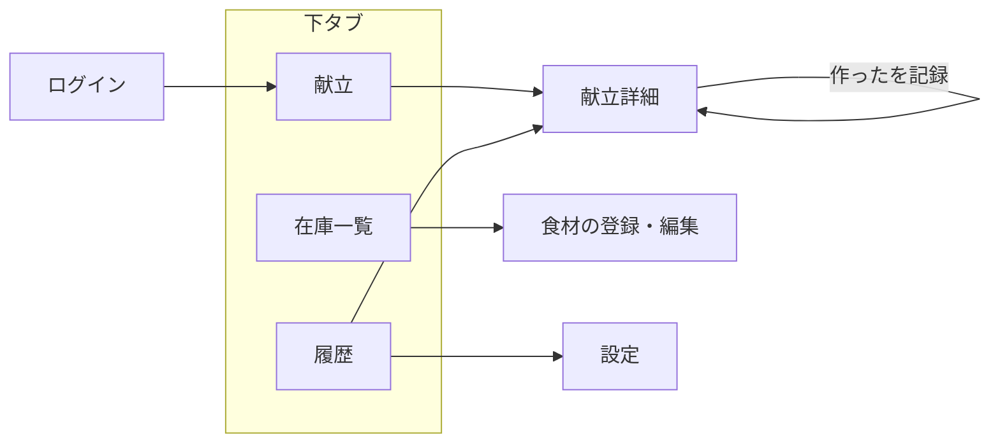

# 画面設計

> ドラフト v0.4 / 2026-09-07 / 要件定義書 v0.6・ドメインモデル v0.6・ADR-001〜023 に対応
> 閲覧用 HTML は未作成。**この Markdown が正である。**

要件定義 第7章の画面一覧を、実装できる粒度まで落とす。**ADR-022 が前提条件として要求した「新しい献立を求める導線」を、ここで具体化する。**

## ⚠ この文書が決めること・決めないこと

| | |
| --- | --- |
| **決める** | どの画面があるか。画面がどの**状態**を持つか。何が**どこに**あるか。要素の**優先順位**（何を前に出し、何を詳細に回すか）。どの要件に対応するか |
| **決めない** | **文言（ラベル・見出し・本文）**。**配色・書体・余白・寸法**。アイコンの選定。アニメーション |

**ワイヤーに書かれている日本語はすべて仮置きである。** 「今日の献立」「前に見た献立」「新しい献立を見る」「これを作った」等はいずれも**確定した文言ではなく、そこに何を意味する要素が入るかを示すための代用**である。**この文書を根拠に文言を実装しないこと。**

同様に、枠線・記号（🔖 ⚠ ✓ ✗）・タブの絵文字は、**要素の区別を紙の上で示すためのもの**であって、UI にその記号を出す決定ではない。

> 文言とデザインは実装の段階で詰める。**そのとき制約になるのは、ここで決めた構造と、`docs/domain-model.md` の禁止語である。**

---

---

## 1. 前提

| 前提 | 出所 |
| --- | --- |
| スマートフォンのブラウザが主用途。モバイルファースト | 要件 3.2 |
| 台所での**片手操作**。主要操作は親指の届く下半分に置く | NFR-14 |
| PWA。ホーム画面から単独起動する | FR-38、ADR-016 |
| オフラインでは操作を止める。書き込みを許さない | FR-41 |
| 期限の警告は**色だけで表現しない** | NFR-17 |
| コントラスト比は WCAG 2.1 AA 相当 | NFR-16 |

---

## 2. ナビゲーション

### 2.1 構造

下部に3つのタブを置く。**片手で届く位置に主要な移動手段を集める**（NFR-14）。

```
┌────────────────────────────┐
│                            │
│         （各画面）          │
│                            │
├────────────────────────────┤
│  🍽 献立   🧊 在庫   🕘 履歴  │
└────────────────────────────┘
```

設定は「履歴」タブの右上に置く。**開く頻度が最も低く、下タブの1枠を占める価値がない**（アカウント削除とログアウトしかない）。

### 2.2 ⚠ 起動時に開く画面を「献立」に変えたい

要件 第7章は **「在庫一覧（ホーム）」** としているが、**「献立」を起動時の画面にすることを提案する。**

| 理由 | |
| --- | --- |
| プロダクトゴールと一致する | 目的は「今日の献立を考える判断コストをなくす」こと（要件 2.1）。**在庫管理は手段であって目的ではない** |
| 開く動機と一致する | 帰宅して開く理由は「何を作るか知りたい」であって「在庫を眺めたい」ではない（要件 3.1 のペルソナ） |
| 待ち時間がない | ADR-022 により、既定の表示では **LLM を一度も呼ばない**。開いた瞬間に出る（NFR-03） |
| 在庫の入口は失われない | 買い物後の一括登録（FR-08）はタブ1つで届く |

**これは要件の変更にあたるため、第12章に論点として上げる。** 決まるまでは本書は「献立」を起動時の画面として書く。

### 2.3 画面遷移



**献立詳細に入る経路が2つある**（献立タブと履歴タブ）。表示内容は同じで、戻り先だけが違う。

---

## 3. 献立タブ ★中心

**この画面が ADR-022 の帰結をすべて背負う。** 提案の件数が1〜3件で変動し、再利用と生成が混ざらず、生成は明示操作でしか起きない。

### 3.1 状態

| # | 状態 | 条件 | LLM |
| --- | --- | --- | --- |
| S-1 | 提案あり（再利用） | 作れる既存の献立が1〜3件（ADR-022） | 呼ばない |
| S-2 | 提案あり（生成） | 生成した3件、または通った1〜2件（論点1） | 済み |
| S-3 | 保存済みの提案 | 在庫が前回から変わっていない（C-7） | 呼ばない |
| S-4 | 在庫が足りない | プロンプトに載る在庫が0〜1件（prompt-design 第8章） | 呼ばない |
| S-5 | 生成中 | 明示操作の直後 | 待機 |
| S-6 | 生成に失敗 | 検証を通った献立が0件、または API エラー（NFR-07） | 失敗 |
| S-7 | 上限に達した | 1日の生成回数の上限（NFR-C2） | 呼ばない |

**S-1 と S-2 は見た目が違う。** 再利用には印が付き（FR-35）、生成には付かない。**S-3 は S-1 / S-2 と見た目が同じ** — 利用者にとって「前回と同じものが出ている」ことは説明不要である。

### 3.2 ワイヤー（S-1: 再利用が2件）

```
┌────────────────────────────┐
│ 今日の献立                  │
│                            │
│ ┌────────────────────────┐ │
│ │ 🔖 前に見た献立          │ │
│ │ 豚こま肉と白菜の生姜焼き  │ │
│ │ 材料4件 · 不足なし        │ │
│ │ 使う: 豚こま肉(今日) 白菜 │ │
│ └────────────────────────┘ │
│ ┌────────────────────────┐ │
│ │ 🔖 前に見た献立          │ │
│ │ にんじんと卵の炒めもの    │ │
│ │ 材料3件 · 不足なし        │ │
│ │ 使う: にんじん 卵         │ │
│ └────────────────────────┘ │
│                            │
│ ┌────────────────────────┐ │
│ │  ＋ 新しい献立を見る      │ │
│ │  今の在庫から3件つくります │ │
│ │  （数十秒かかります）      │ │
│ └────────────────────────┘ │
│                            │
│ ⚠ AIによる提案です。分量・   │
│   加熱時間はご自身で確認を   │
├────────────────────────────┤
│  🍽 献立   🧊 在庫   🕘 履歴  │
└────────────────────────────┘
```

### 3.3 決めたこと

#### D-1　件数が変動することを隠さない

**1件しかない日に、空きを埋めない。** 3枠のうち2枠を空欄やプレースホルダで見せると「壊れている」と読まれる。カードを詰めて並べ、**末尾の「新しい献立を見る」ブロックが常に最後に来る**ことで、画面としての収まりを作る。

> **これが ADR-022 の前提条件そのものである。** 1件の日に利用者が取れる行動が、この末尾ブロックだけになる。

#### D-2　「新しい献立を見る」はカードと同じ面を持つ

テキストリンクではなく、献立カードと同じ大きさの面にする。**提案が1件の日でも画面が空白に見えない**ためであり、押せることを迷わせないためでもある。

**押すと必ず LLM を呼ぶ**（FR-36）。費用と待ち時間が発生する操作なので、**「数十秒かかります」を押す前に見せる**（NFR-04）。

#### D-3　再利用にだけ印を付ける（FR-35）

| | 印 |
| --- | --- |
| 再利用（`origin: 'reused'`） | **印を付ける** |
| 生成（`origin: 'generated'`） | **印を付けない** |

両方に印を付けると、印が背景になって消える。**片方だけに付けるから目に入る。**

印が伝えるべき意味は、要件 FR-35 が定めた「**前に見たこれ、今日の在庫で作れます**」である。**印と「不足なし」の並びでその意味を作る**ことまでを決め、**具体的な文言と形（バッジ・アイコン・色）は決めない。**

> **生成した献立が既存と同名だったために既存を参照した場合も、印は付かない**（C-4c）。`origin` は「この提案でどの経路から来たか」を表すので、生成の経路から来たものは `'generated'` である。**S-1 と S-2 が混ざらないのはこのため。**

#### D-4　カードには不足の件数だけ、内訳は詳細で（FR-17）

カードに材料を全部並べると縦に伸び、**3件を見比べられなくなる**。カードには次の3つだけ置く。

- 献立の名称
- 材料の件数と、不足の件数（「不足なし」または「不足2件」）
- 「使う:」に相当する欄に、**期限が近い在庫を優先して2〜3件**（FR-18 の結果を見せる）

**件数はどちらも主材料で数える**（C-16）。調味料を含めると「材料9件・不足なし」のように見え、**その献立の規模が伝わらなくなる。**

「使う:」に期限が今日の食材が入る場合、名称の後ろに `(今日)` を添える。**色だけに頼らない**（NFR-17）。

#### D-5　注意表示は画面末尾に1回（FR-20）

カードごとに3回出すと、読まれなくなる。**一覧では末尾に1回。詳細画面では必ず出す**（手順と分量を実際に見る画面だから）。

#### D-6　生成中は前の提案を残す（S-5）

```
┌────────────────────────────┐
│ 新しい献立をつくっています…   │
│ ▓▓▓▓▓▓▓░░░░░░░  20秒経過     │
│                            │
│ ┌────────────────────────┐ │
│ │ （前の提案 薄く表示）     │ │
```

**押した瞬間に画面を空にしない。** 数十秒かかる操作（NFR-04）で画面が空になると、失敗したように見える。**失敗（S-6）したときに前の提案がそのまま残っていれば、利用者は何も失わない。**

#### D-7　在庫が足りないとき（S-4）は在庫タブへ送る

```
┌────────────────────────────┐
│ 献立を出すには在庫が足りません │
│ 冷蔵庫にあるものを2つ以上     │
│ 登録してください             │
│ ┌────────────────────────┐ │
│ │  🧊 在庫を登録する        │ │
│ └────────────────────────┘ │
```

「新しい献立を見る」はこの状態では**出さない**。押しても呼べない操作を置かない。

### 3.4 この画面が対応する要件

FR-16（複数件）/ FR-17（不足材料）/ FR-18（期限優先の可視化）/ FR-20（注意表示）/ FR-21（保存済みの表示）/ FR-34（再利用）/ FR-35（区別表示）/ FR-36（明示操作）/ NFR-03（2秒以内）/ NFR-04（生成中の明示）/ NFR-C2（上限）

---

## 4. 献立詳細

献立タブと履歴タブの両方から入る。**表示は生成時のまま不変**（FR-30 / C-3）。

> 下の例は**生成された献立**（不足1件）である。3.2 の再利用カードは不足0件でなければならない（C-10）ため、**別の献立として読むこと。** 不足の表示を示すために、あえて不足のある献立を例にしている。

```
┌────────────────────────────┐
│ ← 豚こま肉と白菜の生姜焼き   │
│                            │
│ 材料（2人分）                │
│ ✓ 豚こま肉      300g        │
│ ✓ 白菜         1/4個        │
│ ✓ 玉ねぎ         1個        │
│ ✗ しょうが      1かけ  不足  │
│   醤油         大さじ2       │
│   みりん       大さじ2       │
│                            │
│ 手順                        │
│ 1. 白菜を一口大、玉ねぎを…   │
│ 2. 醤油大さじ2、みりん…      │
│ …                          │
│                            │
│ ⚠ AIによる提案です。分量・   │
│   加熱時間はご自身で確認を   │
│                            │
│ ┌────────────────────────┐ │
│ │  ✓ これを作った           │ │
│ └────────────────────────┘ │
└────────────────────────────┘
```

### 決めたこと

- **充足は開くたびに算出する**（FR-32 / ADR-009）。保存しない。**履歴から開いた1週間前の献立でも、今日の在庫で判定される**
- 賄える材料に `✓`、不足に `✗ 不足` を付ける。**記号と文字の両方**で区別する（NFR-17）
- **調味料（`kind: 'seasoning'`）には印を付けない**（C-16 / ADR-023）。充足判定の対象外なので、賄えるとも不足とも表示しない。**印がないこと自体が「在庫と照合していない」という意味になる**
- 材料の並びは**主材料が先、調味料が後**。何がその献立の中身かが、上から読んで分かる
- 調理を記録する操作は**取り消せない**（C-3 / 調理記録は追加のみ）。ただし**確認ダイアログは出さない** — 押し間違えても実害がなく、1タップの重さを増やすほうが害が大きい
- 記録済みの献立を再度開いた場合も、**同じ位置に記録の操作がある**（FR-31）。すでに記録があることが分かる表示にする（文言は決めない）
- **在庫は自動で減らない**（C-8）。記録後に「在庫を減らしますか」とは聞かず、在庫タブで明示的に行う

---

## 5. 在庫タブ

```
┌────────────────────────────┐
│ 在庫                    ＋  │
│ [すべて] [肉] [野菜] [その他] │
│                            │
│ ⚠ 期限 今日まで              │
│  豚こま肉    300g   今日     │
│  小松菜      1束    今日     │
│                            │
│ 期限が近い                   │
│  白菜       1/4個   あと2日  │
│  卵         6個     あと5日  │
│                            │
│ その他                      │
│  にんじん    2本    あと12日 │
│  乾燥わかめ  1袋    －       │
├────────────────────────────┤
│  🍽 献立   🧊 在庫   🕘 履歴  │
└────────────────────────────┘
```

### 決めたこと

- **既定は期限の近い順**（FR-04）。並べ替えの選択肢を置かない — 期限順以外で見たい理由が MVP にない
- 期限で3つの帯に分ける。**帯の見出し自体がテキストの警告**になっているので、色を使わなくても意味が通る（NFR-17）
- **帯の境界は残り3日。** 当日と超過が「今日まで」、残り1〜3日が「期限が近い」、残り4日以上と期限未設定が
  「その他」（FR-12 の「3日以内=警告、当日/超過=危険」そのまま。B-11 で実装済み）。
  **上のワイヤーの「卵 6個 あと5日」は概略であり、境界の例ではない**
- 期限未設定は「－」を表示し、末尾の帯に置く。**警告の対象外**（FR-13）
- 削除は行のスワイプ。**確認は出さない**（登録し直すコストが低い）
- 同じ食材を統合しない（ADR-007）ので、**同名の行が並ぶことがある**。これは仕様であって不具合ではない
- カテゴリの絞り込み（FR-07）は Should。**数十件の規模では絞る必要が薄い**ので、実装の順序は後ろでよい

---

## 6. 食材の登録・編集

**1件10秒以内**（NFR-15）が設計の制約。

```
┌────────────────────────────┐
│ ← 食材を追加                │
│                            │
│ 食材名                      │
│ ┌────────────────────────┐ │
│ │ にん                    │ │
│ └────────────────────────┘ │
│  にんじん                   │
│  にんにく                   │
│                            │
│ 分量（任意）    期限（任意）  │
│ ┌──────────┐  ┌──────────┐│
│ │ 2本       │  │ 9/12     ││
│ └──────────┘  └──────────┘│
│                            │
│ ┌────────────────────────┐ │
│ │  保存してもう1件          │ │
│ └────────────────────────┘ │
│         保存して閉じる       │
└────────────────────────────┘
```

### 決めたこと

- **既定のボタンは「保存してもう1件」**（FR-08）。買い物後の一括登録が主な使い方で、1件だけ足すのは例外
- 分量と期限は**任意**（FR-13）。必須にすると登録が面倒になり、判断基準3（要件 2.2）を損なう
- 食材名はカタログから補完する（FR-02）が、**補完に出てこない名前もそのまま登録できる**（FR-03）。補完は入力を助けるだけで、登録を止めない
- 保存場所は**持たない**（要件 5.5）

> ⚠ **補完に出る食材名が、そのまま C-6 の完全一致に効く。** 利用者が補完から選べば表記が揃い、自由入力すると揺れる。**Q-4（食材カタログの初期データ）の質が、この画面を通じて再利用率に効く。**

---

## 7. 履歴タブ

```
┌────────────────────────────┐
│ 履歴                    ⚙  │
│ [ 以前見た献立 | つくった ]   │
│                            │
│  豚こま肉と白菜の生姜焼き    │
│  9/5 · 材料5件              │
│                            │
│  にんじんと卵の炒めもの      │
│  9/3 · 材料3件              │
├────────────────────────────┤
│  🍽 献立   🧊 在庫   🕘 履歴  │
└────────────────────────────┘
```

### 決めたこと

- 2つの一覧は**同じ献立を調理記録の有無で振り分けたもの**（FR-28 / FR-29 / ドメインモデル 第5章）。**一度作った献立は「以前見た献立」から消えて「つくった」に移る**
- 新しい順（生成日時）。**充足状況は一覧に出さない** — 全件について現在の在庫と突き合わせる必要があり、開いたときに算出すれば足りる（FR-32）
- 名称での検索（FR-33）は Could。件数が増えてから
- 設定への入口をここに置く（2.1）

---

## 8. 設定・認証

| 画面 | 中身 |
| --- | --- |
| ログイン／サインアップ | Supabase Auth に委譲（ADR-020）。**自前でパスワードを持たない**（NFR-12） |
| 設定 | ログアウト、アカウントとデータの削除（FR-27 / NFR-13） |

**アカウント削除は確認を必須にする。** 取り消せず、在庫・献立・調理記録がすべて消えるため。ここは「これを作った」と逆の判断になる。

---

## 9. 画面をまたぐ規則

| 事象 | 扱い | 出所 |
| --- | --- | --- |
| オフライン | 画面上部に帯で明示し、**書き込みを伴う操作を無効化する**。閲覧は続けられる | FR-41 |
| LLM の障害・レート制限 | **在庫と保存済みの献立は通常どおり使える**。生成だけが縮退し、その旨を伝える | NFR-06 |
| 生成の失敗 | 前の提案を残したまま、再試行の手段を示す。**自動で再試行しない** | NFR-07 / ADR-005 |
| 期限の表現 | 色に加えて必ずテキスト（「今日」「あと2日」）を併用する | NFR-17 |
| 初回起動 | 在庫0件なので献立タブは S-4。**在庫の登録に送る** | — |
| iOS のインストール導線 | 「ホーム画面に追加」の手順を案内する UI を持つ | FR-40 |

---

## 10. 差し戻す論点

### 論点1　起動時の画面を「献立」にしてよいか　`判断待ち`

2.2 の通り。**要件 第7章が「在庫一覧（ホーム）」としているため、要件の変更にあたる。**

推奨は「献立」。プロダクトゴール（要件 2.1）と開く動機に一致し、ADR-022 により**待ち時間なしで表示できる**ようになったことが根拠になる。承認が得られたら要件 第7章を改訂する。

### 論点2　提案が1件の日に、それでよしとするか　`判断待ち`

ADR-022 の帰結として受け入れた設計だが、**画面にしてみると「選ぶ」体験にはならない**。D-1 / D-2 の導線で救う前提で書いたが、実際に使って不満が出るなら、次の選択肢がある。

| 案 | 内容 |
| --- | --- |
| A | このまま。足りなければ利用者が明示操作で求める（**現状の設計**） |
| B | 作れる既存の献立が1件のときだけ、自動で生成に回す（ADR-022 の部分的な撤回） |

**判断は実際に使ってから。** いま決めない。

### 論点3　文言とデザインは全面的に未確定　`実装時に詰める`

冒頭に書いたとおり、**本書は文言も配色も決めていない。** ワイヤーの日本語は仮置きである。

実装時に詰めるとき、制約になるのは次の2つだけである。

| 制約 | 出所 |
| --- | --- |
| **禁止語を使わない**（レシピ / メニュー / 候補 / 料理 / ストック / アイテム / フード / 献立案） | ドメインモデル 第3章・ADR-018 |
| 本書で決めた**構造・状態・優先順位**を崩さない | 本書 |

とくに検討が要るのは次の3か所。**いずれも「何を伝えるか」は決まっていて、「どう書くか」だけが未決である。**

| 箇所 | 伝えるべきこと |
| --- | --- |
| 生成を起こす操作（3.2 / D-2） | 押すと新しい献立が作られること。**数十秒かかること** |
| 再利用の印（D-3） | 前に見た献立であり、**今日の在庫で作れる**こと |
| 注意表示（D-5） | AI による提案であり、**分量と加熱時間は自分で確認する**必要があること（FR-20 の要件そのもの） |
