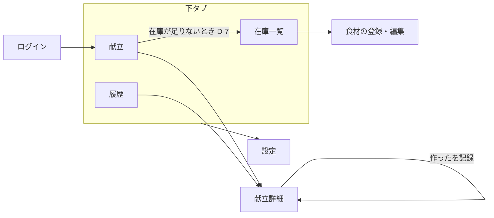

# 画面設計

> ドラフト v0.5 / 2026-10-02 / 要件定義書 v0.6・ドメインモデル v0.6・ADR-001〜074 に対応
> **構造・状態・遷移はこの Markdown が正である。見た目と文言の正は `docs/design/` のデザインである**（2026-10-02 にユーザーが作成。ADR-074）。

要件定義 第7章の画面一覧を、実装できる粒度まで落とす。**ADR-022 が前提条件として要求した「新しい献立を求める導線」を、ここで具体化する。**

## ⚠ この文書が決めること・決めないこと

| | |
| --- | --- |
| **決める** | どの画面があるか。画面がどの**状態**を持つか。何が**どこに**あるか。要素の**優先順位**（何を前に出し、何を詳細に回すか）。どの要件に対応するか |
| **決めない**（`docs/design/` が決める） | **文言（ラベル・見出し・本文）**。**配色・書体・余白・寸法**。アイコンの選定。アニメーション |

**ワイヤーに書かれている日本語はすべて仮置きである。** 「今日の献立」「前に見た献立」「新しい献立を見る」「これを作った」等はいずれも**確定した文言ではなく、そこに何を意味する要素が入るかを示すための代用**である。**この文書を根拠に文言を実装しないこと。** **文言は `docs/design/` から取る**（ADR-074 決定1。今の画面との差分は `docs/design/README.md`）。

同様に、枠線・記号（🔖 ⚠ ✓ ✗）・タブの絵文字は、**要素の区別を紙の上で示すためのもの**であって、UI にその記号を出す決定ではない。

> 文言と見た目はデザインに従う。**そのときも制約になるのは、ここで決めた構造と、`docs/domain-model.md` の禁止語である。** デザインが**振る舞い**（操作の有無・確認の有無・遷移）でこの文書と食い違う箇所は、ユーザーの了承を得てからこの文書を改める（ADR-074 決定2。一覧は論点4）。

---

---

## 1. 前提

| 前提 | 出所 |
| --- | --- |
| スマートフォンのブラウザが主用途。モバイルファースト | 要件 3.2 |
| 台所での**片手操作**。主要操作は親指の届く下半分に置く | NFR-14 |
| PWA。ホーム画面から単独起動する | FR-38、ADR-016 |
| オフラインでは操作を止める。書き込みを許さない | FR-41 |
| 期限の警告は**色だけで表現しない** | NFR-17 |
| コントラスト比は WCAG 2.1 AA 相当 | NFR-16 |

---

## 2. ナビゲーション

### 2.1 構造

下部に3つのタブを置く。**片手で届く位置に主要な移動手段を集める**（NFR-14）。

```
┌────────────────────────────┐
│                            │
│         （各画面）          │
│                            │
├────────────────────────────┤
│  🍽 献立   🧊 在庫   🕘 履歴  │
└────────────────────────────┘
```

設定は下タブに置かない。**開く頻度が最も低く、下タブの1枠を占める価値がない**（アカウント削除とログアウトしかない）。
**入口は SP では献立・在庫・履歴の3つの見出しの右、PC ではサイドナビの下端に置く**（デザイン ★1・★9・12・サイドナビ。2026-10-02 に「履歴タブの右上だけ」から改めた）。設定を開いている間、下タブはどれも選ばない。

**下タブを画面下端に固定するのは SP の幅のときだけである。** PC（広い幅）は下タブを出さず、左にサイドナビ（献立・在庫・履歴と、下端に設定）を置く（デザインの PC 1440。2026-09-21 にユーザーが「完全に別のレイアウトを想定している」と表明していたもの）。**SP と PC を切り替える幅は 1024px である — 幅 1024px 以上を PC、未満を SP とする**（B-60 で決めた。デザインは 390 と 1440 しか描いていない。ADR-074 結果4 / ADR-076）。縦持ちのタブレット（768〜834px）は片手で持つので SP（下タブ）に残し、横持ち（1024px〜）から PC にする — サイドナビ 240px と左右の余白 48px を引いて中身に 688px 残る最小の幅である。切り替えは CSS のメディアクエリだけで行い、JS で幅を読まない（ADR-076）。各画面の CSS module の `@media (min-width: 1024px)` はこの値の写しである。

**設定はタブの外の4つ目の行き先である**（B-60）。開いている間は中身の欄に設定を描き、どのタブも選ばない（PC ではサイドナビの「設定」が選ばれた印を持つ）。開いたままタブを押すと設定を閉じてそのタブを出し（**ただしアカウントとデータの削除を送っている間は帯のタブも「設定」も押せない**。B-60b。8章）、設定の「閉じる」では開く前に選んでいたタブ（開いていた献立詳細も）に戻る。

### 2.2 起動時に開く画面（`決定済み`。**「献立」である**）

**起動して最初に開くのは献立タブである**（2026-09-24 にユーザーが決定。ADR-064）。
要件 第7章は 2026-09-24 まで「在庫一覧（ホーム）」としていたが、同章を改訂した。

| 理由 | |
| --- | --- |
| プロダクトゴールと一致する | 目的は「今日の献立を考える判断コストをなくす」こと（要件 2.1）。**在庫管理は手段であって目的ではない** |
| 開く動機と一致する | 帰宅して開く理由は「何を作るか知りたい」であって「在庫を眺めたい」ではない（要件 3.1 のペルソナ） |
| 初回起動が案内になる | 在庫が0〜1件の世帯は S-4 になり、D-7 が在庫の登録に送る。**空の在庫一覧より、次に何をすればよいかが分かる** |
| 在庫の入口は失われない | 買い物後の一括登録（FR-08）はタブ1つで届く |

> **既定タブの反映は B-49（web の献立タブ）と同じ周に行う。** それまで `apps/web/src/navigation/Tabs.ts` の
> `DEFAULT_TAB` は `'pantry'` のままである — 既定タブだけを先に反転させると、仮置きの段落
> （`MealsTab.tsx`）が起動画面になる。**この食い違いは `Tabs.ts` の doc にも書いてある**（ADR-064 結果3）。

> **2026-09-20 に「決めずに進む」とした理由は解消した。** 当時は献立の経路がサーバに無く、生成も
> LLM プロバイダ待ち（ADR-019）で、**起動直後に空の画面が出る**ことが決め手だった。提案の2経路が
> `main.ts` で結線され（B-48a〜c / ADR-061 / ADR-062）、仮の生成器が生成を埋める（B-47 / ADR-060）ため、
> 在庫が0〜1件でも空にはならず S-4 になる。

> ⚠ **起動時に提案を取りに行く置き方は、まだ決まっていない**（ADR-064 結果1 / B-49 の宿題）。
> 既定の提案（`POST /suggestions`）は作れる献立が0件のとき生成を呼ぶ（ADR-022 / C-15）ので、
> **在庫を登録した直後の起動が、利用者の求めなしに生成1回（NFR-C2 の1日10回の枠）を消費しうる。**
> 献立を既定にしたことで「タブを開いたときに取りに行く」形は選べなくなり、門が取るか、保存済みの
> 提案だけ出して明示操作を待つかの2択になる。後者を採るなら**第3章に状態を1つ足す**
> （「在庫が変わったが、まだ取りに行っていない」）周が先に要る。

### 2.3 画面遷移


```mermaid
flowchart LR
  login[ログイン] --> meals
  subgraph tabs[下タブ]
    meals[献立]
    pantry[在庫一覧]
    history[履歴]
  end
  meals --> detail[献立詳細]
  meals -->|在庫が足りないとき D-7| pantry
  history --> detail
  pantry --> edit[食材の登録・編集]
  tabs --> settings[設定]
  detail -->|作ったを記録| detail
```

**献立詳細に入る経路が2つある**（献立タブと履歴タブ）。表示内容は同じで、戻り先だけが違う。

---

## 3. 献立タブ ★中心

**この画面が ADR-022 の帰結をすべて背負う。** 提案の件数が1〜3件で変動し、再利用と生成が混ざらず、生成は明示操作でしか起きない。

### 3.1 状態

| # | 状態 | 条件 | LLM |
| --- | --- | --- | --- |
| S-1 | 提案あり（再利用） | 作れる既存の献立が1〜3件（ADR-022） | 呼ばない |
| S-2 | 提案あり（生成） | 生成した3件、または通った1〜2件（論点1） | 済み |
| S-3 | 保存済みの提案 | 在庫が前回から変わっていない（C-7） | 呼ばない |
| S-4 | 在庫が足りない | プロンプトに載る在庫が0〜1件（prompt-design 第8章） | 呼ばない |
| S-5 | 生成中 | 明示操作の直後 | 待機 |
| S-6 | 生成に失敗 | 検証を通った献立が0件、または API エラー（NFR-07） | 失敗 |
| S-7 | 上限に達した | 1日の生成回数の上限（NFR-C2） | 呼ばない |
| S-8 | 提案がまだ無い | 保存済みの提案が1件も無い（初回起動） | 呼ばない |

**S-8 は献立タブが保存済みの提案を読み取ることの帰結である**（ADR-065 結果1 / B-58）。この画面を開いたときに既定の提案（`POST /suggestions`）を求めると、作れる献立が0件の世帯では利用者の求めなしに生成が1回走り、NFR-C2 の1日10回の枠と費用を消費する。FR-21 の「再生成は明示的な操作でのみ行う」に反するので、**献立タブは保存済みの提案を読み取り専用で取り**（`GET /suggestions/latest`）、生成は明示操作（FR-36）だけで起こす。**まだ一度も提案していない世帯では、取れるものが無い** — それが S-8 であり、「新しい献立を求める」操作だけを出す。

**S-1 と S-2 は見た目が違う。** 再利用には印が付き（FR-35）、生成には付かない。**S-3 は S-1 / S-2 と見た目が同じ** — 利用者にとって「前回と同じものが出ている」ことは説明不要である。

### 3.2 ワイヤー（S-1: 再利用が2件）

```
┌────────────────────────────┐
│ 今日の献立                  │
│                            │
│ ┌────────────────────────┐ │
│ │ 🔖 前に見た献立          │ │
│ │ 豚こま肉と白菜の生姜焼き  │ │
│ │ 材料4件 · 不足なし        │ │
│ │ 使う: 豚こま肉(今日) 白菜 │ │
│ └────────────────────────┘ │
│ ┌────────────────────────┐ │
│ │ 🔖 前に見た献立          │ │
│ │ にんじんと卵の炒めもの    │ │
│ │ 材料3件 · 不足なし        │ │
│ │ 使う: にんじん 卵         │ │
│ └────────────────────────┘ │
│                            │
│ ┌────────────────────────┐ │
│ │  ＋ 新しい献立を見る      │ │
│ │  今の在庫から3件つくります │ │
│ │  （数十秒かかります）      │ │
│ └────────────────────────┘ │
│                            │
│ ⚠ AIによる提案です。分量・   │
│   加熱時間はご自身で確認を   │
├────────────────────────────┤
│  🍽 献立   🧊 在庫   🕘 履歴  │
└────────────────────────────┘
```

### 3.3 決めたこと

#### D-1　件数が変動することを隠さない

**1件しかない日に、空きを埋めない。** 3枠のうち2枠を空欄やプレースホルダで見せると「壊れている」と読まれる。カードを詰めて並べ、**末尾の「新しい献立を見る」ブロックが常にカードの後に来る**ことで、画面としての収まりを作る（その後ろに置くのは注意表示だけである。D-5 / デザイン `MealScreen`。2026-10-02、B-61 で「常に最後」から改めた）。

> **これが ADR-022 の前提条件そのものである。** 1件の日に利用者が取れる行動が、この末尾ブロックだけになる。

#### D-2　「新しい献立を見る」はカードと同じ面を持つ

テキストリンクではなく、献立カードと同じ大きさの面にする。**提案が1件の日でも画面が空白に見えない**ためであり、押せることを迷わせないためでもある。

**押すと必ず LLM を呼ぶ**（FR-36）。費用と待ち時間が発生する操作なので、**「数十秒かかります」を押す前に見せる**（NFR-04）。

> **2026-10-02、デザインの文言は「時間がかかる場合があります」である**（ADR-074）。長さの見当は押す前には出さず、押したあとに経過秒数を出す（デザイン ★3）。待ちがあることは押す前に伝わるので NFR-04 の趣旨は保つと読み、デザインに従う。

#### D-3　再利用にだけ印を付ける（FR-35）

| | 印 |
| --- | --- |
| 再利用（`origin: 'reused'`） | **印を付ける** |
| 生成（`origin: 'generated'`） | **印を付けない** |

両方に印を付けると、印が背景になって消える。**片方だけに付けるから目に入る。**

印が伝えるべき意味は、要件 FR-35 が定めた「**前に見たこれ、今日の在庫で作れます**」である。**印と「不足なし」の並びでその意味を作る**ことまでを決め、**具体的な文言と形（バッジ・アイコン・色）は決めない。**

> **生成した献立が既存と同名だったために既存を参照した場合も、印は付かない**（C-4c）。`origin` は「この提案でどの経路から来たか」を表すので、生成の経路から来たものは `'generated'` である。**S-1 と S-2 が混ざらないのはこのため。**

#### D-4　カードには不足の件数だけ、内訳は詳細で（FR-17）

カードに材料を全部並べると縦に伸び、**3件を見比べられなくなる**。カードには次の3つだけ置く。

- 献立の名称
- 材料の件数と、不足の件数（「不足なし」または「不足2件」）
- 「使う:」に相当する欄に、**期限が近い在庫を優先して2〜3件**（FR-18 の結果を見せる）

**件数はどちらも主材料で数える**（C-16）。調味料を含めると「材料9件・不足なし」のように見え、**その献立の規模が伝わらなくなる。**

「使う:」に期限が今日の食材が入る場合、名称の後ろに `(今日)` を添える。**色だけに頼らない**（NFR-17）。

> **2026-10-02、デザインに従って改めた**（ADR-074）。「使う:」の見出しを置かずに名称を並べ、**期限が今日のものは太字**にし、画面の見出しの下に凡例「太字の材料は今日が期限です」を1行置く。太字は色ではないが**読み上げには届かない**ので、期限が今日であることを読み上げにも渡す手当てを実装の周（B-61）で置く。

#### D-5　注意表示は画面末尾に1回（FR-20）

カードごとに3回出すと、読まれなくなる。**一覧では末尾に1回。詳細画面では必ず出す**（手順と分量を実際に見る画面だから）。

#### D-6　生成中は前の提案を残す（S-5）

```
┌────────────────────────────┐
│ 新しい献立をつくっています…   │
│ ▓▓▓▓▓▓▓░░░░░░░  20秒経過     │
│                            │
│ ┌────────────────────────┐ │
│ │ （前の提案 薄く表示）     │ │
```

> **2026-10-02、デザインに従って改めた**（ADR-074）。生成中は操作を無効にして `考えています…` と経過秒数を出し、画面の上端に進行線（動きを減らす設定では止める）、前の提案のカード群は不透明度 0.4 で残す（B-62）。

**押した瞬間に画面を空にしない。** 数十秒かかる操作（NFR-04）で画面が空になると、失敗したように見える。**失敗（S-6）したときに前の提案がそのまま残っていれば、利用者は何も失わない。**

#### D-8　在庫が変わっていることは、操作へ誘う手がかりとして出す（`決定済み`）

**2026-09-24 に B-49b で決めた。** `GET /suggestions/latest` は「保存時の在庫スナップショットが現在の在庫と食い違うか」を返している（ADR-065 決定4）。**真のときだけ、「新しい献立を見る」の面に手がかりを1つ添える。** 押せば違う献立が出る見込みがあり、それがこの操作へ誘う理由になるためである。偽のときは何も出さない — 常に何か出ていると手がかりとして読めなくなる。

**出さないという選択肢もあった**（backlog B-49b が明示的に認めていた）。採らなかったのは、真であること自体が利用者の得になる情報だからである。**ただし献立の出し分けには使わない** — 在庫が変わったことを理由に勝手に生成しない（FR-21「再生成は明示的な操作でのみ行う」）。

**求めた提案に差し替えた直後は偽である。** いま求めた提案はその瞬間の在庫から組まれており、食い違いようがない。

**在庫を登録・削除して通った回は、保存済みの提案を取り直す**（同じ周で決めた）。取り直さないと、在庫を足したのに手がかりが出ない・消したのに出たままになる。**取り直す費用は無い** — この経路は生成を一度も呼ばない（ADR-065 決定1・決定2）。**文言と形は決めない**（冒頭のとおり）。

#### D-7　在庫が足りないとき（S-4）は在庫タブへ送る

```
┌────────────────────────────┐
│ 献立を出すには在庫が足りません │
│ 冷蔵庫にあるものを2つ以上     │
│ 登録してください             │
│ ┌────────────────────────┐ │
│ │  🧊 在庫を登録する        │ │
│ └────────────────────────┘ │
```

「新しい献立を見る」はこの状態では**出さない**。押しても呼べない操作を置かない。

#### D-9　上限に達したとき（S-7）は案内だけを出す（`決定済み`）

**2026-09-24 に B-49c で決めた。** 1日の生成回数の上限に達した回は、**案内だけを出し、操作を1つも出さない。** 「新しい献立を見る」を出さないのは D-7 と同じ理由（押しても呼べない操作を置かない）であり、**在庫タブへも送らない** — 在庫はこの結末の原因ではないので、送っても利用者は何も解けない。

**残り回数も、上限がいつ解けるかも告げない。** 24時間の窓は基準日時から遡って定まり（ADR-049 決定2）、結末（`SuggestMealsOutput`）にその材料が1つも載っていない。持っていない数を画面で作らない。

**失敗（S-6）ではない。** 200 で届く結末であり（ADR-062 決定2 / ADR-041）、失敗の案内と同時に出さない。**ただし D-6 の「前の提案を残す」はここには及ばない** — D-6 が残すと決めたのは S-5（送信中）と S-6（失敗）であって、S-4 / S-7 は**提案そのものが差し替わる結末**だからである。**文言と形は決めない**（冒頭のとおり）。

### 3.4 この画面が対応する要件

FR-16（複数件）/ FR-17（不足材料）/ FR-18（期限優先の可視化）/ FR-20（注意表示）/ FR-21（保存済みの表示）/ FR-34（再利用）/ FR-35（区別表示）/ FR-36（明示操作）/ NFR-03（2秒以内）/ NFR-04（生成中の明示）/ NFR-C2（上限）

---

## 4. 献立詳細

献立タブと履歴タブの両方から入る。**表示は生成時のまま不変**（FR-30 / C-3）。

> 下の例は**生成された献立**（不足1件）である。3.2 の再利用カードは不足0件でなければならない（C-10）ため、**別の献立として読むこと。** 不足の表示を示すために、あえて不足のある献立を例にしている。

```
┌────────────────────────────┐
│ ← 豚こま肉と白菜の生姜焼き   │
│                            │
│ 材料（2人分）                │
│ ✓ 豚こま肉      300g        │
│ ✓ 白菜         1/4個        │
│ ✓ 玉ねぎ         1個        │
│ ✗ しょうが      1かけ  不足  │
│   醤油         大さじ2       │
│   みりん       大さじ2       │
│                            │
│ 手順                        │
│ 1. 白菜を一口大、玉ねぎを…   │
│ 2. 醤油大さじ2、みりん…      │
│ …                          │
│                            │
│ ⚠ AIによる提案です。分量・   │
│   加熱時間はご自身で確認を   │
│                            │
│ ┌────────────────────────┐ │
│ │  ✓ これを作った           │ │
│ └────────────────────────┘ │
└────────────────────────────┘
```

### 決めたこと

- **充足は開くたびに算出する**（FR-32 / ADR-009）。保存しない。**履歴から開いた1週間前の献立でも、今日の在庫で判定される**
- 賄える材料に `✓`、不足に `✗ 不足` を付ける。**記号と文字の両方**で区別する（NFR-17）。**B-63 でデザインに揃えた** — 賄える行はチェックのアイコン（文字は読み上げにだけ渡す）、不足は × のアイコンと見える `不足`（`docs/design/README.md` / ADR-074）
- **調味料（`kind: 'seasoning'`）には印を付けない**（C-16 / ADR-023）。充足判定の対象外なので、賄えるとも不足とも表示しない。**印がないこと自体が「在庫と照合していない」という意味になる**
- 材料の並びは**主材料が先、調味料が後**。何がその献立の中身かが、上から読んで分かる
- 調理を記録する操作は**取り消せない**（C-3 / 調理記録は追加のみ）。ただし**確認ダイアログは出さない** — 押し間違えても実害がなく、1タップの重さを増やすほうが害が大きい
- 記録済みの献立を再度開いた場合も、**同じ位置に記録の操作がある**（FR-31）。すでに記録があることが分かる表示にする（文言は決めない）
- **在庫は自動で減らない**（C-8）。記録後に「在庫を減らしますか」とは聞かず、在庫タブで明示的に行う

---

## 5. 在庫タブ

```
┌────────────────────────────┐
│ 在庫                    ＋  │
│ [すべて] [肉] [野菜] [その他] │
│                            │
│ ⚠ 期限 今日まで              │
│  豚こま肉    300g   今日     │
│  小松菜      1束    今日     │
│                            │
│ 期限が近い                   │
│  白菜       1/4個   あと2日  │
│  卵         6個     あと5日  │
│                            │
│ その他                      │
│  にんじん    2本    あと12日 │
│  乾燥わかめ  1袋    －       │
├────────────────────────────┤
│  🍽 献立   🧊 在庫   🕘 履歴  │
└────────────────────────────┘
```

### 決めたこと

- **既定は期限の近い順**（FR-04）。並べ替えの選択肢を置かない — 期限順以外で見たい理由が MVP にない
- 期限で3つの帯に分ける。**帯の見出し自体がテキストの警告**になっているので、色を使わなくても意味が通る（NFR-17）
- **帯の境界は残り3日。** 当日と超過が「今日まで」、残り1〜3日が「期限が近い」、残り4日以上と期限未設定が
  「その他」（FR-12 の「3日以内=警告、当日/超過=危険」そのまま。B-11 で実装済み）。
  **上のワイヤーの「卵 6個 あと5日」は概略であり、境界の例ではない**
- 期限未設定は「－」を表示し、末尾の帯に置く。**警告の対象外**（FR-13）
- **削除は確認を挟む**（2026-10-02 にユーザーが決定。論点4 #1 / デザイン 9b / B-69）。SP は行の横スワイプでその行に「削除」が現れ、押すと確認（「<名称> <分量> を削除しますか」・「削除」/「やめる」）が出る。**なぞっただけでは消えない。**最初の焦点は「やめる」で、「やめる」と Esc は何も消さずに閉じる
- **編集は行のタップ**（B-55）。スワイプ（削除の操作を現す）とタップ（編集）は移動の長さで読み分け、**どちらにも当たらない動きは何も起こさない**。削除の操作が現れている・行末の操作を開いているときのタップは、それを閉じるだけで編集を開かない
- **行末に操作「…」を置く**（2026-10-02 にユーザーが決定。論点4 #2 / B-69）。開くと「編集」/「削除」が出る（「削除」は上と同じ確認）。**キーボードと読み上げからも編集・削除に届く**（論点4 #2）。デザインは PC の幅にだけ描いているが、SP の幅で見た目から隠すかは切り替えの幅（B-60）が決まってから B-64 で決める
- 同じ食材を統合しない（ADR-007）ので、**同名の行が並ぶことがある**。これは仕様であって不具合ではない
- カテゴリの絞り込み（FR-07）は Should。**数十件の規模では絞る必要が薄い**ので、実装の順序は後ろでよい

---

## 6. 食材の登録・編集

**1件10秒以内**（NFR-15）が設計の制約。

```
┌────────────────────────────┐
│ ← 食材を追加                │
│                            │
│ 食材名                      │
│ ┌────────────────────────┐ │
│ │ にん                    │ │
│ └────────────────────────┘ │
│  にんじん                   │
│  にんにく                   │
│                            │
│ 分量（任意）    期限（任意）  │
│ ┌──────────┐  ┌──────────┐│
│ │ 2本       │  │ 9/12     ││
│ └──────────┘  └──────────┘│
│                            │
│ ┌────────────────────────┐ │
│ │  保存してもう1件          │ │
│ └────────────────────────┘ │
│         保存して閉じる       │
└────────────────────────────┘
```

### 決めたこと

- **既定のボタンは「保存してもう1件」**（FR-08）。買い物後の一括登録が主な使い方で、1件だけ足すのは例外
- 分量と期限は**任意**（FR-13）。必須にすると登録が面倒になり、判断基準3（要件 2.2）を損なう
- 食材名は、その世帯が過去に入力した食材名と保存済みの献立の材料名から補完する（FR-02。食材カタログは MVP では置かない）が、**補完に出てこない名前もそのまま登録できる**（FR-03）。補完は入力を助けるだけで、登録を止めない
- 保存場所は**持たない**（要件 5.5）
- **見た目と文言は B-65 で `docs/design/` に揃えた**（ADR-074）。見出しは `食材を登録` / `食材を編集`、欄の名前に札 `任意`、置き文字 `例: 300g` / `日付を選ぶ`、編集の期限は `10月3日（土）` と残日数、編集の保存は `保存`。上のワイヤーの日本語は仮のまま残す（ADR-074 結果1）。PC の右から出るパネルは B-65b

> ⚠ **補完に出る食材名が、そのまま C-6 の完全一致に効く。** 利用者が補完から選べば表記が揃い、自由入力すると揺れる。**Q-4（食材カタログの初期データ）の質が、この画面を通じて再利用率に効く。**

---

## 7. 履歴タブ

```
┌────────────────────────────┐
│ 履歴                    ⚙  │
│ [ 以前見た献立 | つくった ]   │
│                            │
│  豚こま肉と白菜の生姜焼き    │
│  材料5件                    │
│                            │
│  にんじんと卵の炒めもの      │
│  材料3件                    │
├────────────────────────────┤
│  🍽 献立   🧊 在庫   🕘 履歴  │
└────────────────────────────┘
```

### 決めたこと

- 2つの一覧は**同じ献立を調理記録の有無で振り分けたもの**（FR-28 / FR-29 / ドメインモデル 第5章）。**一度作った献立は「以前見た献立」から消えて「つくった」に移る**
- 新しい順（生成日時）。**充足状況は一覧に出さない** — 全件について現在の在庫と突き合わせる必要があり、開いたときに算出すれば足りる（FR-32）
- 名称での検索（FR-33）は Could。件数が増えてから
- **開いた直後は「以前見た献立」の列を出す**（B-54b。ワイヤーの左を採った）。列の選択はタブを移ると初めに戻り、詳細を開いて戻ったときは保たれる
- 行を押すと献立詳細を開き、閉じると履歴へ戻る（2.3）。**1行は名称と主材料の件数だけで、日付は出さない**（ADR-068 決定4）
- 設定への入口は見出しの右に置く（2.1。献立・在庫と同じ）

---

## 8. 設定・認証

| 画面 | 中身 |
| --- | --- |
| ログイン／サインアップ | Supabase Auth に委譲。**自前でパスワードを持たない**（NFR-12）。**方式はメールとパスワード**で、web は `@supabase/supabase-js` を継ぎ目の背後に置く（ADR-046）。**画面は1つで、操作は `ログイン`（主。Enter の落ちる先）と `アカウントを作る`（副）の2つ**（FR-25）。見た目と文言は `docs/design/` 14（ADR-074）に従い、デザインに描かれていない `アカウントを作る` は**残すことを 2026-10-02 にユーザーが決めた**（論点4 の追記）— ログインの下に、デザインの副の操作の見た目で置く（B-68） |
| 設定 | ログアウト、アカウントとデータの削除（FR-27 / NFR-13） |

**アカウント削除は確認を必須にする。** 取り消せず、在庫・献立・調理記録がすべて消えるため。ここは「これを作った」と逆の判断になる。

> **2026-10-02、確認の文はデザインの「アカウントと、冷蔵庫の食材・履歴をすべて削除しますか」に改める**（ADR-074。実装は B-67）。下の段落が求める「取り消せないこと」はこの文に無い。文言はデザインが正なので従うが、**確認を必須にすることは変えない。**

**削除の操作は B-56f で置いた**（B-56c が設定画面の器とログアウトを入れ、B-56d がアカウントの側の経路を通した）。操作は `アカウントとデータを削除` の1つで、押すと**画面の中に**確認の文 `アカウントと、冷蔵庫の食材・履歴をすべて削除しますか` と `削除する`・`やめる` の2つの操作が出る（文言と見た目は B-67 で `docs/design/` 13・13b に揃えた。上の追記）。送るのは `削除する` だけで、送っている間は設定画面のどの操作も効かない。**帯（3つのタブと PC の「設定」）も効かない**（B-60b）— 押せると設定が閉じ、失敗した回の案内を見ないまま利用者が残る。送っている間かは門も持ち（帯を止めるため）、設定画面も持つ（確認と案内の状態を門へ移さないため。B-56f）。**通ったらすぐにサインアウトしてログインの画面に戻す**（ADR-071 結果2）。失敗した回はサインアウトせず設定画面に留まり、原因を断定しない案内を出す（自動で送り直さない）。

---

## 9. 画面をまたぐ規則

| 事象 | 扱い | 出所 |
| --- | --- | --- |
| オフライン | 画面上部に帯で明示し、**書き込みを伴う操作を無効化する**。閲覧は続けられる。止めるのは世帯のデータへの書き込み（在庫の登録・編集・削除、新しい献立を求める、調理記録、アカウントとデータの削除）で、**ログイン画面のサインインとアカウントを作る操作は止めない**（世帯のデータではなく、送れば既存の断りに落ちる。B-70） | FR-41 |
| LLM の障害・レート制限 | **在庫と保存済みの献立は通常どおり使える**。生成だけが縮退し、その旨を伝える | NFR-06 |
| 生成の失敗 | 前の提案を残したまま、再試行の手段を示す。**自動で再試行しない** | NFR-07 / ADR-005 |
| 期限の表現 | 色に加えて必ずテキスト（「今日」「あと2日」）を併用する | NFR-17 |
| 初回起動 | **起動時に開くのは献立タブ**（2.2 / ADR-064）。在庫0件なので S-4 になり、D-7 が**在庫の登録に送る** | — |
| iOS のインストール導線 | 「ホーム画面に追加」の手順を案内する UI を持つ | FR-40 |

---

## 10. 差し戻す論点

### 論点1　起動時の画面を「献立」にしてよいか　`決定済み`

**2026-09-24、ユーザーは「献立」にすることを決定した**（ADR-064）。2.2 に書き直し、要件 第7章と
第11章 8 も改めた。**この論点は閉じる。**

経緯は3つの日付で読める。**2026-09-07** に本書 2.2 が「献立」を推し、要件の変更にあたるため
第11章の未決事項に上げた。**2026-09-20** にユーザーは「決めずに進む」と判断した — 献立の経路が
サーバに無く、生成も LLM プロバイダ待ち（ADR-019）で、**新しい世帯には再利用できる献立がそもそも
無いため起動直後に空の画面が出る**、という理由だった。**2026-09-24**、提案の2経路の結線
（B-48a〜c）と仮の生成器（B-47 / ADR-060）でその理由が消え、決め直した。

**残っている宿題は2.2 の ⚠ に書いた1つだけである** — 起動時に提案を取りに行く置き方（ADR-064 結果1）。
これは既定タブとは別の判断で、**B-49 が答える。**

### 論点2　提案が1件の日に、それでよしとするか　`決定済み`（いったん案A）

ADR-022 の帰結として受け入れた設計だが、**画面にしてみると「選ぶ」体験にはならない**。D-1 / D-2 の導線で救う前提で書いたが、実際に使って不満が出るなら、次の選択肢がある。

| 案 | 内容 |
| --- | --- |
| A | このまま。足りなければ利用者が明示操作で求める（**現状の設計**） |
| B | 作れる既存の献立が1件のときだけ、自動で生成に回す（ADR-022 の部分的な撤回） |

**判断は実際に使ってから。** いま決めない。

**2026-10-02、ユーザーは「いったんよしなに」とした。** 案A（現状の設計）のまま進め、実際に使って不満が出たら案B を改めて相談する。

### 論点3　文言とデザインは全面的に未確定　`決定済み`

**2026-10-02、ユーザーがデザインを作り「文言など変更していますがこれが正です」とした**（ADR-074）。文言と見た目は `docs/design/` に従う。以下は決まる前の記録であり、制約の2つは今も効く。

冒頭に書いたとおり、**本書は文言も配色も決めていない。** ワイヤーの日本語は仮置きである。

実装時に詰めるとき、制約になるのは次の2つだけである。

| 制約 | 出所 |
| --- | --- |
| **禁止語を使わない**（レシピ / メニュー / 候補 / 料理 / ストック / アイテム / フード / 献立案） | ドメインモデル 第3章・ADR-018 |
| 本書で決めた**構造・状態・優先順位**を崩さない | 本書 |

とくに検討が要るのは次の3か所。**いずれも「何を伝えるか」は決まっていて、「どう書くか」だけが未決である。**

| 箇所 | 伝えるべきこと |
| --- | --- |
| 生成を起こす操作（3.2 / D-2） | 押すと新しい献立が作られること。**数十秒かかること** |
| 再利用の印（D-3） | 前に見た献立であり、**今日の在庫で作れる**こと |
| 注意表示（D-5） | AI による提案であり、**分量と加熱時間は自分で確認する**必要があること（FR-20 の要件そのもの） |

デザインはこの3か所に答えている — 生成を起こす操作は「新しい献立を見る」と「時間がかかる場合があります」（**長さの見当は押したあとの経過秒数で出す**。D-2 の追記）、再利用の印は「前に見た献立」、注意表示は「AI による提案です。分量・加熱時間等はご自身でご確認ください」。

### 論点4　デザインが振る舞いを変えている箇所を採るか　`決定済み`

デザイン（ADR-074）は見た目と文言のほかに、**本書の決めごとと食い違う振る舞い**を4つ描いている。見た目の変更に紛れ込ませず、**ユーザーの了承を得てから本書を改める**（ADR-074 決定2）。一覧と今の決めごとは `docs/design/README.md`「了承が要るもの」。

| # | デザイン | 本書の今の決めごと |
| --- | --- | --- |
| 1 | 在庫の削除に確認を挟む（SP はスワイプで現れる「削除」→ 下から出る確認、PC は中央のダイアログ。最初の焦点は「やめる」） | 5章「確認は出さない」 |
| 2 | PC の在庫の行末に操作（編集・削除）を置く | 5章「行の中に『編集』の操作を出さない」 |
| 3 | オフラインの帯を出す | 9章（FR-41）。決めごとは同じだが、**実装が無い** |
| 4 | ログインの画面からアカウントを作る操作を外す | 8章（ADR-046 / FR-25 Must）。今はログインの画面から作れる |

**2026-10-02 にユーザーが決めた**：1 確認を挟む、2 行末の操作を置く、3 オフラインの帯を実装する、4 `アカウントを作る` は残し、見た目はデザインに合わせて整える。 5章は B-69 の周で、8章は B-68 の周で改める。

**論点2 にはデザインは答えていない**（再利用2件と生成3件しか描かれていない）。論点2 は案A のまま進める（論点2 の追記）。
